https://edu.devstyle.pl/products/domain-drivers

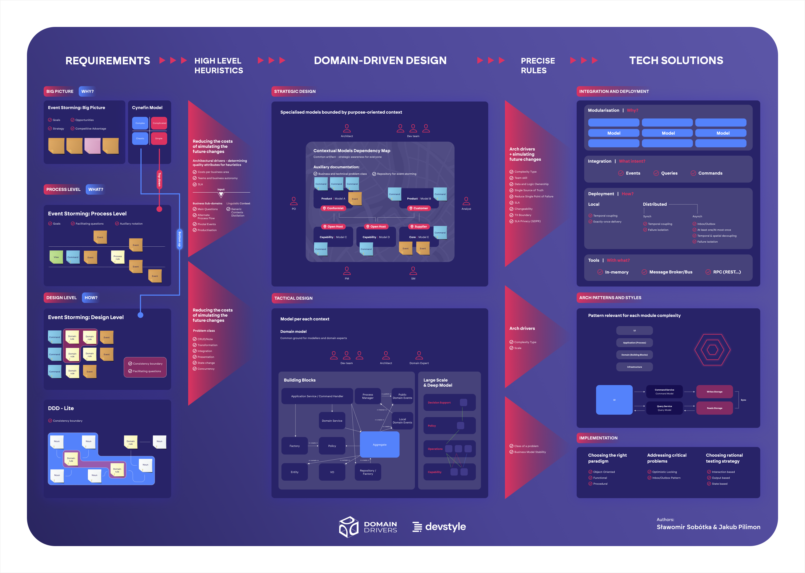

## Moduł 01 - Wstęp do szkolenia

-   Jeśli będziesz wstanie argumentować przed biznesem to będziesz miał większe szanse na to, żeby zaimplementować DDD w projekcie.
-   Stajesz się pro-aktywnym doradcą a nie tylko wykonawcą.
-   Pomagasz dowozić projekty, a nie tylko je wykonywać.
-   Rozumiesz principal z których wynikają wzorce, dlaczego ich używamy. To pozwala na to, żeby zastosować je w odpowiednich miejscach.
-   Będziesz wstanie wskazać alternatywne rozwiązania, które są bardziej odpowiednie dla danego problemu.
-   Umiejętność zadawania pytań, które pomagają zrozumieć problem. Znalezienie optymalnego rozwiązania.
-   Usuwanie blokady zależności pomiędzy zespołami, poprzez rozwiązanie problemu zależności modułów.
-   Eliminowanie mody i przypadku z projektu technicznego. Zbytecznej złożoności która nie wnosi wartości.
-   Celem nie jest nauka DDD tylko zrozumienie problemów biznesowych i technicznych, które pozwolą na zastosowanie DDD w projekcie.

## Moduł 001

### L01. Despota-driven Development

-   Problem jest gdzie do wszystkiego podchodzimy do CRUD
-   Głównym problemem jest to że dane są edytowane różnych miejscach
-   Problemem jest to że procesy operują na danych pomiędzy różnymi modułami
-   CRUD może być większą ilością kodu w projekcie niż kod biznesowy
-   System płytki to system gdzie pomiędzy UI a bazą danych nie ma żadnej warstwy biznesowej
-   System głęboki to system gdzie pomiędzy UI a bazą danych jest warstwa biznesowa
-   Zwykle problemem jest brak rozpoznania klasy problemów, które są w systemie i które powinny być rozwiązane
-   Data envy - kiedy jedna klasa chce mieć dostęp do danych z innej klasy
-   Feature envy - kiedy jedna klasa chce mieć dostęp do metod z innej klasy
-   Problemy zostaną rozwiązane "druciane" czyli poprzez mieszanie modułów i klas

### L02. Disaster-driven Design

-   W zaleznosci od klienta musisz dostosować swoje podejście
-   W jaki sposób sprawić wrazenie zeby klient myślał ze wiemy co robimy:
    -   Mowa ciała - kazdy ruch ktory zaczynasz powinnien wrocic do pozycji wyjsciowej. Czyli jak machasz reka do góry to powinna wrocic do pozycji wyjsciowej z ktorej zaczynała
    -   zwiezłe wypowiedzi - mówisz krótko i na temat
    -   przydziwięki i dopełniacze - nie powinno się kończyć zdania tak jakby to było pytanie do klienta
    -   Jeśli nie wiesz co powiedzieć to po prostu milczysz
        -   To znacznie lepsze niż robienie "yyyyyyy"
        -   "prawda, no tak"
-   Świadomość sytuacji, brak zaufania
-   Prawo conwaya - systemy które są projektowane przez zespół który nie jest w stanie zrozumieć problemu, będą miały architekturę która jest kopią struktury zespołu
    -   to też odwzorowuje się strukturę firmy
-   Wdrażenie zmian
-   Ludzie róźnie reagują na zmiany
    -   Każdy inaczej pojmuj zmianym ciężko jest zrozumieć co zmiana oznacza dla innych, nie możesze tego przedstawiać ze swojej perspektywy
-   jak sprzedawać zmiany
-   nie powinniśmy używać narzędzi bez zrozumienia, bo to może prowadzić do katastrofy
-   **Najczęściej problem w modelu to problem podczas analizy problemu**
-   Musimy uczyć się heurystyk do podziału większych modułów na mniejsze moduły
-   Potrzebujemy dobrze zrozumieć Event Storming aby to pomagało a nie przeszkadzało

### L03. Mapa szkolenia

-   5 kolumn
    -   pierwsza o zbiernaniu wymagań
        -   Big picture
            -   co chcemy osiągnąć
            -   jaką mamy przewagę konkurencyjną
        -   Design level
            -   rozpoczęcie od projekotwnia najtrudniejszych przypadków użycia, tak aby sprawdzić czy projekt ma jakikolwiek sens
                -   identyfikacja blokerów i ryzyko wykonalności
        -   Process level
            -   Event storming
            -   Szukamy pytania jak coś działa bez wchodzenia w szczegóły implementacji
    -   druga zawiera wysokopoziomowe heurystyki
        -   zawężanie możliwości stożka niepewności
        -   Szukanie drivertów biznesowych i architektonicznych
            -   Ma to na celu ocenienie czy projekt ma sens, czy idziemy w dobrym kierunku
            -   Drivery ustalamy z klientem
        -   Podzielenie na mniejsze niezleżne modele
    -   trzecia kolumna to artefkaty powstające dzięki DDD
        -   mapa powiązań pomiędzy autonomicznymi modelami (mapa kontekstów)
            -   **Mapa kontekstów to najważniejszy element w DDD**
            -   zapewnia świadomość organizacji systemu dla całej firmy (też tej nie technicznej)
            -   pokazuje wzroce integracyjne
            -   symulowanie zmian w systemie
            -   Niezależne modele
            -   jeden model = jeden problem
            -   modele finalnie muszę ze sobą współpracować
            -   modele często mają odwzierciedlenie w zespołach IT (jeden zespół = jeden model)
                -   To może prowadzić do problemów z komunikacją
        -   taktyczne modele to modele zorientowane na rozwiązanie konkretnego problemu
    -   czwarta kolumna - to konkretne heurystyki pozwalające na zaprojktowanie finalnego rozwiązania
        -   jest to finalne zawężenie stożka niepewności
        -   to powinno spiąc wszystko w całość, tak aby było to zrozumiałe dla programistów
        -   powinno być widać wynik pracy analizy w tej kolumnie
            -   bedły na poziomie strategicznym generują znacznie większe koszty niż na poziomie taktycznym
        -   trzeba wybrać narzędzia które pomogą w implementacji
            -   dobranie technolgii to zależy od corowych modułów
        -   jak dobrać rozwiązanie do problemu
            -   zawsze trzeba zastanowić się nad alternatywami
    -   piąta kolumna - to działące rozwiązanie dla klienta, to za co płaci
-   **Najważniejsze są metody dojścia do rozwiązań niż samo rozwiązanie**
-   Celem jest dobrania optymalnego rozwiązania dla danego problemu, bez zbędnej złożoności. Na to szukamy powtarzalnyej metody
-   Głębokie modele - tutaj będą korzystne wiedza z algorytmów, struktur danych, wzorców projektowych
-   Najważniejsze są separacje warstw, tak aby nie było zależności pomiędzy nimi
-   DDD Lite - kiedy nie mamy dostępu do biznesu to musimy zrobić DDD Lite
-   **Dobre DDD to dobre praktyki na wielu poziomach**

### L04. Jak korzystać z tego szkolenia

-   Uczenie przez różniczenie
    -   polega na przedstawieniu kilku rozwiązań i pokazaniu różnic
    -   jeżeli pojawią się jakieś emocje u klienta to znaczy że dobrze wykonaliśmy swoją robotę
        -   to spowoduje że klient na dłużej zapamięta to co mu pokazaliśmy
    -   zmagania bohaterów
        -   podejście proste (takich problemów jest sporo w dużych systemach) to podejście które powstało w czasach bańki internetowej (indie)
        -   podejście nastaiwione na nowości, na to żeby coś zrobić szybko. Brak dobrego dobrania klasy narzędzia do klasy problemu powoduje że system jest zbyt skomplikowany. Ominięcie wielu problemów biznesowych. Problemy na poziomie technicznym, kultury pracy, brak zrozumienia problemu
            -   co ważne to typowe dla nauki jakiejkolwiek branży
        -   podejście klasyczne, z lat 70, ugruntowane w latach 80. Ztonowane i zdystansowane podejście do problemu.
            -   Dobranie klasy nardzędzia do klasy problemu, zrozumienie problemu, zrozumienie co jest ważne dla klienta
            -   Branie pod uwagę drivery biznesowe i architektoniczne
    -   porządkowanie pojęć
        -   pierwsza ksiażka na temat DDD była pisana na początku wieku
        -   problem space, solution space
        -   domena, sub-domena
        -   bounded context, moduł
    -   model dreyfus i cykl Kolba
        -   cykl kolba
            -   doświadcznie problemu
            -   obserwacje i wnioski
            -   tworzenie teorii i hipotez
            -   zastosowanie w praktyce
            -   finalnie celem jest znalezienie rozwiąznaia lub przesunięcie się o jeden cykl bliżej rozwiązania
        -   model dreyfusa
            -   celem jest dojście do poziomu eksperta, gdzie głównie posługujemy się intuicją. Na tym etapie wiemy że wszystko zależy od kontekstu.
            -   najwięcej czasu spędzimy na poziomie "kompetentnego" gdzie zaczynamy rozumieć co się dzieje wokół nas. Potrzeba lat praktyki aby dojść do poziomu eksperta
    -   myślenie trójwymiarowe
        -   przełożenie wymagań na model to proces heurystyczny przy użyciu technik odkrywania wiedzy
        -   można tworzyć własne building blocki, tak jak np. agregat procesowy
    -   płaszyczyny ze szkolenia
        -   zbieranie infroamcji
            -   technika top down
                -   zaczynamy od modelu domenowego
            -   technika bottom up
                -   zaczynamy od reguł domenowych
            -   Event storming - Big picture
            -   Cynefin - Big picture
                -   klasifikowanie problemów pod kątem ich złożoności
                -   podjęcie decyzji w których miejscach używamy podejścia top down a gdzie to nie ma sensu (czyli bottom up
            -   Event storming - process level
                -   zaczynamy od procesów
                -   jak postawić cel spotkania event stormingu
                -   AS-IS, TO-BE
            -   Umiejętnosności miękkie
            -   Szukanie ukrytych poddomen biznesowych
            -   Celem jest uniknięcie naiwnych vertical slicingów, które powodują plątnanine zależności
        -   Mapa kontekstów
            -   najważniejsze umiejętność to umiejętnosć rozbijania większego problemu na mniejsze
                -   celem jest to aby móc to pojać umysłem i nie mieć przeładowania kongitywnego
            -   mapa kontekstów to najważniejszy arefakt w DDD
            -   to wypływa na podział ludzi w zespole
                -   jeden zespół = jeden model
            -   to też pokazuje gdzie nam contekty przeciekają
                -   to też pokazuje gdzie mamy zależności
            -   dobrze wykonana mapa powoduje że kontekst mapuje się na moduł w systemie
        -   racjonalna architektura
            -   finalnie to jest to co chcemy osiągnąć, to powoduje że firma jest bardziej elastyczna
            -   dobór wzorców integracyjnych
            -   modelowanie taktyczne ma sens dla głębokich dziedzin
        -   modelowanie
            -   event storming - design level
            -   musisz mieć już jakieś konkretny problem
            -   jeżeli nie rozumiesz problemu to lepiej napisać primtytywny kod aby zrozumieć problem i następnie zacząć modelować
            -   model powinien być implementowalny
                -   tak aby nie prowadzić to nieprozumienia w zespole
                -   model powinnien być zrozumiały dla biznesu, tak aby mogli bo zwerifikować (zrozumiały dla ekspertów dziedzinowych)
                -   modele będziemy budować z building blocków np. agregatów
            -   zrozumienie gdzie mamy problem współbieżnego dostępu do danych
            -   być może model nie wymaga zupełnie programowania bo problem jest już rozwiązany przez jakieś narzędzie itp.
        -   Kod
            -   podejmowanie istotnych decyzji technicznych
            -   tutaj często pojawiają się problemy marnowania czasu na rozterki techniczne, które nie mają znaczenia dla biznesu
                -   gdzie ten czas można poświęcić na decyzje strategiczne (modelowanie)
            -   dobry projekt techniczny to taki który pozwala łatwo zmienić decyzje co do wcześniejszych decyzji projektowych

### L05. A czym jest Domain-Driven Design?

-   rozmycie pierwotnej idei DDD
    -   Rick Evans opublikował w 2003 roku książkę Domain-Driven Design która spopularyzowała DDD
    -   sama wiedza została uguntowana 20 lat wcześniej
    -   jest to naturalny efekt rozmycia ideii z czasem, np. Agile software development stał się samym Agile'm
-   Pryncypia i heurystyki
    -   Rodzaje DDD
        -   DDD by Eric evans - pierwotna koncepcja, zainspirowanie kolejnych pokoleń
        -   DDD - Technial onanism - wypaczenie ideii evansa, skupienie się na technicznych aspektach
        -   Base design principles - ogólne zasady dobrego kodu, są programisći którzy nie znają DDD ale piszą dobry kod
        -   DDDD a'la botegga - dodatkowe heurystyki wypracowane przez autorów szkolenia
    -   celem jest przybliżenie naszej branży do standardów inżynierii
-   Czym jest a czym nie jest DDD
    -   Zbiór zasad, sposób myślenia, przewodnik do projektowania systemów
    -   DDD nie jest złotym młotkiem i nie rozwiązuje wszystkich problemów
    -   **DDD nie jest frameworkiem**
    -   możesz stosowac tylko wybrane techniki z DDD, nie musisz stosować wszystkiego jako dogmatu
    -   Krytyka DDD
        -   pierwsza grupa to osoby który tłumaczą to brakiem podjęcia stosownych krorków
            -   nie umiejętność mówienia językiem korzyści aby przekonać biznes oraz innych programistów
            -   brak umiejętności miękkich
            -   używanie DDD jako młotka do wszystkich problemów, nie dopasowanie narzędzia do problemu
        -   brak wiedzy biznesowej, brak współpracy z biznesem
            -   może to nie jest w interesie kogoś kto jest zainteresowany żeby projekt się udał
            -   czasami może być to firma gdzie nie ma miejsca na analizę problemu, nie chce tego organizacja
-   Jak sprzedać DDD?
    -   retoryke przyjmujemy w zależności od klienta
        -   przykład, sprzedaż wiertarki udarowej
            -   w przypadku bizensu sprzedajemy większą wydajność, mniejsze koszty
            -   w przypadku eksperta sprzedajemy jako narzędzie do wykonania konkretnego zadania
    -   DDD sprzedawalibyśmy jako metdyki w których dział IT jest doradcą i partnerem biznesowym
    -   **sprzedajemy "redukcje odpadów" (waste)**
-   Pull vs Push (czym są odpady, jak to redukować)
    -   Push to podejście waterfall, ci z wyższych sfer nie rozumieją potrzeb tych z niższych sfer (głuchy telefon)
        -   np. analitycy którzy wytwarzają artefakty które nie są potrzebne, to powoduje że programiści (niżej) i tak muszą wykonywać analizę
        -   Dodanie do założenia push np. cykli sprintowych nadal nie rozwiązuje problemu przepływu informacji
        -   DDD zakłada odwrócenie tego procesu na Pull
            -   W tym podejściu osoby realizujące swoje pracę dociągają potrzebne im informacje w zależnie od potrzeb
            -   Korzystają tylko z potrzebnych im informacji więc nie powstaje odpad
-   Role w DDD
    -   
    -   Aby rozmawiaż z biznesem potrzebujesz minimum dwóch ról
        -   osoba która ma wiedzę
            -   weryfikuje model, sprawdza czy nie doszło do nieporozumień
            -   uczy się z modelu jak może optymalizować biznes
            -   model musi być czytelny dla niego
            -   źródło wiedzy dopieramy w zależności od potrzeby
                -   np. ekspert domenowy aby zebrać informacje o regułach biznesowych
                -   ekspert nie musi być użytkownikem systemu
                -   jeśli potrzebujesz zrozumieć strategiczne cele to musisz zaprosić osoby z zarządu
        -   osoba która modeluje w trakcie spotkania (modelarz)
            -   modeluje w trakcie spotkania lub po spotkaniu
            -   zadaje pytania, szukając odpowiedzi i modeli
            -   modelarz powinnien mieć wiedzę techniczną na wysokim poziomie tak aby modele były implementowalne w praktyce
            -   nie każda techniczna osoba powinna brać udział w spotkaniach z biznesem (może nie powinna)
        -   Facilitator - osoba która przygląda się z boku spotkaniu i go moderuje
            -   przydatna na początku, kiedy zespół nie wie jak prowadzić spotkania
            -   nie musi być to zewnętrzny ekspert
            -   partner, nie przeciwnik. Pomaga pokazując gdzie można wykonać poprawki
            -   osoba zainteresowana modelowaniem
-   Mapowanie ról - analityk i PO
    -   Czym zajmuje się analityk i Product Owner w DDD?
    -   Analityk
        -   Proxy expert - proxy do rynku
        -   expert domenowy - prawo itp. (wyspecializowany)
        -   Facylitator (wzmacnia komunikacje, standaruzją dokumentacje)
        -   Modelarz (jeżlie mają doświadczenie techniczne)
-   Model
    -   
    -   Czym jest model?
        -   wspólna płaszczyzna porozumienia
        -   baza wiedzy
        -   narzędzie do stawiania hipotez oraz pytań
    -   Model jest wspólnym arefaktem aplikacyjnym, ustruktryzowanym wyobrażeniem o rozwiązywanym problemie
    -   Model definiuje słownictwo używane w systemie, dokumentacji oraz konwersacjach
    -   Język jest bardzo istotny, to co mówimy ma znaczeni
    -   Model mówi namy jak działa biznes razem z technologią
    -   Ważne aby model był zrozumiały dla biznesu (ogólnie dla wszystkich)
        -   pokazanie poprzez strzałki przepływu informacji
    -   Model nie odzworowuje rzeczywistości tylko jest jej uproszczoną wersją na tyle ile to nam potrzebne
    -   Mogę wygenerować kilka modeli tego samego problemu (wszystkie są nieprawdziwe ale niktóre są użyteczne)
-   Co modelujemy?
    -   Poziom startegiczny (strategiczny dla biznesu)
        -   podział problemu na mniejsze niezależne obszary biznesowe
        -   każdy z tych obszarów potencjalnie potrzebuje stworzenia osobnego modelu
        -   model dopasowany do klasy problemu jaki rozwiązujemy
        -   miejsce gdzie zastnawiamy się nad integracją modułów
        -   jest to poziom dla osób które chcą wiedzieć więcej o systemie, szerzej patrząc na system
    -   Poziom taktyczny (bardziej techniczny)
        -   np. wystawianie faktur. To nie jest core działalności firmy
        -   używamy building blocków
            -   modelowanie behawioryzmu, czyli jak działa biznes a nie tylko statycznych danych
        -   jest to elementarz dla programistów, analitków
    -   priorytety dziedzin
        -   Core
            -   powód powstania rozwiązania
            -   przewaga konkurencyjna
            -   tutaj inwestujemy czas najlepszych ludzi, tworzymy unikalną wartość
            -   to zwykle tylko kilka procent kodu
        -   Generic Core
            -   reużywalne rozwiąznaia systemowe
        -   Generic
            -   możliwe kupienie gotowego rozwiązania
        -   Supporting
            -   niekrytyczne funkcje systemu
            -   rozwiązanie gdzie możemy poświęcić mniej czasu (kosztem jakości)
-   Ubiquitos language
    -   Wspólny język dla wszystkich (biznes, programiści, analitycy)
    -   jezyk wspólny tylko dla kontekstów ograniczonych (w ramach jednego modelu)
    -   np. serwer to co innego dla IT a co innego dla branży samochoodowej (blacha)
    -   natomiast to też działa w drugą stronę. Np. dostępność będzie tym samym dla ludzi, maszyn, serwerów itp. (będą zasobem)
    -   ten wspólny język może pojawić się później podczas destylacji modelu
    -   to ograniczone conteksty nie są samymy w sobie celem
        -   to tylko heurystka, a celem jest stworzenie niezależnych modeli
-   knowladge crunching
    -   w DDD zakładamy inteacyjne pogłębianie wiedzy
    -   building blocki pozwalają ukrywać wiedzę, zgodnie z zasadą "ukrywaj to czego nie wiesz"
        -   agregaty
        -   object value
        -   eventy
    -   w iteracji na iteracje "kruszymy wiedzę"
        -   to powoduje tylko lokalne zmiany w bulding blockach które ukradają wiedzę
-   to co Cie zabije to prawo Conwaya
    -   "architetura systemu jest pochodną szlaków komunikacyjnch w organizacji"
    -   prawo to opisuje antywzorzec (często tego nie rozumie biznes)
    -   źle zoorganizowana firma prowadzi do źle zoorganizowanego systemu
    -   taktyczne DDD pozwala odkryć te szlaki komunikacyjne i zminimalizować zależności
-   Dokumentowanie modelu
    -   Event storming jest noracją nieformalną, a nie dokumentacją. Służy do prowadzenia warsztatów z osobami nie technicznymi.
    -   **Dokumentować powinniśmy w formie rozszerzonej mapy kontekstów, mapy modeli**
    -   jeżeli dokumentacja jest zbytnio szczegółowa to utracona jest esencja modelu
-   What drives your design?
    -   DDD
        -   Design - będziemy uczyć się projektować oprogramowanie
        -   Driven - będziemy uczyć się jakie są drivery biznesowe i architektoniczne
        -   Domain - podział problemu na niezależne obszary, domeny biznesowe, dogłebne zrozumienie krytycznych obszarów
    -   Są systemy gdzie zrozumienie domeny nie jest krytyczne bo ona jest trywialna
    -   Czasami są firmy gdzie są inne drivery np. szybkie powstanie kodu, działanie baterii itp.
-   Czy DDD jest dla mnie?
    -   Tak, natomiast skorzystasz z tych narzędzi które będą dla Ciebie teraz przydatne
    -   Finalnie to Ci się przyda na kolejnych poziomach kariery

### L06. Zadanie

-   Naczęstsze techniki podziału problemu
    -   szukanie rzeczowników
    -   intuicja
    -   naśladowanie działów struktur biznessowych

## Moduł 02 - Analiza Bottom-Up - kiedy musisz szybko zweryfikować założenia

### L01. Po co dzielić? Kiedy tego nie robić?


-   Na początku analizy nie powinniśmy myśleć o dzieleniu problemu na moduły czy konteksty, skupmy się na podzieleniu problemu na mniejsze problemy
-   Nadmierne dzielenie dla dzielenia to częsty efekt zachwytu nad DDD (nie zawsze jest to konieczne)
-   Dzieląc bez potrzeby powodujemy że kod jest trudniejszy do zrozumienia i wkoynujemy overdesign
-   Złożoność oprogramowania to nie koniecznie konieczność w dużych systemach
    -   jeżeli dobrze zaprojektujemy system to złożoność nie będzie problemem
-   Złożoność jest inkrementalna, nie jest to problem który pojawia się nagle
-   mamy możliwe podejścia
    -   złą modularyzację - duży początkowy koszt i szybko rosnący dalszy koszt
    -   bez modularyzacji - mały początkowy koszt i rosnący koszt (ale wolniej niż błędna modularyzacja)
    -   dobra modularyzacja - mały początkowy koszt i wolno rosnący koszt
    -   
-   Modularyzacja nie jest celem samym w sobie, to walka ze złożonością w dugło trwającym projekcie

#### Kiedy tego nie robić?

-   Modularyzacja nie ma sensu jeżeli system nie będzie rozwijany lub to tylko prototyp (Proof of Concept)
    -   Nie zdążysz zobaczyć zysków z tej inwestycji
-   źle podzielony system będzie jeszcze gorszy niż nie podzielony system
    -   Lepiej czegoś nie wiedzieć niż wiedzieć źle
-   Podzielenie na zbyt dużo małych modułów niesie ze sobą koszt integracji tych modułów
-   Podzielenie mimo wszystko może mieć sens
    -   kiedy dany mechanizm powinnien być oddzielny np. dla testów
    -   chcemy aby dany mechanizm był częściej wdrażany niż reszta systemu
    -   izlowoanie porażek danego modułu (jeżeli reszta systemu nie powinna cierpieć z powodu porażki danego modułu)
    -   chcemy wydzielić osobny zespół projektowy aby zrównoleglić prace
-   Drivery architektoniczne
    -   wymagania funkcjonalne (problem biznesowy)
    -   atrybuty jakościowe (skalowalność, dostępność, wydajność itp.)
    -   ograniczenia zespołowe (zespoły, wiedza, czas, pieniądze)
    -   przyjęte konwencje (np. technologie, wzorce projektowe)

#### Po co modularyzacja?

-   Pomaga to programiście skupić się na wycinku złożoności
    -   zmniejszenie przeładowanie kognitywne
    -   narzędzie do zmiany pomysłu, łatwiej się wycofać (zmiana lokalna)
    -   jasny podział odpowiedzialności, wie do kogo się zgłosić w razie problemu
    -   sprawcze zespoły (łatwiej zrozumieć co się dzieje)
    -   narzędzie walidacji pomysłów (np. dla analityka)
    -   inwestycja finansowa (zwraca się w przypadku długotrwałych projektów)
-   **Moduł symbolizuje wektor zmiany w systemie**
    -   przygotowuje system na zmiany
-   W podziale warstwowym w momencie zmiany logiki biznesowej trzeba zmieniać wszystkie warstwy
    -   w DDD zmiana logiki biznesowej powinna być zlokalizowana w jednym miejscuń
-   zmiany z powodu wymagań funkcjonalnych są częstsze niż zmiany z powodu wymagań nie funkcjonalnych
-   **podział powinnien minimalizować miejsca do zmiany**
-   pułapki modularyzacji
    -   brak świadomości celu wprowadzania modularyzacji
    -   inwestycja bez oczekiwanych efektów
    -   zapętlenie w procesie modularyzacji

**Idealnie jeżeli możemy wykonać protoyp modularyzacji, tak aby sprawdzić czy to ma sens**

**Celem nie są bounded contexty ale autonomiczne modele**

Bounded contexty są heurystyką szukania odseparowanych modeli, heurystyką nastawioną na analizę lingiwstyczną
tak to nazwał Evans bo był nastawiony na analizę lingwistyczną, ale można to też robić na inne sposoby

### L02. Show me the money.

-   perspektywa procesowa w zależności do aktorów
-   event sotrming może być świetnym sposobem na zrozuzmienie bizensu i powiązań między aktorami
-   zrozumienie obszarów biznesowych oraz zrozumienie po co każdy z nich będdzie miał pokrycie w systemie
-   wyznaczenie obszarów dla których trzeba się bliżej przyjżeć (np. obszary które są bardzo skomplikowane) oraz dobrania dla nich odpowiedniej techniki analizy (w zależności od klasy problemu)
    -   top-down
    -   bottom-up

Po to, aby KORZYSC_DLA_KLINETA
potrzebujemy zrobić AKTYWNOŚĆ

#### Na czym zarabiacie?

-   Warsztat startegiczny
    -   Na czym zarabiacie
    -   gdzie są ryzyka
    -   gdzie są szanse na zysk
    -   poznanie otoczenie systemu, z czym się integruje system
    -   ograniczenia regulacyjne

#### Event storming - big picture

-   ryzyka i szanse
-   zyski i straty
-   otoczenie
-   obszary do pogłebionej analizy
    -   top-down
    -   bottom-up

#### Model kynefin


-   Problemy proste
    -   znamy odpowiedź
    -   znamy przyczynę
    -   znamy rozwiązanie
    -   przyczyna i skutek są proste i potwarzalne
-   Problemu skomplikowane
    -   wymaga analizy
    -   prawdoobnie znamy odpowiedź
    -   przyczyna i skutek są od siebie oddzielone czasowo
-   Problemy złożone (bottom-up)
    -   nie znamy odpowiedzi
    -   nie znamy przyczyny
    -   przycznyna i skutek nie są powtarzalne
-   problemy chaoetyczne
    -   nie znamy odpowiedzi
    -   nie znamy przyczyny
    -   przyczyna i skutek nie są zrozumiane

#### Podejście do analizy


-   Problemy złożone
    -   bottom-up
        -   Szukanie reguł domenowych
-   Problemy klasyczne
    -   top-down
        -   mapowanie procesów
        -   orientuemy się na zachowania
        -   w przypadku trafienia na głęboką domenę piszemy PoC (Proof of Concept) aby zrozumieć problem

#### Kiedy potrzebne jest taktyczne DDD?

To zwykle tylko dla 5-7% kodu

### L03. Event Storming Big Picture - facylitacja.

#### Cel - założenia Event Stormingu Big Picture

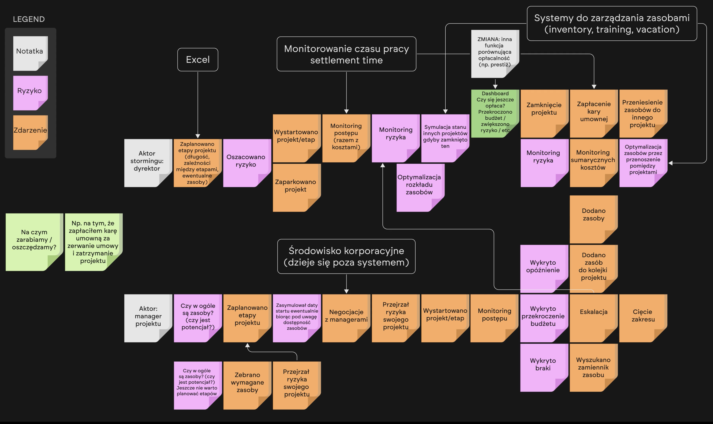

-   skupienie na ogólnej wizji, nie szczegółach modularyzacji
-   rozpoznanie otoaczenia biznesowego
    -   rozpoznanie ryzyk i szans
    -   rozpoznanie regulacji prawnych
-   świadomość tego, czemu ma służyć dane rozwiązanie
    -   rozwiązaniem nie zawsze musi być pisanie kodu

Najważniejsze pytanie: **"Po co to robimy?"**

jak będzie wygladać fima po wdrożeniu systemu, gdzie będzie różnica na lepsze

Pytamy o to co jest ważne dla biznesu.

Nie chcemy marnować czasu na modelowanie nie istotnego problemu dla biznesu

#### Kogo zapraszamy?

Szukamy osób które mogę odpowiedzieć na pytanie "Po co to robimy?"

-   poziomy odpowiedzialności (event storming - big picture)
    -   przedsiebiorcy
        -   maja wizje
        -   wyznaczają cele
    -   managment (event storming - process level)
        -   wiedzą jakie są cele
        -   ewentualnie jakie etapy dojścia do tego celu
        -   wiedzą jak rozliczać cele
    -   eksperci (event storming - design level)
        -   wiedzą jak to zrobić
        -   np. piszą kod itp.

#### Metodyka

-   BIg picture nie jest precyzyjny, może się ograniczać tylko do samych zdarzeń. Zdarzenia nie muszą być opisane w żadnej specyficzny sposób.
-   Nie muszą to być konkretne punkty w czasie, każdy z nich może wyglądać jak osobny proces
-   **chodzi o zrozumienie powodu powstania systemu, a nie jak konkretnie ma on działać.**
-   Nie powinnieneś pouczać osoób z zarządu czym jest dobre zdarzenie, to nie o to tutaj chodzi
-   Chcemy wyjśc ze spotkania ze zrozumieniem które porcesy są dobrze poznanie a które nie
    -   Dobranie rozwiąznaia analizy top-down, bottom-up

zdajemy pytania

-   Na czym zarabiamy?
-   Na czym oszczędzamy?
-   Czym różnicujemy się od konkurencji?
-   po co powstaje ten system?

#### Nawyki koginitywne

-   Szukanie motywacji, nastawienie na cele podczas rozmowy a nie na problemy
    -   dążenie do celu
    -   motywowanie nagrodami
    -   jest dobrze, może być lepiej
-   Skupienie się na problemach może spowodować że będziemy szukać problemów w organizacji sugerująć że coś jest nie tak
-   wymiana słowa problem na wyzwanie
-   pytając o cele masz szansę odkryć brakujące zdarzenia i dojść do sedna problemu

#### Zakończenie warsztatu

-   Kończymy w momencie jak mamy rozpoznane wszystkie krytyczne obszary biznesowe
-   zapytaj się czy jest coś jeszcze co wpływa na krytyczne decyzje biznesowe
-   dopytaj z kim możesz porozmawiać o szczegółach (process level)
-   po czym rozpoznać że Twój rozmówca nie potrafi odpowiedzieć na Twoje pytania
    -   cieżko wzdycha
    -   przewraca oczami
    -   pamiętaj że czasami osoba nie może poweidzieć że czegoś nie wie, bo jest osobą zarządzającą
-   u dorosyłch osób kierunek ich bioder i stóp pokaże im ich kierunek zainteresowań
-   nie zadręczaj pytaniami, zakończ spotkanie

### L04. Fail fast: Top down vs Bottom up

#### Co by było gdyby?

W celu lepszego zrozumienia i odkrycia ryzykownego obszaru biznesowego.

Wchodząc w szczegóły przydatne moze być techniki design level event storming

Nie zwołują spotkania aby zrobić event storming, chcą zrozumieć jak działa ten ryzykowny obszar

-   Design level oraz process level są dobrymi praktykami ale nie dzaiałają zawsze
    -   ich dogmatyczne stosowanie może prowadzić do problemów i braku zaufania

W momecnie kiedy nie wiesz co zrobić to najlepiej zaproponować jakiś model (PoC) aby zobaczyć czy to ma sens

#### Jak modelujemy?

-   top down - jeśli wiemy co chcemy zrobić ale nie wiemy jak
    -   rozpoczynamy od startegicznego modelowania odspearowanych modeli
    -   aby dalej skończyć na modelowaniu taktycznym
-   bottom up - nie znane obszary, gdzie potrzeba odkrycia, protopowania
    -   zaczynamy od taktycznego modelowania, modelowania tego co naprawdę wiemy oraz tego czego na pewno nie możemy zrobić

W momencie kiedy wszystko zależy od wszystikiego sprawdza się szukanie deep modeli

### L05. Szukanie Deep Model jako technika fail fast.

#### Kiedy model nie jest oczwisty?

Najcześciej są problemy modelami które wymagają bardziej niestarndardowego podejścia

Problemy jakie z nimi zwykle są:

-   uzależnienie od Autora rozwiązania
-   techniki klejenia niż modelowania

Najczęstsze tego typu problemu:

-   zmiana reguł biznesowych
-   zmiana obiektów biznesowych w systemie

Zwykle tutaj potrzeba "sprytnego" modelu do rozwiązania problemu

Do tego potrzebne są różne techniki modelarskie

Musimy wytworzyć nawyk myślenia lateralnego czyli nie liniowego

#### Modele zbyt specyficzne

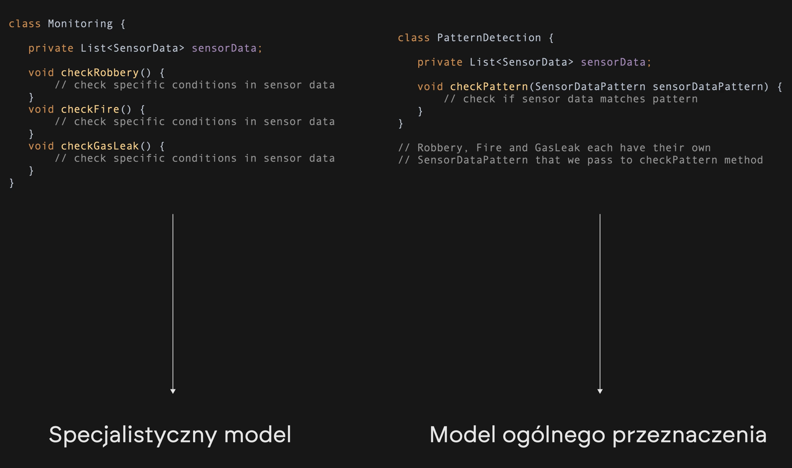

Najczęstszym problemem złożoności w kodzie są nadmiernie wyspecyfikowane modele "overspecialized models"

Zwykle to objawia się tym że muszę cały czas sprawdzać jakieś specjalne przypadki i to w wielu miejscach.

Zawsze zakładaj że podane przez biznes reguły to przypadek specyficzy, a nie reguła ogólna,
spróbuj zamodelować system tak aby obsługiwać każdy przypadek specyficzny

**Uogólnianie poprzez usuwanie przypadków specjalnych**

z takich techniki powstaje model ogólnego przeznaczenia albo też nazymwany model głęboki (deep model)

Aby znaleść taki ogólny model zadaj sobie pytanie:
**Jakiej ogólnej regule odpowiadają te specyficzne przypadki?**

To powoduje że upraszczamy model, a nie komplikujemy, upraszczamy interfejsy, a nie komplikujemy

#### Ogólne, czyli mniejsze lub prostsze

Modele ogólne zwykle są "oczywiste" oraz mają zelete prosty i zrozumiały interfejs

Łatwiej taki model rozwijać, łatwiej go testować, łatwiej go zrozumieć

Warto zawsze inwestować w

#### Model głęboki

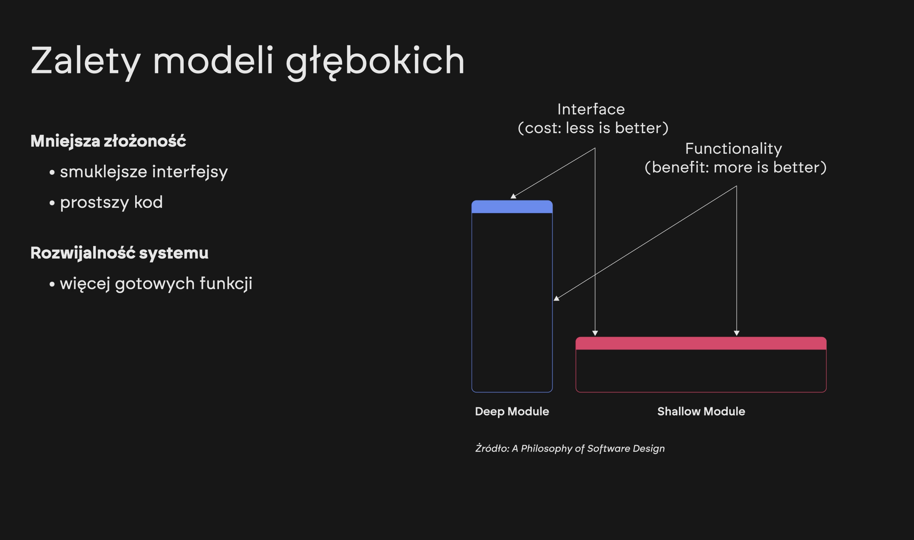

Modele głębokie to takie który są prostsze ale głębsze bo mogą "więcej" obsługiwać

Ogólny model nie oznacza modelu na wszystko, musimy dobierać deep model lub specialized model w zależności od potrzeb i problemu jaki chcemy rozwiązać

Zwykle usunięcie modeli specyficznych nie jest możliwe bo to jest tego czego potrzebuje użytkownik ale one mogą być nad modelem ogólnym i z niego korzystać jako z bazowego modelu

Powinniśmy unikać sytuacji gdzie z panicznie unikamy żadnego if'a w kodzie,
**powinniśmy zrozumieć że ogólny system służy głównie do tego aby uprościć system**

#### Cholerne User Story

User Story autorem jest Kent Beck

User Story jest zaproszeniem do rozmowy

Analizując problem tylko z poziomu User Story prawdopobnie nie odkryjesz głębokiego modelu

#### Szkic rozwiązania


**Implementuj taki model który ma tylko te funkcje którę są dzisiaj potrzebne,
ALE którego interfejs jest gotowy na wiele nowych.**

Jeżeli nie wiesz jaki model głęboki mozesz zastosować, możesz po prostu spróbować po koleij dopasować gotowe rozwiąznia z książek do swojego problemu. Prawdopobnie znajdziesz tam rozwiązanie które będzie pasowało do Twojego problemu. Po prostu metodą brute force próbuj dopasować gotowe rozwiązania do swojego problemu.

**Jest dużo łatwiej oceniać sensowność rozwiązania, mając już przykładowe gotowe rozwiązania!**

**Redukuj problem który chcesz rozwiązać, do problemu który wiesz jak rozwiązać**

Pomocne pytania do szukania deep modelu:

-   Jaki jest obecnie najprostszy interfejs dla obecnych wymagań?
-   Czy intefejs jest łatwy w użyciu?
-   Jak wiele różnych wymagań kończy się wywołaniem tylko jednej, danej metody?

### L06. Co jest stabilne, a co zmienne?

-   Procedura pozwalająca rozwiązać palące problemy biznesowe
    -   Najpierw sprawdź czy jest tutaj potrzeba użycia deep modelu
        -   Sprawdzenie tego możesz dooknać poprzez zauważenie że specjalistyczne przypadku na siebie wpływają (powiązany graf)
        -   zwykle cechuje się to tym że przy próbie dodania nowego modułu będzie on wpływał na resztę modułów a one na niego
    -   Określenie API ogólnego modelu (deep model), stabilne wymaganie w gąszczu zmieniających się wymagań
        -   Szukamy tego co ma robić dany model, jeszcze nie wiadomo jak to będzie działać
        -   Stabilność trzeba rozumieć za coś co zawsze się dzieje w procesie, np. mamy inne alarmy ale każdy alaram szuka jakiegoś wzorca aby się odpalić
    -   Zaimplementuj najprostszy przypadek Twojego ogólnego modelu

Sposoby szukania abstrakcji

-   Poszukanie gotowych rozwiązań (z książek)
-   Generalizacja - szukanie bardziej ogólnego obiektu który będzie mógł obsłużyć wiele przypadków
-   Zmiana reprezentacji - zmiana reprezentacji obiektu na bardziej ogólną np. na drzewo

## Moduł 03 - Deep Models - głębsze zrozumienie w celu uproszczenia problemu

### L01. Rozwiązanie: Przykład deep modelu - harmonogramu. Jak na nie wpadać?

-   Rozpoczęcie prac od obszaru complex tak aby sprawdzić czy PoC ma sens
    -   Rozpoczęcie od bottom-up, przygotowanie PoC dla krytycznych obszarów
-   Zawsze szukanie alternatywnego modelu
    -   Zawsze szukaj alternatywnego modelu, nie bój się zapytać czy jest inny model
    -   Zawsze szukaj modelu który jest bardziej ogólny
-   Implementacja ma zawsze drugorzędne znacznie, istotne jest rozwiązanie problemu
    -   Po prostu w momencie zmiany decyzji był przepisywany moduł

#### Redukcja problemu


-   Przeszukanie gotowych rozwiązań z książek itp.
    -   "Nie wiesz co robić to rób co wiesz"
-   Rozwiązanie najprostszego przypadku
-   Stosowanie techniki uogulniania poprzez usuwanie przypadków szczególnych
-   Jeżeli żaden z przypadków szczegółnych nie pasuje do modelu to znaczy że musimy go dostroić
    -   Dostrajanie nadal jest w obrębie ogólnego modelu, np. waga grafu w algorytmie

#### Słowa mosty


Słowa mosty pomagają w znalezieniu modelu ogólnego

Na przykład "zależność, cykl pomiędzy etapami" to słowa mosty które pomagają w znalezieniu modelu ogólnego
Sugerują użycie grafu gdzie takie słowa też występują

Oczywiście to wymaga znajomości algorytmów, struktur danych itp.

#### Wizualizacja

Wizualizacja problemu może pomóc w znalezieniu modelu ogólnego, np. podczas wizualizacji problemu znajdziemy podpowiedzi które pomogą w znalezieniu modelu ogólnego, rysnek będzie wyglądał jak jakiś znany algorytm np. graf

#### Intiucja

Intuicja to nieuświadomiona wiedza pochodząca z doświadczenia

Intuicja sprzyja tym którzy mieli szansę wystawić się na różne przypadki i problemy

Dobrym treningiem jest modelowanie tego czego używamy na co dzień, dla terningu w głowie. Wiele otacza nas techniologii które możemy modelować

#### Separacja konceptów

Podejmowanie wczesnej decyzji wdrożeniowej jest ryzykowne, lepiej jest oddzielić koncepty od implementacji.

Istotne jest aby nie poświęcić tygodni aby udowodnić że coś działa, lepiej jest zrobić PoC

### L02. Protip konsultanta: jak szybko generować wartość?

-   Można sprawdzić czy zmiana reprezentacji świata realna na algorytm np. graf jest sesowna, można to sprawdzić poprzez
    sprawdzenie czy kolejen obiekty ze świata algorytmów są w stanie reprezentować obiekty ze świata realnego
-   W ten sposób można wygenerować nowe pomysły biznesowe które można łatwo zaimplementować, w ten sposób można generować wartość
    oraz zyskiwać zaufanie klienta. Budowanie partnera biznesowego a nie tylko podwykonawcy
-   To też jest trick który pozwala zyskać budżet na analizę bo biznes widzi że to ma sens, możemy wygenerować nową wartość
-   "Dobrze wybrany model pozwala na zadanie ciekwych pytań"

### L03. Metryki dobrego modelu - brakujące narzędzie rozwiązujące "moje jest mojsze niż Twojsze"

#### Onanizm techniczny

-   W naszej branży brakuje podejścia inżynierskiego do modelowania
    -   czyli porównanie kilku rozwiązań pod kątem metryk
-   **Model to płaszczyzna komunikacji**
-   Zwykle problem jest patrzenie na system poprzez metryki techniczne pomijając metryki biznesowe
-   Zwykle metryki technicznie nie sa najważniejsze na początku
-   DDD staje się przykrywką do tego "kto dalej sika", to przechodzi do okradania klienta
-   Skupianie się na metrykach które w tym momencie nie są krtyczne
-   Zwykle dobre dobranie modelu i struktury jest znacznie bardziej istotne od implementacji

**Separacja koncepcji od konkretnej reprezentacji**


Na prrzykład graf to koncept, ale można go różnice zaprezentować, np. macierz sąsiedztwa, lista sąsiedztwa itp.

Nie powinno się mówić o reprezentacji osobie nie technicznej, tylko o konceptach

#### Drivery architektoniczne

Zwykle gorzej nam idzie z oceną metryk nie technicznych

Drivery architektoniczne to wymagania które nie są funkcjonalne, np. dostępność, skalowalność, wydajność

Szukanie rozwiązania poprzez zaproponowanie kilku rozwiązań i przefiltrowanie ich pod kątem drivery architektonicznych

-   Poprawność
    -   Czy spełnia kryteria akceptacji?
    -   Przejście przez wszystkie znane przypadki i sprawdzenie czy model je obsługuje
-   Prostoty użycia
    -   Ile jest warstw translacji?
    -   Jak łatwe jest API?
    -   Czy gotowe narzędzie zadziała, czy będzie potrzebna trasnlacja naszego modelu na model narzędzia?
    -   Czy znamy to narzędzie, czy musimy się go uczyć?
-   Rozwijalność i produktyzacja
    -   ile przyszłych rozwiązań mogę od razu rozwiązać?
    -   Walidujemy różne use case na tym modelu, różne przyszłe możliwe zmiany
-   Koszta
    -   Po prostu ile to będzie kosztować, praca czy gotowe rozwiązanie

Jeżeli nie potrafisz łatwo opowiedzieć o Twoim modelu biznesowi to prawdobonie tego modelu nie ma.

Twój model powinnien być wstanie odpowiedziec na use case'y biznesowe np. dodanie kolejnej reguły biznesowej

Biznes chce modeli którę rozwiązują ich problemy ale nie muszę wiedzieć jak konkretnie działają

#### Model jako narzędzie do prowadzenia symulacji zmian wymagań

Dobry model pozwala biznesowi zadać dobre pytania.

Model powinnien być rozwijalny, powinnieneś generować różne use case i sprawdzać czy model je obsługuje

#### Metryki będą się różnić w zależności od kontekstu

-   Może liczy się czas
-   Może liczy się rozwojość rozwiązania

#### Jak dokumentować modele?

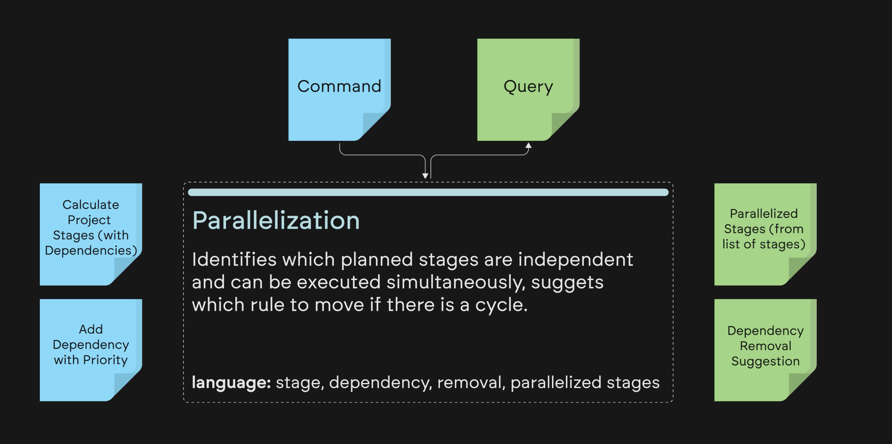

-   Testy automatyczne
-   ADR'y
-   Format rozumiany przez cały zespół (nie tylko techniczny)
-   Najczęściej wystarczy rysunek

UML'e wiele nie wnoszą, zwykle biznes ich nie rozumie. Jest zbyt złożona

### L04. Deep Model: Optymalizator

#### Metodyka zbierania wymagań


-   Zbadaj potrzębę na deep model -> znajdź stabilne rozwiązanie w gąszczu naiwnych przypadków -> szukaj ogólnego modelu i zaimplementuj najprostszy przypadek
    -   Pozwala to na lepsze zrozumienie wymagań i szukanie deep modelu. Może jest jakieś gotowe rozwiązanie które można dostosować

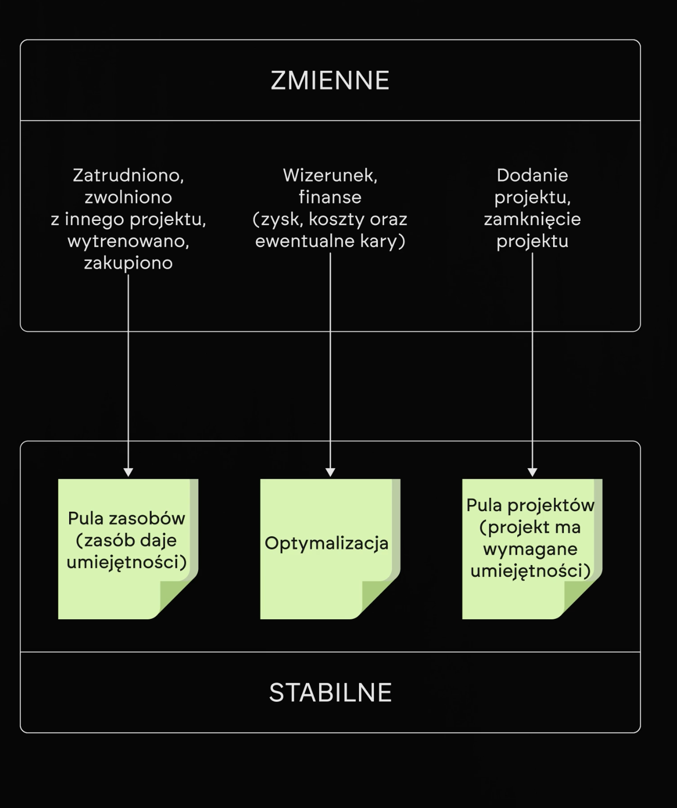

#### Stabilność vs niestabilność

Szukamy stabilnego modelu w niestabilnych wymaganiach

Dobry model pozwala automatycznie zadawać dobre pytania, usuwać specjalne przypadki

### L05. Zadanie

Brain popełnił błąd przez rozsmarowanie modelu po całej aplikacji

**Dużo łatwiej jest rozwiązać problem który chcesz rozwiązać, jeśli sprowadzisz go do problemu który wiesz jak rozwiązać**

### L06. Modelowanie Niepewności i Rozwiązania Zadania

Rozwiązaniem zadania jest zastosowanie ogólnego modelu dopasowania

Najważniejszy wniosek z zadnia: **wiele problemów można sprowadzić do znanych problemów**

#### Testowanie modelu

Testujemy model poprzez próbę dodania nowego przypadku, jeżeli model nie obsługuje tego przypadku to znaczy że trzeba go dostroić

**Pamiętaj prawdobponie Twój problem nie jest unikalny! Znajdź gotowe rozwiązanie i dostroj je do swojego problemu**

Uważaj na sytuacje jak biznes używa słów nigdy lub zawsze, tłumacz to na:

nigdy - nie znamy takiego przypadku
zawsze - zawsze to robimy, ale nie zawsze to robimy tak samo lub wcale nie robimy

Przygotywowanie się na przyszłe zmiany to nie jest łamanie zasady YAGNI

YAGNI - You Ain't Gonna Need It

Ironicznie pachanie się w model specjalistczny w dłuższej perspektywie będzie bardziej kosztowne niż zrobienie modelu ogólnego

### L07. Czy AI zastąpi białkowego modelarza? O szukaniu deep modelu przez deep learning

Powinniśmy nauczyć się poprawnie używanie LLM (Large Language Model)

Źle: generuje model

Dobrze: generują pomysły, generują konkretną implementacje znanego modelu

W tym momencie AI nie zastąpi modelarza, ale może pomóc w generowaniu pomysłów.

Najlepiej działa jak juz wiemy co chcemy zrobić, zapadła decyzja projektowa, a AI generuje implementacje

W tym momecnie musimy jeszcze poczekać zanim AI będzie wstanie samodzielnie modelować systemy

### L08. Bottom up: Podsumowanie i Zadanie

#### A kiedy takich głębokich modeli nie robić?

Nie zawsze to musi być problem modelarski

Może to być problem techniczny:

-   integracja z zewnętrznym systemem
-   pobieranie danych

#### Myślenie redukcyjne

-   Szukanie analogii
-   redukowanie problemu
-   zawsze zakładamy że ktoś już podobny problem rozwiązał

**Potrzebujesz czasu aby zdobyć doświadczenie, musisz zobaczyć wiele problemów aby zacząć widzieć analogie. Wtworzenie intuicji to proces długotrwały.**

### L09. Model jest wszystkim czego potrzebujesz

#### Jest coś jest dobre do wszystkiego to jest dobre do niczego

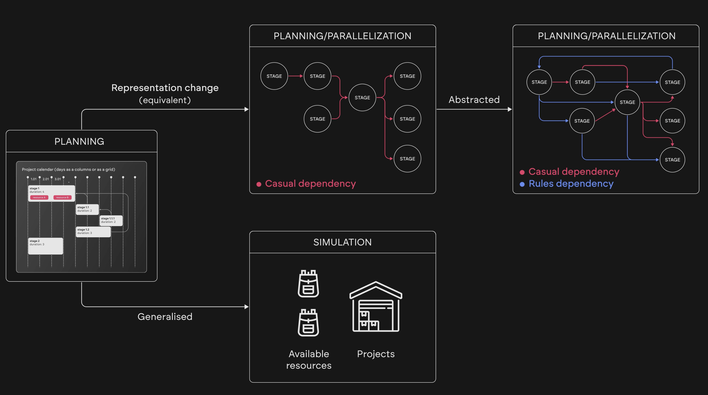

Opracowanie właściwego modelu to klucz do zwycięstwa

#### Model a rzeczywistość

Model nie musi odwzierciedlać rzeczywistości, musi być użyteczny

#### Model jako baza o regułach

Model to baza reguł, które pozwalają na generowanie nowych pomysłów, tłumaczą co się dzieje w firmie

## Moduł 04 - Analiza Top-Down - jak radzić sobie z obszernym, wielodomenowym problemem

### L01. Rozwiązanie zadania

**Dobry model pozwala samemu zadwać dobre pytania**

Dzielenie kodu na siłę może powodować że zaciemnimy sposób rozwiązania np. jakiś algorytm

Rozwiązaniem jest tutaj zbyt specyficzne podejście do potrzebnych zasobów do projektu, nie tylko pieniądze ale też wizerunek lub kombinacja tych dwóch

### L02. Event Storming Process Level - wprowadzenie

#### Nie kradnij

Okradaniem klienta jest próba modelowania procesów tam gdzie ich nie ma

#### Cel sesji Event Storming - Process Level

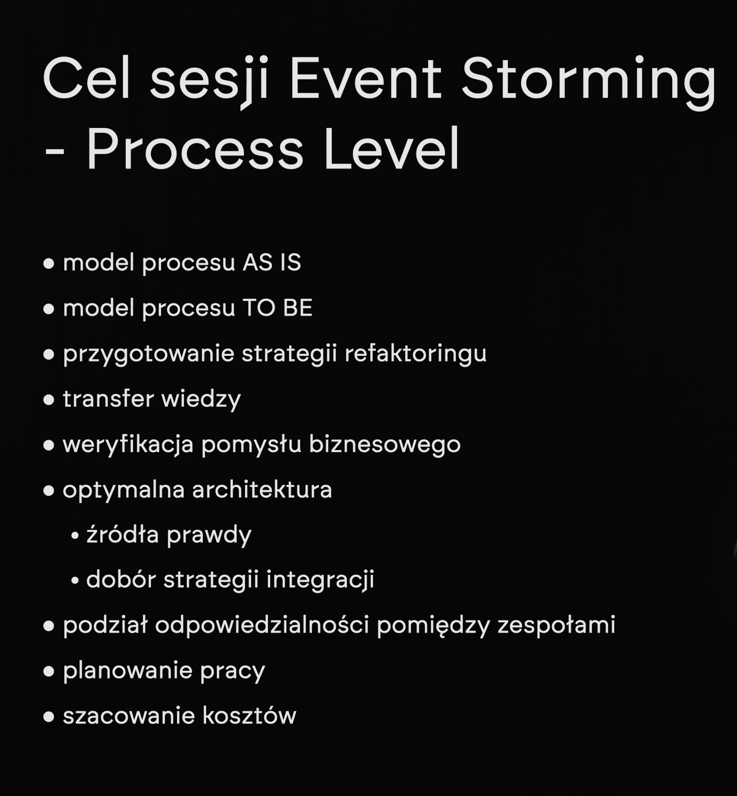

Użycie narzęddzia dla użycia jest bezsensu, korzystaj tylko z tego co jest potrzebne

Nie zwołuj spotkania aby wykonać Event Storming,
to tak jakby chirurg chciałby Cie operować dla operowania a nie aby Ci pomócF

Tricki

-   **Zakomunikuj cel spotkania i powołuj się na nieo w razie problemów**
-   Wprowadzaj notacje stopniowo
    -   zacznij od zdaczeń
    -   dodaj komendy i widoki
    -   dodaj reguły procesowe
-   Dodaj poziomy swimline
    -   poziom poza systemem
    -   poziom UI
    -   poziom domenowy
    -   poziom infrastruktury
    -   poziom innych systemów
-   Rozpocznij o istotnych zdarzeń
    -   pivotal events - sesja kreatywana TOBE
    -   zdarzenia początkowe i końcowe - sesja AS IS
-   abstract vs konkret - dopasuj się do grupy
    -   pierwsza grupa ludzi będzie się skupiać na konkretach, np "weźmy taki przykład"
    -   druga grupa na ogólnych principach, np. "jakie są zależności pomiędzy tymi zdarzeniami"
-   zwertfikuj go od końca
    -   przechodząc przez każde zdarzenie zadaj sobie pytanie, co musiało się zadziac wcześneij aby to zdarzenie miało miejsce. Możliwe że w ten sposób uda Ci się odkryć brakujące zdarzenia

#### Uczestnicy

Szukamy zależności przyczynowo-skutkowych, bez niej nie mówimy o procesach

Zapraszamy osoby z managmentu, czyli osoby którę wiedzą co ma być zrobione ale nie wiedzą jak to się robi dokładnie

Zapraszasz do kilka-kilkanaście osób, tak aby nie było chaosu

#### Czas

Średni czas trawnia sesji to 1-3 dni (w zależności od liczby procesów)

Zebrana wiedza powinna wystaczyć do zaplanowania pracy na kilka kolejnych miesięcy, wynikiem powinna być podział na konteksty i przydzielenie ogólnych zadań do zespółów

Zespoły następnie samodzielnie ustalają szczegóły z espertami dziedzinowymi w sesjach takttycznych

Może się okazać że będzie potrzebny jeden dzień wiecej aby ropzoczac prace, mogę być tarcia pomiędzy uczestnikami

#### Dla osób Facilitujących

Potrzebne korki który powinny się pojaić na spotkaniu:

-   zrozumienie - definiowanie problemu/wyzwania
    -   zrozum jakie są przyczyny wyzwania oraz jasno określ swoje cele i wyniki
    -   nie szukaj szybkicj rozwiązań, staraj sie jak najlepiej zrozumieć problem
-   ideacja - generowanie pomysłów
    -   badanie możliwośc i znajdowanie włąsciwości wujaśniających
    -   Na tym etapie żadeń pomysł nie jest zły
-   Analiza - ocena pomysłów (przeglądanie i sortowanie)
    -   badanie wykonalności i praktyczności wybranych pomysłów
-   kierunek - tworzenie planu, wdrażanie rozwiązań, wzmacnianie

#### Antypatycowanie chaosu

W momencie jak na starcie spotkania będzie chaos to narysuj ten rysunek:


i skomentuj to:

Pierwsza faza może wyglądać na chaotyczną, ale jej struktura jest częscią więszkej metodyki aby zrozumieć procesy

#### Wstęp

Musisz zadbać o gładkie wprowadzenie

Zakomunikuj cel spotkania i wprowadzaj notacje ale stopioniowo

Zdarzenia - wpływaja na proces, coś co się dzieje, coś może się zdarzyć następnie. Muszą przypisane od konkretnego punktu w czasie

Zdarzenia opisuje się w czasownikiem w casie przeszłym w trybie dokonanym.

Proces płatności to nie zdarzenie ale proces, natomisat składa się np. z

-   zlecono pobranie
-   potwierdzono pobranie
-   odrzucono pobranie
-   potwierdzono płatność

Po wytłumaczeniu poproś uczestników aby podali własne przykłady z ich procesów biznesowych

Zwerfikuj czy to są konkretne punkty w czasie, czy to są zdarzenia

#### Zanim zaczniesz

Uczestnicy mogą korzystać z poleceń UI np. kliknięto przycisk, w taki sposób wyborażają sobie system osoby bez wiedzy technicznej

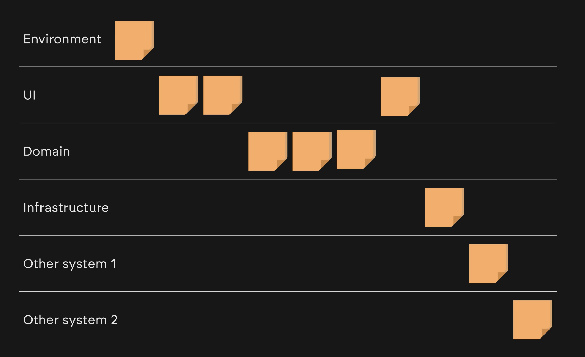

Dodaj poziomy swimline, zapis od lewej do prawej. Wygląda na prcesy które są wykonywane w systemie ale podzielone na konteksty.

Swimline pozawalja nam oddzielić zdarzenia domenowe od tych które są związane z UI albo poza systemem

Możesz dodać własne poziomy w ramach potrzeb.

#### Początek

Dla sesji AI IS zaczynamy od zdarzeń początkowych i końcowych. To pozwala na to aby się skupić na tym procesie i nie wychodzić poza niego

Dla sesji TO BE zaczynamy od pivotal events, czyli zdarzeń które są kluczowe dla procesu
Pivotal event to taki która ma poważne kosekwencje aby go odwrócić, np. zamówiono towar, aby go odwrócić trzeba wykonać cały proces złożenia rezygnacji

Nie przejmuje się kolejnością, eksplotuj zdarzenia wokół pivotal events. Ułożenie tego w czasie przyjdzie kolejnych etapach analizy.

#### Start

Najpierw osoby z różnych działów zajmują się swoimi procesami, pracują równolegle

#### Kolejne elementy

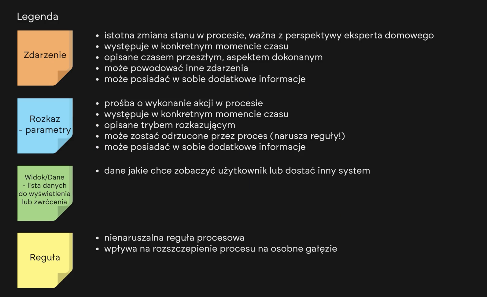

Komendy - każde zdarzenie musi mieć swoją przyczynę, np. inne zdarzenie lub komenda. Zapisana jako czasownik w trybie rozkazującym. Komendy mogą być wysyłane z innych systemów lub od innych użytkowników. Komendy można odrzucić.

Widoki - Widok to ekran jaki prezentujemy użytkownikom lub dane API jakie zwracamy innym systemom. Posługiwanie się widokami pomaga osobm nie technicznym. Zapytaj jakie zdarznenia muszą zadziać aby zebrać wymagane dane do wyświetlenia na widoku. Zapytaj do czego będą te dane służyć dalej.

Procesy mogą być liniowe lub rozgałęciaż się na kilka możliwości. Rozdzielają je reguły procesowe.

Reguły - Wpływają na rozwidlenia procesu. INTERESUJA CIE TYLKO REGUŁY PROCESOWE. Pomijamy reguły walidacyjne, bo wiadomo że kończą proces i przerywają wyświetelenem błędu. Pomijamy reguły zmiany stanu.

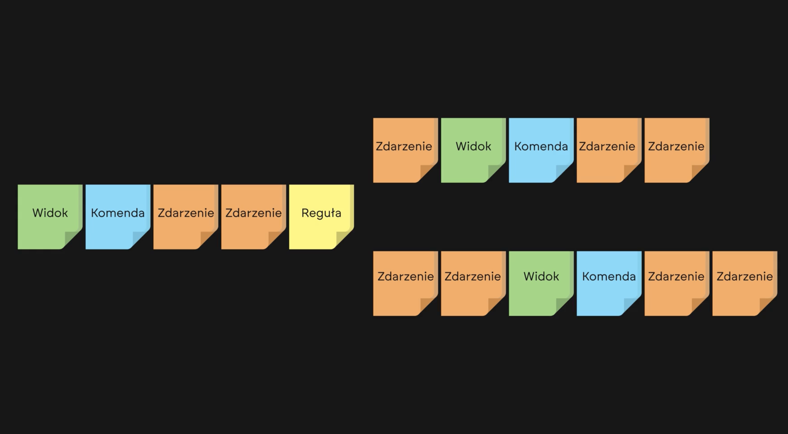

Reguły:

-   **procesowe - sterujące wyborem ścieżki w procesie**
-   walidacyjne
-   synktatyczne - wejście np. formularza
-   biznesowe - porówanie wejścia z bazą danych
-   obliczeniowe - algorytmy, np. obliczanie ceny
-   spójność zmiany stanu
-   spójność danych w bazie danych

**Pamiętaj aby przyklejać karteczki, nawet jeśli nie jesteś pewień czy to jest dobra karteczka, to zawsze można odkleić**

Kartęczkę łatwiej zmienić niż rysunek

Spotkania na żywo mają lepsze rezultaty niż zdalne, lepiej jest zrobić to w biurze

### L03. Model procesów

[Modelowanie procesów](./assets/DD_M04L03_PROCESS_LEVEL.pdf)

#### Podejście pierwsze - próba uogólnienia

W momencie kiedy nie możesz ułożyć zdarzeń w czasie to znaczy że nie masz tutaj do czynienia z procesem.

#### Wszystko, wszędzie, naraz

#### Podejście drugie - konkretne use case

Rozpisanie konkretnych use case które są procesami, odkrywanie wspólnych elementów procesów

Jeżeli nie wiesz jaką reprezentacje wybrać dla klienta to spytaj go aby Ci to narysował

#### Po zmianach Brajana

Można rozpoznać że Event Storming nic nie wniósł jeżeli zdarzenie wyglądada tak samo jak komenda

### L04. Porady dla facylitatorów

Umiejętności miekkie są niezbędne aby zbierać wymagania

#### Ale Ty masz silną psychikę

**Więkoszość ludzi lubi mieć wrażenie że prowadzący wie do czego zmieża oraz to co robimy ma sens**

-   Wykonuje gesty które wracają do pozycji od której zostały wyprowadzone
-   nie macha rękami
-   nie zakrywa szyji
-   mówi konkretnymi frazami patrząć w konkretne punkty

#### Weryfikuj od końca

Aby zweryfikuje event storming sprawdź go od końca, zaczynając od ostatniego zdarzenia. Zadaj pytanie co musiało się zdarzyć aby to zdarzenie miało miejsce.

Ludzie myślą skrótami myślowymi, myślą od A do D, pomijając B i C

przejście tego od końca nie uruchamia tych skrótów myślowych

#### Generyczne pytania są dobre na wszystko

ważne aby mieć zdarzenia na poziomie ziarnistości, nie za duże ani za małe

Jeżeli zdarznenia nic nie wnoszą to znaczy:

-   masz płytką dziedzinę, czyli CRUD
-   musisz poświęcic więcej czasu aby dojść do sedna problemu

Dojście do sedna opierają się o generyczne pytania

-   Being - Czym to jest?
    -   co ma projekt? Etapy, Co mają etapy? inne etapy. Co ma jeszcze projekt? Nazwę, a ile minmalnie znaków ma nazwa?
    -   w praktyce jest to najmniej praktyczne pytanie do odkrywania problemu
-   Behaving - jak to się zachowuje?
    -   zachowania mogą lepiej zrozumieć biznes
    -   kto zmienia?
    -   dlaczego zmienia?
    -   powód zmiany?
    -   jakie jest skutek zmiany?
    -   jak często się zmienia?
    -   czy zmianę można zmienić, wycofać?
    -   5 why
        -   UP - dlaczego to jest ważne?
        -   DOWN - jakie jest sktek?
-   Becoming - W co to się zmienia?
    -   w co się zmienia?
    -   czy łatwo jest odwracalne?

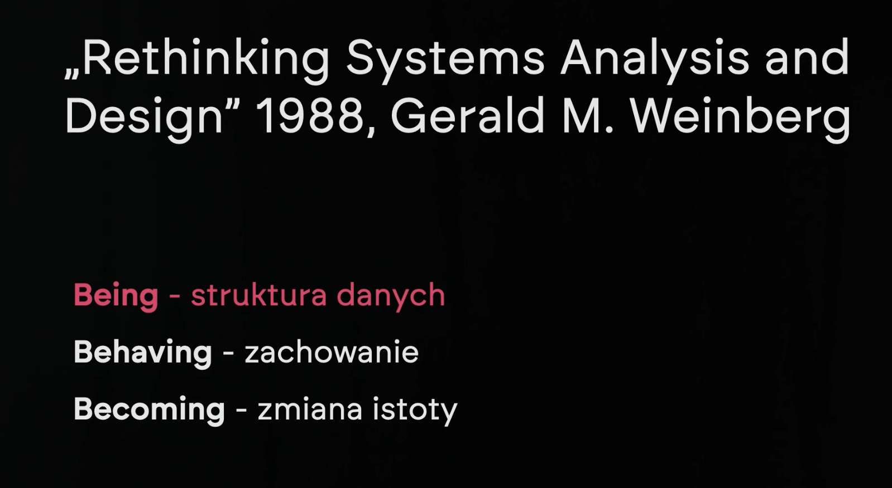

#### Rozróżnianie zdarzeń i komend

Podczas stormingu zauważysz komendy którę brzmią tak samo, czy to są te same komendy?
Sprawdź czy powodują te same zdarzenia, jakie są skutki w dalszych etapach procesu

Uwaga! mogą to być zdarzenia z innych kontekstowych modeli

#### Zbieraj złe pomysły

Zbieraj karteczki które są ze złymi pomysłami do obszaru "zaoszczędzone pieniądze" i pokaż na koniec sponsorowi spotkania

#### Nie używaj brudnych słów

Zdarzenia techniczne

-   zmieniono rekord
-   zapisano rekord do bazy
-   usunięto
-   zmodifikowano

Może być tak że analityk z technicznym tłem będzie rzucał takimi zdarzeniami. W takiej sytuacji poproś aby pomyślieli że nie ma komputerów tylko są same analogowe narzędzie i karteczki

**Stwórzmy model tego co się dzieje w biznesie**

#### Do refaktoringu potrzebujesz dwóch modeli

Zawsze stwórz dwa modele AS-IS i TO-BE

Posiadanie dwóch modleli jest ważne bo zwykle biznes myśli o celach, że może być lepiej

Jeżeli nie stworzych dwóch modeli to skończysz z miksem dwóch światów

Biznes zapytaj o to co warto refaktoryzować,
ekspertów dziedzinowych o to co łatwo rekaktoryzować

To są tak zwane łatwo wiszące owoce, aby pokazać przed sponsorem massive win

#### Zmiana reprezentacji

Jeżeli poprosisz zespół aby zaprojektować system na nowo to pojawią się małe lokalne zmiany, generalnie kształt modelu będzie podobny

Zwykle problem polega na tym że opowiadamy o tym systemie używając tych samych rzeczowników.

Używając zdarzeń opowiadamy historie czasownikami a nie rzeczownikami, przez co jest większa szansa na nowy lepszy model.

#### Uwaga na ekspertów

mam dwa rodzje UI:

-   induktywne - dla ekspertów
    -   pozwala ekspertom robić wszystko
    -   na UI widać schemat bazy danych
    -   eksperci mają logikę w głowie a system traktują jako notatnik
-   nastawione na zadania - dla laików
    -   wszystko ma się zadziać po kliknięciu przycisku

#### Weryfikacja modularyzacji

Typowe problemy w przypadku modularyzacji:

-   stawianie granic w złych miejscach
-   przeciekanie modeli
-   brakuje źródeł prawdy
-   nie zadziałą w systmach rozporoszonych

Zwykle diagram modularyzacji jest taki sam, czyli niezależne moduły które są podłączone do szyny danych

Problem jest taki że dopiero jak nałoży się kierunki komunikacji to pojawi się plątanina połączeń

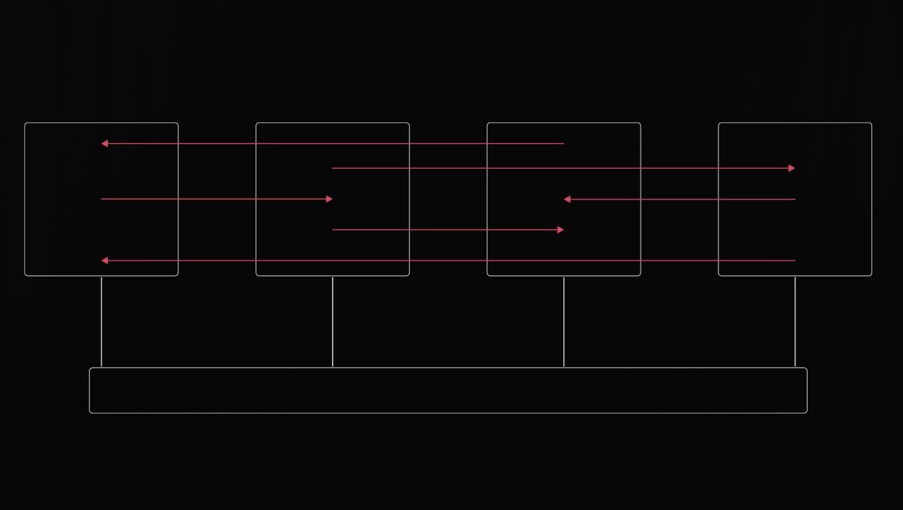

A w momencie jak przeanalizujesz treść tej komunikacji to odnajdziesz przeciekanie modeli, czyli zmiana w jednym modeli powoduje kaskadę zmian technicznych i koordynacji wielu zespołów

Poproś swojego architekta aby nałożył na swoją architekturę proces biznesowy w postaci karteczek z event stormingu.

Jak zapraszasz ludzi na spotkanie to nie rób sobie za cel obnażenie braku kompetencji architekta, a raczej zakomunikuj transfer wiedzy od archtiekta do zespołu, następnie zadawaj pytania, ewentualnie stosując złote mosty

#### Synchronizacja wiedzy biznesowej

Spotkanie przydatne kiedy nie rozumiesz jak działa biznes

Rozpisz strukturę AS IS i następnie poproś osobę z każdego działu aby przeszła po każdej karteczce i wyjaśniła jak to rozumie, jak wypływa każde zdarzenie na ich obszar biznesowy

To może pokazaż że ta osoba zupełnie inaczje rozumie konsekwencje zdarzeń, może pracuje na złych założeniach

To jest znak ża należy wykonać rzetelną analizę jak działą biznes, zanim zaczniemy tworzyć rozwiązanie

#### Planowanie prac

Możesz uzyć User Story mapping

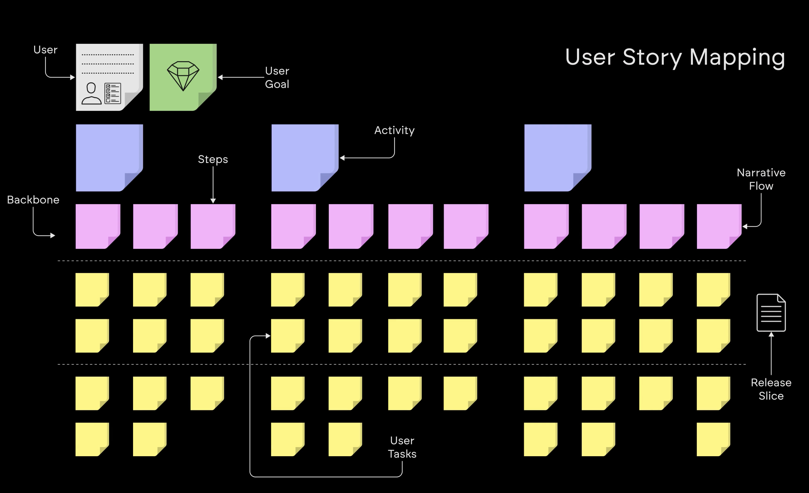

W tym mozna użyć zdzarzeń zamiast User Task i sortujesz je w względem priorytezacji implementacji

#### Wycena

Zespoły które przeszły już wielkrotnie analizę procesową mogą nabrać intyucji co do kosztu typowych elementów do implementacji

#### Pizza

Event sotrming nie jest formalny, jest jak pizza na którą możesz nakładać wszystko. Możesz wprowadzać nowe typy karteczek.

#### Nie myśl

Najlepszą radą dla niedoświadocznych modelarzy jest:

**Nie myśl rozwiązaniem technicznym**

W momencie jak dostajesz pytania przyjmij zaożenie że wszystko da się zrobić, na spotkaniu Twoim celem jest jak najlepsze zrozumienie problemu biznesowego. W takim momencie proces jeszcze mozę sie zmienić, więć zbyt wczesne myślenie o rozwiązaniu jest stratą czasu.

### L05. Cyrk na kółkach

#### Co się stało się

Problemy w komunikacji często wynikają z problemów lękowych u innych osób

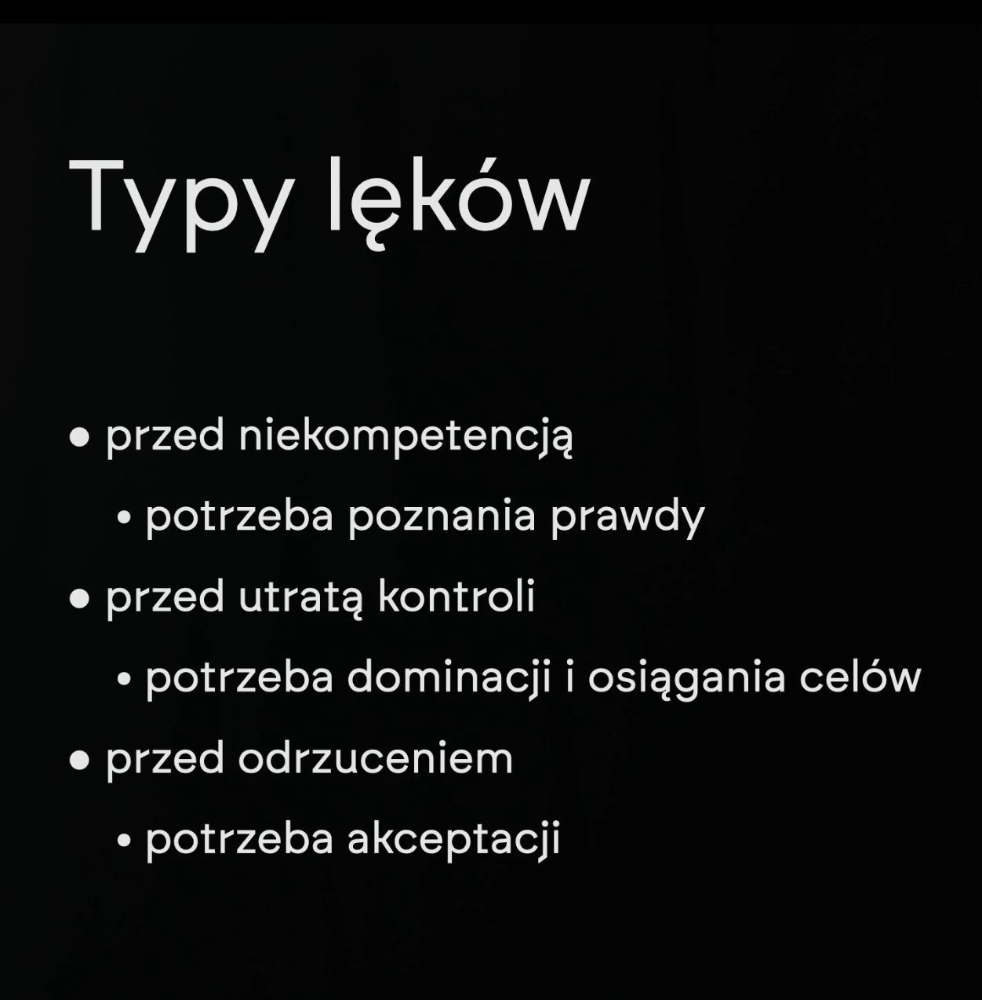

### L06. Elementarz Komunikacji

#### Metaprogramy

Metaprogramy to schematy myślowe które wpływają na nasze zachowanie, uruchamiają się kontekstowo

Należy inaczej podchodzić do Event storming, w zależności z kim pracujesz

#### Podobnieństwa vs Różnice

Sortowanie informacji w zależności od nastwienia na:

-   podobnieństwa
    -   szukają tego co się zgadza
    -   obawa przed zmianą
    -   ekspanowanie podobnieństw i analogii
-   różnice
    -   szukają przeciwieństw
    -   lubią zmiany
    -   wybór przed odrzucenie
    -   zgoda przez brak różnic

#### Co to dla mnie znaczy?

Projektukjąć TO BE z AS IS i pracując z osobami którę są nastawione na podobnieństwa możesz skończyć z rozwiązaniami które są takie same jak obecne. W takim przypadku użyj zdarzeń pivotowych aby rozpisywać wokół zdarzeń milowych. Samo używanie czasowników może zerwać z schematem myślowym na rzeczownikach

Jednocześnie modelując AS IS z osobami nastawionymi na różnicę może Ci się rozjechać rzeczywistość z modelem, w takim przypadku postaw zdarzenia początkowe i końcowe jako ramy celu

#### Ogół vs Szczegół

Opis rzeczywistości

-   Sczegół
    -   kwantyfikatory szczegółowe
        -   będą mówić istnieją takie przypadki
    -   detale
        -   skupieni na detalach dlatego nie radza sobie z obrazek czałości
    -   etapy i sekwenje
        -   Potrzebują podziału na mniejsze etapy, sekwenje
    -   liniowy przypadek
        -   układają informacje w liniowe sekwencje krok po kroku
-   Ogół
    -   kwantyfikatory ogólne
        -   "bo ty zawsze", "bo ty nigdy", "ogólnie to jest tak"
    -   generalizacje
    -   kolejność nie ma znaczenia
        -   nie zwracają uwagi na kolejność, nie widzą zależności przyczynowo-skutkowych
    -   gubienie się w szczegółach
        -   długie siedzenie w detalach jest dla nich frustrujące

#### Co to dla mnie znaczy?

DLa osób które mają tendencje do wchodzenia w szczegóły, pytaj "Dlaczego to jest ważne?" (pytaj w górę) oraz odnoś się do celu czyli do ostatniego zdarzenia

Dla osób które mają tendencje do ogólniania, odnoś się do wspólnego interesu, np. "Aby zredukować ryzyko, obniżyć koszty, zwiększyć zyski, potrzebuje zejść głębiej". Ważne aby pamiętać aby to był dobry moment, miejsce gdzie warto kopać głębiej

#### Od problemu vs cel

Nastawienie do świata

-   Unikanie
    -   filtrowanie problemów i zagrożeń
        -   wszędzie widzą problem, skupiają się na tym co kiedyś nie wyszło
    -   sam brak problemu, oznacza że jest dobrze (nie jest źle)
        -   nie trzeba psuć, uważaj tylko nie spadnij
    -   problemy rozporaszają w dążeniu do celu
        -   problemy łatwo odwracają ich uwagę
    -   wiedzą czego nie robić
        -   ale nie wiedzą przez to co robić
-   Dążenie
    -   filtrowanie na cele i korzyści
        -   motywją ich koryści
    -   zawsze może być lepiej
        -   jest dobrze ale może być lepiej
    -   nie widzą problemów dążąc do celu
        -   będą reagować silnie na nagrody, natomiast problemy zurzają na innych

Osoby ustawionę na unikanie nie będą chcialły planować bo są pewne że coś sie wyspie po drodzę, takie osoby trzeba zapewniać że damy sobie radę bo będziemy wiedzieć co robić

Natomiat osoby nastawione na cel zupełnie nie widzą po drodze żadnych problemów, "jakoś trzeba pokonać e tam", dla takich osób jeżeli zaczniesz im wyliczać możliwe problemy techniczne to będzie to odbierane przez biznes jako marudzenie

Zanim zaczniesz zwracać na coś problem zawsze sie zastanów:

**Czy to jest najlepszy moment aby zwrócić uwagę na jakiś problem?**

Jeżeli to jest ten moment to połącz to z zagrożeniem jakiegoś konkretnego celu.

#### Co to dla mnie znaczy?

Jeżeli osoby nastawione na unikanie zaczną odchodzić od celu, przypomnij im co jest naszym celem spotkania oraz cel procesu ostatniego zdarzenia.

Jeżeli chcesz uwypublikć problem to poproś kogoś aby wskazał jakiemu celu zagraża ten problem

#### Źródło referencji

Źródło referencji

-   Wewnętrzne

    -   własna retrospektywa
    -   poczucie, że się wie
        -   będą mówić że to po prostu wiedzą
    -   potrzeba samodzielnego sprawdzenia
        -   sam wiem, sam muszę sprawdzić, będę wiedział jak sprawdzę
    -   osobiste decyzje
        -   nie zważają na opinie innych
        -   takimi osobami jest trudno zarządzać
    -   pochwały nie służą do potwierdzania
        -   nie potrzebują zewnętrznych pochwał, nie szanują pochwał kogoś kto się nie zna
    -   pochwały budują status
        -   pochwały są im potrzebne do budowania statusu w grupie

-   Zewnętrzne
    -   opinie innych
        -   bo większość ludzi, bo klienci kupują, tak wszyscu mówią, bo Pan X tak mówi
    -   wiedza pochodzi z zewnątrz
        -   bo ktos coś im powiedział
    -   pochwałą jest informacją zwrotną
        -   potrzebują zewnętrznych poleceń informacji zwrotnych, oraz pochwał aby wiedzieć że podążają w dobrym kierunku

W momencie jak pracujesz z osobą która szuka źródłe zewnętrznych powoływanie się na własne doświadczenia moze być nie wystarczające (chyba że jesteś ekspertem w danej dziedzinie), bądź przygotowany że poprosi się o wyniki badań itp.

W momencie jak pracujesz z kim nastawionym na wewnętrzne, powyoływanie się na inne osoby będzie odbierane jako brak zrozumeinia ich problemu projektowego, lepiej zaproponować własny eksperyment, np. tutaj jest repo z tym nowym kodem, sprawdź go osobisćie, zobacz jak działa, daj znać co o tym myślisz

#### Co to dla mnie znaczy?

Podczas stormingu możesz trafić na osoby wszechwiedzące które nie zważają na opinie innych, zwykle takie osoby będą nastawione na unikanie problemów, najlepiej skupić się na problemie i spytać tą osobę jak by rozwiązała ten problem

**Ważne jest pozostawienie złotych mostów, możliwość wycofania się z jakiś błędynch twierdzeń z zachowaniem twarzy**

Najlepiej zapytać udająć zaciekawnie a nie z wyższością: **"Czy to twierdzenie będzie też dobrze działać w innym kontekście?"**

## Moduł 05 - Heurystyki Szukania Modeli

### L01. Rozwiązanie zadania

Powinniśmy przypadki sprowadzić do testów akceptacyjnych

testów pokazują nam do czego dążymy, jakie są nasze cele

### L02. Podział strategiczny - pojęcia

#### Każdy z każdym na szynach

Zamiana komunikacji wszysyc do wszyscy na szynę to nie jest rozwiązanie, nadal nie wiemy co się dzieje w systemie

#### Storming to dopiero początek

Spotkanie event sotming process level może być celem samym w sobie aby transferować wiedze

Storming to tylko wsad do dobrej architektury

Będziemy używać heurystyk aby szukać rozsądnych granic modeli którę są zgodne z driverami architektury oraz taktycznymi

Po stormingu musi dojść do przeanalizowania zebranych informacji

#### Lekko sakrastyczny wstęp

Agile Software Development został skrócony do Agile, nie wiadomo dlaczego

Agile nie rozwiązuje w tym momencie problemów z tym że zmiany kaskadowo przechodzą przez zespoły, mimo że Agile miał to rozwiązać, zwinne podejście w tym przypadku nie działa

DDD pomaga zwrócić uwagę na:

-   zależność pomiędzy kontekstowymi modelami
-   driver architektoniczny pojedyńczego źródła prawdy

#### Drivery architektoniczne

-   Driver autonomii modułów
    -   niezależna praca zespołów
        -   zmiany w jednym module nie powinny wymagać zmian w innym module
    -   niezależne wdrożenia i deployment
    -   odporność na awarie
    -   uwolniony potencjał innowacji
        -   pomysły jakiegos obszaru nie powinny być chamowane przez inny obszar, chamować można poprzez oczekiwania na innych

Jak zaczynasz pracę z czyimś projektem zapytaj jakie były drivery architektoniczne, jakie były cele, co chcieli osiągnąć. Bez tego nie jesteśmy wstanie podjąć decyzji czy podjęte decyzje są poprawne.

Czasami drivery nie były określane wcale.

#### Po co dzielić?

-   Powody do zmian
    -   autonomia pracy
        -   podział pracy
    -   autonomia zmian
        -   zmiany w jednym module nie powinny wpływać na inne moduły
        -   typowym przykładem jest zmiana na inną implementacje lub innego dostawcę
    -   autonomia skalowania
        -   skalowanie jednego modułu nie powinno wpływać na inne moduły
    -   izolacja błędów
        -   błąd w jednym module nie powinien wpływać na inne moduły
    -   bezpieczeństwo
        -   bezpieczeństwo jednego modułu nie powinno wpływać na inne moduły

#### Jak nie dzielić?

Zły podział może przynieść więcej pracy niż monolityczna struktura

-   Ryzykowne metodyki podziału
    -   vertical slice po makietach ekranów
        -   dzielenie systemu z deep modelem spowoduje sporo problemów ze sprzężeniem
        -   jeżeli tak podzielisz to będziesz miał problemy ze spójnością danych
    -   vertical slice po krokach procesu
        -   to samo co wyżej
    -   struktury rzeczowników
        -   to samo co wyżej dla nie trywialnej logiki biznesowej
    -   podążanie za struktukturą organizacyjną
        -   to samo co wyżej
        -   jeżeli komunikacja w firmie jest chaotyczna to podział systemu będzie chaotyczny

Brak podziału modułów per dział może prowadzić do problemu ownershipu, czyli nikt nie czuje się odpowiedzialny za dany moduł

#### Odwrócenie metodyki

**Najpierw sprawdź jakie byłby interakcje i następnie wydziel moduły**

tak aby zmiany atomowe którę muszą być spójne były wewnątrz prostokątów

#### Heurystyki do racjonalnego zarządzania symlulacją

Zaczynamu od wysokopoziomowych heurystyk biznesowych wyznaczają gdzie warto się pochylić nad heurystykami precyzyjnymi. Mówiąc inaczej dzięki heurystykom biznesowym zwężamy obszar poszukiwań heurystyk precyzyjnych.

Wstrzymanie się z podziałem do momentu przeprowadzenia rzetelnej analizy behawioralnej.

Różne heurystyki powinny dawać taką samą odpowiedź w zależności od miejsca podziału modułów

Dążymy do autonomicznego modelu i modułów które są niezależne od siebie

#### Jak korzystać materiałów na temat heurystyk?

Myśl o heurystkykach jako symolowaniu tego co może się zdarzyć i odseparowaniu od tego co jest stabilne

**Pamiętaj! Aby sprawdzić czy heurystyka przybliża Cie do celu, musisz najpierw określić cel przy pomocy driverów architektonicznych**

np. Chcey podzielić system tak aby system był odporny na awarie i skalowalny

-   Wpływ driverów architektonicznych na decyzje
    -   driver architektoniczny
        -   określa cel, np. odporność na awarie
    -   atrybut jakościowy
        -   określa metrykę celu, np. dany obszar biznesowy jest niestabilny, jego awaria nie może wpłynąć na inne obszary
    -   heurystyka
        -   ogranicza miejsca badania symulacji
        -   np. tam gdzie prawdoopodobnie będie granica modułów
        -   im więcej heurystyk tym większa pewnosć
    -   symulacja
        -   sprawdzenie atrybutów jakościowych w miejscach wskazanych przez heurystyki

Powinnismy korztać z klocków które znam i wiem że działają w danym kontekście

#### Podstawowe pojęcia a właściwe pojęcie

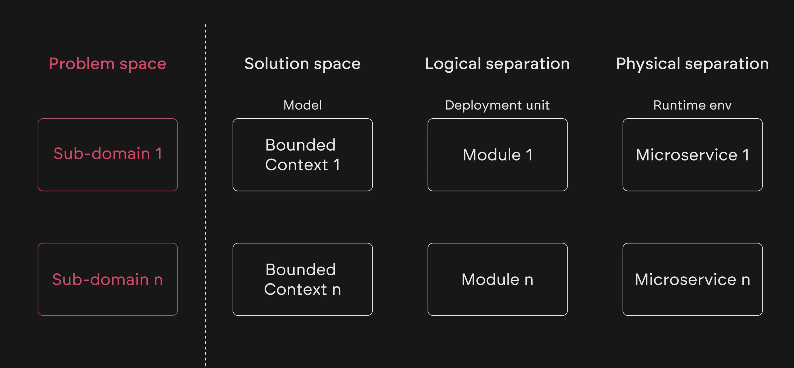

Na początek myśl o osobnych modelach.

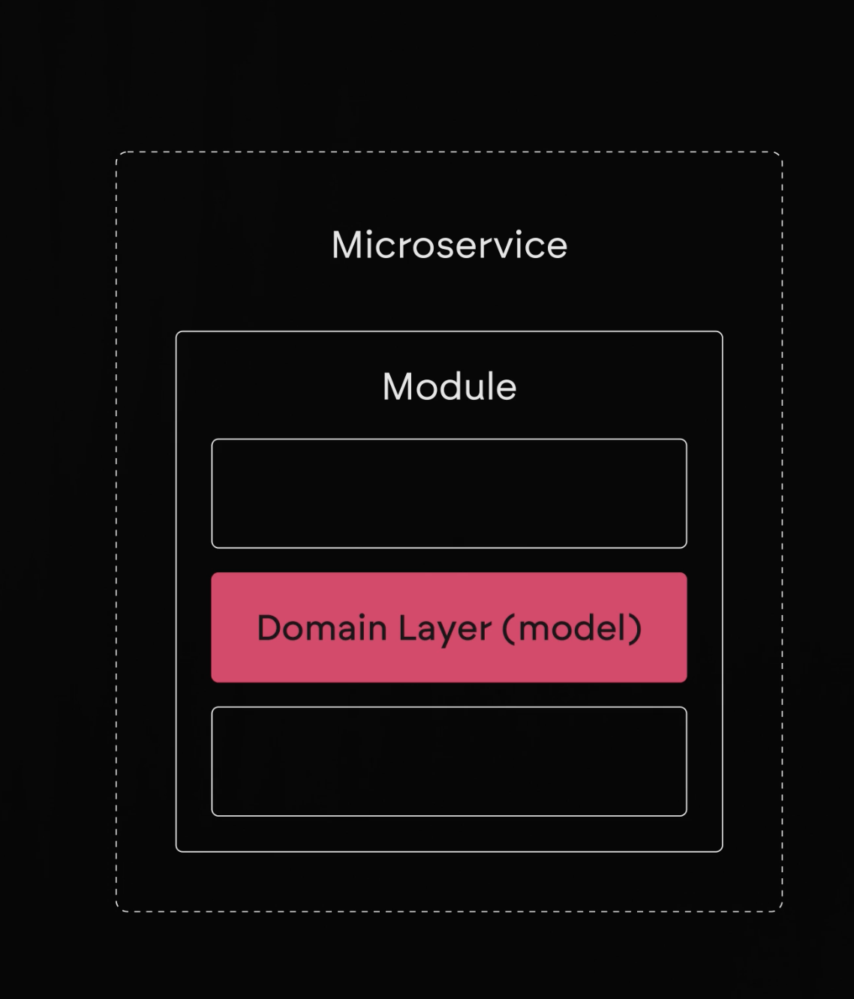

#### Rys historyczny

DDD powstało kiedy modne były wielkie systemy, które były trudne do zrozumienia, kilkudziesięciu programistów pracowało nad jednym systemem

Evans mówił o tworzeniu mniejszych modeli kierując się heurystyką lingwistyczną, czyli szukanie znaczenia słów w innych kontekstach. Osobnych konktekstach znaczeń językowych.

Bounded Context trzeba traktować jako jedną z heurystyk do separacji modeli

**Najelpiej mówić model zamiast Bounded Context**

**Szukanie bounded contextów i poddomen to heurystyki do szukania autonomicznych modeli**

#### Pojęcie: Domeny

Domeny to osobne sfery wiedzy którę występują w realnym świecie który pojektujemy.

To pierwsza heurystyka która naprowadza na modularyzację

-   Domeny i subdomeny
    -   planowanie etapów projektów
    -   zarządzanie zasobami (domena)
        -   szkolenia (subdomena)
        -   urlopy
        -   park maszyn
        -   magazyn

Domeny i subdomeny istnieją w rzeczywistości w organizacji, widoczne to jest w komunikaccji

-   Typy domen
    -   core
        -   powód powstania systemu
        -   przewaga nad konkuencją
        -   product
        -   krytyczne - inwestujemy w jakość
    -   generic core (nie występuje w literaturze)
        -   jak wyżej, ale wyabstrahowane, reużwalny w ramach organizacji
        -   często nazywanę platformą
        -   capibility (dostępność, powszechny element w systemie)
        -   krytyczne - inwestujemy w jakość
    -   generic
        -   gotowe rozwiązania niekrytynczych obszarów
        -   można kupić lub open source
        -   np. wystawianie faktur
    -   supporting
        -   obszary które nie są kluczowe dla biznesu
        -   np. zarządzanie urlopami

Pamietaj aby zdać pytanie do biznesu:

**"Aby sprawdzić czy nie możemy wykorzystać gotowego rozwiązania, muszę zadać kilka pytań"**

Dla każdej domeny określmy jej krytyczność, to pozwala znaleść priorytety oraz przydzielić odpowiedinie zasoby ludzkie

Warto znać mapy wardleya aby zrozumieć jakie obszary są kluczowe dla biznesu

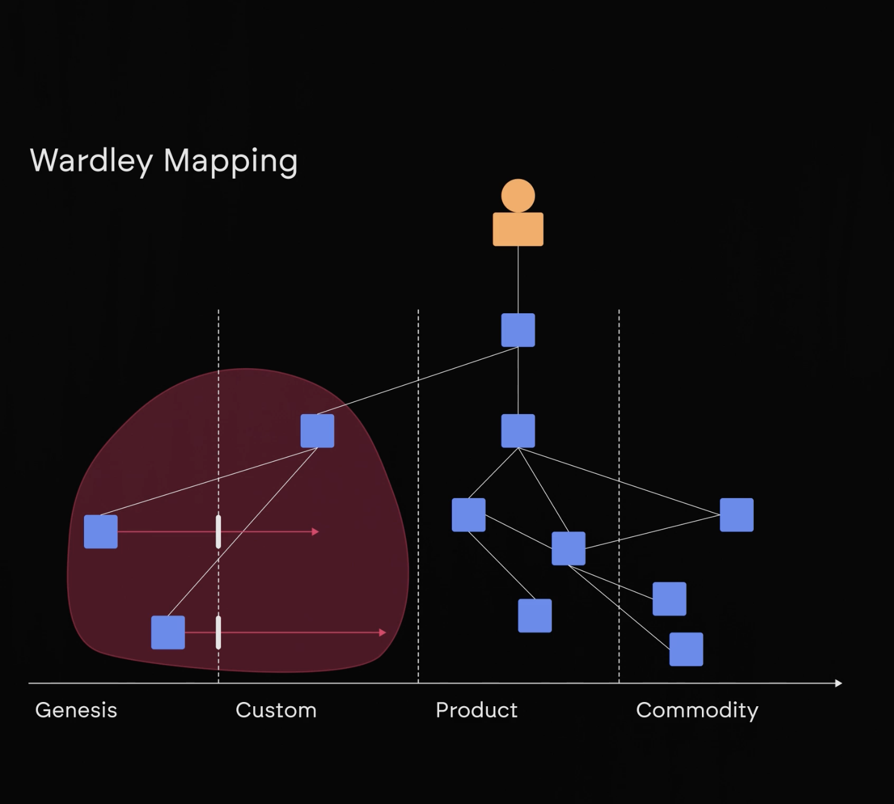

Mapa pokazuje w dwóch warstwach:

-   wnoszona wartość
-   utrorowanie

Z poziomu IT mapa pomaga dopierać zasoby do obszarów które są kluczowe dla biznesu

np. w momencie jak moduły przechodzą w do commodity to przekazujemy je do zespołów które są odpowiedzialne za utrzymanie

#### Pojęcia - Bounded Context

Dzielenie na osobne modele jest ok dopóki modele nie potrzebują informacji z innych modeli, wtedy zwykle zaczynają się problemy

Musimy się zastanwoić jako możemy połączyć modele w sposób który nie spowoduje problemów

Przestrzeń i reguły modelu nazywa się Bounded Context

Kontekst ograniczony to kontekst w którym dany model ma sens

Możesz o tym myśleć jak namespace w programowaniu, przestrzenie nazw się nie przecinają

Lepiej używać słowa model niż Bounded Context

np. zamiast Bounded Context optymlizacji projektu to lepiej powiedzieć model w konkteście optymalizacji projektu

#### Model

Tworzymy modele zorientowana na konkretny problem dla poddziedziny biznesowej

**Model tworzymy pod kątem pytań, jakie chcemy postawić**

np. model projektu ziemi będzie różny w zależności od potrzeb biznesowych

W kodzie możesz tworzyć osobne modele per pytania biznesowe

np. graf odpowiadan na pytanie co się może odbyć jednocześnie a co nie?

#### Moduł

W brażny IT czesto używamy słów ale nikt nie wie co one znaczą

-   Moduł
-   komponent
-   Architektura

-   Moduł
    -   jednostka logicznego podziału kodu słuząca jako artekat wdrożeniowy
    -   moduł jest samowystarczalny (ma swoje API i bazę danych lub część bazy danych)
-   Moduł może zawierać w sobie reużwalne komponenty

Każdy model zamykamy w osobnym module, technicznie mozę sie zdarzyć że ten sam model będzie zaimplementowany w kilku modułach

#### Środowisko wdrożeniowe

Często jedem moduł to jeden mikroserwis, ale czasami moze się zdarzyć że driver architektoniczny zachęca do zrobienia monolitu modułowego

#### Dla Facilitatorów

W jaki sposób się uczymy?

Różne osoby w różny sposób uczą się, pewnie spodkasz każdy z tych typów podczas stormingu

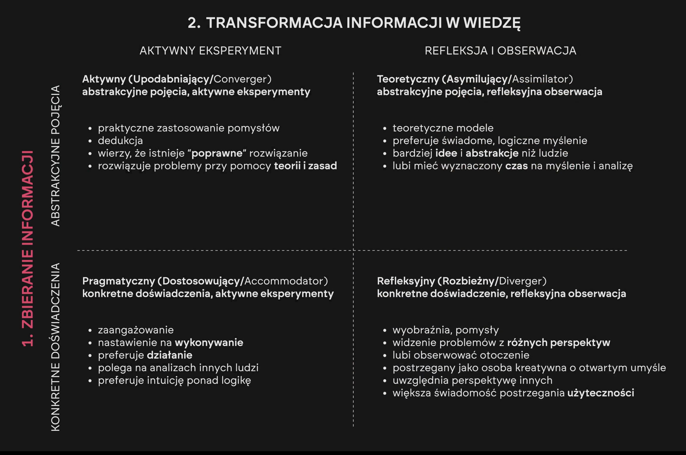

Tutaj zachodzi cykl colba, czyli cykl uczenia się

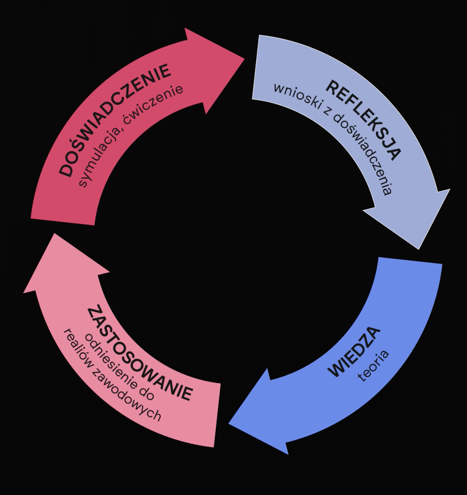

### L03. Heurystyka: główne pytania

#### Zbliżenie analizy i architektury

Jest to heurystyka która daje najwięcej wartości względem poświęconego czasu.

-   Single Source of Truth
    -   Musi istnieć jedno źródło prawdy odnośnie każdego ważnego pytania biznesowego
        -   Mogą istnieć kopie tych źródeł ze względów wydajnościowych
    -   Wszelkie zmiany stanu (command) muszą najpierw przejść przez to źródło prawdy

Rozbicie tego źródła prawdy powoduje problemy w koordynaacji pracy. Problem może dojść do poziomu katastrofy w przypadku systemów rozproszonych

##### Hurystyka głównych pytań

-   Wpisz aktorów i aktory, którzy będą korzystać z systemu
-   dla każdego z nich: zapisz na jakie pytania będą szukać odpowiedzi w systemie
-   sprawdź czy pytania są istotne
    -   w ilu miejscacj procesu są zadawane? (wpływają na proces)
    -   jak często są zadawane?
    -   czy wpływają na cele strategiczne?
-   oznacz zdarzenia która wpływają na te pytania
-   dowiedz się, które muszą być spójne atomowo

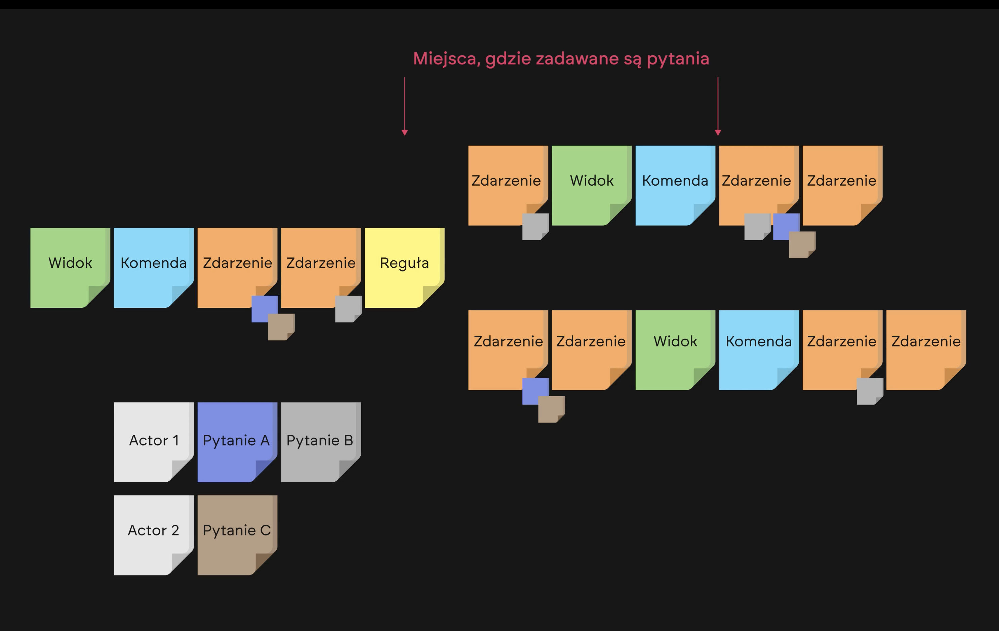

#### Jak zadawać pytania o atomość?

Jak zadasz pytanie do biznesu które zdarzenia mają zajść atomowo?

Dostaniesz pewnie odpowiedź:

-   nie rozumiem co oznacza atomowość
-   boje się energii atomowej
-   wszystkie

**Sposób jaki zadajesz pytania determunuje odpowiedź**

**Najlepiej zadać pytanie o to co się stanie jak operacje będa od siebie oddalone w czasie, jakie będą skutki? (brak spójności)**

Jeżeli biznes Ci odpowie że nie może tak być to znaczy że te dwa zdarzenia muszą być spójne atomowo! To oznacza że muszą zachodzić w jednym środowisku wykonawczym

#### Jak odróżniać pytania?

Przypisanie stałych pytań do zdarzeń jasno pokazuje że pewne osobne zespoły mogą pracować nad dokładnie tym samym pytaniem biznesowym, czyli wykonują taką samą pracę

#### Niejawne poddomeny

Taką metodą zadawania pytań możesz odkrywać niejawne poddomeny, możesz się zastanawiać czy do tego potrzebujesz osobnych bounded contextów (modeli)


#### Archetypy modeli biznesowych i wzorce analityczne

Co w momencie jak bizesn nie potrafi zadać pytań? Lub po prostu nie mamy dostępu do biznesu?

Tutaj może pomóc Literatura

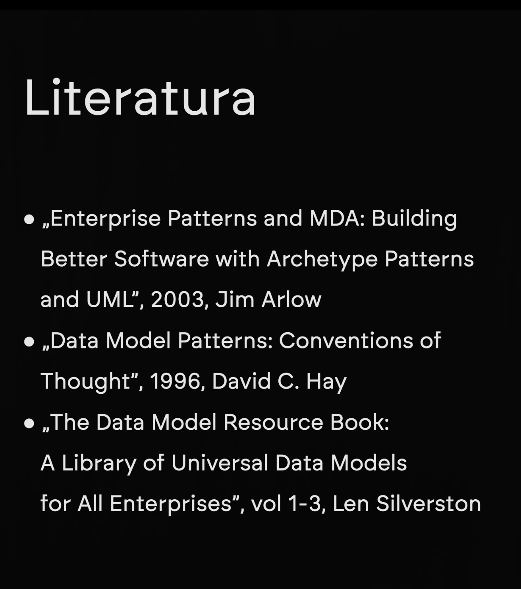

Możesz przejżeć typowe archetypy i poszukać czegoś podobnego aby mieć dobre pytania biznesowe

Jeżeli będziesz to znał to możliwe że nawet będziesz mógł pominąć event storming process level, dzięki dobrym pytaniom mamy gotowe poddomeny a potem już podziały achitektoniczne

Finalnie możesz zrobić event storming process level aby sprawdzić czy te modele są poprawne i czy może nie zgubliśmy jakiś wymagań.

#### Domain Drivers szukają głównych pytań

zrozumienie że są różne typy pytań

-   single source od truth
-   pytanie o jedno źródło prawdy które podlega regułom biznesowym
    -   pytanie o to jaki zasóbj jest dostępny
-   pytania która nie zmienają stanu
    -   co by było gdyby (nie zmienia stanu, symulacja)
-   jakie kolwiek inne pytania które są istotne dla biznesu

    -   ile mam na stanie koparek które są wolne itp.

-   Co istotnego chcą zobaczyć użytkownicy na ekranie? (UI)

#### Ryzyko

Pytanie o szacowane ryzyko?

Osoba finlanie podejmuję decyzje ale chce mieć wszystkie informacje w jednym miejscu.

Reguły często się zmiejają więc chcemy aby były spójne ze sobą

-   Czy łamiemy reguły tworząc harmonogram?
-   Które reguły powodują że harmonogram jest niemożliwy?

Szukamy które pytania są tym samym ale w innym kontekście, to pozwala nam na podział modułów

#### Symulacje

Poprzez heurystykę pytań sprawdzamy zasadność modelu

-   Chcemy wiedzieć jak potencjalnie może wyglądać projekt
-   Jak potencjalnie nowy projekt wpłynie na ryzyko innych projektów
-   Czy warto zamknąć inne projekty aby zrealizować ten projekt

Czy istnieją sensowne pytania które wynikają ze złożenia dwóch modeli?

Wykonanie zbyt wczesnego podziału przed analizą bottom-up może prowadzić do dużych modeli które są trudne do zrozumienia

#### Dostępność

Dostępność to typowy archetyp, zawsze jest dostępność w każdym systemie.

Często się mówi że została wypromowana przez konferencję DDD, ale to jest tylko jeden z archetypów

-   Kiedy będzie dostępny zasób?
-   Kto załozył blokadę?

Tutaj mamy pytania o single source of truth biznesowej informacji która się zmienia komenadami

-   Jakie mamy zasoby? Jakie będą mieć umiejętności?

-   Jaki jest plan projektu? Co następuje po czym?

-   Jaki jest status projektu?

Mozę być zdarzenie które jest środowiskowe które wyzwala tylko algorytm, nie wpływa na stan systemu

#### Obecna mapa modeli

Pamiętaj, Vertical slice to prawie zawsze zły pomysł, to zwykle łamie single source of truth

### L04. Heurystyka: alternatywy w przebiegu procesu

#### Myślenie procesowe vs Myślenie regułowe

Każda organizacja dąży do stworzenia prcesu dlatego że procesy dają przewidywalność oraz powtarzalność

Firmy dbają o procesy aby:

-   zminimalizować ryzyko że stracą pracownika który wie jak coś robi
-   mogą zastąpić pracownika innym, szczególnie drogich ekspertów

Proces powinnien być szczególnym przebiegiem przez nasze komponenty

Co jest pierwsze proces czy reguły?

Zwykle pierwsze reguły, np. ograniczenia prawne, regulacyjne. Następnie na nie nakładamy sekwencje czasowe, po to aby pracownicy którzy rozumieją powiązania pomiędzy pracownikami nie byli potrzebni

Dlaczego zaczynamy analize od procesów?

-   zaczynamy od miejsc gdzie już są procesy lub się skrystalizują
-   nasi rozmówcy zwykle są przyzwyczajeni do rozmów o procesach

Co się cześciej zmienia? Procesy czy reguły?

Raczej to procesy, reguły są zwykle stałe

Czasami nawet jest zmiana procesów tylko po to aby pokazać pracownikom kto tutaj teraz rządzi (nowy zarząd)

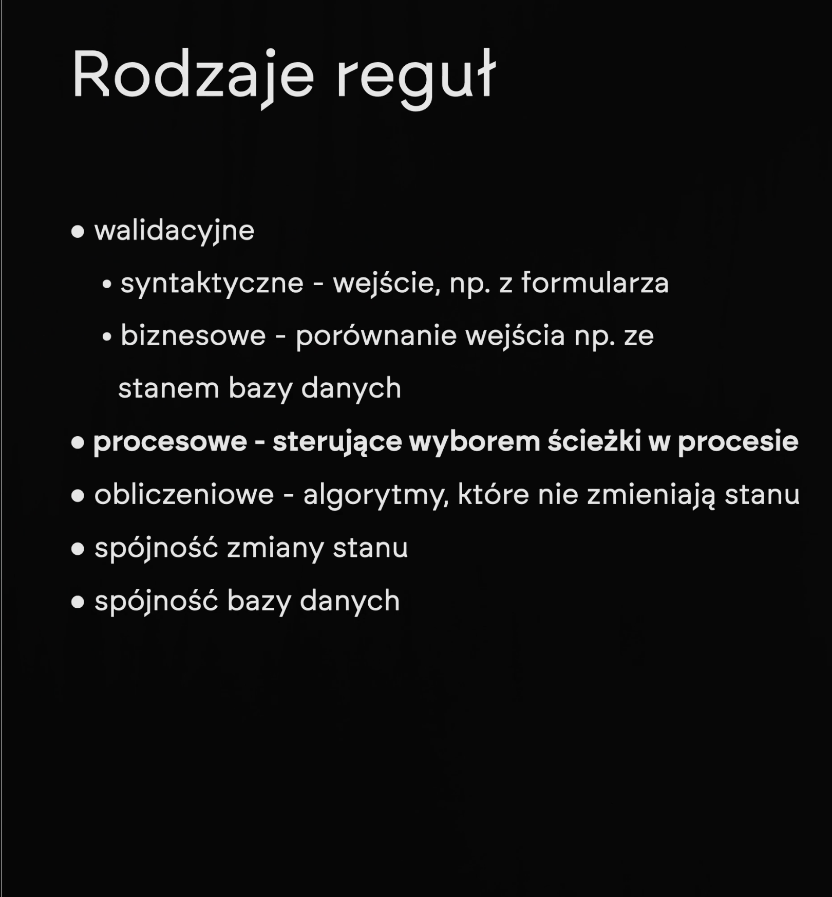

Procesowe reguły mogą się zmieniać, ale zwykle są one związane z regułami biznesowymi

Zdefiniowane procesy do konkretne użycie systemu oraz przejście przez zdefiniowane reguły

#### Heurystyka: Alternatywne wejścia do procesu

Świetna heurystyka która służy też jako walidator modeli i procesów

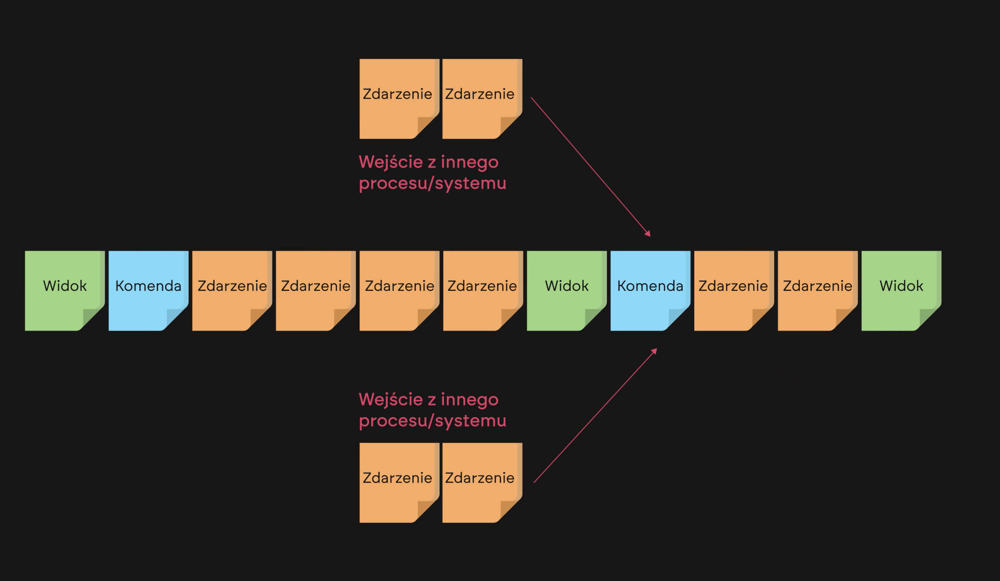

-   Sprawdzaj czy są alterantywne wejścia do każdedej z komend
    -   np. dojście do zakupu z pomnięciem koszyka
-   Sprawdzaj tam gdzie mamy zbiór wydarzeń
    -   możliwe że wydarzy się tylko podzbiór tych zdarzeń (z powodu wejścia z innego procesu)
        -   blokujemy towary bo ktoś je dostał gratis z innego procesu

#### Generyczne poddomeny

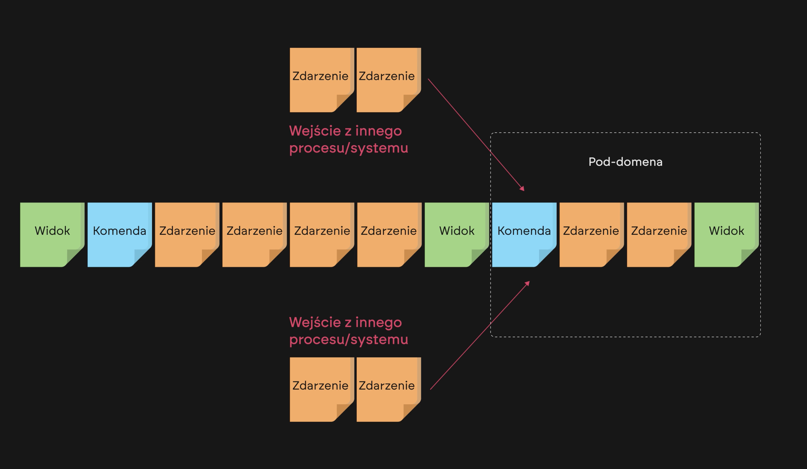

W przypadku kiedy kilka procesów zbiera się do jednej grupy zdarzeń, to znaczy że mamy do czynienia z generyczną poddomeną. Sprawdź heurystyką głównych pytań czy nie pomineliście gdzieś źródła prawdy

#### Konsekwencja dla Architektury

API modułu powinno być na tyle ogólne aby inne procesy mogły z niego korzystać

Jeżeli nie odkryjesz tego że są inne procesy którę mogą uderzać do komendy może to spowodować że inne procesy będą musiały korzystać z API które nie jest generyczne, np. wymaga obiektu zamówienia

Jest to wtedy sytuacja upstream - downstream, gdzie poddomena jest upstream i wymusza na innych procesach korzystanie z API które nie jest generyczne

Finalnie taka heurystyka powinna naś prowadzić do mapwania open hostów

#### Heurystyka: alternatywne wejścia z pod-procesu

Analogicznie co do szukania wejśc od procesu powinniśmy szukać alteratywnych wyjść z podprocesu


Tutaj nie chodzi o zakończenie procesu z powodu błędu ale rozgałęzienia które są wartościowe dla biznesu

Zapytaj czy po tym widoku musi być wykonana taka sama komenda?

Np. czy po wygnenerowaniu oferty zawsze musi nastąpić jej zatwierdzenie? Nie chodzi o to że użytkownik coś musi zrobić ale że ma taką możliwość

Możesz też zapytać: Czy procesy mogą się wykonać częściowo?

#### Konsekwencja dla architektury

Podobnie jak z poprzednia heurystyką prawdopobnie odkryliśmy osobną poddomenę i upewniamy się czy na pewno mamy jedno źródło prawdy

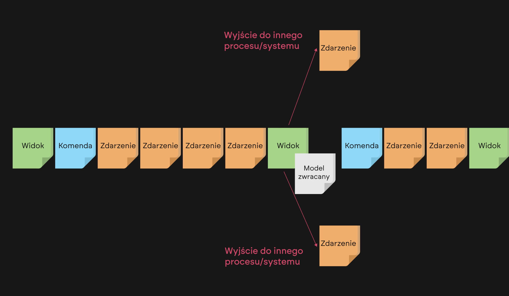

Wyjście z procesu w przypadku rozcięcia powinno być uniwersalne

Widok rozumiemy jak zwracane dane z powodu wykonania kwerendy
Komenda to rozmiemy jako zapytanie do moduły które nie zmienia jego stanu

#### Heurystyka: wejścia i wyjścia

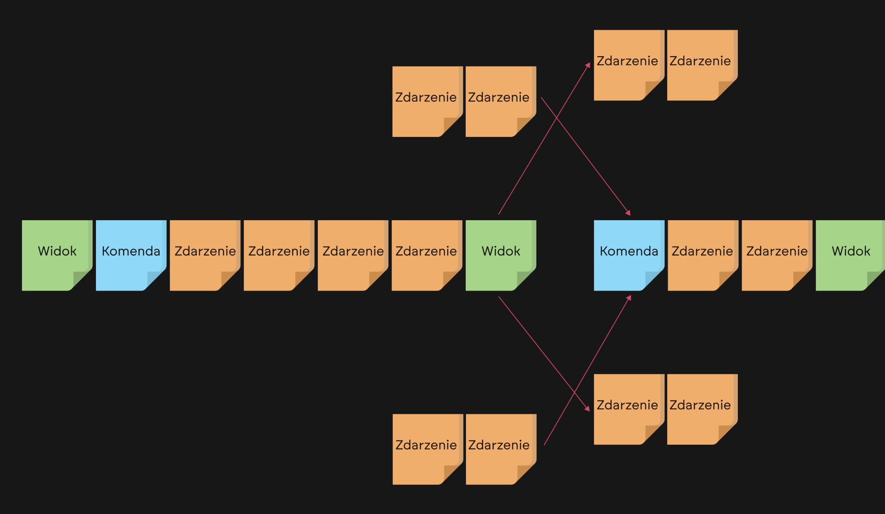

Może być tak że mamy wiele alternatywnych wejść i wyjść

W takim przypadku mamy już bardzo jasno widoczny podzia na poddomeny.

Problemem jest to że nie możemy powiedzieć która strona jest upstream a która downstream

-   Strategia dla równoważnych podprocesów
    -   opracowanie modelu pośredniego (publish langauge)
    -   dodanie nowej poddomeny orkiestrującej proces (orchestration domain)

#### Heurystyka: Wszystko wpływa na wszystko

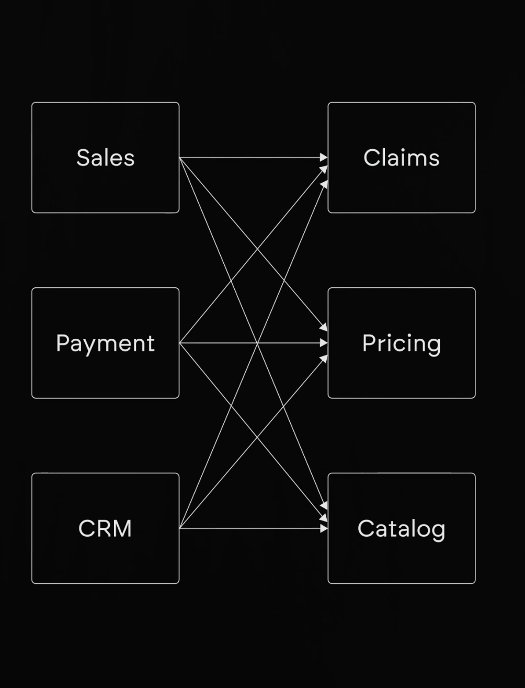

W takim przypadku kiedy reguły biznesowe ulegną zmianie to 6 zespołów musi koordynować swoją pracę

Jeżeli widzisz taką sytuacje to prawdobonie pominąłeś domenę pomiędzy nimi

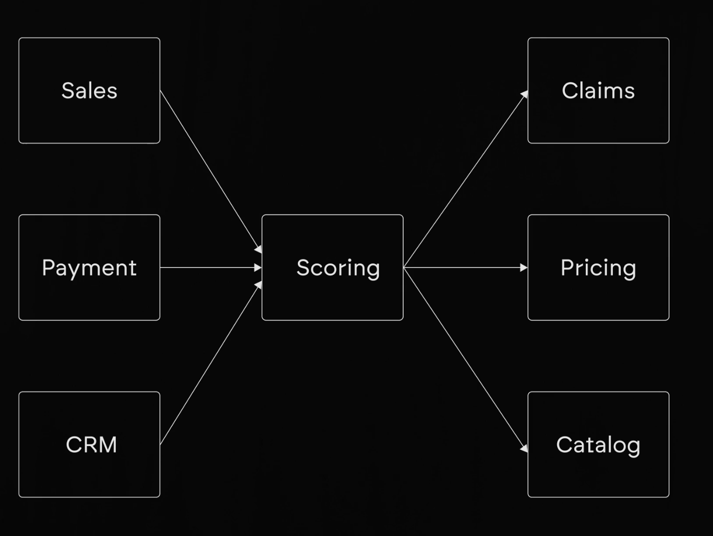

Możesz znaleść pomoc w książkach aby wyjśc z takiej sytuacji

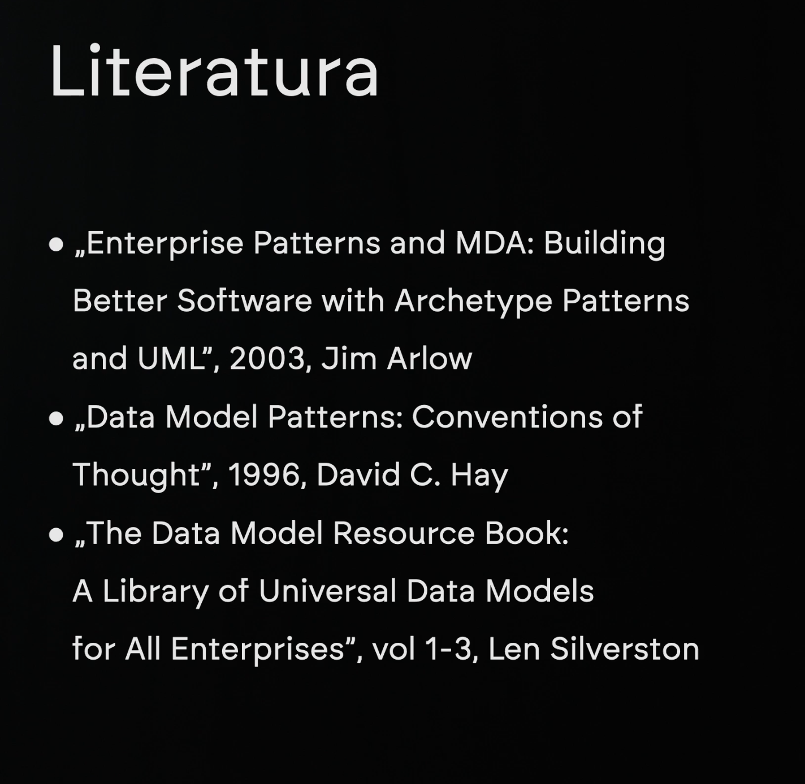

#### Konsekwencja dla architektury

Bez odkrycia scoringu mielibyśmy orgie mikroserwisów oraz paraliż zmian w zespołach

Użycie scoringu po środku daje Ci możliwość oparcai się o event sourcing i podrożowanie w czasie

#### Porady dla Facilitatorów

Często jest obawa o pytanie o alternatywne wejścia i wyjścia jako że biznes może to odbierać jako zbyt skomplikowane

Użycj sprawdzonej struktury aby nie być odebrany jako naciągający

Po to aby KORZYSC_DLA_KLIENTA
potrzebujemy zrobić AKTYWNOŚĆ

np. po to aby użyć gotowych rozwiązań z rynku potrzebuje zadać teraz pytanie o alternatywne wejścia i wyjścia

Pytania służą do zebrania punktów swobody modelu aby dobrać gotowe rozwiązanie

#### Domain Drivers szukają alternatywnych przebiegów

Zwykle jak zadasz dobre pytania to ta hurystyka tylko potwierdzi że dobrze zaprojektowałeś modele

### L05. Heurystyka: Pivotal Events

Podczas event stormingu mogły się trafić zdarzenia którę dają wrażenie kamieni milowych dla procesu

-   Pivotal Events
    -   nie jest łatwo wycofać
        -   zwykle okazuje się że jest osobny podproces wycofania
    -   pojawia się zmiana typu
        -   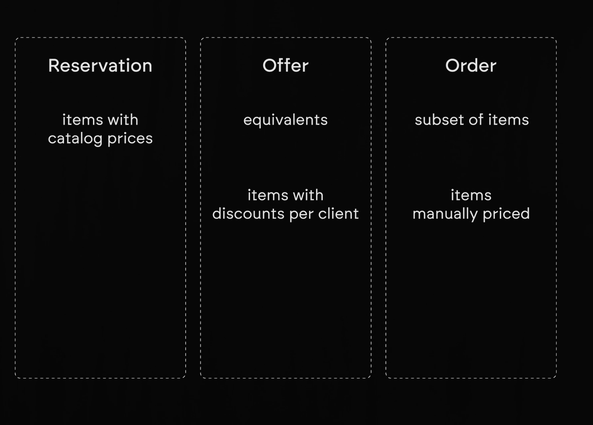
        -   warto stworzyć osobne modele ponieważ będą miały zupełnie inne reguły operacyjne
        -   inne operacja na każdym z tych modeli
        -   **zrobienie tego w jednym modelu spowoduje że stracimy wyrazistość modelu**
        -   może też spowodować że nie będziemy mogli zrobić alternatywnych wejść i wyjść
        -   to też prowadzi że np. w procesie porówniania ofert też będziemy operować na obiekcie order

Pivotal events wydzielają granice pomiędzy poddomenami

Używając tej heurystyki modelujemy "becoming" czyli zmiana istoty rzeczy, w praktyce lepiej jest to zrobić jako osobne klasy bo nie musimy walczyć z wielkimi klasami

#### Uwagi dla Facilitatorów

Zaczynamy od tej heurystyki kiedy chcemy modelować stan TOBE

Jak zrobisz analizę AS IS to możesz na końcu poprosić o wskazanie zdzarzeń pivotalnych, jeżeli tego biznes nie rozumie to poproś o wskazanie zdarzeń które jest ciężko wycofać

Następnie zadaj pytania:

-   Czym operujemy przed, a czym po tym zdarzeniu?
-   Czy zmieni się struktura danych?
-   Czy te struktury mogą być użyte w innych procesach?

Możliwe że taka analiza wskazę alternatywne wejścia i wyjścia

#### Drivers Demo

Warto zwrócić uwagę na modele którę mają bardzo dużo zdarzeń, szczególnie takich które są niezależne od siebie

Jeżeli coś się nazwywa managment to zwykle jest to "worek" na wszystko

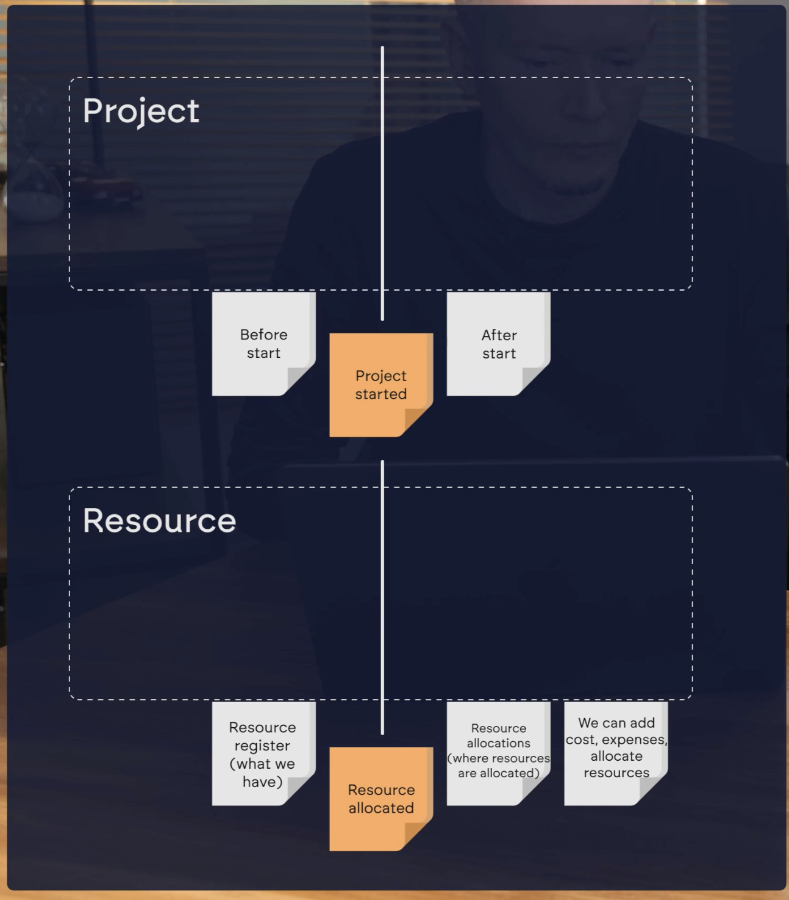

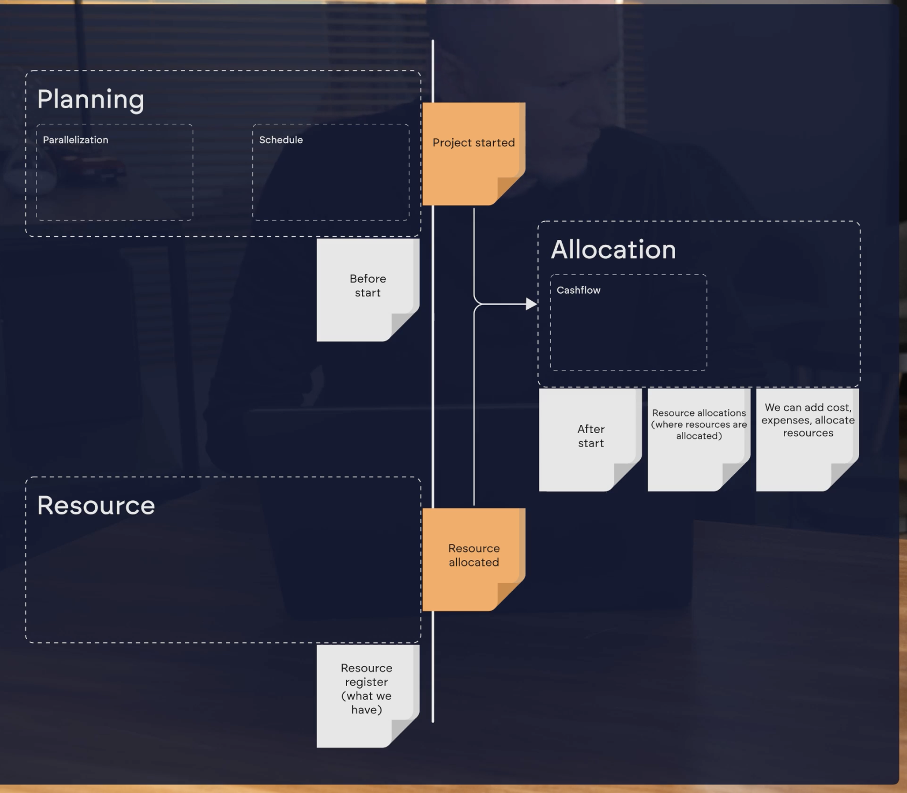

### L06. Heurystyka: Capability vs Product

#### Topolgie zespołów

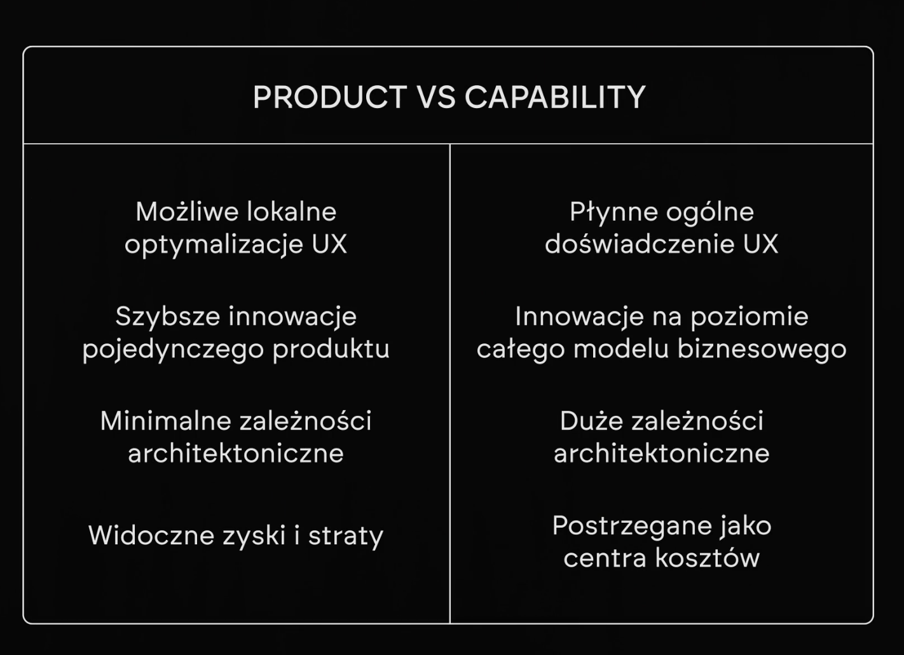

-   Zespoły nastawione na produkty (product)
    -   czyli na to co możesz sprzedać
-   Zespoły nastawione na zdolności (capability)
    -   reużywalne moduły platformowe

Żadna z tych topologii nie zadziałą jeżeli nie są dobrze wydzielone niezależne moduły i konteksty

Najlepiej połaczyć obie te topoogie

#### Konteksty procesowe i zasobowe

Jeżeli mamy styk dwóch poddomen to możemy je zintegrować poprzez:

-   komunikacja zdarzeniami w modelu publish language
-   koordynator procesu pomiędzy dwoma poddomenami

Nie chcemy aby domeny generyczne wiedziały jakie są kolejene kroki w procesie

-   Bo mogą brać udział w wielu procesach
-   Bo z tego powodu przestaną być generyczne

Potrzebujemy nadrzędnych dziedzin które będą koordynować procesy, mają w sobie stan procesu oraz etapy procesu

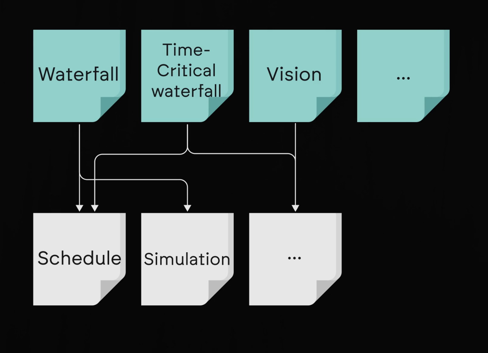

Domeny procesowe biorą na siebie odpowiedzialność której nie chcemy mieć na poziomie generycznych domen

#### Dla Facilitatorów

Aby spradzić czy domena generyczne jest naprawdę generyczna to musimy sobie odpowiedzieć na pytanie:

Czy jeśli bym zamknął tą domene generyczną w innym module to czy znaleźli by się chętni aby ją kupić?
Czy taka domena ma wartość sama w sobie?

W ten sposbó też sprawdzamy potencjał produktyzacjny

Domeny produktowe dają możliwość niezależnej pracy zespołów, możliwość eksperymentowania w niezależny sposób

Wydzielenie wspólnych capability umożliwa ujednolicenia UX, innowacje na poziomie całego biznesu

#### Demo Drivers

[DD_M05L06_MAPA_MODELI](./assets/DD_M05L06_MAPA_MODELI.png)

### L07. Uwagi i pułapki sub-domen

Mamy typowe porblemy i pułapki które możemy spotkać podczas analizy subdomen

#### Prawo conway'a i dryft architektoniczny

"Architektura systemu jest pochodną szlaków komunikacyjnych w organizacji"

Jeżeli znajdziesz subdomeny które nie mapują się na działy w organizacji (a tak może być) to musisz wziąść pod uwagę kilka kwestii:

-   Ownership - kto będzie właścicielem odkrytych generycznych subdomen?
    -   rozwiązaniem jest tutaj transparentna mapa kontekstów

#### Role

Wiązanie się na reguły jest błędne ponieważ role się zmieniają w czasie a kod za tym nie będzie nadążał

#### Splątanie na UI

Interfejs graficzny zmienia się najczęściej, nie powinien być powiązany z logiką biznesową. Często UI wyświetla dane z różnych domen, to może kusić aby tak projektować architekturę. Ale jeśli zmieni się projekt pod kątem UX?

#### Archetypy

Warto zapoznać się z gotowymi archetyami aby nie wymyślać koła na nowo

#### Kiedy nie szukać poddomen?

Nie powinniśmy na siłe szukać poddomen, jeżeli nie ma potrzeby to nie szukajmy

### L08. Destylacja kontekstów: dwukierunkowa analiza lingwistyczna

#### Bounded Context

Jeżeli nie znajdziemy subdomeny to nie znaczy że ona znikneła, po prostu będzie zaimplementowana jako statusy na bazie czy plątanina pomiędzy modułami.

Zawsze chcemy budować modele odpowiednie do klasy problemu.

Modele mają sens tylko w jasno określonych kontekstach czyli tzw. Bounded Context

Poddomeny odrywamy ale Bounded Contexty wymyślamy

Lepiej używam słowa model niż Bounded Context, jest to często lepiej zrozumiałe dla biznesu

#### Różnice pomiędzy Bounded Contextami a poddomenami

DDD powstało wtedy kiedy orgainizacje jeszcze nie były przesięknięte IT, w tamtych czasach mapowanie poddomen z technicznymi rozwiązaniami były nieodzowne

W większości aktualnych książek jest pomijane odkrywnie ukrytych poddomen, nie znajdziesz u nich heurystyk jakie do tej pory ćwiczyliśmy.

Jeżeli nie odkryjesz ukrytych poddomen będzie konieczność silnego wiązania pomiędzy poddomenami a bounded contextami

Szukamy generycznych poddomen tak aby stały się automatycznymi kontekstami dla wyspecjalizowanych modeli

Dlatego jest propozycja aby uprościć język i po prostu mówić o osobnych modelach zamiast Bounded Contextów, a nawet lepiej autonomicznych modelach, o modelach wyspecjalizowanych do rozwiązawania konkretnych zadań.

Natomiast istotne jest zapoznanie się z tymi terminami używanymi w książkach aby jednak zachować zdolność komunikacji z osobami które znają te terminy i czytały książki

#### Cel tworzenia modeli dziedzin

Modele nie są odzwierciedleniem rzeczywistości, a tylko reprezentacją wycinka potrzebego do rozwiązania problemu

-   Cel tworzenia modeli dziedzin
    -   płaszczyzna komunikacji
        -   komunikacja z expertami dziedzinowymi, którzy wiedzą jak działa biznes lub chcą się dowiedzieć
        -   reprezentacja modelu musi być czytelna dla
    -   baza wiedzy
    -   narzędzie do zadawania pytań
    -   narrzędzie do walidacji pomysłów
    -   projekt do implementacji
        -   na tym nam najbardziej zależy
        -   chcemy aby model był implementowalny
        -   aby implementacja spełniała drivery architektoniczne
        -   dobieramy modele tak aby pisanie kodu było przyjemne i łatwe do zrozumienia

W sekcji techniczej zajumujemy się każdym modelem z osobna, ale najpierw musimy znaleść dobre granice pomiędzy modelami

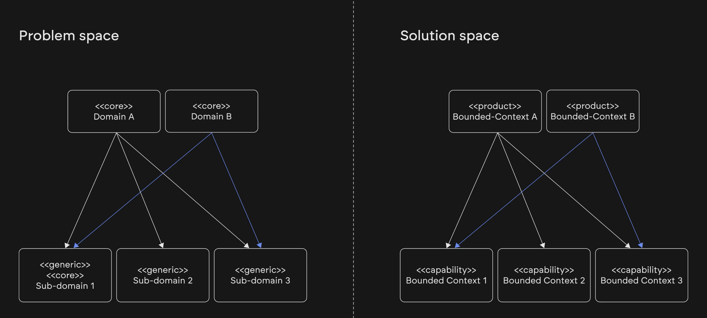

reguła kciuka - na pewno każda generyczna subdomena to osobny bounded context, chcemy aby model w takiej to niezależnej subdomenie był traktowany jako capibility w naszej architekturze, czyli był zamknięty w reużywalne komponenty

Domeny procesowe które są planowane jako osobne produkty, warto stworzyć osobne konteksty i zapewnić niezależność prac

Najlepsza prosta rada: założ na początku że każda poddomena to osobny bounded context, podczas destylacji kontekstów będiemy weryfikować to założenie

Po weryfikacji może się okazać że kilka modeli jest tak podobnych do siebie że nie ma sensu ich rozdzielać, w takim przypadku mogą być w jednym kontekście

Zbytnio naiwne połączneie kilku modeli moze spowdować "kule błota", kosztem zaoszczędzenia kilku godzin pracy możemy stracić kilka miesięcy na debugowaniu

#### Jedyną stałą jest zmiana

**Zawsze zakładamy że granice kontekstów ulegną zmianie.** Dowiemy się czegoś nowego lub biznes się zmieni.

Są techniki którę pozwalają przenosić funkcje, klasy pomiędzy kontekstami.

**Kluczem jest świadome zarządznie caplingiem**

#### Wieloznaczności vs uogólnienia

Destylacja kontekstów to pozbywanie się elementów które nie są istotne z punktu modelowania.

Pierwszym poziomem destylacji kontekstu jest analiza lingiwstyczna. Niektóre słowa są wieloznaczne w biznesie.

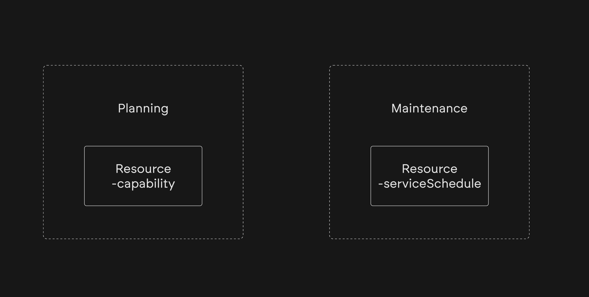

np. zasób jest dodawany do planowania ale również zasób jest w kontekście utrzymania. Co istotne że w każdym z tych kontekstów model będzie się różnił. Potrzbujemy inne dane oraz inne reguły. **Jedynie ID będzie takie samo.**

Na pozimie rozwiązania będziemy mieć różne klasy resource. W praktyce dobrze jest dodać prefixy dla tych klas np.

-   PlanResource
-   MaintenanceResource

Ktoś mógłby powiedzieć że możemy zsumować pola w jedej klasie ze wszystkich kontekstów. Pierwszym problem jaki napotkasz to będzie "wyścig" commitów.

Gra commitów to gra która polega na tym że kto pierwszy wykona push idzie do domu a reszta się merguje.

Właśnie po to się osobne bounded contexty aby pokazać że te rzeczowniki oznaczają coś innego w różnych kontekstach.

#### Scenka rodzajowa #1

Może się zdarzyć że ktoś opowiadając o obiekcie powie różne sprzecze rzeczy np. raz dokument ma jeden status a raz inny.

**Co istotne należy pamiętać aby zacząć rozmawiać o zachowaniach**, ale to co jest pewne w tym momencie mamy do czynienia z innymi kontekstami.

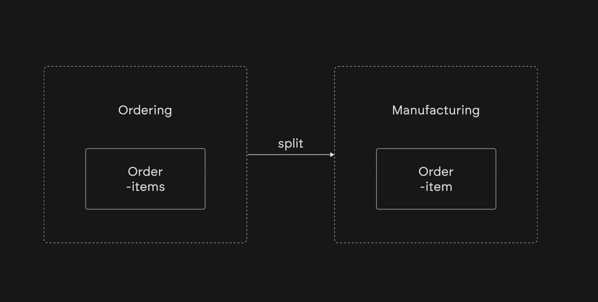

Czyli możemy założyć że jak się coś takiego zdarzy to pewnie ekspert dziedzinowy mówi tym samym rzeczownikiem o dwóch różnych rzeczach.

#### Scenka rodzajowa #2

```
np. "Jako manager, chce dodać nowe ogłoszenie, po to aby moi klienci mogli je kupić"

Definiuje wówczas kategorie i cenę oraz parametry: częstość emisji

Mogę zmienić kategorie i wpływa to na już sprzedane ogłoszenia, chyba że zostały wydrukowane, to wtedy nie.

Mogę zmienić częstotliwość, ale już to nie wpływa na już sprzedane ogłoszenia.

Jako pracnik HR chce kupić ogłoszenie, po to aby pojwilo się w gazetach, socjalach itp.

Czasem chce zmienić częstotliwość emisji, o ile nie przekroczy to mojego budżetu
```

Takie wymagania często prowadzą do tego że mamy mase ifów i kombinatorykę przypadków testowych.

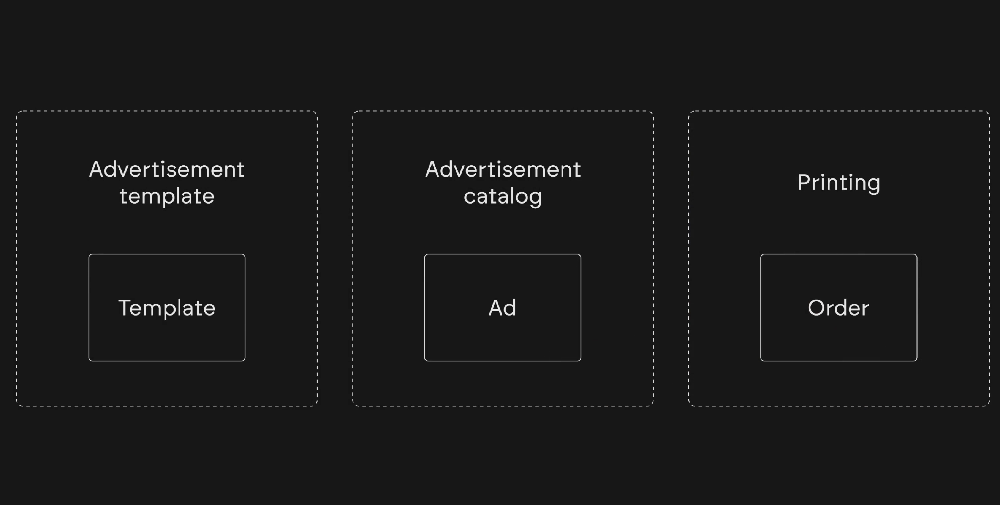

Wystarczy pół godziny analizy poddomen, aby znaleśc rozwiązanie:

-   Szablony ogłoszeń
-   Produkt handlowy
    -   tym handlujemy
-   Drukowanie produktu
    -   to co już się wydarzyło

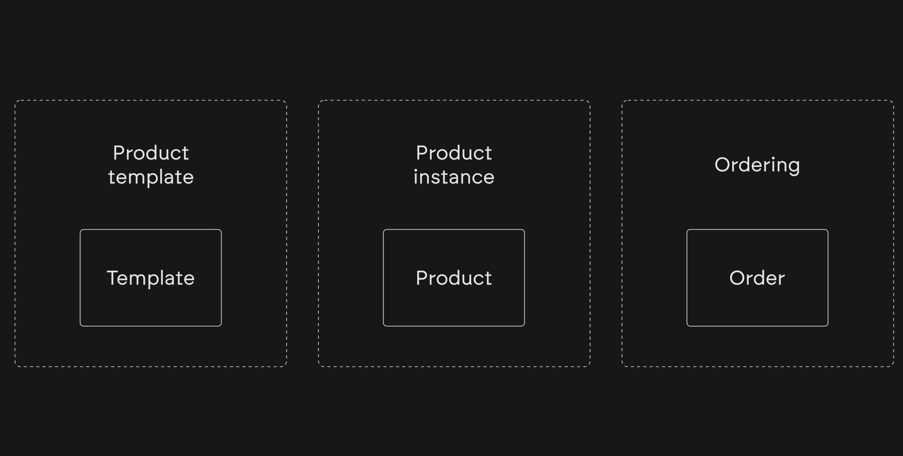

Rozwiązanie z użyciem archetypów z książki:

-   Szablon produktu
-   Instancja produktu
-   Zamówienie

#### Wieloznaczność vs uogólnienia - ciąg dalszy

w książkach DDD zwykl znajdziesz informacje o usuwaniu wieloznaczności jako destylacje kontekstów

W każdym kontekście może istnieć dowolna ilość klas i funkcji

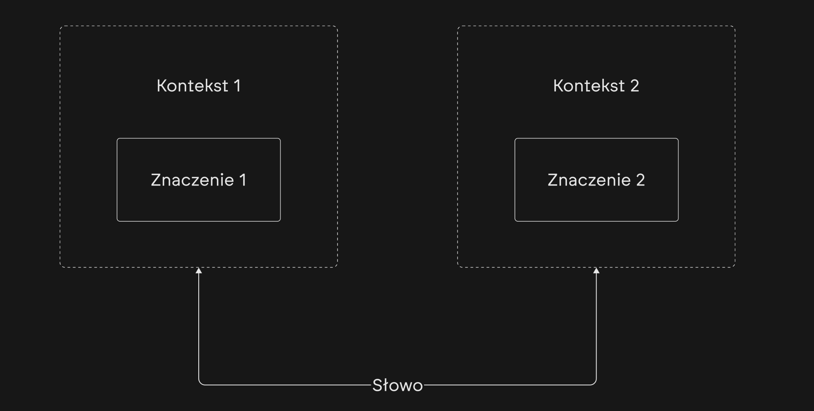

-   Techniki generalizacji
    -   uogólnienie - pozbycie się szczegółów
        -   np. w systmie faktorowych faktura i zamówienie to może być dla nas Dokument który jedynie co nam potrzebne do jego ID i data utworzenia. Tworzymy częśc współną która jest nam potrzebna.
    -   wyabstrahowanie - wyłonienie istotnych szczegółów
        -   jest to trudniejsze niż uogólnienie
        -   szukamy nowych pojęć których nie było w puli pojęć konkrentych
        -   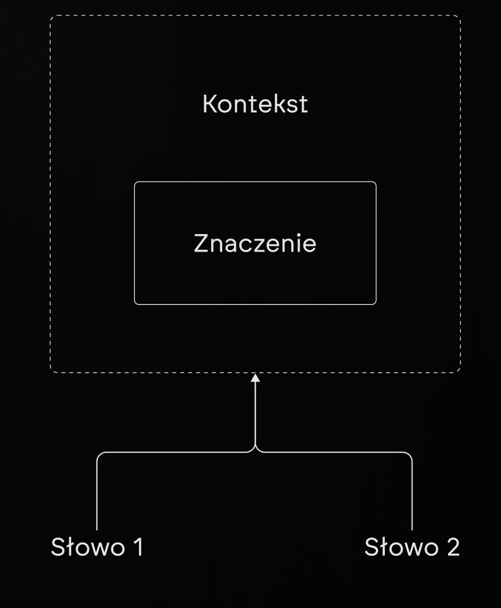
        -   dochodzimy do sytuacji kiedy wiele słow ma takie samo znacznie w jednym kontekście
            -   **Wiele rzeczy jest nierozużnialna od siebie w pewnym kontekście**
        -   np. w kontekście planowanie nie musimy rozróżniać od siebie zasobu ludzi, maszyn itp. to co robimy to wyabstrahujemy to co jest istotne w kontekście planowania czyli dostępność oraz zdolności
        -   zdolność wyabstrahowania nie jest powszechna wśród programistek i programistów oraz analityków. Da się ukończyć kursy czy studia bez tej zdolności.
        -   można to robić poprzez różne techniki proceduralne, tak aby sobie poradzić bez dobrej znajomości domeny
    -   zmiana reprezntacji

Pozbywanie się nieistotnych szczegółów czyli takich które nie mają wpływu na modelowany problem

#### Destylacja kontekstów

Musimy znaleść zdarzenia które wpływają na zmianę stanów, które to znajdują odpowiedź na główne pytania. Wiemy też które komendy wpływają na tą odpowiedź, te które są inicjatorem tych właśnie zdarzeń

Na przykładnie kontekstu dostępności

Chcemy odpowiedź na pytanie czy zasób jest dostępny w jakimś okresie czasu

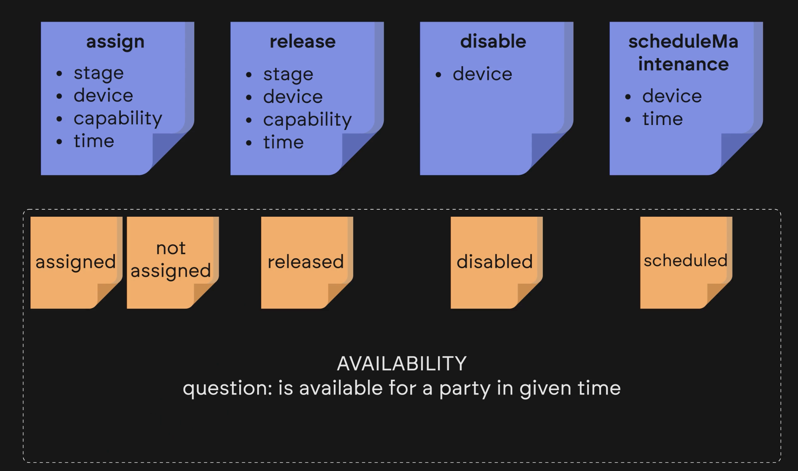

zbieramy komendy i zdarzenia które odpowiadają na te pytania.

Na poziomie implementacji komendy nie muszą być implementowane zgodnie z wzorcem command handler, mogą to być po prostu service

zdarzenia to też nie muszą eventy publikowane na publishera, wystarczy nawet zmiana pola na bazie danych.

Często się zdarza że prowadzimy event storming z ludzmi nie zdolnymi do abstrahowania, używali słów konkretnych. Nam modelarzom nie wolno zerwać cienkiej linii porozumienia. Nie powinniśmy ich zarzucać pomysłami na generyczne abstrakcje.

Czas na abstrahowanie jest podczas budowania mapy kontekstów.

###### Destylacja

destylacja może polegać na pozbyciu się nie potrzebnych informacji.

Np. jednynie co nas interesuje to zapisanie właściciela blokady i na ile czasu

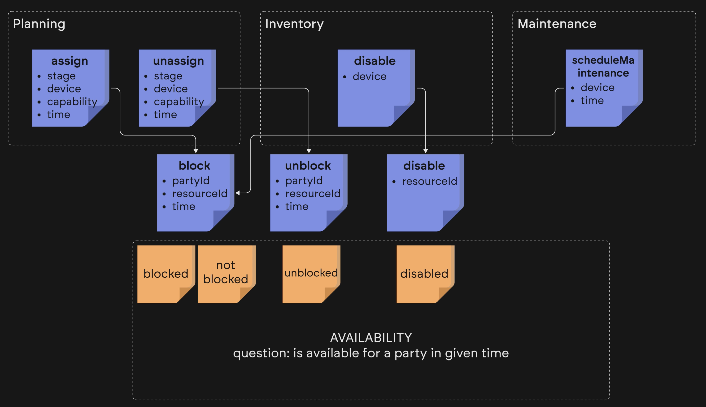

Zdarzenie które jest parafrazą komendy są dosyć normalne w prostych modelach

Przeciekanie kontekstu jest wtedy kiedy zaprosisz do kontekstu kogoś z innego kontekstu i zmiany z temtego kontekstu kaskadowo wpływają na inne konteksty

Finalnie powinna być zgoda archtektury z analizą, jeżeli mamy kontekst np. availibility to zapewne powinniśmy to wydzielić jako osobny moduł czy nawet mikroserwis

Architekt często może mieć problem z tym że nie zna głównych pytań biznesowych. Analityk może je znać ale brakuje mu zrozumienia techniczych aspektów co powoduje błędy przy próbie zaprojektowania modelu.

Dlatego istotna jest rola modelarza który integruje te dwa światy.

#### Demo Storming

Jeżeli mamy projekt w wielu kontekstach to prawdobonie na poziomie taktycznym będzie można to wyabstrahować do czegoś bardziej pasującego do tego kontekstu (zamisat projektu)

np. pracownik i koparka mogą być tym samym w jednym kontekście a winnym zupełnie czymś innym

np. dostępność i zasoby nie muszą odróżniać od siebie ludzi od maszyn

np. mieć specyficzny kontekst per typ zasobu

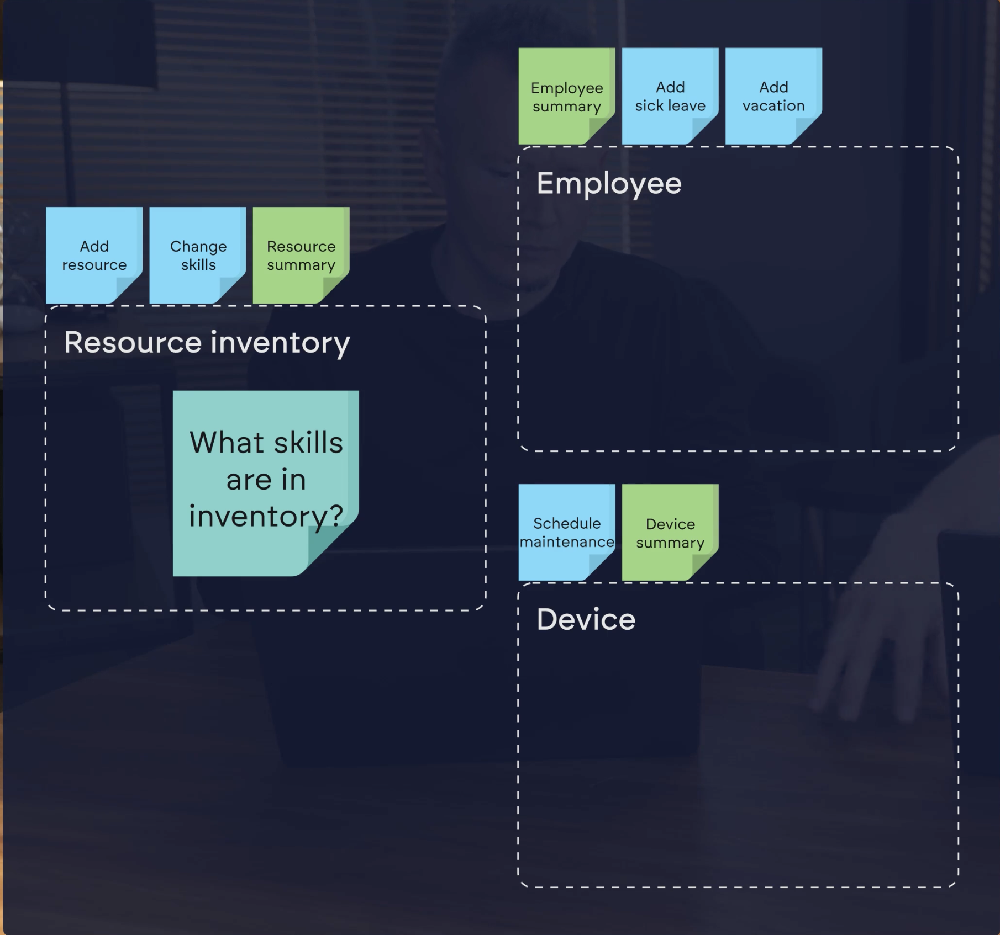

#### Drivery architektoniczne w destyFlacji kontekstów

-   Dodatkowe heurystyki
    -   Spójność heurtystyki (to co musi się zmieniać razem, musi być w jednym miejscu). Czyli znajdnować się w jednym kontekście.
    -   SLA (kiedy integrujesz wiele modułów, to aby wyliczyć SLA, musisz je pomnożysz przez siebie)
    -   wspólne dane (wystarczą Ci read modele), czyli dodatkowy kontekst
    -   Single Point of Failure (więcej strzałek - większe ryzyko)
    -   Zależności dwukierunkowe (wiadomix)
    -   Antywymagania (czego na prawdę nie chcemy lub nie możemy)

**Rolą projektana jest redukcja możliwych decyzji których zmiana jest kosztowna**

### L09. Podsumowanie odkrytych modeli

Po odkryciu modeli powinno się przejść do szukania relacji pomiędzy modelami

Istotne aby przed tym krokiem zweryfikować czy z tym modeli możemy odtworzyć proces jaki zachodzi w biznesie

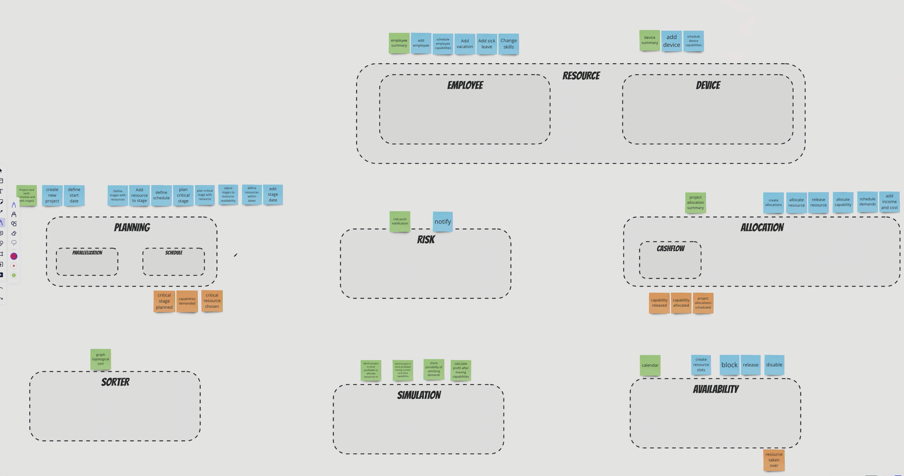

Co istotne w trakcie developmentu pojawią się koordynatory modeli, ale co najważniejsze trzeba sprawdzić czy z tymi modeli możemy odpowiedzieć na pytania jakie będą zadawane w trakcie procesu

Sprawdzamy przepływ sterowania, czyli jakie komendy są wywoływane w odpowiedzi na zdarzenia

Finalnie chodzi nam o to aby sprawdzić czy nie mamy tutaj ryzyka że to zupełnie nie zadziała, jeżeli tak to trzeba wrócić do analizy

## Moduł 06 - Mapa Autonomicznych Modeli

### L01. Modularyzacja bez mapowania - czyli wyszło “jak zwykle”

Nie ma znaczenia jak bardzie jesteś kumaty, nie ma szans abyś wszystko przewidział.

#### Przypomnienie

Problem się pojawia jak logika zaczyna się pojawiać wielkotornie w wielu modułach, szczególnie jeśli jest źródło prawdy na dosyć istotne pytanie biznesowe

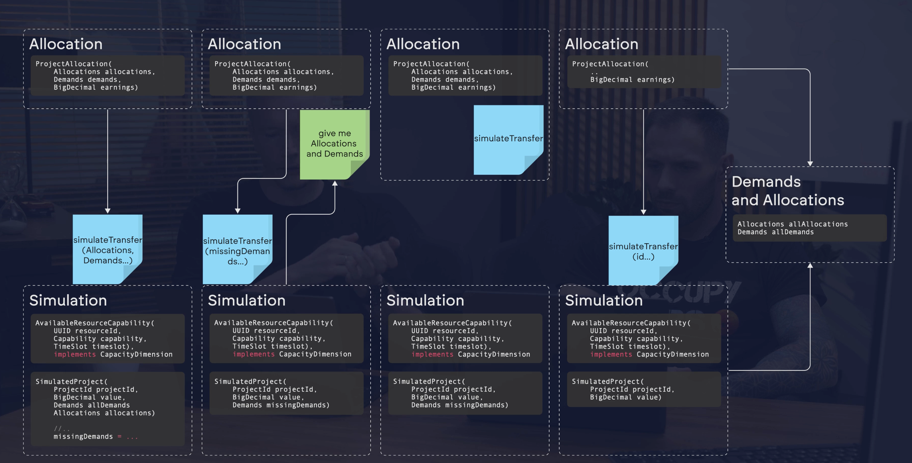

#### Zawężanie stokżka możliwości

Potrzebne metryki porównawczne i następnie wybranie samego rozwiązania

#### Modularyzacja to nie koniec

To co było częstym problem modularyzacji to zapominanianie o tym że poszeczególne modele nie żyją w izolacji, zawsze się jakoś mapują, integrują ze sobą.

-   pierwsze rozwiąznie - problem z wyciekiem danych i jednym źródłem prawdy
-   drugie rozwiązanie - problem z kierunkiem przypływu danych, co jeśli chielibyśmy je odwrócić?
-   czwarte rozwiązanie - problem z odpowiedzialnością za nowy byt, kto jest odpowiedzialny za nowy byt który pojawił się w wyniku integracji
-   piąte rozwiązanie - jest ok, ale może troche mniej optymalne
-   trzecie rozwiązanie - jest ok, ale może być mniej rozwojowe z powodu braku danych w alokacji na temat np. prawnych

Zawsze zapisuj ADR (Architecture Decision Record) aby później wiedzieć dlaczego coś zrobiliśmy. Rozwiązanie może się jeszcze zmienić.

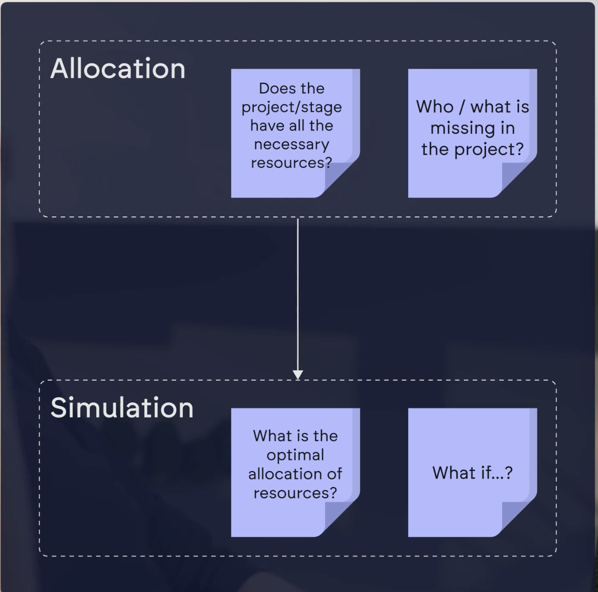

Zawężamy stożek możliwości:

-   patrzymy na potencjalne wyciekanie szczegółów implementacyjnych
-   patrzymy na przeciekanie danych pomiędzy modelami
-   patrzymy czy potencjalnie zduplikowana logika jest zmienna
-   patrzymy który model ma się do którego dostosować
    -   jeżeli mamy dwa modele to opcje są trzy
        -   kompletnie niezależne od siebie
        -   wzajemnie zależne od siebie
        -   upstream - downstream, czyli albo jeden model jest zależny od drugiego albo odwrotnie
-   patrzymy na liczbę zespołów pracujących
-   patrzymy na atrybuty jakościowe
    -   wynikają z obciążenia
    -   specyfiki wdrożenia systemu

Dużo tutaj było mówione o czymś co nazywamy mapą kontekstów

### L02. Mapa Kontekstów (Mapa Zależności Między Modelami) - Twój najważniejszy artefakt

Mapa kontekstów główny artedakt strategicznego DDD


Najlepiej to nazywać:

**Mapa zależności pomiędzy modelami tworzonymi w kontekście rozwiązywania konkretnych problemów**

Mapa kontekstów oraz mapa modeli jest używane wymiennie

Mapa służy do komunikacji pomiędzy techniczymi i nie technicznymi osobami

**Co istotne pilnuj aby wszystkie decyzje architektocznie były podejmowane przy tej mapie**

### Propagacja modelu

-   propagacja struktur
    -   w systemie brak enkapsulacji struktur powoduje problematyczne sprzężenie
-   propagacja odpowiedzialności
-   propagacja źródła prawdy
    -   dwa modele zaczynają odpowiadać na to samo pytanie
    -   w momencie jak dwa modele odpowiadają na to samo pytanie to prowadzi do problemów z rozwojem systemu
    -   uniknięcie sytuacji joinów po mikroserwisach
    -   znając źródła odpowiedzi na pytania wiesz kto, kogo, o co i po co pyta, to zawęża stożek możliwości komunikacji pomiędzy modelami

Aby dobrze podzielić system trzeba podjąc decyzje o kierunkach i formach zależności pomiędzy modelami

-   mapa kontekstów (mapa modeli)
    -   kluczowe narzędzie każdego modelarza
    -   pomaga zrozumieć zależności pomiędzy modelami i zespołami
    -   pokazuje jak różne części systemu czy organizacji współpracują ze sobą, kto od kogo zależy i jak ta zależność wygląda

### Po co mi mapa modeli?

Sama modularyzacja nie wystarczy aby utrzymać sensowną architekturę

-   Po co mapa modeli?
    -   ujawnia, od jakich usług zależy konkretne rozwiązanie oraz kto zależy od danego zespołu czy usługi
    -   pomaga w indentyfikacji wąskich gardeł i ryzyk
    -   dokumentuje decyzje, pomaga wdrażać nowy zespół w system
        -   może być też artefaktem dokumentującym na przykład event storming procesowy
    -   waliduje pomysły
        -   product owner widzi co może jeszcze zbudować z obecnych elementów systemu
        -   pokazuje capability co może się przekładać na nowe produkty

Pojęcie mapa kontekstów sugeruje modelujemy modele i pojęcia z naszych kontekstów

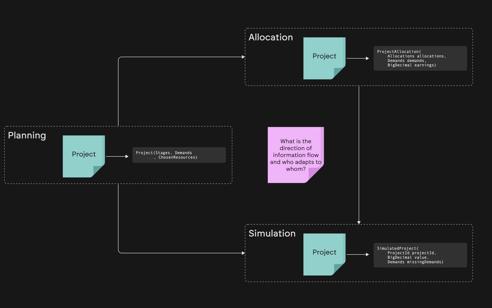

Na takiej mapie widać relacje pomiędzy modułowe, widać relacje pomiędzy zespołami. Czy na przykład moduły o sobie wiedzą lub zupełnie nie wiedzą.

To bardzo ważny element bo on potem wpływa na pracę programistów i utrzymanie systemu.

Tylko mapa modeli wyłapuje dysfunkcje które są niewidoczne lub są słabo widoczne na samej liście modułów. Na liście nie ma relacji tylko same moduły.

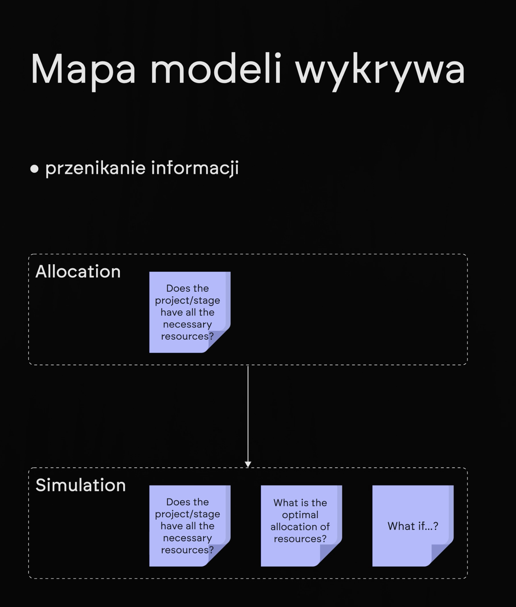

Mapa np. pokazuje że dwa konteksty są zbyt mocno ze sobą powiązane, odpowiadają na te same pytania, co prowadzi do problemów z rozwojem systemu. Co prowadzi do rozmycia odpowiedzalności, nie wiadomo kto ma implementować nowe funkcje.

Dodatkowo silne sprzężenie zespołów i potrzebe ciągłego koordynowania pracy pomiędzy nimi.

-   Mapa modeli wykrywa

    -   przenikanie informacji
    -   makiawelizm (ktoś jest zbyt mocno zależny od kogoś)
    -   niezdrowe zależności zespołowe
        -   np. ważna funkcja w zespole jest blokowana bo czekamy na jakieś API

```
-   sposoby współpracy które pokazuje mapa modeli
    -   niezależne (free)
        -   publish language - każdy ma swoje API, wspólny język
        -   sperate ways - każdy idzie swoją drogą
            -   tutaj godzimy się na ryzyka czyli zdublikowane źródła prawdy
    -   wzajemnie zależme (mutally dependent)
        -   shared kernel
    -   upstream - downstream (jeden zależy od drugiego)
        -   Conforimist - czyli biorę to co dają
        -   Anti-Corruption Layer - warstwa antykorupcyjna
        -   Customer-Supplier - downstream ma wpływ na upstream
        -   Open-Host Service - wystawienie generycznego API dla innych (publiczne API)
```

Problem z mapami z książek jest taki że zwykle jest przydatna dla kogoś kto już dobrze zna system, więc tak naprawdę nie potrzebuje tej mapy.

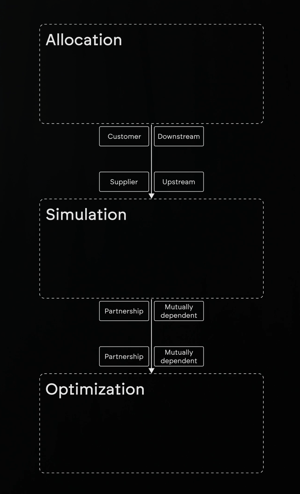

Zanim stworzysz jakikolwiek artefakt zadaj sobie pytanie po co tworzysz. Tutaj zwtkle odpowiedzią będzie zapisanie inforacji którę będą odpowiadały na typowe pytania:

-   dlaczego musimy wersjonować API?
-   dlaczego awaria tego systemu powoduje awarię innego systemu?
-   gdzie znajduje się wiedza o tym jak działa system?

Mapa kontekstów powinna służyć jako dokumentacja stormingu procesowego. Przenieś na mapę wszystkie elementy z event stormingu.

warto dodać do mapy:

-   głowne pytania na jakie kontekst odpowiada
-   komendy jakie przyjmuje
-   jakie widoki wyświetla
-   jakie zdarzenia emituje
-   dodać słowa ze słownika biznesowego, opis
-   typy złożności problemu oraz strategie testowania
    -   to pozwala osobom technicznym wiedzieć czego się spodziewać w kodzie
-   zespół który się zajmuje danym kontekstem oraz wymagane od niego kompetencje

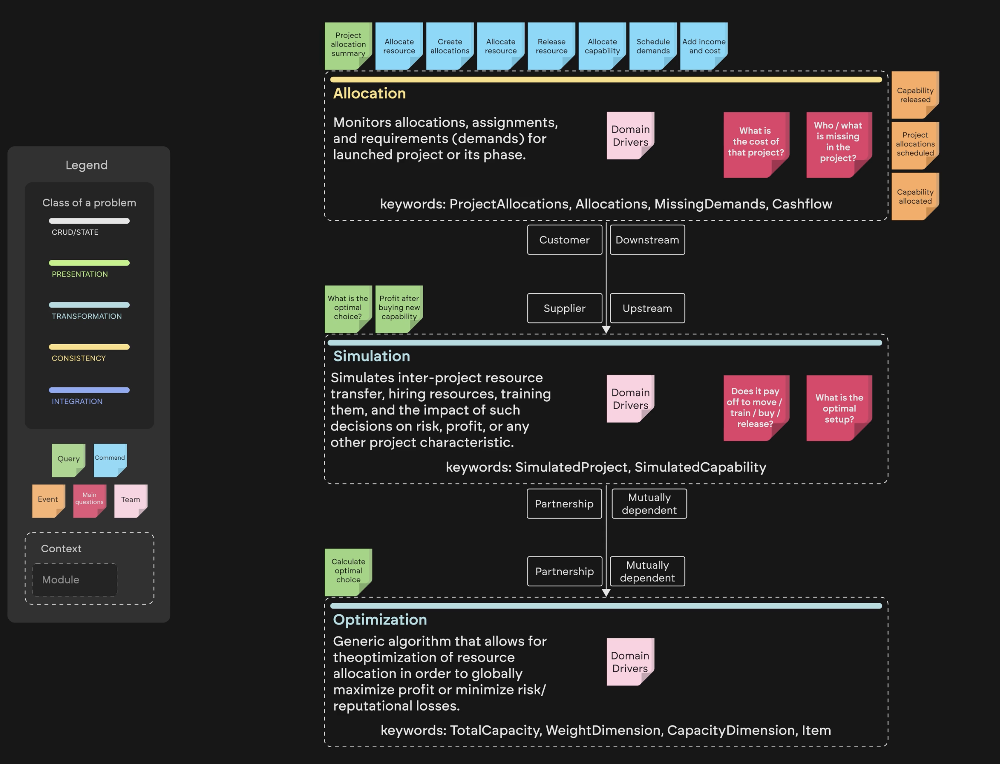

### L03. Strategie dostosowywania się - poradnik modelarza

W przypadku relacji Symulacji z alokacją mamy sytracje relacji na zasadzie conformisty, czyli biorę to co dają

-   każda zmiana zewnętrznego modelu wpływa na mój model
    -   nie mam żadnej strefy zgniotu, czyli zawsze muszę się dostosować
-   ma sens tylko w przypadku bardzo stablinego i dojrzałego modelu lub w przypadku narzuconych norm (na przykład przez regulatora)
    -   regulacje się zmieniają i musisz się do nich dostosować (jesteś conforimistą z założenia)

#[zaleznosci](./assets/zaleznosci.png)

Tutaj mamy problem gdzie zmiana w alokacji przepływa pośrednio do planingu który jest zależny od alokacji i mamy awarie w planingu.
Czyli mamy sytuację zmiany kaskadowe.

**Taką sytuacje możemy wyłapać przed katastrofą ale tylko na mapie modeli.**

W takiej stuacji warto przygotować strefę zgniotu czyli przygotować się na to że model do którego jesteś podpięty jest zmienny

#[ACL](./assets/ACL.png)

Nazywamy to Aniti-Corruption Layer, czyli warstwa antykorupcyjna. To jest warstwa która pozwala na to aby zmiany w zewnętrznym modelu nie wpływały na nasz model. Przykład życiowy: Nie będziesz mógł wejśc w swoich butach w domu ale jeżeli zmienisz buty to już będziesz mógł.

ACL powstrzymuje wypływanie struktrury z jednego modelu do drugiego. Natomiast pytanie czy to zabezpieczenia przed propagacją logiki pomiędzy modelami?

-   Anti-Corruption Layer
    -   strefa zgniotu - tylko przez nią przechodzą zmiany
    -   tylko do niej propagują zmiany
    -   w środowisku rozposzonym może być problem z duplikowaniem logiki

#### Shared Kernel

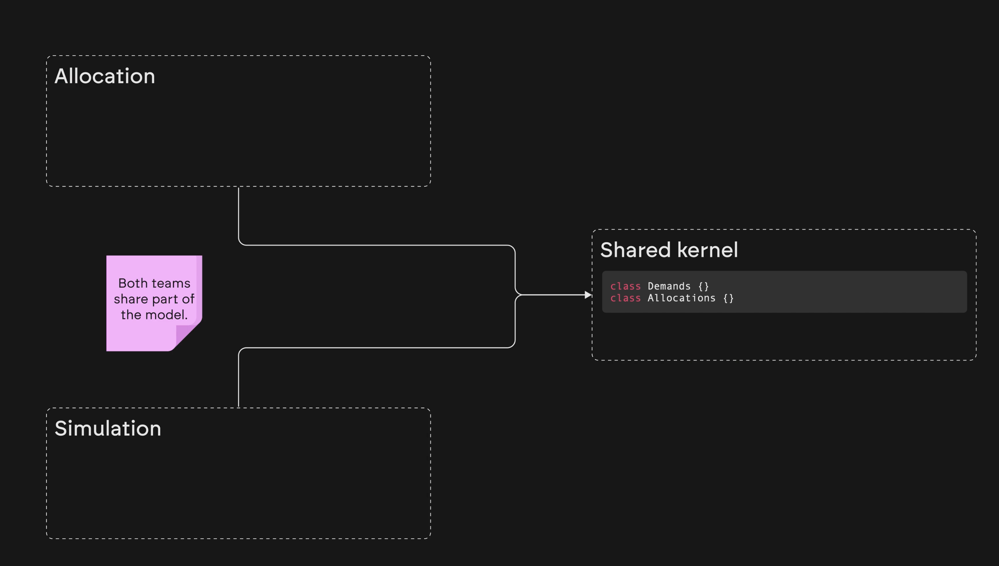

Shared kernel to relacja gdzie modele są wzajmnie od siebie zależne

Ma to sens kiedy zespoły są w relacji partnerskiej, czyli współpracują ze sobą

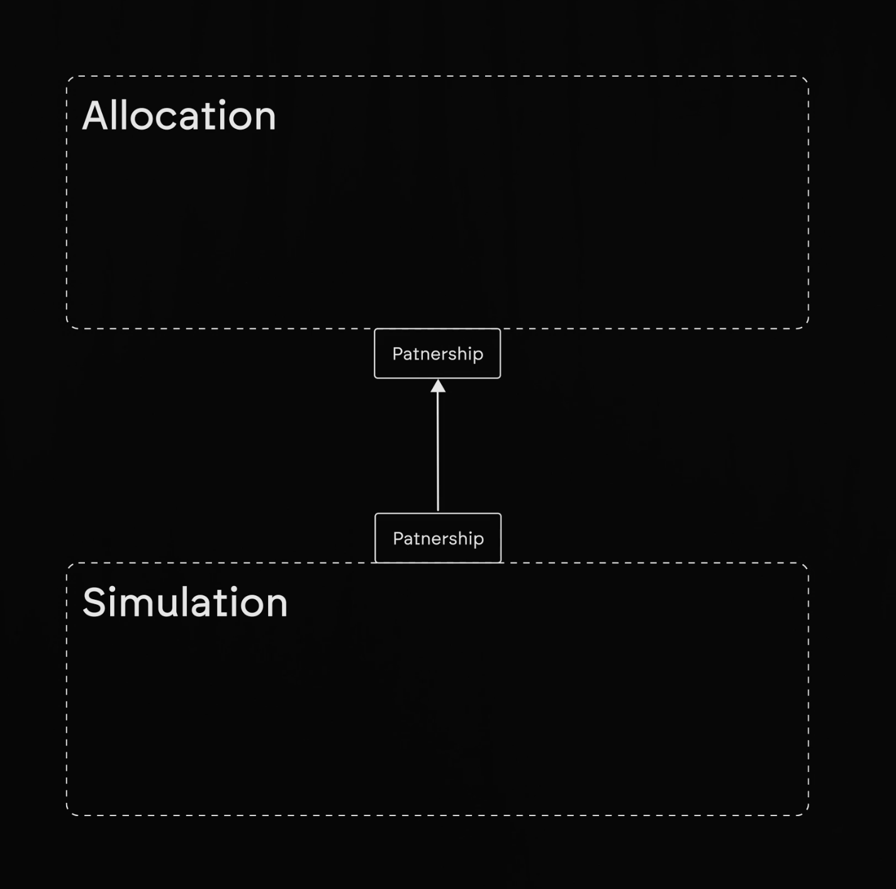

czyli zespoły razem pracują, planują i dowożą produkt, jest to wzorzec organizacyjny

Natomist jest ryzyko że jak będziesz w partnership ze zbyt duża ilością zespołów to zaczniesz się gubić i spędzać zbyt dużo czasu na spotkaniach i koordynacji

W momencie jak downstream chcey wpływać na upstream mamy sytuacje Customer-Supplier

#### Customer-Supplier

-   typ relacji gdzie downstream może mieć wpływ na upstream
-   wymagania przez downstream powinny być wzięte pod uwagę przez upstream

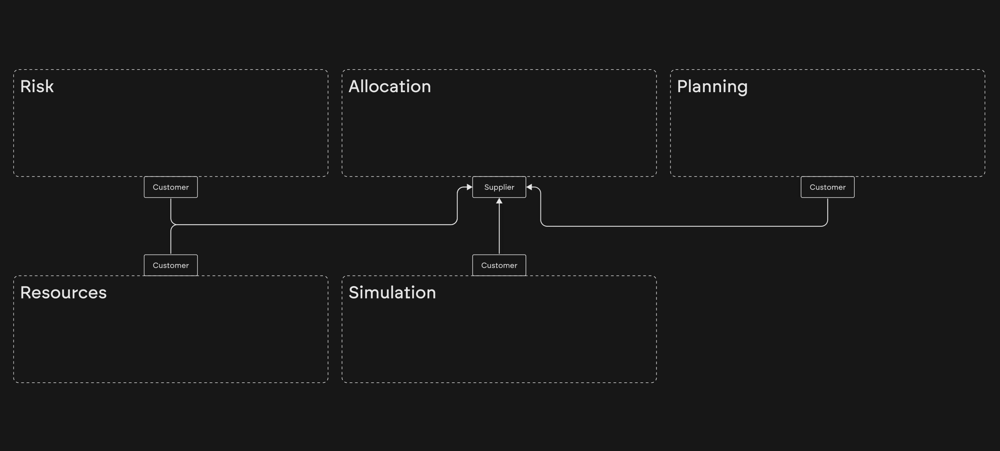

Ma to taki problem że jak upstream ma już wiele klientów to może być problem z dostosowaniem się do wszystkich wymagań

Czyli mimo że jesteś upstream to zaczynasz zachowywać się jako downstream w sytacji patologii

#### Open-Host Service

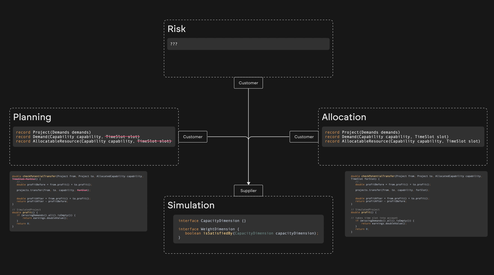

-   oferuje wspólny model i funkcjonalność dla wielu zastosowań
-   może być rozumiane jako publiczne API dla wielu kosumentów

Wystawiamy generyczne API przez co możemy optymalizować cokolwiek poprzez wykorzystanie domknięcia które odpowiada na pytanie czy zasób wystaczy aby zaspokoić potrzebę

generyczny API przed DDD nazywało się modułem ogólnego przeznaczenia

#### Publish language

-   dobrze udokomentowany język współdzielony przez konteksty
-   każdy kontekst można tłumaczyć na i z tego języka
-   czasem definiowany jest poprzez konsorcium (najważniejszych klientów, najważniejsze zespoły)

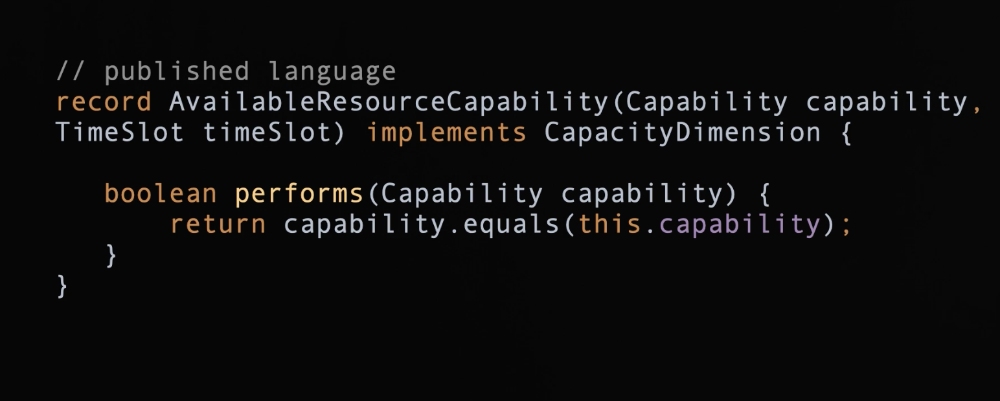

Jest to język na który wszyscy się umawiają, nie powinnien być zmieniany bez zgody wszystkich

#### Podsumowanie

mapa modeli to wzroce organizacyjne, nie techniczne,

np. niezależność zespołów można osiągnąć poprzez publish language lub tworzyć swoje modele niezależnie

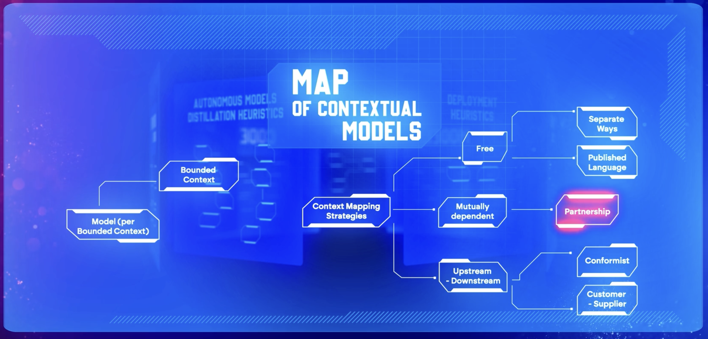

Co istotne

-   Open-host service
    -   minimalizuje problem bycia dostawcą usług dla wielu klientów
-   Shared kernel
-   Anit-Corruption Layer
    -   minimalizuje bycie conforimistą

to są techniki a nie wzorce organizacyjne, które zapobiegają propagacji modelu

Modele coreowe nie powinny być w relacji downstream z innymi modelami

### L04. Logiczne poziomy integracji kontekstów

W momencie rozpisywania komunikacji modułów możemy rozpisywać:

-   Kto kogo pyta?
    -   czyli kto jest inicjatorem zdarzenia
-   z jaką intentencją?
    -   zdarzenie
        -   zaproponowanie faktu, oznajmienie bez konkretnego adresata
        -   właścicielem jest emiter
        -   wielu odbiorców albo nie ma odbiorcy
        -   wysłający jest jeden
    -   komenda
        -   zmiana stanu / wywołanie zachowania, to jest rozkaz i najpewniej chcemy znać jej stan wykonania
        -   właścicielem jest konsument
        -   jeden odbiorca
        -   wysłających jest wielu
    -   query
        -   odczyt danych, brak zmian stanu
        -   właścicielem jest konsument
        -   jeden odbiorca
        -   wysłających jest wielu
-   w jaki sposób?

    -   system nierozproszony
        -   temporal coupling
        -   łatwiejszy w implementacji
        -   wiązanie w czasie, muszą razem działać
        -   często błąd w jednym module kończy się automatyczną porażka w innym module (np. wyczerpanie pamięci)
    -   system rozproszony

        -   messaging

            -   temporal coupling
            -   spatial decoupling
                -   integrowne moduły nie muszą się widzieć (fizyczny adres nie jest znany)
            -   failure isolation
            -   trudny do implementacji, debugowania
            -   asynchroniczne
            -   versioning
            -   at least vs at most once
            -   inbox and outbox pattern

        -   REST, RCP
            -   temporal coupling
            -   failure isolation
            -   łatwe do implementacji oraz debugowania
            -   sync or async
            -   versioning
            -   at least vs at most once
            -   inbox and outbox pattern

-   jakimi narzędziami?
    -   Dla messages
        -   Kafka
        -   RabbitMQ
        -   ActiveMQ
        -   ZeroMQ
    -   Rest
        -   Spring
        -   Django
        -   Flask
        -   Express
    -   W świecie nierozposzonym
        -   method call
        -   oberve pattern
        -   in-memory event i command bus

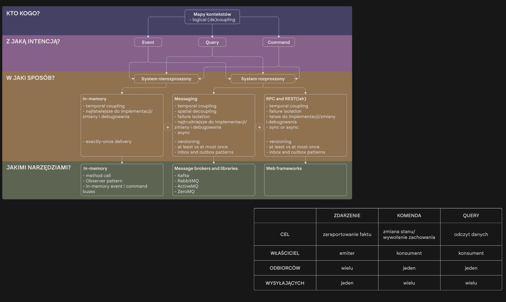

Co istotne jeżeli na mapie kontekstów jest zbyt dużo problemów to one potem lawinoow się popagują w dół

**Pamiętaj że najważniejsze jest zrozumiemie kto od kogo logicznie zależy**

Zastanów się następnie jaka jest intencja komunkacji?

-   Czy chcesz kogoś poinformować?
-   Czy komuś coś rozkazać?
-   Czy o coś zapytać?

Opresyjne zdarzenie jest wtedy kiedy emiter dokładnie wie co się powinno wydarzyć (błędnie użyte zamisast komendy)

#### Małe sprostowanie

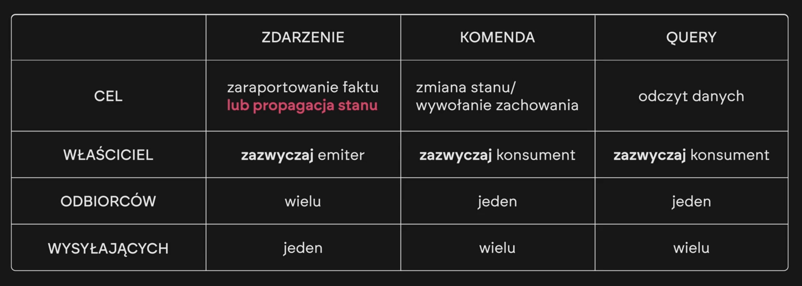

Tak zwykle wygląda relacja ale może się zdarzyć że właścicielem komendy nie będzie konsument, np. kiedy jest regulator który nakazuje zmianę

**Jeżeli znasz koleny krok procesu - użyj komendy**

Następnie zawężamy stożek niepewności poprzez wybranie w jaki sposób chcemy komunikować się pomiędzy modelami oraz jakimi narzędziami

#### A co jak nie masz sprawczości?

Nawet jak zostały już podięte decyzje to możesz np. dodać extra warstwe ACL która przetłumaczy to na język który jest zrozumiały dla twojego modelu

#### Typy zdarzeń

"Opublikowane" to jeszcze gorzej niż "publiczne", czyli jeżeli robisz zdarzenie gdzie masz obiekty które zostały zserializowane

-   event notification
    -   informacja o fakcie
-   event carried-state
    -   informacja o fakcie oraz stanie

Zdarzeń z event sourcingu nie używamy do integracji pomiędzy modułami

#### Podsumowanie

Mape kontekstów biorą pod uwagę

-   przenikanie modelu
-   przenikanie źródła prawdy
-   relacje pomiedzy zespołami

Przy definiowaniu mapy konktekstów pamiętaj:

-   logicznie wiązanie to coś innego niż wiązanie w czasie
-   dojrzałość i liczebność zespołów
    -   im mniej zespołów i bardziej dojrzałe tym lepiej
-   stabilność modelu
-   atrybuty jakościowe
-   wpływy regulatorów

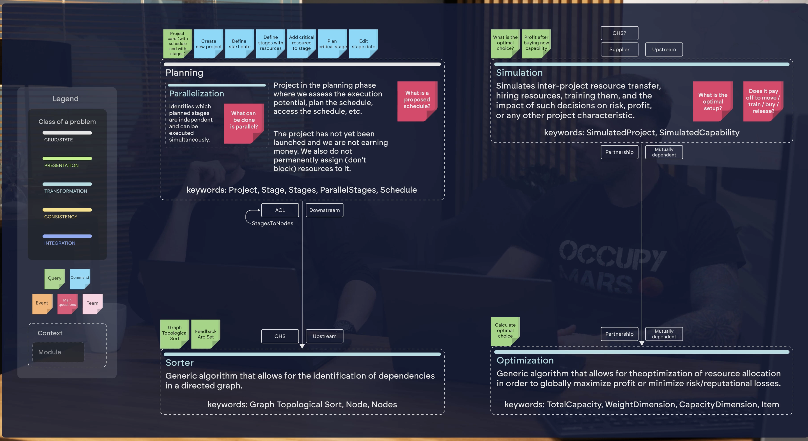

### L05. Dramat mapowania kontekstów w kilku aktach

#### Zachłysnąć się zdarzeniem

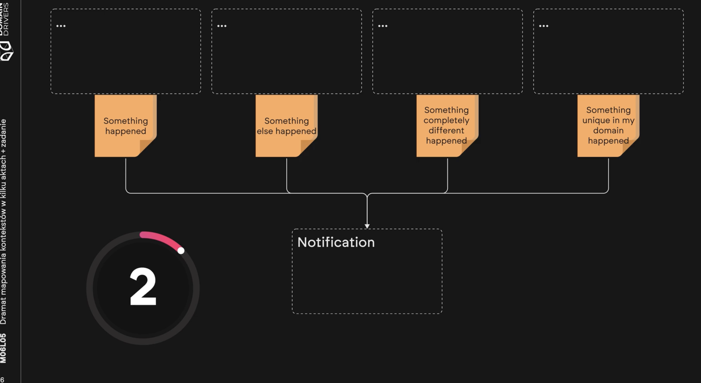

rozwiązaniem jest to aby wystawić OpenHost Service tak aby każdy model samodzielnie decydował o swojej logice

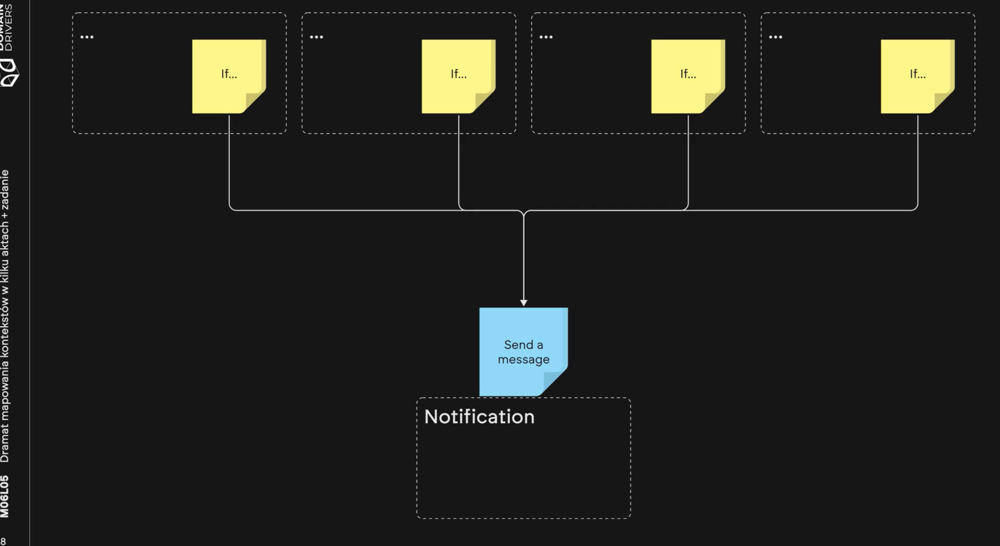

Możliwe że potrzebujesz extra logiki, w takim razie możesz dodać pośredni model który będzie tłumaczył zdarzenia

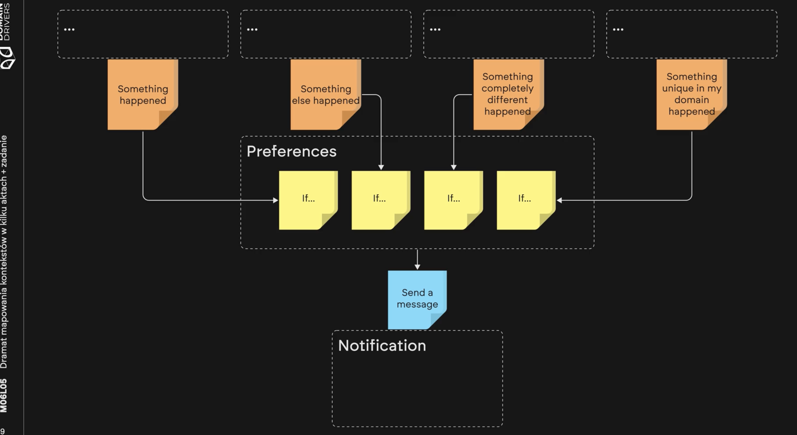

Pamiętaj o heurystyce, **Czy na pewno nie brakuje mi modelu mapującego?**

Opresyjne zdarznenie np. kako się wylało, które ukrycie znaczy po prostu posprzątaj

#### Problem komunikacji generyków z core'ami

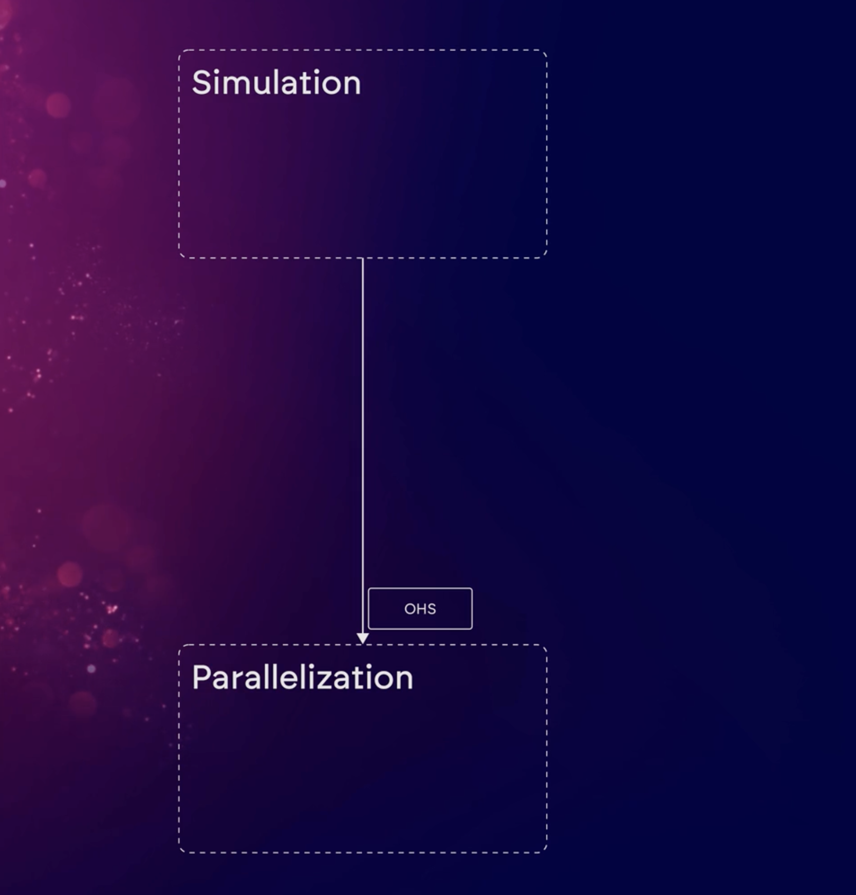

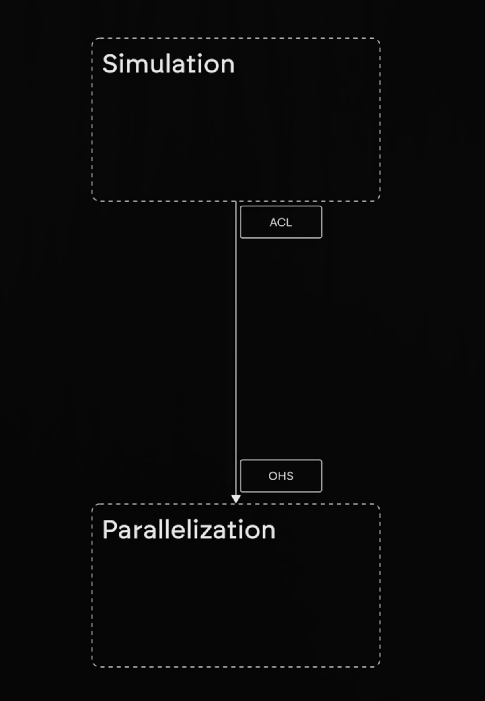

W takim przypadku aby core nie dostosował się do generyka możemy dodać ACL który będzie tłumaczył zdarzenia i będzie strefą zgniotu

#### Zagadka Mariana

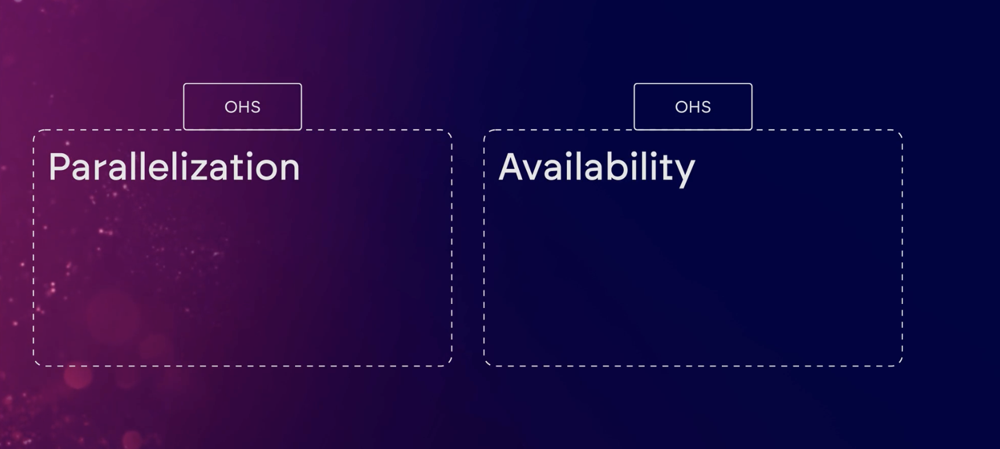

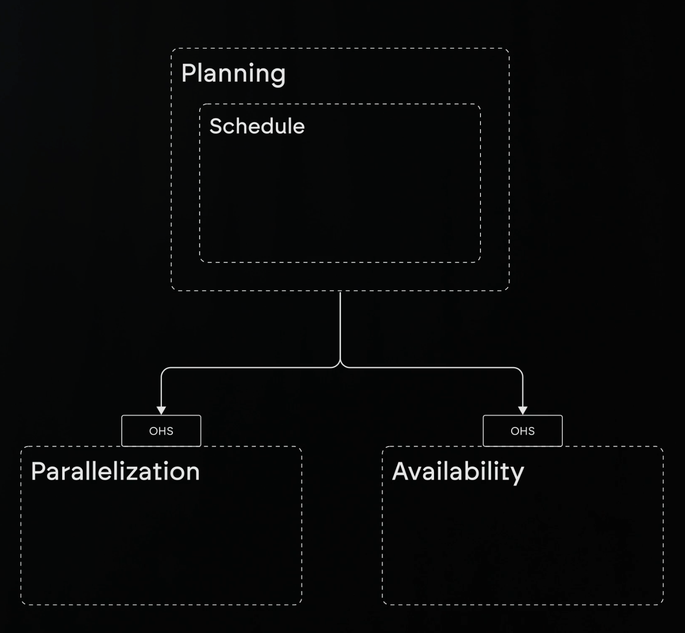

Użycie tak zwanego czystego fabrykatora, czyli coś co spowoduje ze nie będzie wiązania pomiedzy modelami którymi nie chcemy mieć wiązania

#### Obecna mapa modeli

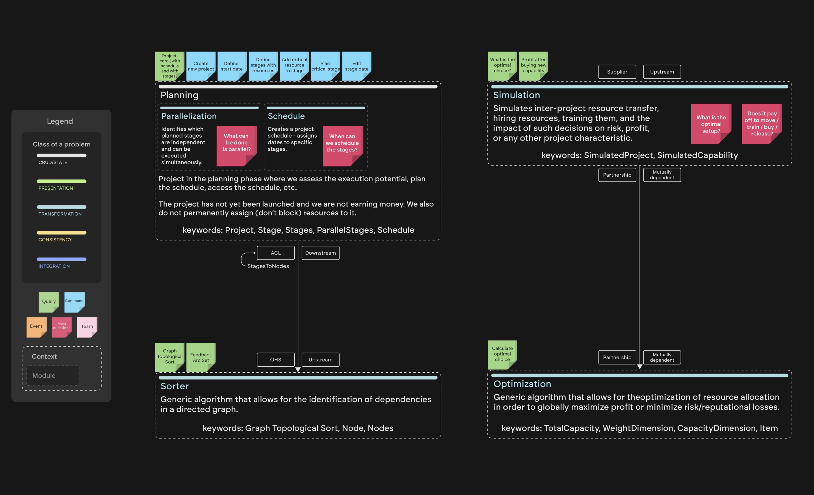

## Moduł 07 - Klasyfikacja Problemów Modelarskich

### L01. Rozwiązanie zadania

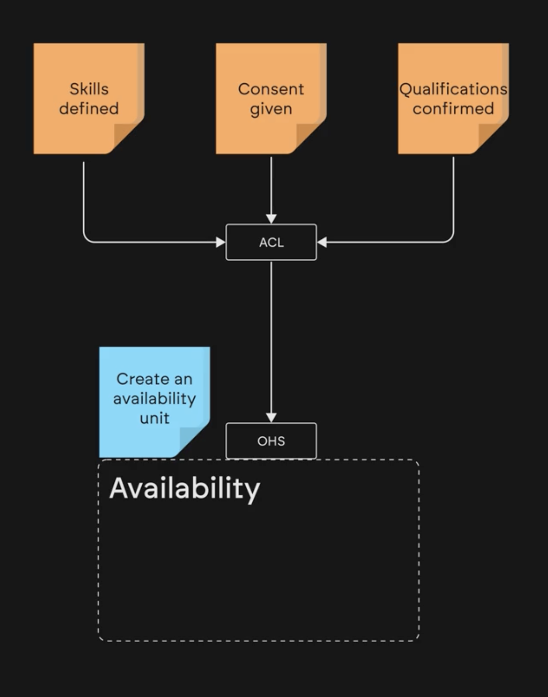

W momencie kiedy masz sytuacje że aby odpowiedzieć na pytanie które wymaga integracji z wieloma kontekstami to jest moment na użyvcie usługi mapującej (np. ACL), tak aby nie było bezpośredniej integracji z corowym modelem

### L02. If ifowi nierówny

#### Code review

Dekompozycja funkcjonalna - to antywzorzec w projektowaniu obiektowym który polega na modelowaniu proceduralnym i zastosowaniu klas jako kontenerów na podprocedur

#### Podchodzimy do taktyki

klasyfikujemy problemy tak aby następnie każdą klasę problemu zamodelować w osobnym kontekście odpowiednimi elementami konstrukcyjnymi

Zawsze chcemy dopasować bulding block adekwatnie do klasy problemu

#### Rodzaje logiki

Niezmienniki - reguły dziedzinowe

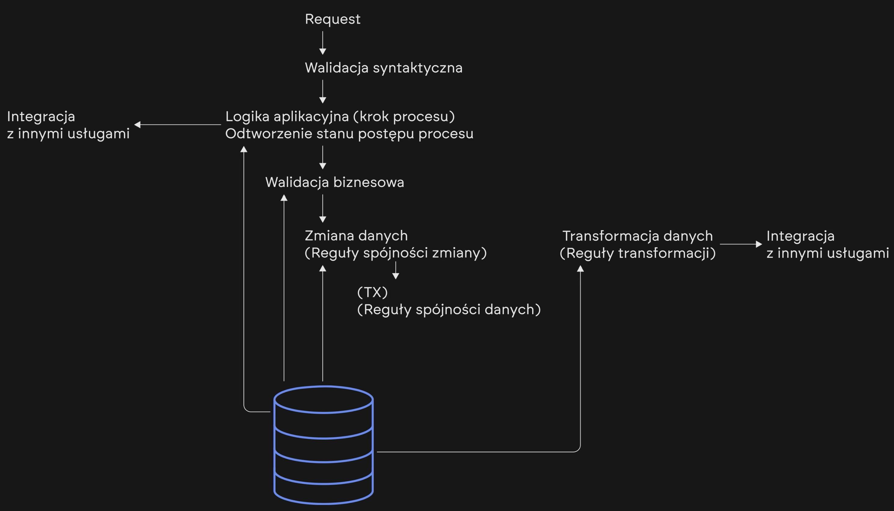

Zwykle w systemie mamy powtarzalne problemy które możemy podzielić na rodzaje logiki

#### Elementy konstrukcyjne


#### U mnie wszystko jest funkcją

Takie podejście jest dobre dopóki mamy prosty skrpyt który jest mały i nie rośnie, takie podejście w dużym systemie biznesowym spowodowałoby paraliż systemu i projektu

#### Resposiblility Driven Design

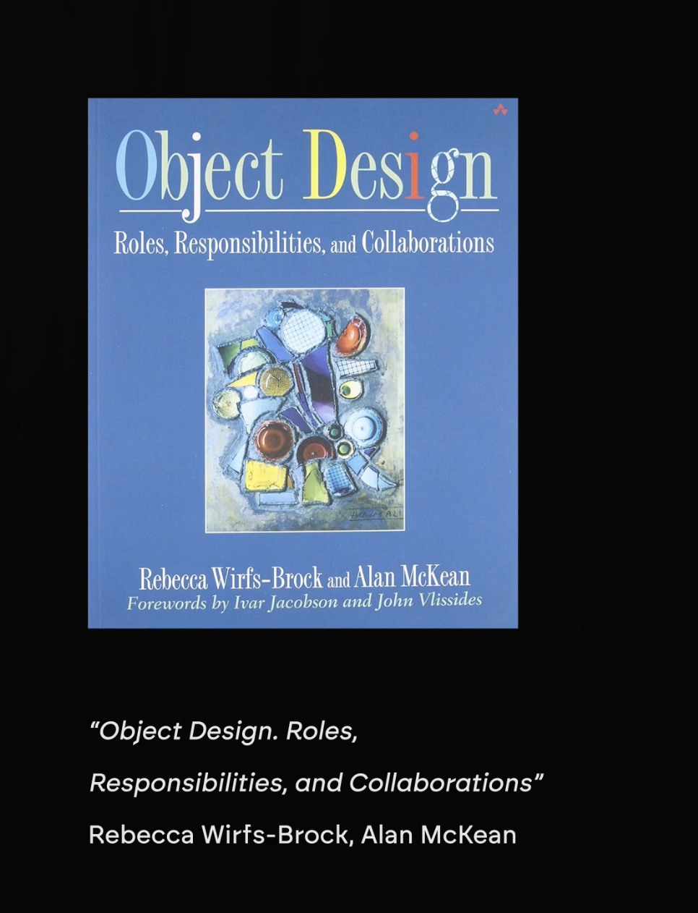

Zawsze jak towrzysz nową klaskę to zastanów się jaką rolę będzie ona grała w Twoim systemie, mówiąc inaczej jaki będzie rodzaj logiki zawarty w niej. Możesz zawrzeć tylko jeden rodzaj logiki w jednej klasie

Responsibility Driven Design to lepsze podejście niż Single Responsibility Principle ponieważ łatwiej przekłada się na kod.

### L03. Jak rozpoznawać - CRUD

#### Jak rozpoznawać?

Musimy się nauczyć rozpoznawać rodzaje logiki w naszym systemie i odpowiednio je klasyfikować

#### CRUD

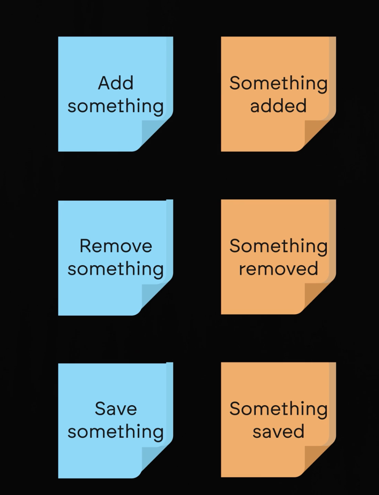

Jeżeli widzisz taki wynik process level event storming to znaczy że mamy możliwe dwa przypadki:

-   Modelarz nie przyłożył się do swojej pracy, nie zdał pytań behing oraz becoming
-   Mamy do czynienie z problemem klasy CRUD

Mogą się zdarzyć jakieś reguły walidacji ale głównie opierasz się na CRUD

#### CRUD zakamuflowany

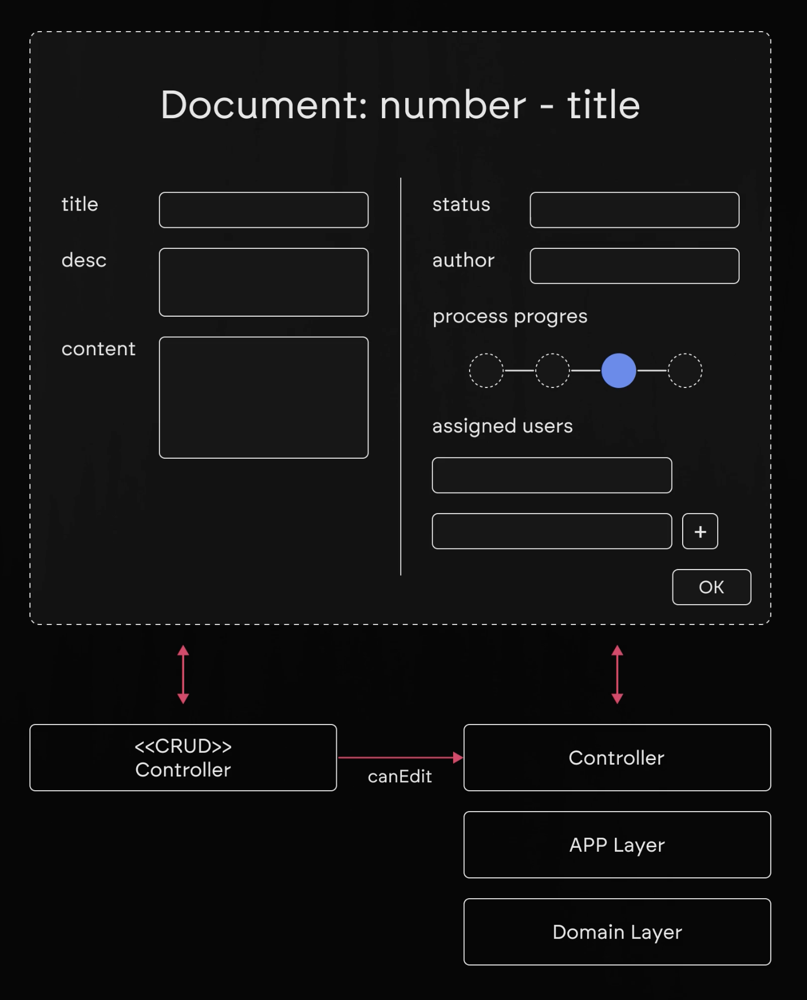

Możliwe że mamy syutajce gdzie jest curd ale też skomplikowana logika biznesowa, w takim przypadku dobrym pomysłem jest rozbicie na dwa modele

np. w przypadku kiedy wykonuje się edycja dokumentu po prostu ten CRUD będzie powiadamiał model o tym że zmieniło się pole X, tak aby ten model mógł zareagować

**Najlepiej nie łączyć CRUD z głęboką domeną**

Często CRUD nazywa się notatką, dlatego że dobrze opisuje klasę problemu jaki rozwiązuje

#### Demo

Nie dziedziczymy po BaseAgregrateRoot wtedy kiedy danie nie są chronione żadnymi regułami to tylko CRUD

### L04. Jak rozpoznawać - Transformacja i Prezentacja

#### Transformacja i prezentacja danych

Transformacja i prezentacja danych często idą ze spobą w parze

Co istotne tutaj nie mamy żadnego zmiany stanu, to jest tylko przekształcenie danych

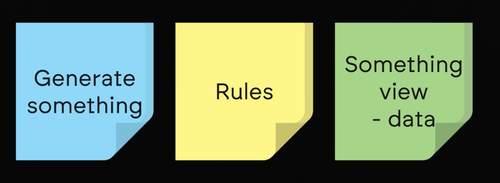

rozpoznasz to po tym że nie zdarzeń na event stormingu

Model prezentacyjny to kontrakt

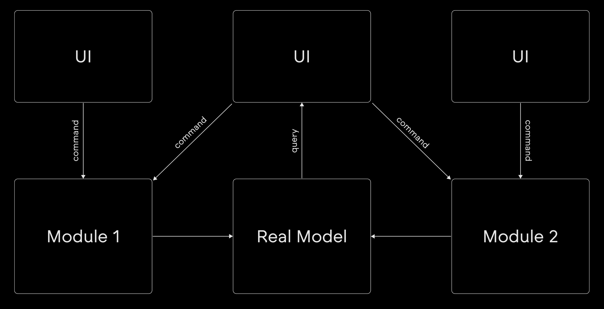

Read model czyli modele którę są tylko projekcją danych których zmiany zachodzą w źródłach prawdy

np. Kalendarz to tylko projekcia danych, to że klikamy na kalendarzu to nie znaczy że wykonujemy operacje na kalendarzu, a raczej na innych modelach, a każde kliknięcie do wysłanie komendy do źródła prawdy

**Wszystkie zmiany stanu najpierw przechodzą przez źródło prawdy**

#### Techniki implementacji

-   implementacje read modelu
    -   kwerendy do źródeł prawdy
    -   widoki zmateriaizowane
    -   cache odświeżany np. eventami ze źródeł prawdy

#### Tipy

Eventy state transport - czyli eventy które przenoszą stan są ok do odświeżania cache nawet jak zdradzają dziedzinę

Nie musisz po stronie domeny tworzyć cronów które uderzają eventami że wygasły jakieś dane po stronie źródła prawdy, wystarczy że dodasz do eventu TTL i cache sam się odświeży

**Myśl o cache jak o czymś, co zawsze można usunąć i odtworzyć ze źródeł prawdy**

### L05. Jak rozpoznawać - Integracja

#### Integracja

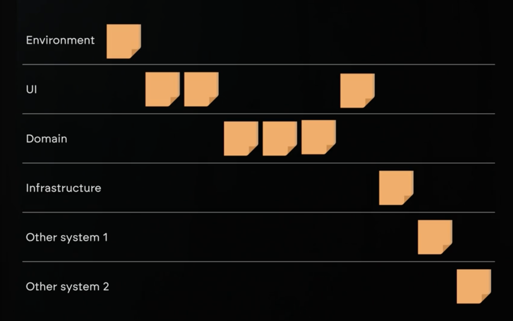

Poblemy integracyjne pojawiają się kiedy musimy pobrać dane z innych modułów i je obrobić dodatkowo

Jest to bardzo widoczne na swim lines na event stormingu procesowym, kiedy zaczynasz widzieć że zdarzenia z jednego modelu są wysyłane do drugiego modelu

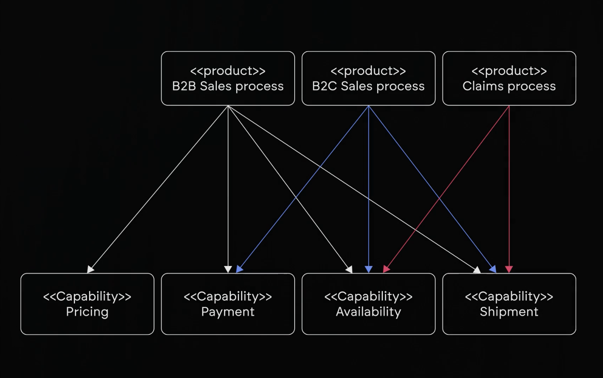

Tak samo widać to na mapie powiązań z modułami

W momenice jak mamy OHS (Open Host Service) to one wymuszają w jaki sposób należy się integrować z innymi modelami, co istotne nie wymuszają ich modelu dziedzinowego ale mają specjalny model z poziomu API

W tym przypadku moduły typu porcesowego czy produktowego będą miały role orkiestratora i będą odpowiedzialne za integrację

#### Publish language

W systemach rozporoszonych może być pokusa aby pozbywać się koordynatorów na rzecz eventów, to niestety może prowadzić do stowrzenia rozporoszenego monolitu czyli systemu w którym konteksty przeciekają między sobą

Możemy próbować wyłonić publiczny język dla systemu ale to będzie w praktyce bardzo ciężkie do realizacji, szczegółnie dla dużego systemu oraz dla bizensu który nie jest dojrzały

Język publiczny nie musi być modelem z żadnego kontekstu, jest to model na poziomie procesów systemwów, każdy kontekst powinnien w takieh sytuacji być wstanie konsumować i emitować zdarzenia z publish language

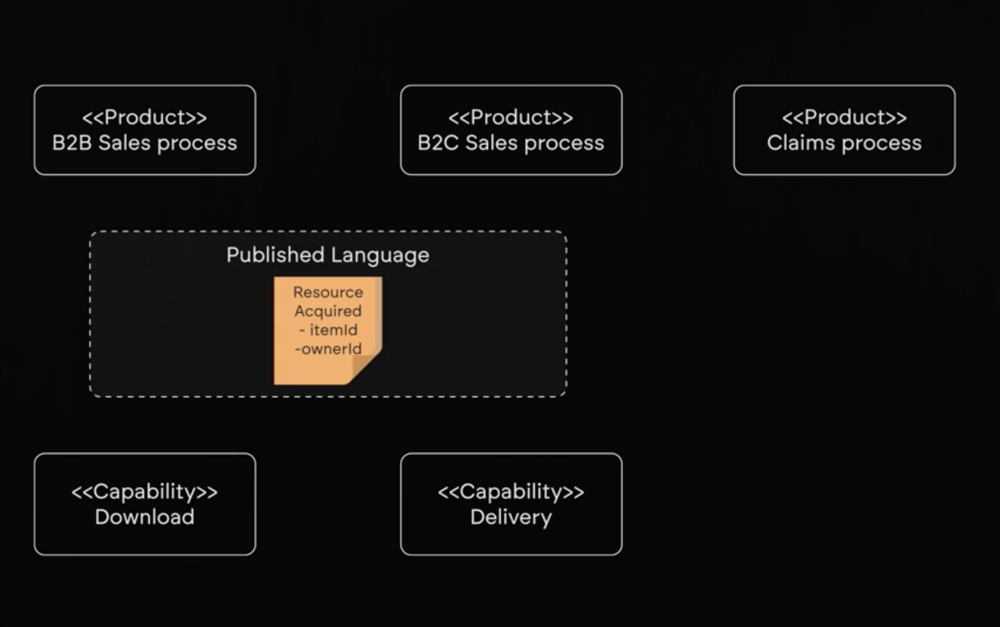

Jeżeli dystrubucja eventów posiada logikę wystarczy dodać model dyspozytora.

#### Autonomia

Chcemy osiągnąć stan że modele nie wiedzą o szczegółach innego modelu, jeżeli chce się dopytać to może w relacji customer - suplier.

Natomiast tutaj istotne jest określenie granic pomiędzy tymi modelami.

Niestety z czasem życia systemu może być wymuszenie dodanie modelu orkiestrującego, a to może spowodować że nasza koncepcja zdarzeń w architekturze rozproszonej może się rozmyć. W takiej sytuacji możemy dodać managera tzw. Saga Managera.

#### Model integracji


Przykład kiedy mamy wywołanie komendy i potem kilka zdarzeń biznesowych, z punktu widzenia biznesu kolejność może nie mieć znaczania ale jeżeli zejdziemy na poziom techniczny sytuacja może się zmienić. Jeżeli któreś zdarzenie uderze do zewnętrznego systemu to mamy ryzyko że nie zadziała i to może nieść kolejne konsekwencje.

np. zdarzenie zapłacono za produkt powinno się wywołać razem ze zdarzeniem dodano premie dla pracownika, ale co jeśli płatność zostanie przerwana? Wtedy premia nie powinna być dodana, w przypadku technicznych zdarzeń takie sytuacje mogą się zdarzyć.

**To co istotne to chcemy zamodelować ten scenariusz porażki**

Musimy uwzględnić włąściwe adresowanie komunikatów.

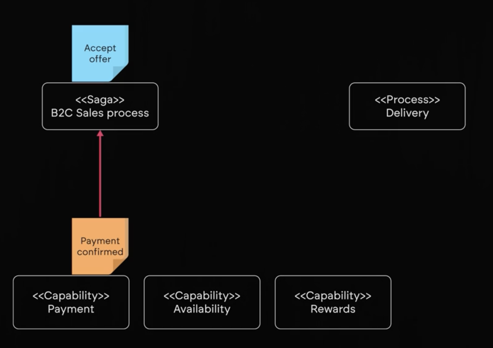

Pytanie czy lepiej integrować bezpośrednio moduły czy jednak robić pośrednika który jest odpowiedzialny za przekazanie informacji. Tutaj zawsze jest dylemat.

-   Pośrednik oznacza więcej skoków aby wykonać pracę
-   Pośrednik to single point of failure
-   Bezpośrednie integracje mogą prowadzić do przenikania modeli i dostosowywania się do innych modeli
-   Dużo zależy od zespołów i tego jak są zorganizowane, jak zwykle to wszystko zależy od sytuacji

#### Demo

Moduł ryzyka jest problemem integracyjnym

Czerwoną flagą jest momnet kiedy wszystkie modele zaczynają być integractyjne (wszystko ze wszystkim), czyli integrator integruje się z innymi integratorami

### L06. Jak rozpoznawać - Rywalizacja o zasoby

#### Historia pewnego requestu

Jest to klasa problemu najbardziej kojarzona z taktycznym DDD i popularnymi w świecie DDD Agregatami


Komenda może zwracać wynik operacji ale nie dane domenowe, zmienia to stan i może mieć wpływ na inne komendy czy wywołanie ponownie tej samej komendy.

Komenda to nie musi być CommandHanlder, może to być service czy metoda HTTP w Rest API typu POST

**Chodzi o intencje zmiany**

W momencie jak jest ryzyko dwóch mechanizmów zapisywanych w tym samym czasie to powinniśmy użyć optimistic lockingu czyli w momencie jak jeden mechanizm zapisuje to drugi nie może zapisywać

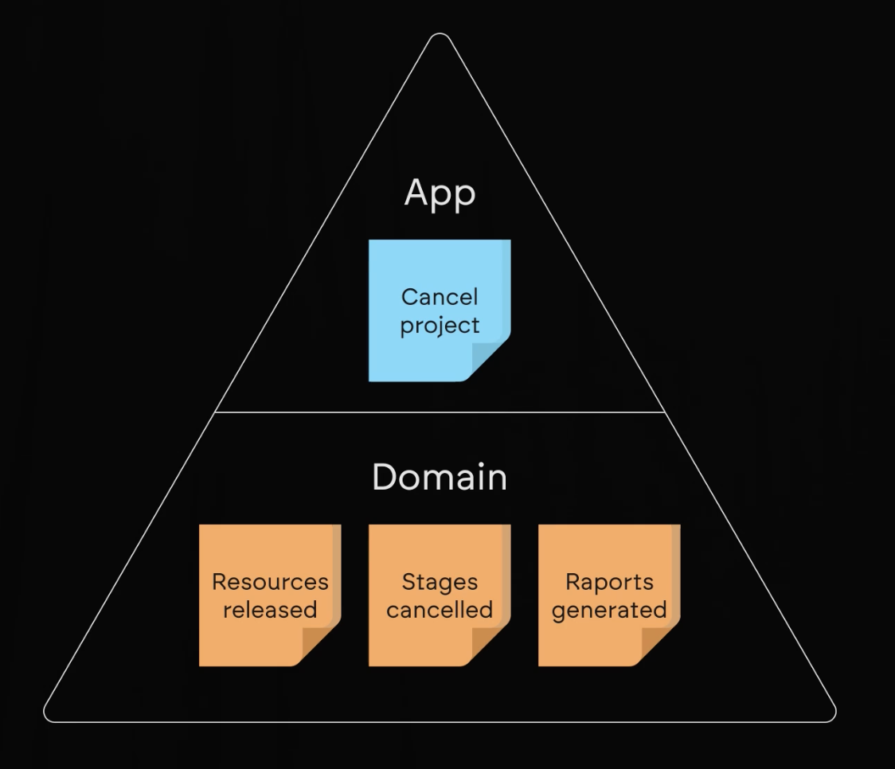

Warstwy służą do zmian warstw abstrakcji, nie jest istotne czy warstwy są oznaczone osobnymi pakietami ale to że realizujemy logikę innego poziomu. Nie chcemy aby zdarzenia z warstwy górnej były znane przez warstwę dolną

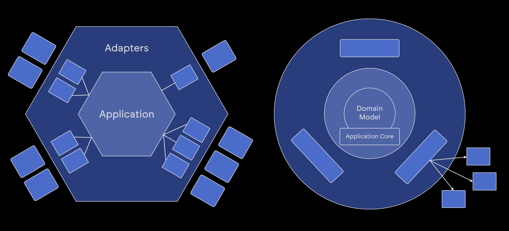

#### Poziomy reguł

Jak odróżnić reguły domenowe od reguł aplikacyjnych oraz infrastrukturalnych?

Wyobraź sobie że biznes pracuje z kartkami, ołowkami i telefonami. Jakie reguły by zostały? To właśnie te są regułami domenowymi.

np. "jeżeli użytkownik właścicel reklamacji chce ją zamknąć" to jest reguła domenowa, ponieważ jest na wyższym poziomie abstrakcji gdzie szczegóły techniczne nie mają znaczenia.


#### Rodzaje zmian stanu

Event sourcing to zapisywanie w bazie danych sekwencji zdazreń, to jest bardzo dobre do zapisywania historii zmian stanu

#### Jak wykrywać zmiany stanu na modelu procesu

Odryjesz w event storming process level kiedy zobaczysz że na odpowiedź pytania ma wpyłw wiele zmian stanu czyli zdarzeń. Na przykład na dostępność zasobu ma wpływ wiele zdarzeń czyli zmian stanu.

Jeżeli w systemie możemy jednocześnie wysyłać wiele komend które mogą mieć wpływ na ten sam stan to mamy ryzyko wyścigu

#### Modele tworzone w kontekście rozwiązania konkretnego problemu

Destylacja modeli:

-   Gromadzimy wszystkie zdarzenia która mają wpływ na odpowiedź na pytania na która odpowiada model i gromadzimy komendy które są przyczyną zaistnienia tych zdarzeń
-   pozbywamy się pojęc nieistotnych dla tego kontekstu modelu
    -   czyli takich które nie są powiązane regułami domenowymi z tym kontekstem

#### Event stormimng - desing level

Rozmawiamy z eskpertami dziedzinowymi, czyli osoby które więdzą jak działa obszar bizensu (poddomena) i konkretny obszar działania tego bizensu

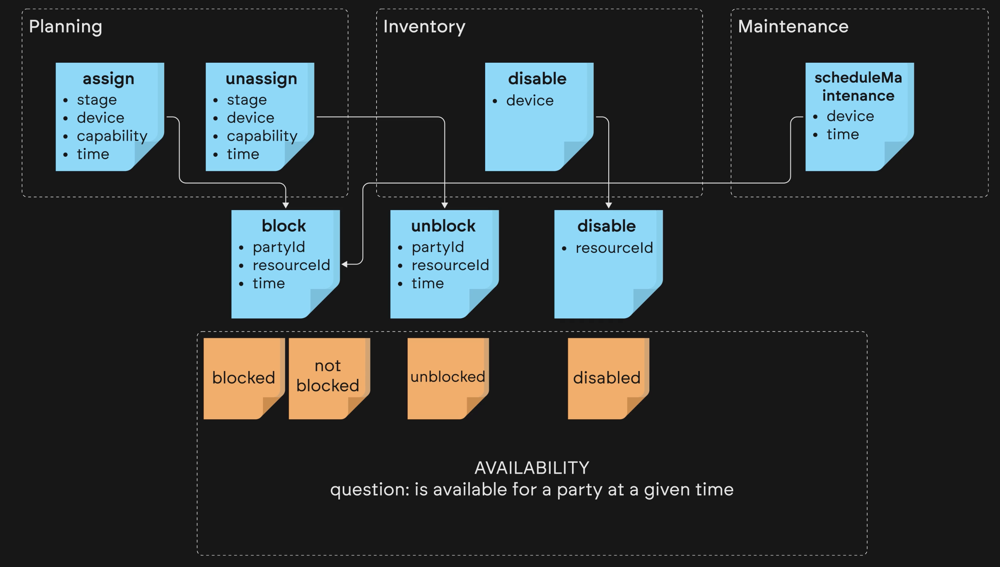

Zaczynamy od pokazania mapy kontekstów, następnie skupiamy się na modelu który chcesz stworzyć

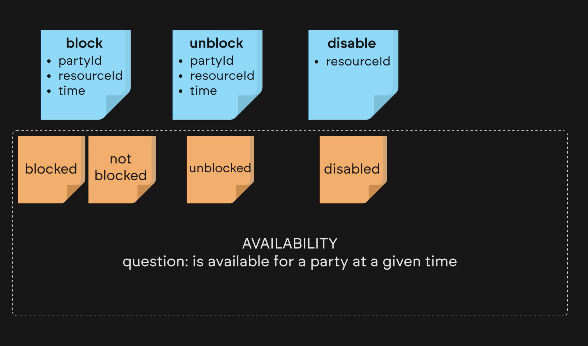

Celem nie jest przekonanie eksperta do Twojego pomysłu, celem jest wypracowanie wspólnego modelu.

Jeżeli eksprty zakwestionuje wypracowane słownictwo to dopasowujesz się do eksperta. Wychodzimy z założenia że to co się dowiedzialieśmy na poziomie analizy procesowej jest niekompletne. Dodania zdarzeń i komend.

**Najbardziej nam zależy na dodaniu reguł domenowych**

Co istotne na poziomie process level zależało nam na dobrej jakości zdarzeniach, natomiast na poziomie taktycznym zależy na precyzyjnych regułach domenowych

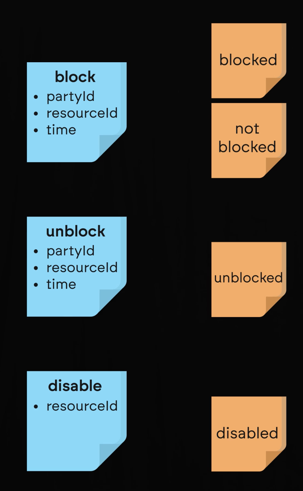

Dla każdej komendy pytamy się eksperta co musi być spełnione aby mogło zadziać się zdarzenie lub co blokuje zajście tego zdarzenia lub decyduje o wyborze jednego z wielu zdarzeń. Zdarzenia możemy dodawać.

Dobrym sposobem jest pytanie czy dane zdarzenie może zadziać się ponownie jeżeli już wcześniej się wydarzyło. Np. czy można zasób zablokować jeżeli już zostało zablokowane przez kogoś innego. To pozwala wyworzyć pierwszą prostą regułę domenową.

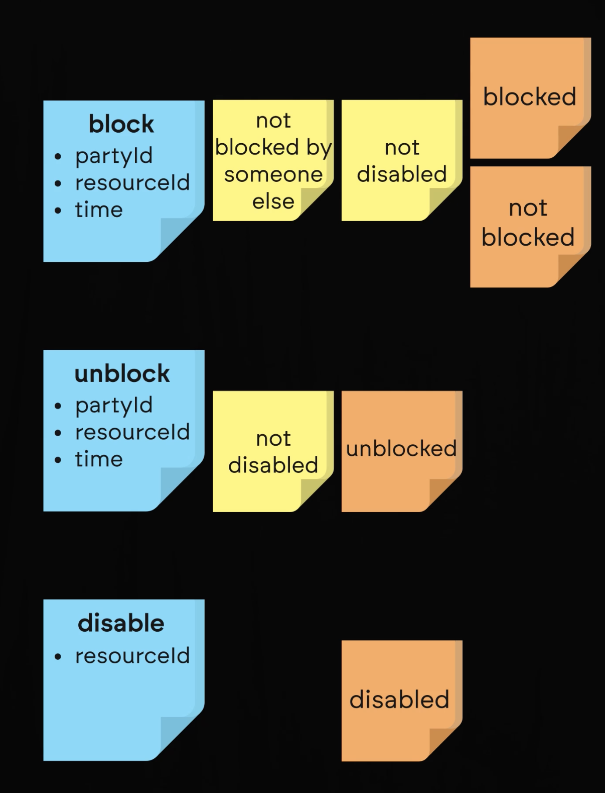

Dobrze jest zapisać kązdą taką regułę na osobnej kartece.

Zapytaj o spójność trasakcyjną po ludzku:
Czy stałoby się coś złego jeżeli byśmy te reguły sprawdzili osobno?
Jaka byłby konsekwencja gdybyśmy nie sprawdzili któreś z reguł, ale zrobili to nieco później?

Możesz wziąść konkretny use case i zrobić: Czy to będzie dla was ok jeżeli będzie możlie zablokowanie zasobu który jest już zajęty przez kogoś innego?

Jeżeli tutaj znajdziemy spójność to te dane i reguły zamknięty w jednej klasie

To co enkapsuluje takie elementy nazywamy w DDD Agregatem

#### Podejście bottom-up

Jeżeli nie możesz podejść top-down z jakiegoś powodu to możesz podejść bottom-up

-   Wypisz wszystkie rzeczowniki, ale nie grupuj ich w nadrzędne struktury
-   Dodaj reguły i połącz je z rzeczwonikami
-   Dowiedź się które reguły muszą być spójne atomowo
-   W ten sposób odnajdziesz granice agregatów
-   Problem pojawi się jeżeli rzeczwonik będzie powiązany z wieloma regułami które są w innych kontekstach

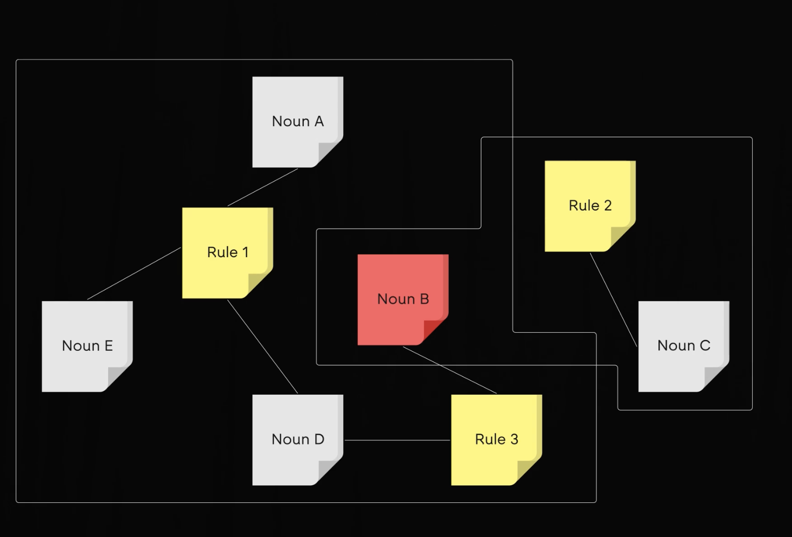

#### Współpraca na styku analityk-dev

Byłby łatwiej się dogadać jakbyśmy z analitykami rozmawiali w sposób DDD

#### Złożone modele rywalizacji o zasoby

Meta model to powtarzalna struktura w które można wpasować modele konkretnego biznesu czyki tzw. modele dla modeli

### L07. Łączenie klas problemów

#### Trójpodział logiki - Open/Close Principle w praktyce

W modelu złożonego modelu zwykle możemu wydzielić strukturę wyższego rzędu charakteryzującą się różną podatnością na zmiany

Open/Close Principle - Umożliwia dodawania nowych klas bez modyfikacji istniejących klas

Warto wydzielić w modelu części które charkateryzują się różną podatnością na zmiany

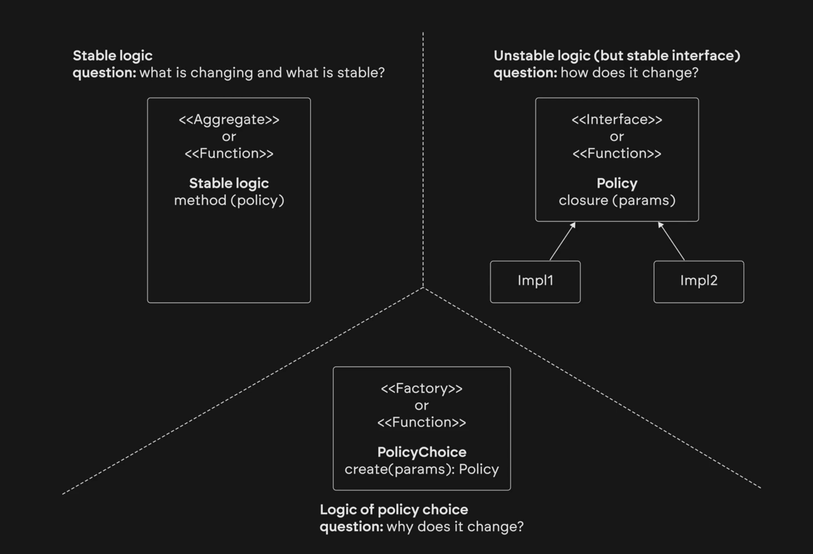

-   Logika stabilna
    -   rzadko podelga zmianom
    -   są to głównie operacje zmiany stanu
    -   agregaty albo trasnformaty
-   Logika zmieniająca się
    -   przykrywamy stabilnym interfejsem
    -   delegujemy na zewnątrz stabilnych struktur
-   Wybór domknięć
    -   Trasnformata która zwraca inne transformty na podstawie parametrów
    -   Logikę hermetyzujemy w fabrykach lub funkcjach

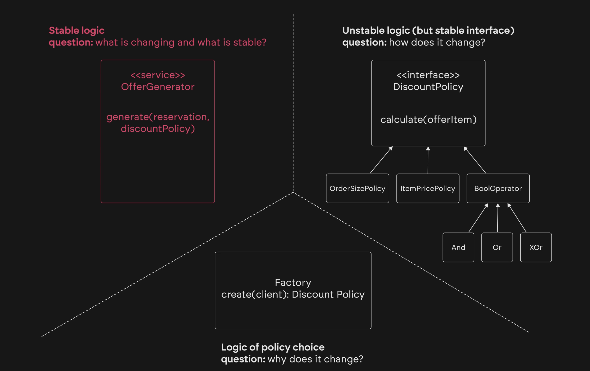

#### Knowladge Level + Operations Level

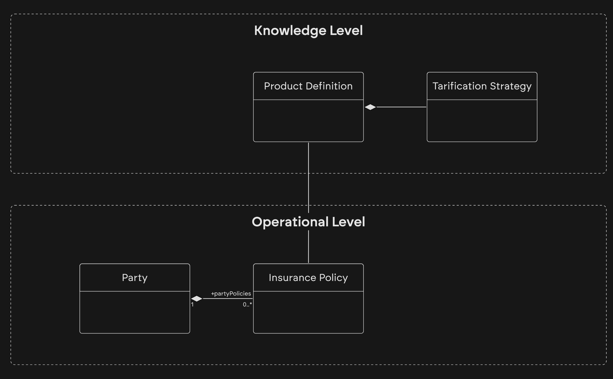

Niektóre problemy warto podzielić na dwie warstwy, operacyjną i wiedzy.

-   Warstwa wiedzy
    -   Jest to grupa obiektów która określa jak inna grupa obiektów powinna się zachowywać
    -   Pozwala rozwijać system bez programowania i łatwiej wprowadzać zmiany
    -   Przykład definicja produktu
    -   definiujemy to co jest możliwe do zdefiniowania
-   Warstwa operacyjna
    -   Przykład instacja produktu

#### Model wieliej skali

Model wielkiej skali to wzorzec w którym dzielmy model na cztery poziomy

-   Capability (poziom zdolności)
    -   to co oferuje nasz system
    -   model może mieć zachowania
    -   Transformaty lub zmiana stanu
-   Operations (poziom operacji)
    -   Jakie operacje wspiera nasz system na bazie potencjalu
    -   Wywołanie metod z poziomu capability z parametrami
    -   Transformaty lub zmiana stanu
    -   Proces zakupu lub reklamacji
-   Policy (poziom polityk)
    -   dostraja poziomi operacji
    -   modelują wariacje operacji biznesowych
    -   Transformaty
    -   Na poziomie techniczym to domknięcia operacji
    -   Różne sposoby liczenia rabatów czy różne sposoby reklamacji

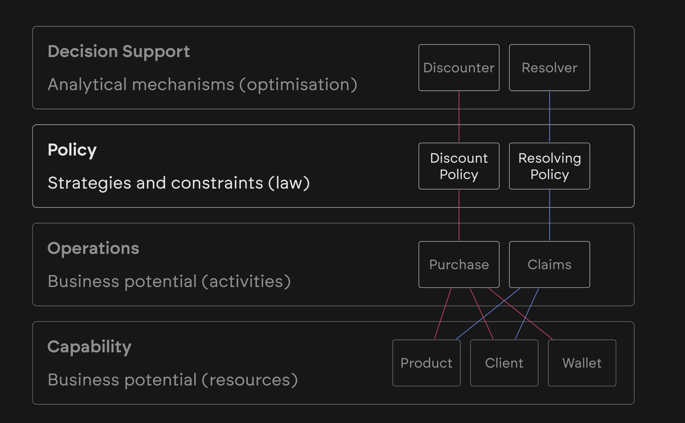

#### Decision Support

Niektóre systemy podejmują decyzje, transformaty które produkują transformaty polityk. Jaki rabat nadać, jak rozpatrzeć reklamację

#### Podsumowanie

Meta modele przemawiają do zespołów które zderzyły się z problemami złożonymi z wielu klas problemów ale go przeoczyły.

Brak nadrzędnej struktury powoduje komplikacje i trudności w dostarczaniu.

Więcej informacji w rozdziale 16 i 17 Evansa

#### Demo

Transformat - dostaje dane i zwraca przetworzone dane

**Jeżeli chcesz skalować unikaj stanu**

## Moduł 08 - Transformaty (Obliczenia)

### Implementacja transformacji/obliczenia - Strategia Testowania, Value Objects i Domain Services

Co ważne mimo że kod jest z dziedzony core wcale nie musi zawierać agregatów

#### Utopijny brak stanu

Idealną sytuacją jest moment kiedy nie mamy stanu i wszystko jest obliczane na podstawie danych wejściowych.

W takiej stuacji możemy bez problemu zrównoleglać obliczenia

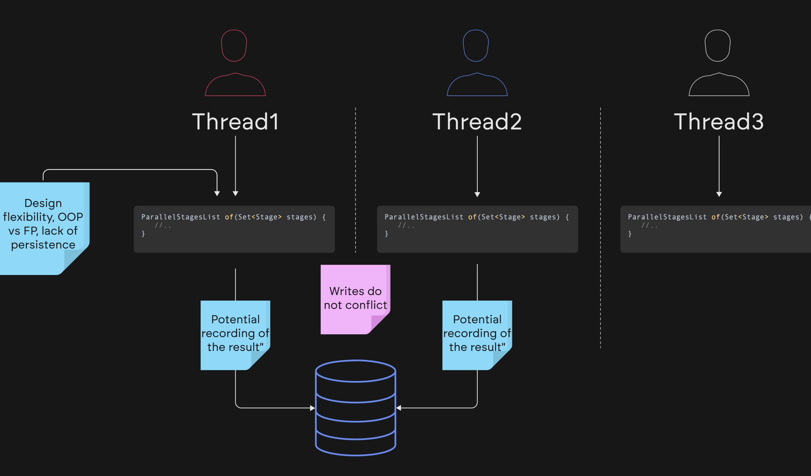

#### Strategia testowania

Taka sytuacja jak wyżej też jest idalna do testowania.

-   Strategie testowania
    -   output based (input-output)
        -   koncentrujemy się tylko na relacji pomiędzy danymi wejściowymi i danymi wyjściowymi
        -   system poddawany takiemu testowi jest traktowany jak czarna skrzynka
        -   zazywaczaj bez mocków i stabów
        -   najstabiliniejsza metoda testowania
            -   test polega tylko na wejściu i wyjściu, nie na wnętrzu systemu

Możemu nie mockować zależności jeśli to też są transformaty, w innym przypadku warto je zmockować bo mają np. side effecty. To zwykle świadczy że zależność jest czymś z klasy problemu integratora i musimy go zamockować.

#### A jednak ten mock...

Możemy mieć wyjątek kiedy transormator to jakieś zewnętrzne API czy coś co nas kosztuje i jest wolne, wtedy warto to zmockować

Pamiętaj,

```
Cel testów: bezpieczeństwo, stabilność, możliwość zmiany algorytmu

Strategia testowania: zazywaczaj output-based (input-output)
```

W przypadku kiedy chcesz ustablizować testy to możesz skorzystać z Assert Object Pattern, czyli zwracasz obiekt który ma metody assercji

#### Elementy konstrukcyjne

**Niemutowalność to cecha obiektów, która zapobiega zmianie ich stanu po utworzeniu, gwaranująć stałość i niezmienność danych w czasie.**

#### Potęga Value Objects

Value objecy czyli obiekty wartości, które modelują konceptujalną całość poprzez powiązanie atrybutów.

Chroni nas to przed prymitywami jako argumentami i częstymi zmianami w kodzie

Mogą też samodzielnie wykonywać trasnformacje na swoich danych

-   Value Objecy są niemutowalne, czyli nie zmieniają swojego stanu
    -   Niemutowalność zachowujemy poprzez zwracanie nowych obiektów ze zmienionymi danymi zamiast zmiany stanu obiektu
-   Pozwalają modelować dodatkowe deskryptywne operacje
-   Pozwalają na wyrażenie intencji dziedziny i przeciwdziedziny transformaty, czyli mamy dwa Value Object, pierwszy reprezentuje dane wejściowe a drugi dane wyjściowe
-   Potrafią same sprawdzić swoją poprawność
-   ułatwiwją zmianę reprezentacji bez ruszania kodu całej transformaty
-   Dwa Value Object są równ jeżeli mają takie same wartości

```
Cel: niemutowalność, zmiana reprezentacji, walidacja, czytelność

Strategia implementacji: obiekty wartości
```

**Przy implementacji konceptu z przestrzeni problemu, załóż że modelujesz Value Object, a potem (ewentualnie) wyprowadź się z błędu**

Idealnie jak Value Object będzie też trasnformatą ale w praktyce to nie zawsze jest możliwe bo może być potrzebne inne Value Object

#### Serwisy domenowe

To są bezstanowe obiekty które pomagają w implementacji które pomagają w wykonaniu operacji która nie pasuje do żadnego z Value Object

```
Cel: testowalność, zamknięcie transformaty za stabilnym interfejsem

Strategia implementacji: na przykład serwisy domenowe
```

To tez może być nazywane czystym fabrykatem czyli coś co nie ma stanu i zwraca obiekt

Jeżeli Twój problem to transformata:

-   zależy nam na niemutowalności -> ValueObject
-   złożone transforaty -> serwisy domenowe

### L02. Implementacja transformacji/obliczenia - Heurystyki doboru paradygmatu

Nie masz często wpływu na paradygmat programowania ale masz wpływ na miejsce i sposób implementacji transformatora

#### Gdzie są dane do obliczeń?

Obliczenia powinniśmy trzymać jak najbliżej źródła danych

Zawężamy stożek możliwości

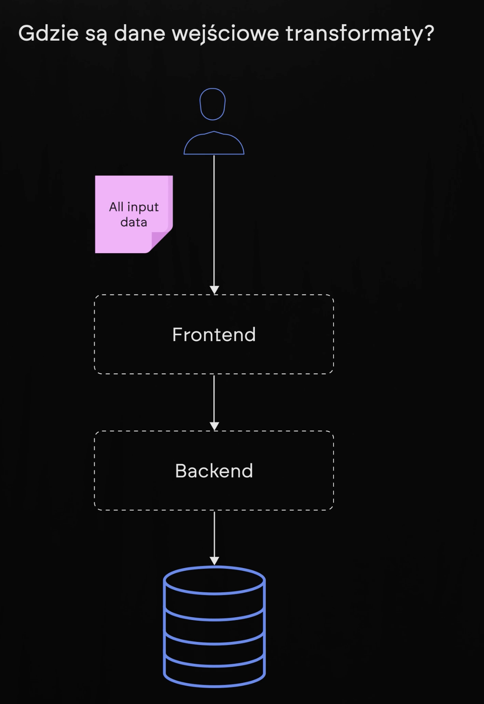

Możemy umieścić transformatę nawet po stronie frontu, jeżeli na to pozwala prywatność i nie boimy się tego że ktoś nie wykona aktualizacji swojego klienta i będzie korzystał z nieaktualnego algorytmu

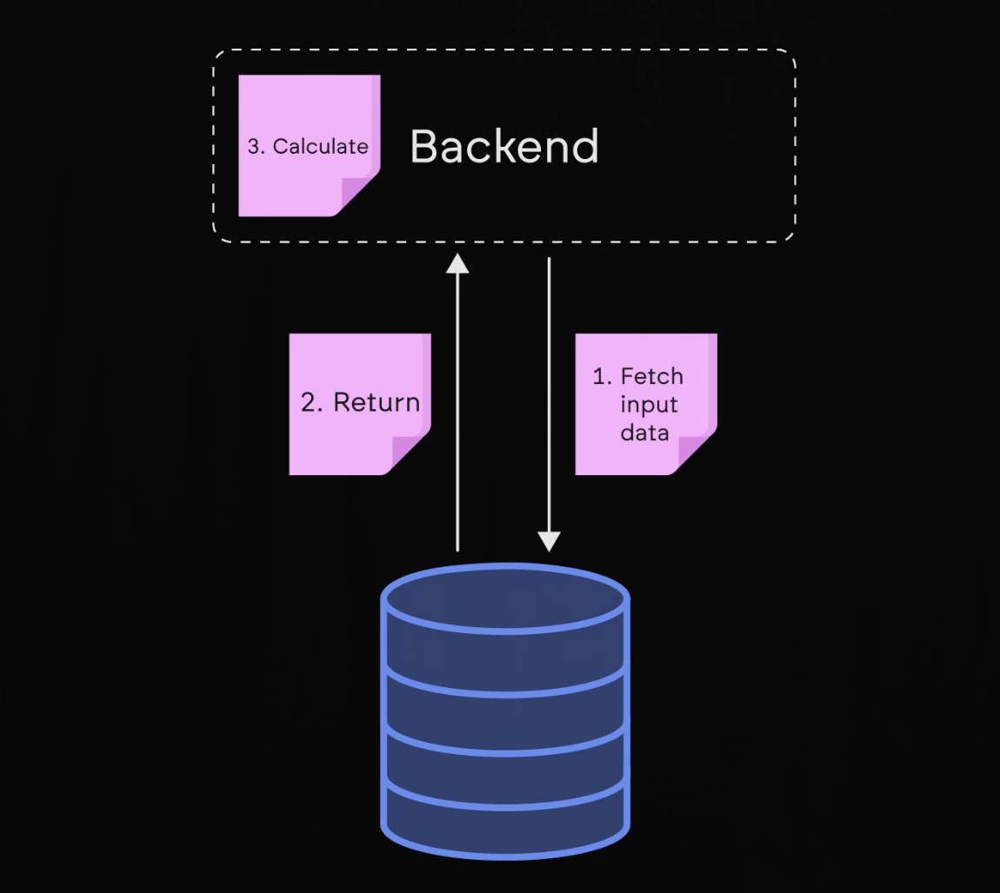

Nawet transforatę można umieścić po stronie bazy danych kiedy jest blisko tych danych

Natomiast po stronie aplikacji jest znacznie łatwiej o testy i pracę z algorytemem

#### Wybór paradygmatu

Zrozum problem i zastanów się czy możesz ten problem łatwiej rozwijązać pisząć kod funkcyjny niż używająć obiektów które świetnie radzą sobie ze stanem ale gorzej z trasnformacją

Jeżeli masz problem grafowy to dobrze jest pomyśleć jaką bazę korzystasz, jeżeli skorzytasz z bazy relacyjnej to może to być bardzo nie wydajne przy skalowaniu problemu

Transformaty to zazwyczaj procedury, tutaj się sprawdza. Natomiast funkcyjny jest bardziej czytelny i łatwiejszy do testowania, natomiast pamiętaj też o umiejętnościach zespołu, mogą woleć obiektowy

**Nie potrzebujesz paradygmatu funkcyjnego, żeby implementować w stylu funkcyjnym**

Mogę myśleć proceduralnie lub funkcyjnie w języku obiektowym

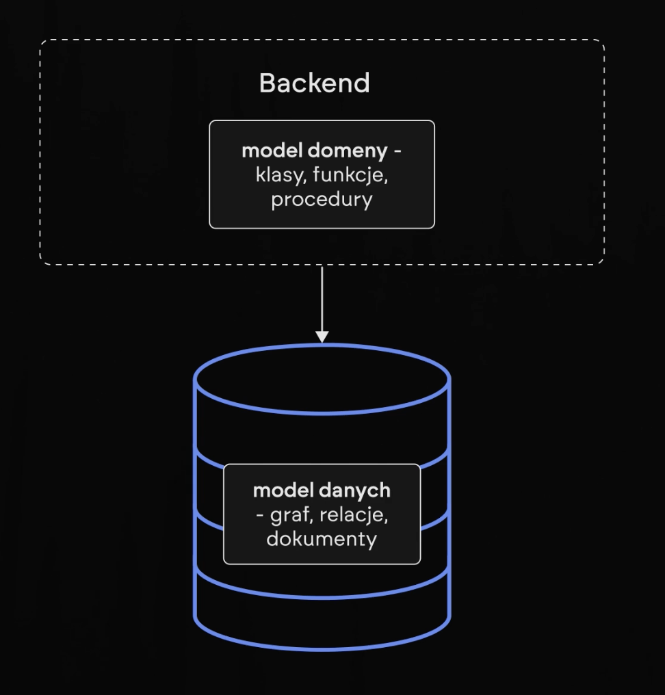

Czy najpierw modelujemy dany czy domenę?

Domena - abstrakcyjna reprezentacja rzeczywistości, obiekty i funkcje w aplikacji
Dane - jak dane są ustruktryzowane i przechowywane

W przypadku transformat nie róbimy obu rzeczy tylko wybieramy gdzie będą transformacje

#### Domain Model

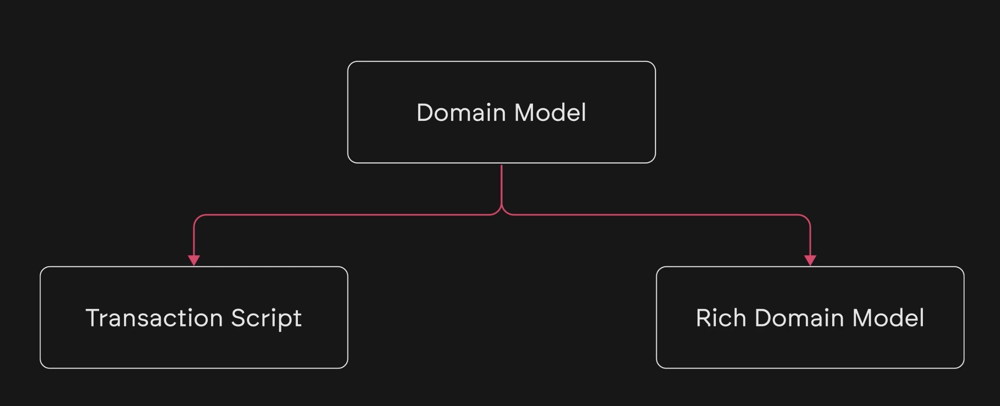

Modelowanie domenowe nie ma znaczenia jakiej jest postaci, ważne aby było dopasowanie do problemu

-   Bogaty Domain Model
-   Anemiczny Domain Model

#### Podsumowanie

-   Zastanów się gdzie jest najwięcej danych do obliczenia
    -   po stronie klienta
    -   po stronie serwera
-   Weź pod uwagę złożoność i zmienność trasformaty

### L03. Transformacje - Dlaczego mieszają się z innymi klasami problemów?

#### Ucieknij od stanu

Problemem jest to że każdy system który robi coś wartościowego zmienia stan.

Rzadko w biznesie znajdziemy odizolowane problemy transformacyjne.

[odizolowanie_problemu](./assets/odizolowanie_problemu.png)

Musisz samodzielnie odizolować problemy z wymagań biznesowych, biznes nie zrobi tego za Ciebie

Wsyzstkie problemy można sprowadzić do klasycznych problemów:

-   transformaty
-   prezentacja danych
-   rywalizacja o zasoby
-   intergracja
-   CRUD

Odizolowywanie problemu pokazuje nam ukryte modele lub konteksty

#### Dlaczego nie widzimy transformat?

-   "lokalność" danych
    -   mamy wszystkie dane w jednym miejscu, zdefiniowne w wymaganiach
    -   wiem jakie ma być wyjście
    -   gorzej nam idzie zauważenie że taka transformata i jej wynik wymaga zebrania danych w jakimś czasie lub pobrane z innych systemów
    -   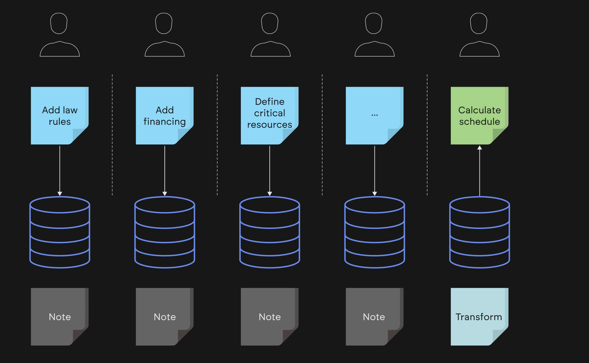
-   "różnica" pomiędzy dziedziną, a przeciwiedzina
    -   np. przy liczeniu RRSO we wejściu mamy liczby i na wyjściu mamy liczbę co nas kieruje autonatycznie do transformaty
    -   gorzej jak daynmi są jakieś reguły a wynikiem np. harmonogram
-   sugestywne wymagania
    -   to jest najczęstszy powód dlaczego przekombinowujemy rozwiązanie

#### Cholerne wymagania

Często biznes mówi po "klingońsku" czyli tebelkami i kolumnami bo liczą że w ten sposób szybciej dostaną rozwiązanie

Istotne aby zawsze pytać o kosnekwencje złamania reguły biznesowej oraz wokół intencji jej modelowania

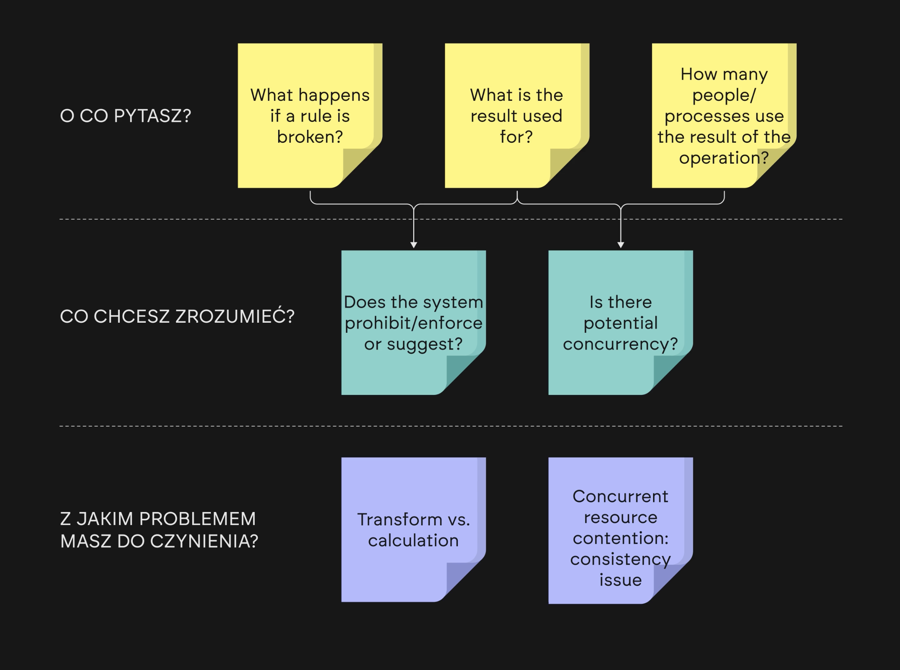

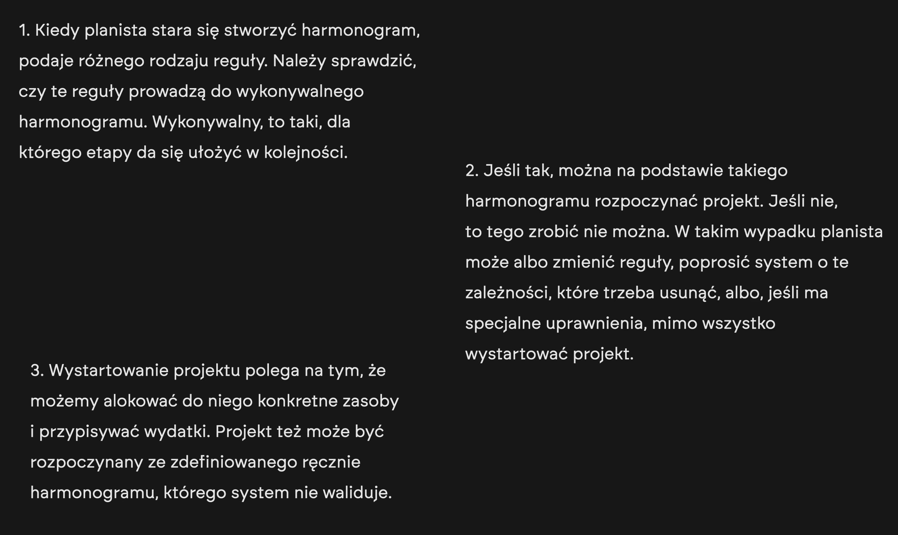

Dobre wymagania rzadko zdarzają się w pierwszej iteracji, ale jeżeli zadasz dobre pytania to w kolejnej iteracji dostaniesz lepsze wymagania

#### Jakimi elementami myślisz?

-   Marian używa encji oraz serwisów
    -   Jest to podejście które działa ale gorzej jeżeli mamy tylko takie podejście
-   Braian używa agregatu
    -   Agregat to dobre podejście ale nie zawsze jest to najlepsze podejście

**Myślenie rozwiązaniem, a nie problemem**

Myślenie poprzez typowe problemu takie jak trasnformata, prezentacja danych, rywalizacja o zasoby, integracja, CRUD

To pozwala nam odwiązywać od siebie rzeczy które mają różne klasy złożoności

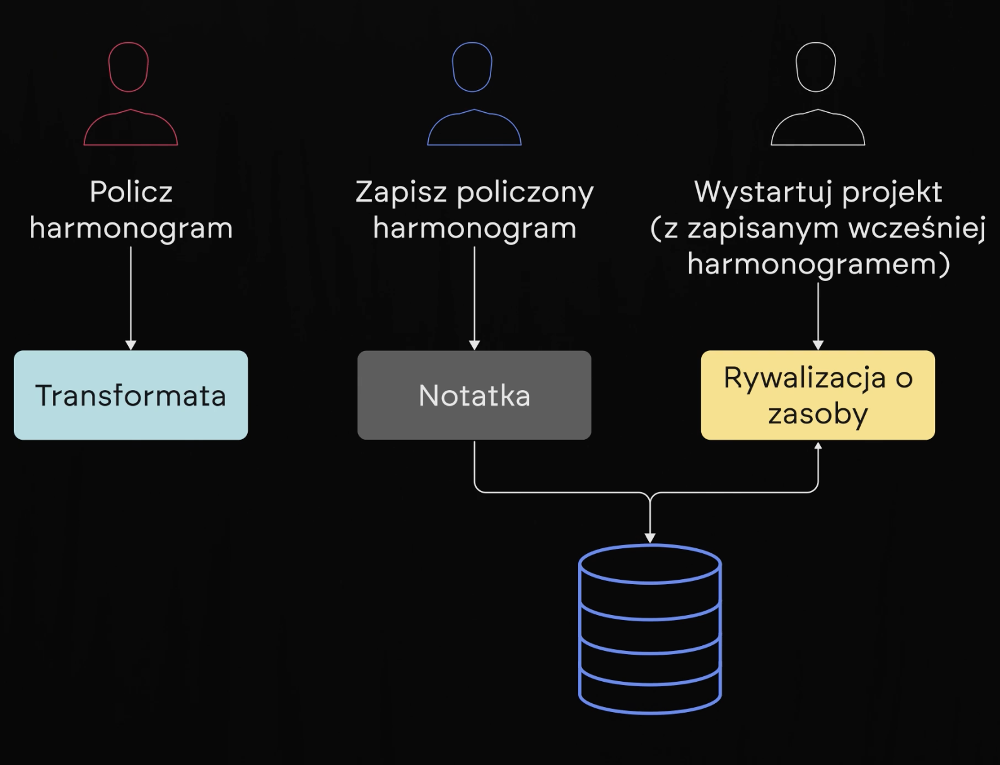

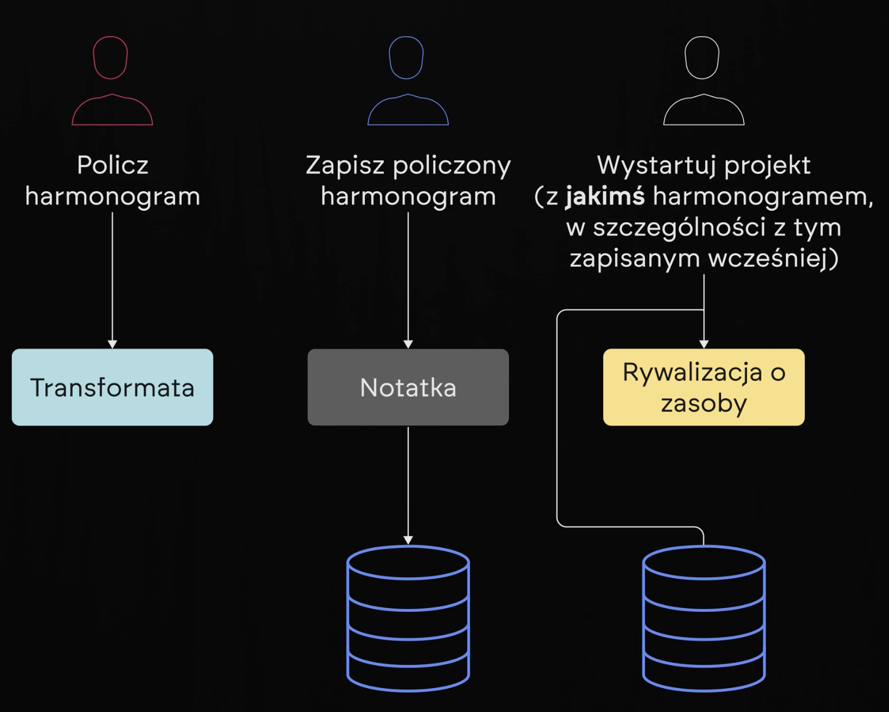

### L04. Model wielkiej skali przy transformatach + podsumowanie

#### Trójpodział logiki w transformatach

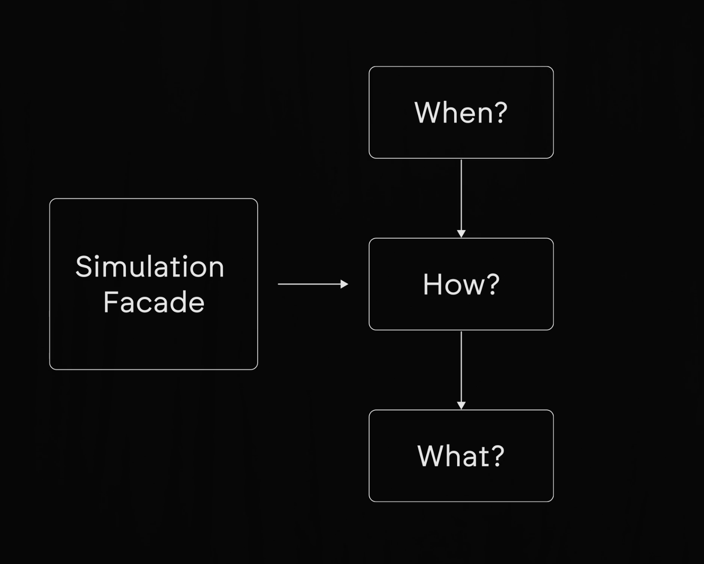

Istotne jest zauważenie co jest stabilne (jest polityką) a co nie jest stabilne

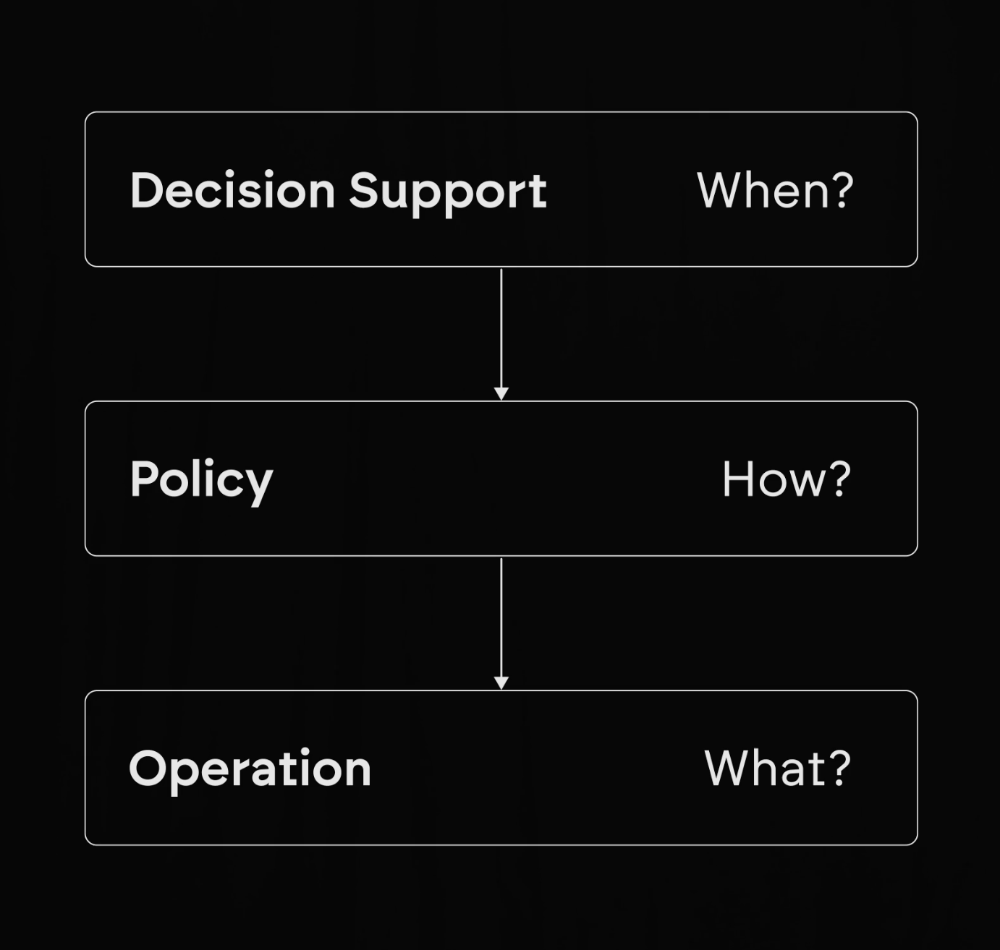

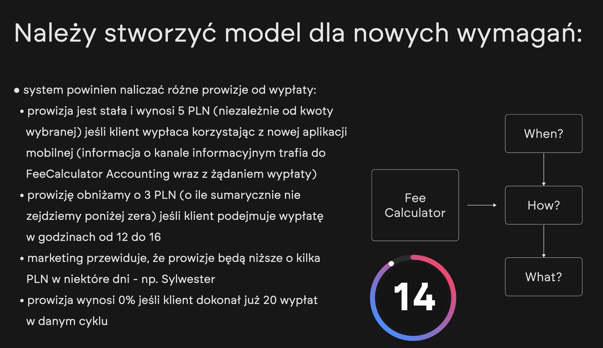

Tutaj mamy stałe polityki:

-   stała opłata
-   obniżka o procent
-   obniżka o kwotę

Wynikiem zawsze jest liczba (opłata)

To kiedt aplikujemy zależy od kanału, czasu, dnia

Mogą się zwieksząć ilości reguł "kiedy" ale polityki są raczej stabilne, dzięki separacyji tych warstw, dzielimy coś co jest stabilny od czegoś co jest niestabilne

#### Podsumowanie

-   Użyteczna metafora
    -   kalkulator, translator. Każdy ma swój kalkukator i jego użycie nie wpływa na stan innych kalkulatorów
-   Użyteczne metryki
    -   złożoność (czas, pamięć)
-   Użyteczne drivery
    -   rozszerzalność
    -   skalowalność (poprzez zrównoleglanie)
    -   testowalność
-   strategia testowania
    -   output-based (input-output)
-   użyteczne elementy konstrukcyjne DDD
    -   value object
    -   polityki
    -   domain services
-   paradygmat
    -   proceduralny
    -   styl funkcyjny
        -   side-effect free functions
        -   niemutowalność

Przykład DDD w kinie: https://github.com/ddd-by-examples/cinema

## Moduł 09 - Rywalizacja o Zasoby (Jednostki spójności - czyli agregaty)

### L01. Czy to jeszcze CRUD czy już rywalizacja o zasoby?

#### Transformaty i CRUD'y są łatwe

Transformata jest wygodna bo nie wspóldziemimy stanu pomiędzy wątkami programu

**Agregat, jednostka spójności, jednostka blokowania to jest to samo**

W przypadku crudów jednie musimy zadbać o to aby zapis i odczyt były spójne

#### Rywalizacja o zasoby jest trudniejsza

Tutaj musimy mieć informacje które zmiany stanu powinny sobie wchodzić w drogą a które nie

Brak dobrej analizy powoduje że dobieramy złą klase problemu do klasy rozwiązania

Chcemy się dowiedzieć czy dane danego if'a mogą się zmienić podczas uruchoamiania tego if'a

Pytania:

-   jaka jest konsekwnencja jednoczesnej zmiany?
-   Czy mamy środowisko many-writers, many-readers? Czy mamy współbieżność?

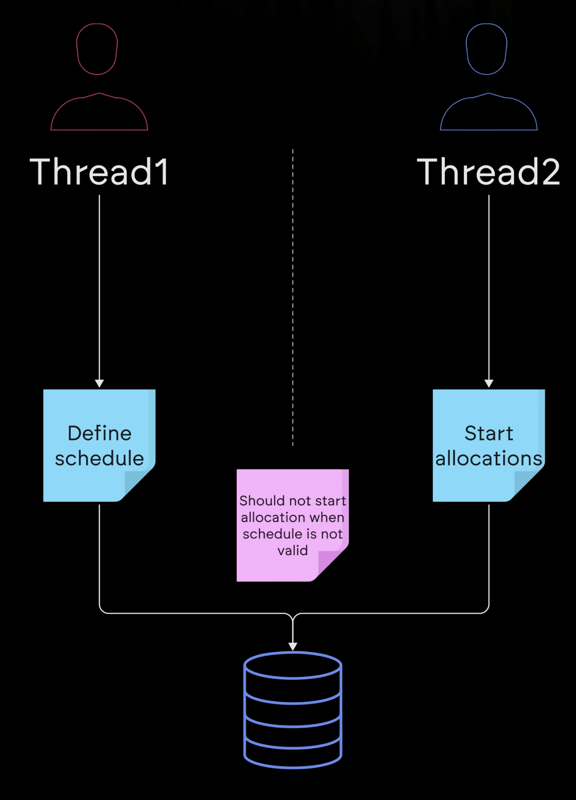

#### Anomalie w bazie danych

Problem rywalizacji o zasoby jest problemem stanowym, to finalnie baza danych jest źródłem finalnym miejscem gdzie mamy aktualny stan danych

Problem lost update niektóre z danych nie zostały zapisane, jakiś zapis został zgubiony.

W przypadku CRUD problem jest mniej ryzykowny.

Typowy problem jest w przypadku kiedy mamy regułę że możemy zmienić dany rekord tylko N razy w ciągu czasu np. dnia. Jeżeli mamy kilka wątkow z tym samego zapytania to może to być problem. Co istotne problem występuje przy wielu użytkownikach, jeśli mamy tylko jeden użytkownik to problem nie ma.

Też może nie być rywalizacji o zasoby, jeśli użtkownicy zmieniają tylko swoje dane, to problemu nie ma.

CRUD czy rywalizacja o zasoby?

-   czy instrukcje warunkowe posiadają dane które w trakcie sprawdzannia reguły mogą zostać zmienione?

#### Jedna tabelka vs wiele tabelek z regułami

Zwykle problem rywalizacji jest spowodowany tym że mamy dany w jednej tabeli.

W budowaniu wydajnych systemów jest ważne aby zablokować tylko to co muszę ale nie więcej.

Write-skew to problem w którym dwie lub więcej transakcje wykonują niezależne modyfikacje w współdzielonych danych, co prowadzi do złego stanu systemu.

Idealnie aby dane które powinny zmieniać się razem aby były w jednej tabeli, tak aby były objęte jednym lockiem (jedna tabelka, jeden lock).

### L02. Dlaczego w agregatach nie chodzi o obiektowość?

Pamiętaj, celem jest wydestylowanie potencjalnie konfliktujących się komend w agregatach. Oraz nie blokowanie tych które do konflitku nie mogę doprowadzić, zachowując system skalowalny.

Możemy to sprawdzić poprzez parowanie każdej komendy z każdą inną i sprawdzenie czy mogą się blokować.

Prosty test modelarza na destylacje jednostki

-   Sprawdź które komendy się ze sobą blokują, a jakie nie.
-   Uwaga! Komenda może się blokować sama ze sobą.
-   Uwaga! Komenda może się blokować same ze sobą w zależności od użytych parametrów
-   Uwaga! Komendy mogą w jedną jednostkę spójności na zasadzie przechodnościo

Bogaty Model (Obiekty z regułami) vs Anemiczny Model (get/set i logiką w serwisach)

-   Anemiczny model
    -   często wykorzystywany bo programiści nie znają innej opcji
    -   Powoduje że mamy kod proceduralny w klasach

Pamiętaj, obiektowe nie znaczy lepsze, to znaczy że mamy obiektowy kod, obiektowe jest lepsze jak problem jest obiektowy, np. kiedy problem musi zarządzać stanem i go enkapsulować w klasach

często używane argumenty do używania obiektowego modelu

-   bo wypada
-   testowalność
-   ponowne użycie (reguły)

Jakie są elementy konstrukcyjne, które tworzą architekturę?

-   encje (tabele) i serwisy (skrypty)
-   obiekty (stan z regułami)

Obiektowość daje nam możliwość ponownego reużycia reguł zapisanych w modelu, nie musimy tego kopiować jeżeli to jest w serwisie

Proceduralnie nie oznacza gorzej niż obiektowość

Kod anemiczny ma sens i działa jeżeli mamy jeden serwis per jedną encję, to zwyklę się dzieje przy CRUD-owych operacjach dlatego tam kod proceduralny jest ok.

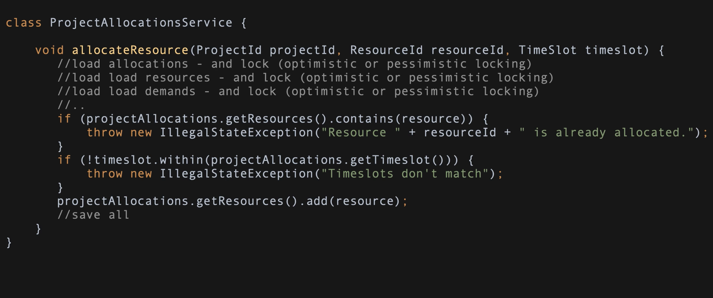

Kod proceduralny utrudnia nam myślenie o jednostce spójności.

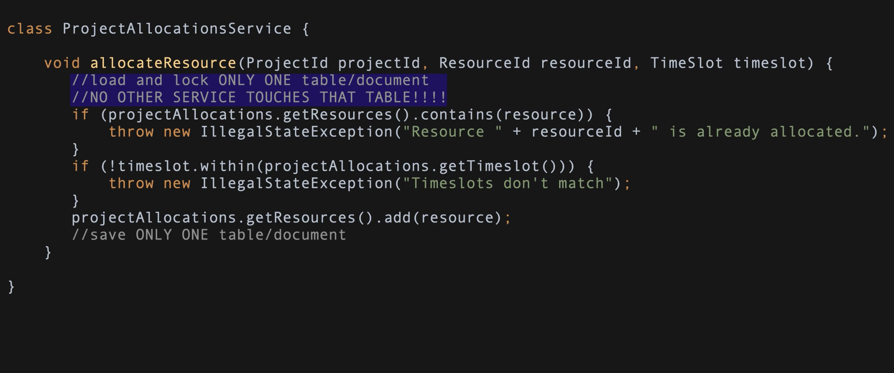

W kodzie procedudalnym możemy to uzyskać jeżeli serwis dotyka tylko swojego stanu i żadnego innego.

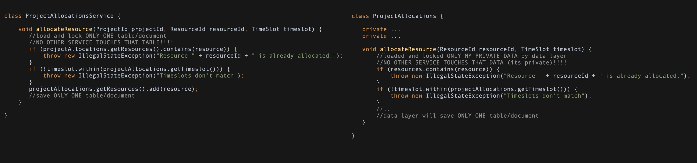

Celem nie jest programowanie obiektowe, celem jest ukrycie stanu i pewność sprawdzania reguł
Celem jest prywatność stanu który będzie blokowany
Celem jest szybki i spójny odczyt danych które będą blokowane

Programowanie obiektowe nie jest warunkiem wystarczającym do dobrej implementacji agregatu.

Technicznie nie jest też warunkiem koniecznym.

Ważniejsz jest decyzja co do jednostki spójności niż decyzja co do implementacji.

#### Styl w kodzie jest drugorzędny

**Dyskusja o obiektowości czy proceduralnym kodzie jest drugorzędna przy złym ksztzałcie agregatu**

Oceń

-   Które komendy mają się blokować, a które nie?
    -   Czasem proces biznesowy wyklucza blokadę
-   Jaka jest częstotoliwość wykonywania komend?
    -   Czy są skoki?
-   ile danych będzie wyciąganych do podjęcia decyzji?

Jednostka spójności jest decydentem, pozwala na coś lub nie

Chcemy mieć kohezje aby wczytać jak najmniej danych przy podjemowaniu decyzji

Kohezja miara jak dobrze grupujemy rzeczy które są zależne od siebie

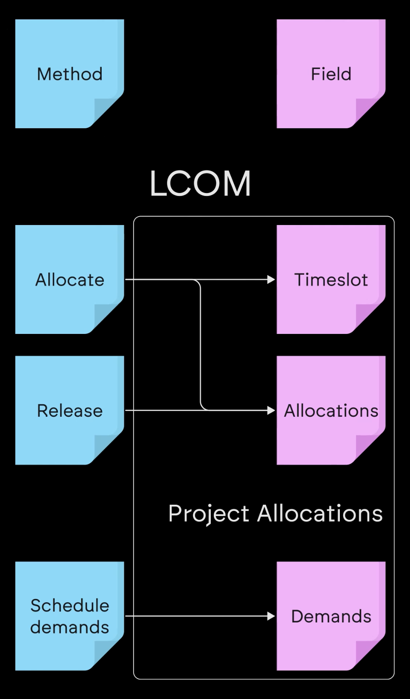

np. jak wiele pól jest używanych przez metody klasy, jeżeli wszystkie pola klasy są wykorzystywane przez wszystkie metody klasy to kohezja to 100% (najlepsze)

Kohezja jest informacją a nie celem samym w sobie, jeżeli kohezja jest mała to raczej nasz system jest niewydajny i niestabilny

Koheezja jest metryką kontekstową. To nie jest dobra metryka do ocen fasad. Ale dobra do oceny jenostek spójności

#### Rozmiar jest ważny

-   Co oznacza że obiekt jest duży?
    -   ilość linii kodu nie jest dobrą metryką, bo jednostka spójności może tyle wymagać aby podjąć decyzję

Natomiast co istotne pytania:

-   Ile danych będzie wyciąganych do podjęcia decyzji?
-   Jaka jest częstotoliwość wykonywania komend?
-   Jak te dane będą blokowane?

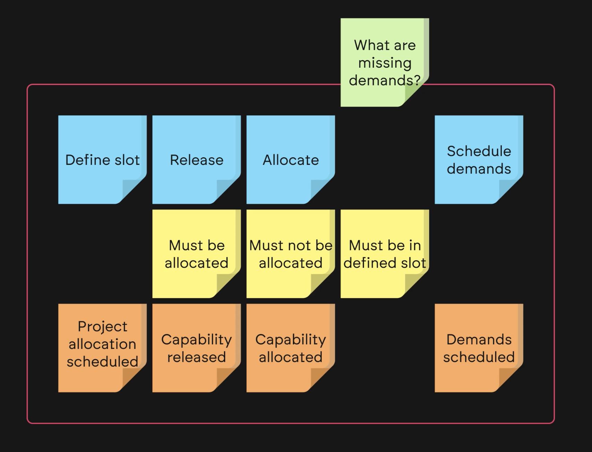

#### Uwaga na skoki komend

Zadaj sobie pytanie czy komendy mogą skakać się w kolejności

#### Słynny agregat

Agregat = graf obiektów z którymi komunikujemy się TYLKO poprzez jego korzeń. Graf obiektów które zawsze muszą być spójne.

Celem stworzenia Agregatu nie jest agregacja obiektów.

Celem agregatu jest agregacja reguł, tak aby:

-   to, co miało być spójne wzajemnie się blokowało
-   a to co nie musi być spójne mogło wykonywać się równolegle

Graf obiektów to konsekwencja a nie cel

### L03. Heurystyki doboru paradygmatu

To że umiem progoramować obiektowow nie pomoże mi jeśli nie umiem zaprojektować agregatu (jednostka spójności)

Jak mogę zaimplementowa√ agregatu?

-   Proceduralnie
    -   Reguły sprawdzone na poziomie serwisów
    -   encje anemiczne (bez zachowań, same torby na dane)
-   Obiektowo
    -   reguły sprawdzane w obiektach
    -   obiekty mają dane jak i zachowania
-   Funkcyjne
    -   niemutowalne funkcje, zwracają nowy obiekt z nowym stanem
    -   typy danych
    -   funkcje z regułami (zwracające nowy stan)
    -   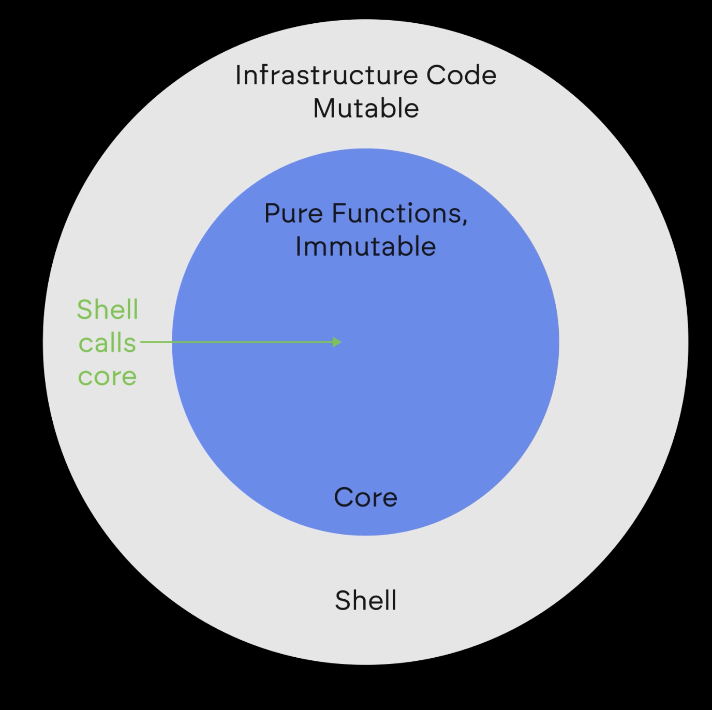

Finalnie najlepiej sprawdza się paradygmat obiektowy bo finalnie od stau nie uciekne a obiektowość świetnie nadaje się do enkapsulacji w agregatach

#### Agregat w bazie danych?

-   zazwyczaj mniej ekspersywny
-   zazwyczaj trudniejszy do testowania
-   zazwyczaj trudniejszy do modyfikowania
-   wydajnieszy

#### Regułą przeniesiona do bazy danych

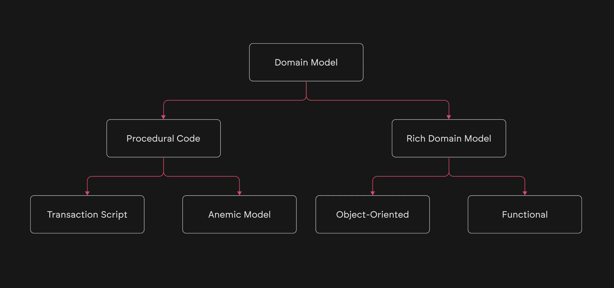

### L04. Rodzaje blokowania i dlaczego 4 zasady projektowania agregatów to w praktyce jedna?

To o co chodzi w tych agregatach?

O to aby zachować zdolność skalowalności z zachowaniem spójności danych.

Celem jest aby stworzyć dużo małych ale nie za małych jednostek spójności,

z jednej strony zbyt surowa jednostka spójności może prowadzić do wolnego systemu który może obsłużyć tylko jedno żądanie na raz, z drugiej strony zbyt mała jednostka spójności może prowadzić do problemów z zachowaniem spójności danych.


Jak mogę obsługiwać blokowanie?

-   Pesymistycznie
    -   nie wpuszczę Cie, jeśli ktoś inny używa zasobu
    -   pesymistcznie to znaczy dlatego że zakładamy że ktoś inny też będzie chciał używać zasobu
    -   najczęściej poczekasz w kolejce aż zasób się zwolni
    -   dobry wybór jeżeli zakładamy duże obciążenie systemu
-   Optymistczne
    -   wpuszczę Cie, nawet jeśli ktoś inny używa zasobu
    -   ale przy "wyjściu" sprawdzę czy byłeś prze zasobie sam
    -   dobry wybór, jeśli nie podejrzewamy dużego obciążenia systemu
    -   Musimy się luczyć z kosztem błędu lub ponowienia operacji
    -   Technicznie najczęściej obsługuje się to przez wersjonowanie danych, czyli zapamiętuje z jaką wersja danych operowaliśmy i jeżeli ktoś inny zmienił dane to nie zapisujemy zmian
        -   Cześć baz danych automatycznie obsługuje wersjonowanie danych
-   Kompensująca
    -   pozwalamy na konflikty i niespójność danych
    -   poprawiamy je później
    -   Jest to technika reakcji na nie spójność a nie blokowania

#### Modele transakcyjności

Dobieramy modele transakcyjności:

-   małe ryzyko - optimistyczne
-   duże ryzyko - pesymistyczne
-   szczególne wymania duzej dostępnośći w rozpoznawaniu konfliktów - kompensująca

Z transakcji biznesowej wynika transakcja techniczna

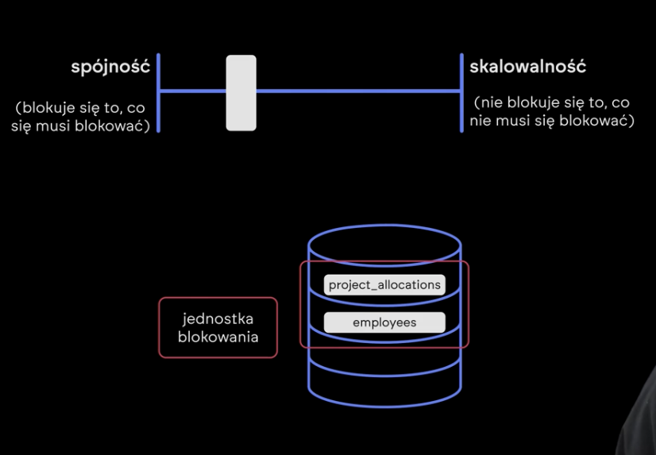

spójność natychmiastowa

-   mniejsza skalowalność
-   brak okna desynchronizacji
-   łatwiejsza w implementacji

[spojnosc_koncowa](./assets/spojnosc_koncowa.png)

spójność końcowa

-   większa skalonowalność
-   istnieje okno desynchronizacji
-   trudniejsza w implementacji

#### Obiekt vs Tabela

Granice obiektów (które często odpowiadają granicom tabel/dokumentów) nie muszą równąć się granicy blokowania

#### Kiedy mogę łamać zasady?

Cztery dobre zasady projektowania agregatów

-   modeluj prawdzwine niezmienniki w granicach spójności
    -   if'y które muszą być sprawdzone natychmiastowo
    -   jeżeli masz w swoim agregacie masz dane których nie potrzebujesz do podejmowania decyzji to nie potrzebnie poszerzasz agregat
    -   **blokuj tylko to co muszisz i nic więcej**
-   projektuj małe agregaty
    -   aby jednostka blokowania jest mała
-   w agregacie odwołuj się do innych agregatów tylko poprzez referencje
-   stosuj spójność końcową poza granicami agregatu

**Kiedy mogę złamać zasadę?**

**Kiedy wiem, z czego wynika.**

Podstawowa zasada projektowania agregatów:

**Nie poszerzaj jednostki blokowania agregatu, jeśli nie musisz.**

### L05. Persystencja agregatów

W idealnym świecie chce wczytać dane z jednego miejsca i zapisać w jednym miejscu jak najszybciej to możliwe.

Persystencja jednostek spójności

-   relacyjnie: jedna tabelka vs kilka tabel

Jeżeli masz powiązane kolekcje w agregacie to zastanów się:

**Czy na pewno jednostka spójności powinna mieć kolekcje zależną? Jaka reguła jest rozpięta na całej kolekcji obiektów?**

Jeżeli Twój ORM wykonuje lazyloading to może to spowodwać problemy ze spójnością danych, ponieważ dane będą pobierane w różnym czasie. Może to mieć poważne konsekwencje jeżeli potem tymi danymi coś przeliczasz itp.

ORM i jednostki spójności

-   pułapka lazy loading
-   write skew
    -   kiedy odczytujesz w dwóch wątkach i zapisujesz w jednym

ORM i jego zalety

-   optimisic locking
-   dirty checking
-   mapowanie typów prostych

Jeśli ORM przeszkadza: szukaj przyczyny w design obiekcie a nie narzędziu

Pamiętaj że możesz skorzystać z Eager loading, czyli wczytanie wszystkich danych razem z głównym obiektem

ORM zabrudza kod biznesowy

ORM przeszkadza, jeśli jego użycie zmusa Ciebie do pozbycia się **kluczowych cech designu** Twojego projektu.

#### Co z innymi typami baz danych?

Dokument jest idalnym miejscem do persystencji agregatu

Użycie event sorcingu - w postaci przyrostowego zapisu zdarzeń jako jedyne źródło prawdy

-   audytowalność
-   analityka - szukanie patternów w zdarzeniach
-   debugowanie - podróż w czasie
-   natomiast więcej danych do wcztytania
    -   tutaj rozwiązaniem jest snapshot
    -   prób wejścia

Są głosy że event sourcing powinnien być domyślnym sposobem persystencji agregatów

#### Co jest pierwsze? Model danych czy model domeny?

-   Często działająca procedura:
    -   znajdź komendy i reguły, które muszą być sprawdzane atomowo
    -   określ dane obiektu
    -   określ dane w bazie
-   Musisz pamiętać o wydajnej persystencji
    -   o tym jak i ile blojuję danych w bazie
    -   oraz ile danych z nazy wczytuję

**Doświadczony modelarz birze obie prespektywy niemal równocześnie pod uwagę**

### L06. Strategia testowania, Application Services, Domain Services, Policies i inne

-   Serwis Aplikacyjny w DDD
    -   koordynuje proces biznesowy
    -   komunikuje się ze światem zewnętrznym
    -   zakłąda transakcje
    -   sprawdza bezpieczeństwo
    -   loguje
    -   wysyła zdarzenia
    -   odświeża widok

Jest to po prostu prosty przykład użycia często używany z agregatami

#### Serwisy aplikacyjne vs domenowe

Pamiętaj że istotnym pytaniem jest co chcesz osiągnąć wyciągajać jakikolwiek serwis

##### Serwis domenowy

Cel: enkapsulacja, testowalność, zamknięcie potwrzającej się operacji za interfejsem

Jest bezstanowy, logika tego serwisu nie pasuje do żadnego z agregatów

wejściem serwisu są obiekty domenowe oraz tak samo na wyjściu są obiekty domenowe

**Tutaj istotne wychodząc od celu a nie wzroca, omoijamy jałowe dyskusje o tym jak wyglądać w kodzie**

Czym się rózni serwis domenowy od serwisu aplikacyjnego?

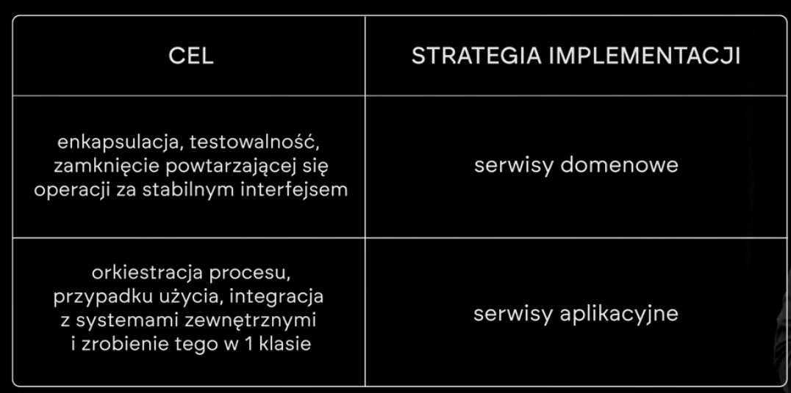

**Elementy konstrukcyjne są środkiem do celu, a nie celem\*\***

zawsze pytaj o cel, sens danej konstrukcji

#### Encje

-   encja mają swoją tożsamość
-   porównywalne poprzez identyfikator
-   zmieniaja się w czasie
-   np. korzeń jednej spójności

#### Immutability

**Załóż, że da się zbudować  agregat z samych value objectów**

#### Tetsowanie

-   output-based
-   indirect state-based

    -   testujesz stan wewnetrzny agregatu

-   Jak publikować zdarzenia?
    -   ze środka agregatu?
    -   zwracać jako paramter zwrotny i publikować poprzez serwis?

Nie ma to znaczenia, jeśli zachowujesz transakcyjność za pomocą wzroca outbox-pattern i zapewniasz że zdarzenia są konsumowane po zakończonej z sukcesem transakcji w agregatach

#### Łaczenie z innymi klasami problemów

wrzorzec specyfikacji, pozwala na sprawdzenie czy agregat jest w stanie obsłużyć żądanie

### L07. Podsumowanie podstaw i zadania praktyczne

-   użyteczna metafora
    -   Technika zarządzania dostępem do ograniczonych zasobów w systemie
        -   kontrolerem jest semafor czy strażnik
-   Użyteczne metryki
    -   kohezja - czyli jak silnie związane są ze sobą obiekty
    -   ilość wczytywanych danych do podjęcia decyzji
    -   liczba wzajemnie blokujących się komend
-   Użyteczne drivery
    -   spójność
    -   skalowalność
-   Strategie testowania
    -   output-based
    -   indirect state-based
        -   testujesz stan wewnetrzny agregatu
-   Użyteczne elementy z DDD
    -   Agregaty
        -   zbudowane z encji i value objectów
        -   dostrajane politykami
        -   emitujące zdarzenia
        -   łączone za pomocą serwisów domenowych
        -   orkiestrowane przez serwisy aplikacyjne
-   paradygmat
    -   obiektowy

#### Zadanie

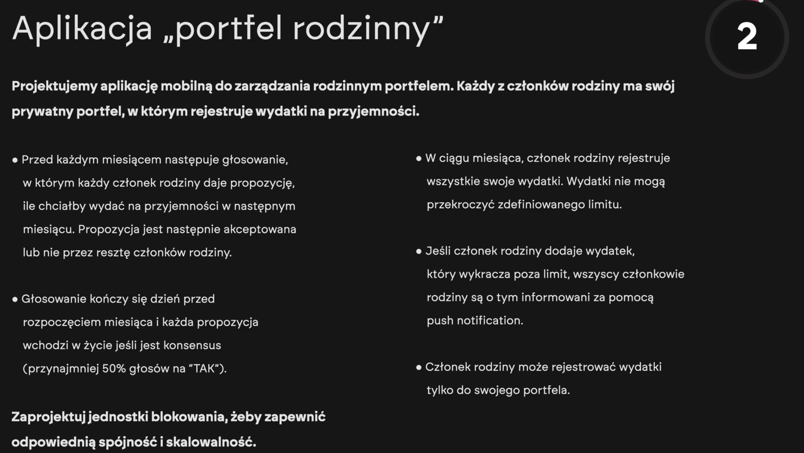

Zawsze na poczatku zadaj pytanie: Gdzie jest tutaj współbieżność danych?

Brak współbieżności danych nie oznacza że nie mogę korzystać z czegoś co przypominają agregaty.

Na przykład czegos co wygląda jak graf obiektów, z którym rozmawiam przez korzeń który podejmuje decyzję.

Tutaj agregatem jest miejsce gdzie uczestnicy głosują bo jest ryzyko że ktoś jednocześnie zagłosuje z dwóch urządzeń jednocześnie.

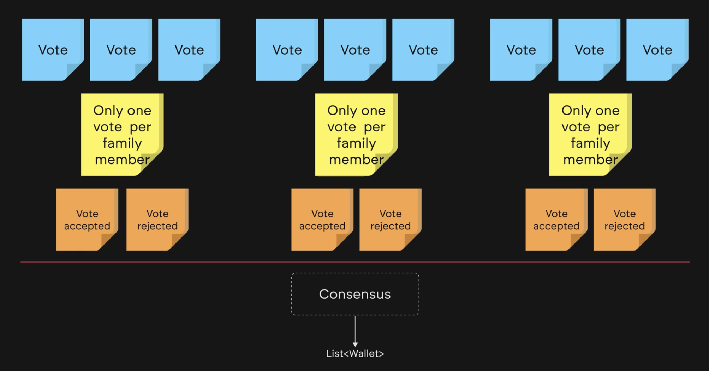

**Nie szukaj agregatów tylko dlatego że w systemie mamy jakieś reguły**

**ALE TO NIE OZNACZA ŻE NIE MOGĘ STWORZYĆ KLASY PORTFEL KTÓRA TROCHE WYGLADA JAK AGREGAT**

Zwracaj uwagę na współbieżność, **zwracaj uwagę kto faktycznie podejmuje decyzję**

#### Zadanie 2

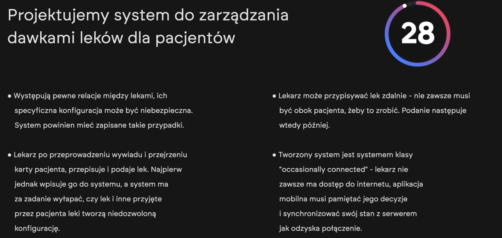

### Zaawansowane agregaty dynamiczne: Kiedy obiektowe agregaty nie wystarczają

Przypomnienie:

-   Oceń które komenty mogą się blokować, a które nie
    -   Pamiętaj że czasem proces biznesowy wyklucza blokadę
-   Jaka jest częstotliwość komend? czy są Skoki?

#### Odchudzanie agregatu

-   Agregat czasowy
    -   Czy w biznesie jest naturalna granulacja czasu?
    -   Bez zbadania wszystkich przypadków to niekoniecznie jest najlepsza rada

Agregat czasowy może prowadzić do tego że będziesz miał wiele bardzo małych obiektów których będzie ogromnie dużo, dlatego nie jest najlepszym pomysłem i komentowanie agregatu czasowego jeżeli nie jest pewien czy to jest potrzebne

#### Agregat dynamiczny

Dla wielu małych agregatów, Wyjmowanie ich z bazy będzie niewydajne

Logikę ich blokowania powinno się przenieść na bazę danych

-   Dla wielu małych agregatów, Wyjmowanie ich z bazy będzie niewydajne

-   Agregat dynamiczny
    -   Niego kształt zależy od żądania
    -   Nie da się go przewidzieć wcześniej

**Wyciąganie jak najmniejszej ilości danych, oraz unikanie blokad to jest sposób na skalowanie naszego systemu**

#### Agregaty w bazie danych

Ile przesyłamy danych żeby podjąć decyzję?

-   w skrajnych przypadkach wykorzystaj bazę danych

#### Agregaty adaptacyjne

### L09. Zaawansowana walka o zasoby: Agregaty procesowe

Bieganie z karteczkami nie rozwiązuje problemów modelarskich co najwyżej je wypukla

Jak modelować dwa agregaty z powiązanymi regułami?

-   Połączyć w jeden
    -   Będzie problem ze skalowalnością
    -   Będzie problem z nazewnictwem

Jeżeli nie wykonamy strategicznej analizy to mamy ryzyko, że regułę będzie sprawdzał zły model

-   Separuj i używaj spójności końcowej

pytania pomocnicze przy łączeniu agregatów

-   Jaka jest konsekwencja rozspójnienia?
    -   Jak szybko musi nastąpić akcja kompensującą?
    -   Jakie są konsekwencje dla firmy roz rozspójnienia?
-   Czy jest możliwość rozspójnienia z powodów "pozasystemowych"?
    -   Np. pracownik został zwolniony, awaria Koparki
-   Czy jest przypadek życia gdzie używamy jednego agregatu bez drugiego?

#### Agregat procesowy

Łączy kilka agregatów transakcją na potrzeby spójności procesu biznesowego

Można to nazwać dynamiczną granicą kontekstu

#### Po 4 Nie zmieniaj dwóch agregatów transakcji

Jeżeli prawie w każdym procesie musisz zmieniać jeden i drugi agregat to prawdopodobnie masz złe granicę kontekstów

#### A co nam to mówi o jednostkach wdrożeniowych?

Jeżeli jakieś agregaty zmienia się często razem to Trzymajmy je w jednej jednostce wdrożeniowej

#### Kolejność odpytywania

To zależy:

-   Który agregat prawdopodobnie odpowie negatywnie na reguły
    -   fail fast
-   zbadaj koszt, najdroższe na sam koniec

## Moduł 10 - Logika prezentacyjna i integracyjna

#### Betonowanie modelu

#### Read model

Techniczne jest to łatwy temat

#### Heurystyka głównych pytań

-   Typy pytań
    -   lokalność danych (spójne)
        -   gdzie są dane? skad je pobrać?
    -   lokalność reguł
        -   w jednym miejscu reguły który opowiadają na pytanie
    -   kwerendy użytkownika
        -   jakie zadaje pytanie użytkownik
    -   "dziwne" anomalie
        -   dziwne pytania biznesowe które mogą być zawiłe

#### Pułapka modelowania - GUI Driven

Częstym problemem modelowania jest potraktowanie modelu do odczytu jako modelu dziedzinowego

Taki model do odczytu odczytują dane z różnych kontekstów.

#### Pułapka modelownia - dokument Driven

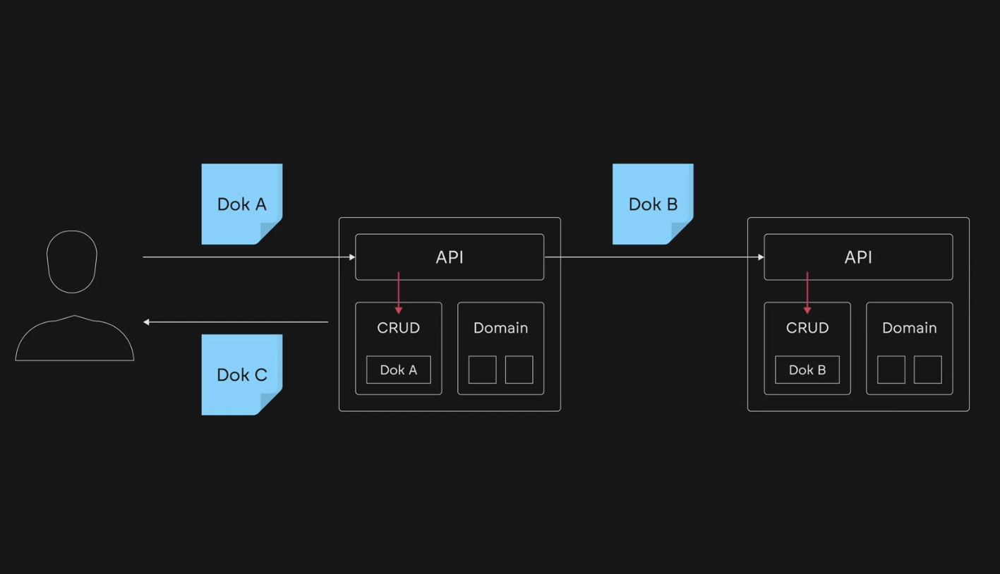

Możemy zrobić API CRUD ale idealnie aby pod spodem były logika domenowa która jest ukryta. Może tylko wspóldzielić ID w postaci Correlation ID

#### Irrelewancja

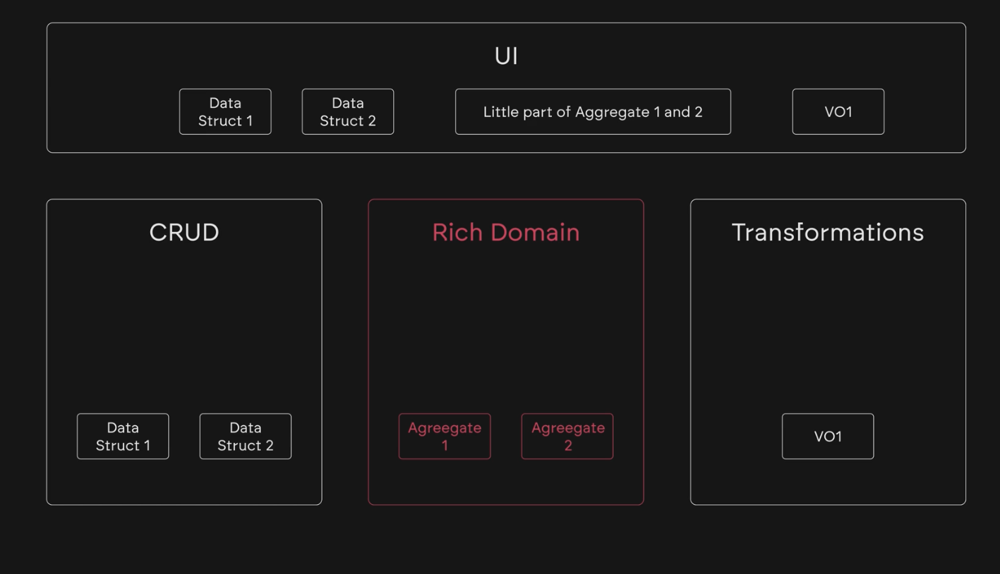

CRUD - typowy crud
Rich Domain - Tutaj mamy skomplikowaną logikę biznesową
Transformations - Tutaj tlumaczymy modele do DTO

Model dziedzinowy jest irrelewantny do prezentacji

DTO - nie mają zachowań

#### To, co jest dobre do wszystkiego, jest dobre do niczego

Raporty często wymagają paradygmatu relacyjnego,

a dla obiektów naturalnym sposobem zapisu jest dokumentowy

### CqRS

#### CqRS na ratunek

to jest przeniesienie CQS na język obiektowy.

-   Oddzielamy od siebie kwerendy i komendy na poziomie API ale też na poziomie modelu
-   Komendy nie muszą być oparte o Command-Handler mogą to być service. Chodzi tutaj o sematykę.
    -   Chodzi tutaj o intencje zmiany!
    -   Komenda może zwracać wynik wykonania (np. bład) ale NIE ZWRACA NOWEGO STANU SYSTEMU
-   Stan systemu możemy poznać tylko poprzez kwerendy, poprzez kwerende mamy na myśli odpytanie API a nie wykonanie bezpośrednio zapytania na bazie danych.
-   Kwerendy zwracają dane które nie są odwzorowaniem 1-1 modelu dziedzinowego, ze względu na ich irrelewancje
-   Kwerendy mogą być wykonywane przez serwisy które zwracają DTO czy json'a
-   Kwerendy raczej są wykonywane synchronicznie

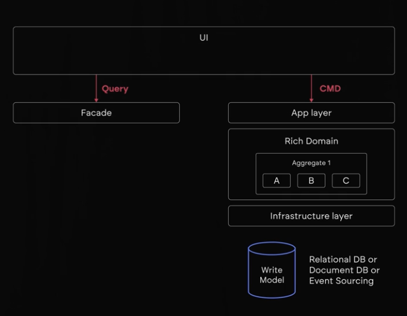;

#### CqRS - podejście 1: Kwerenda do źródła prawdy

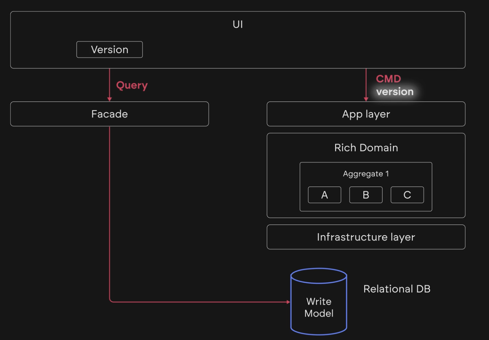

Najprostsza impelementacja to uderzenie do źródła prawdy i pobranie tych danych które są potrzebne dla widoku

Jest to problematyczne bo jak się zmieni coś w modelu dziedzinowym (ale też w bazie) to nam się rozsypią te zapytania.

Jest to raczej podejście początkowe, ale nie do utrzymania w dłuższej perspektywie.

#### Udokumentuj swoją decyzje w ADR'ach

-   Dlaczego podjęto taką decyzje?
-   Jaki był wówczas ruch w systemie?
-   Jakie były załozenia co do SLA?
-   Jakie są możlwe kolejne kroki ewolucji architektury?

#### Uwaga na sekcję krytyczną

Krytyczna sekcją jest "write-model" czyli nasze agregaty itp.

#### Świeżość danych

Często świeżość danych jest kusząca aby odpytywać bezpośrednio źródło wiedzy.

Dane już nie są świeże jak opuszczą transakcje z write-modelu.

#### CqRS - podejście 2: Widoki bazodanowe

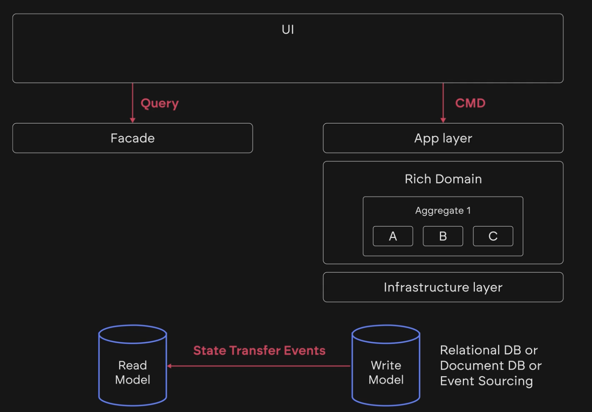

W przypadku problemów z wydajnościa mozemy przejść na inny poziom rozwiązania.

Stworzenie osobnego Read Modelu z Write Model. Możesz meć kilka modeli, np. spłaszczenie jakiś danych.

Może być inna reprezentacja np. graf

NoSql dobieraj pod rodzaj odczytu.

Pozwala to zastosować Event sorcing jako źródło danych które nie daje się do zastosowania do odczytu.

#### Spójność danych

-   Poziomy spójności
    -   zapytanie do źródła danych - spójność natychmiastowa
    -   widoki bazodanowe - spójność zależy od rodzaju widoku
    -   osobny read model - evenual consistency (uwaga na monotinic read, każdy nowy read model może reprezentować inny stan z poziomu opóźnień, tutaj rozwiazaniem jest przwiązanie sesji użytkownika do konkretnej instancji read-model)

Read Your Own Writes - problem polega na tym że klient nie widzi zmian po wykonaniu komendy (opóźnienie w generowaniu ReadModel)

#### Odświeżanie read modeli

Możemy też odswieżać modele poprzez zdarzenia np. dokonanie jakieś zmiany na rekordzie itp.

#### Wygaszanie cache

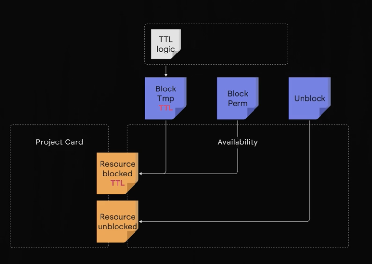

Jeżeli mamy zdarzenia którę mogą się kiedyś skończyć np. zblokowano zasób to najlepszym sposobem jest dodanie TTL do zdarzenia tak aby sugerowało kiedy ma wygasnąć.

#### Single source of truth

-   Musi istnieć jedno źródło prawdy odnośnie każdego ważnego pytania biznesowego
    -   mogą isnieć cache ze względów wydajnościowych
-   wszelkie zmiany stanu (komenda) wpyłwające na odpowiedź na to pytanie muszą najpierw przejść przez to miejsce

#### Zalety read modelu

-   wydajność
-   uwolnienie modeli dziedzinowych od kwerend, umożliwiając swobodny refaktoring domeny
-   niski koszt utrzymania

### L03. Przykłady

#### Read model jako zewnętrzny index

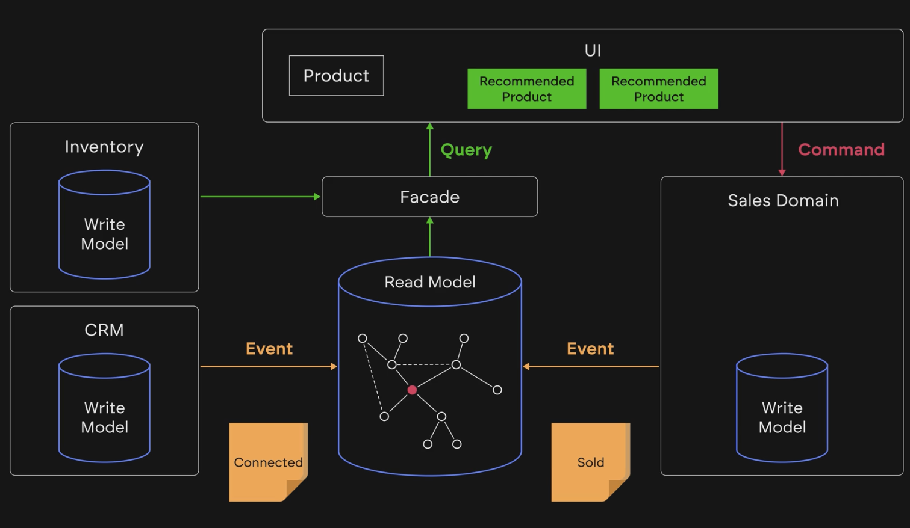

przykład gdzie budujemy graf na podstawie zdarzeń z CRM'a i jest używany jako szybki read model który umożliwia trzymanie tego w optymalny sposób np. graf

**Read model nie musi sie opierać o dane z jendnej domeny**

### Read Model - Podsumowanie

-   użyteczne drivery
    -   skalowalność
    -   tolerancja na partycjonowanie
        -   możesz szybko tworzyć kolejne modele które są dostosowane pod szybki dostęp do danych (optymalizacja pod dane)
-   użyteczne metryki
    -   częstotliwość zmian read modelu względem ilości odczytów
-   strategia testowania
    -   indirect state-based

źródło prawdy: write model i to jest jedyne prawdziwe źródło wiedzy.

**Read model możesz zawsze usunąc i odtworzyć na podstawie write modelu**

#### Przykład

### L05. Saga i Process Manager ze Stanem - Part 1

zajmowanie się klasą problemu integracyjnego

To, że znasz taktyczne DDD nie znaczy że w każdym sytemie znajdziesz agregat

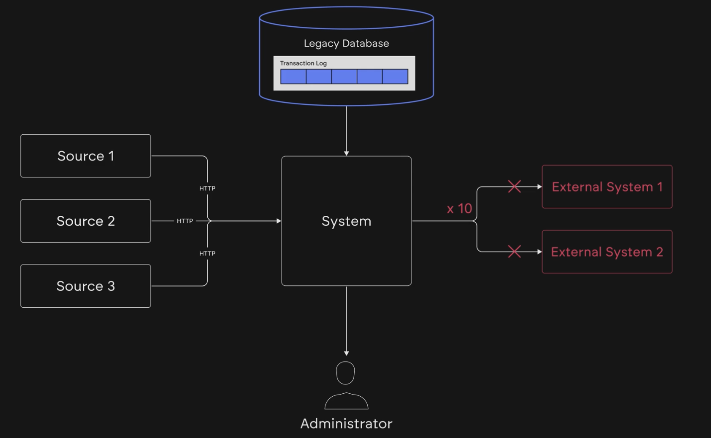

sporo logiki nie oznacza potrzeby agregatu, ponieważ musisz zadać sobie pytanie gdzie tutaj jest miejsce na rywalizacje o zasoby

"Po otrzymaniu informacji o wypłacie, należy poinformować biuro informacji kredytowej" -> **to jest problem integracyjny (procesowy), nie potrzeba tutaj agregatu**

Aby tutaj był potrzebny agregat to musimy mieć wymaganie rywalizacji o jakeieś dane objęte jakaś regułą, np. "Możemy komunikować się z API biura informacji kredytowej tylko 10 razy na godzinę"

Problem integracyjny prawie zawsze występuje, najprostszym przykładem jest obsługa bazy danych, czyli odczyt, modyfikacja i zapis.

#### Procesy przecinające różne moduły

Z jaką klasą problemu masz do czynienia?

-   integracja - gdy wywołujemy kolejne komponenty systemu
-   transformacja - gdy liczymy, co i jak, nalezy zawołać w następnym kroku

Nie realnym jest oczekiwanie że stworzonych autonomicznych modeli nie będziemy musieli integrować

### Saga i Process Manager ze Stanem - Part 2

#### Choreografia vs orkiestracja

Choreografia - kiedy nie ma jednej odpowiedzialności, temat wygląda kusząco ale ma konsekwnecje w tym że jakakolwiek zmiana w procesie angażuje wszystkie zespoły (różne konteksty). Szczególnie trudnym przypadkiem może być zmiana kolejności.

Prowadzi do tzw. zdarzeń opresyjnych czyli takie które ma tylko jednego słuchacza i zostało rzucone tylko po to aby pchać dalej proces. To tworzy pytanie dlaczego mam rzucać takie zdarzenie i udawać że zupełnie nie jesteśmy zainteresowani dalszym przeprocesowaniem tego zdarzenia..

Dodatkowo jak monitorować taki proces? Trzeba go śledzić po wszystkich serwisach, np. przypadek kiedy proces się zatrzyma to trzeba teraz śledzić każde miejsce.

Dodatkowy skrajny przypadek kiedy jednym zdarzeniem interesuje się kilka komponentów i teraz mamy problem z kolejnością przetwarzania tych informacji.

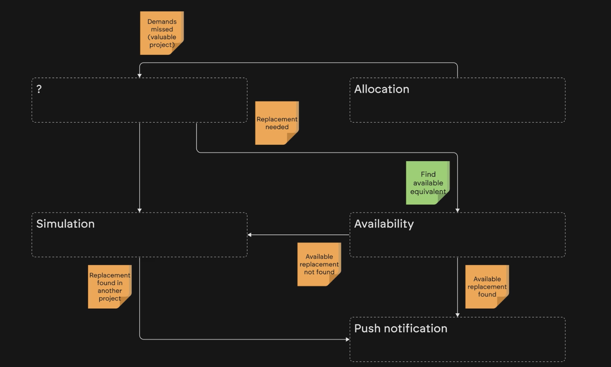

definicja

Choreografia - sposób integracji komponentów, które działają niezależnie, ale współpracują, reagujac na zdarzenia generowane przez siebie nawzajem.

Nie jest to problem z samą architekturą ale z tym że jest źle stosowania, ona ma sens jeżeli mam proces którego nie muszę kontrolować, kolejność nie ma znaczenia itp.

Problem wynika z tego że programiści pchają ten kierunek z powodów zachwytu architekturą bez przemyślenia konsekwencji

Pytania analityzczne przed wybraniem tej architektury

-   Czy interesuje mnie kolejność wykonywania kroków procesu?
-   Czy interesuje mnie atomowość procesu?
    -   to znaczy: czy chcę dokończyć wszystkie kroki, a jeśli się nie uda, to czy mogę wycofać kroki dotychczasowe?
-   Czy muszę ten proces monitorować?
-   Czy jest szansa na jego często zmianę? Czy jest szansa na skalowanie z przyczyn wydajnościowych?
-   Czy muszę ten proces wersjonować? Czy może on jednego klienta wyglądać inaczej niż u drugiego?
-   Czy implementacja zdarzeniami Kończy się zdarzeniami opresyjny mi z jednym słuchaczem?
-   Czy logikę wyliczającą kolejny krok w zależności od wielu czynników?

**jeżeli na jakiekolwiek pytanie powyżej odpowiadamy tak, to oznacza że tutaj powinniśmy zastosować orkiestracje.**

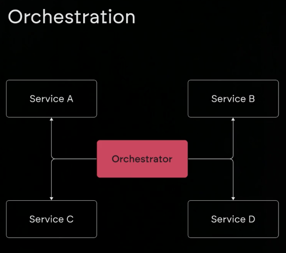

Orkiestrator to coś co nadzoruje cały proces, to może być ale nie musi osobna jednostka wdrożeniowa, może to też być dobrze wydzielony moduł w monolicie.

Co istotne teraz mamy:

-   jedno miejsce do śledzenia procesu
-   jedno miejsce do jego zmiany
-   jedno miejsce do ewentualnego wersjonowania i skalowania
-   jedno miejsce gdzie mamy gwarancje że wydarzy się wszustko albo nic, tutaj będzimy mieć kompensacje

Taki wewnętrzny proces często nazwa się Saga / Process Manager

#### Saga vs Process Manager

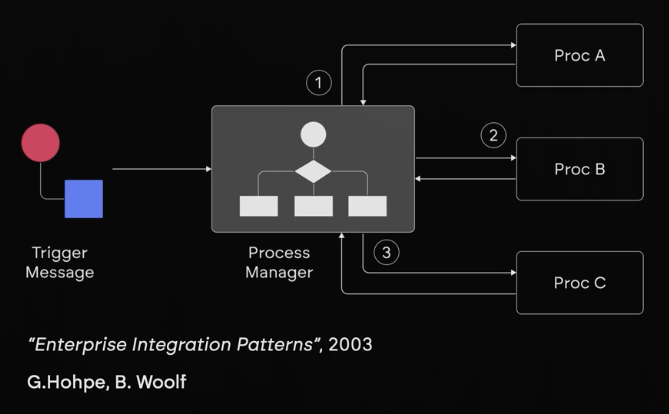

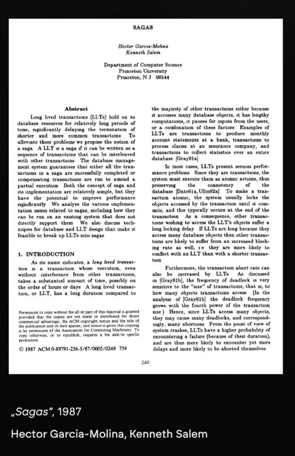

W świecie bazy danych kompensacją jest rollback, w świecie biznesowym odwrotna akcja biznesowa

Podsumowanie:

-   Process Manager - wzorzec, który wylicza następny krok procesu biznesowego
-   Saga - wzorzec, który zapewnia "atomowość procesu" poprzez kompensację

Często w praktyce mamy process manager który ma w środku sage, przez to programiści często używają tych pojęć wymiennie

#### Zdarzeniowowść w prostym serwisie aplikacyjnym

Jeżeli na siłe wyciągniemy logikę z serwisu na rzecz zdarzenia to stworzymy tzw. ukryty coupling czyli listener który obsługuje to zdarzenie może wpłynąć na całą transakcje (proces) wykonywany w serwisie

Jeżeli wysyłamy zdarzenie z serwisu to powinniśmy mieć założenie że nie wiemy czy ktoś się zainteresuje tym procesem, to nie powinno dla nas być istotne (z punktu kontrlowania procesu)

#### Gwarancje dostarczania wiadomości

-   at-most-once delivery - czyli dostarczymy raz lub wcale
    -   łatwa w implementacji
    -   nieodporna na różne awarie

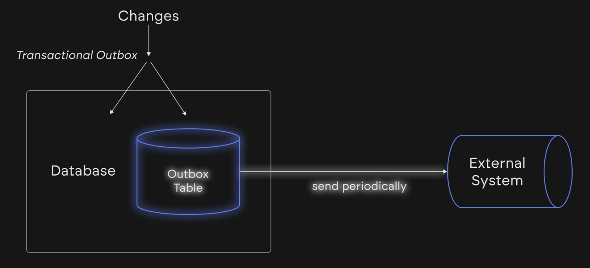

outbox pattern - gdzie wykonujemy jakaś operacje i wysyłamy na zewnątrz wykonanie jakieś operacji asynchronicznie np. wysłanie maila, podzielenie na mniejsze kroki transakcji

**Komepensacja - wycofanie wcześniej udanej zmiany**

Najlepiej dzielić sobie zmiany stanu (saga) i wykonywanie konkretnej operacji (komunikacji z modułami) czyli handlery

### L05. Saga i Process Manager ze Stanem - Part 3

#### Zdarzenia prywatne vs zdarzenia publiczne

Jak możemy uniknąć tego że inny zespół chce edytować zdarzenie na którym oparty jest inny mechanizm w innym kontekście?

minimalizacją problemu może być rozróżnianie prywatnych od publicznych zdarzeń.

prywatne zdarzenia są tylko używane w ramach konkretnego modułu, na przykład na potrzeby logów wewnętrznych itp, dzielenie się tymi zdarzeniami z innymi modułami to jak dzielenie się schematem bazy danych. W momencie jak dzielimy się malutki zdarzeniami to niestety prowadzi to do problemów.

Jak rozpoznać że zdarzenie jest prywatne?

Jeśli naturalnie dla nas jest to że jak to zdarzenie emitujemy to musi istnieć jakiś listener który musi nasłuchiwać tego zdarzenia. To znak że moglibyśmy tego nie robić w taki sposób tylko wyliczyć to w środku modułu z prywatnym zdarzeniem.

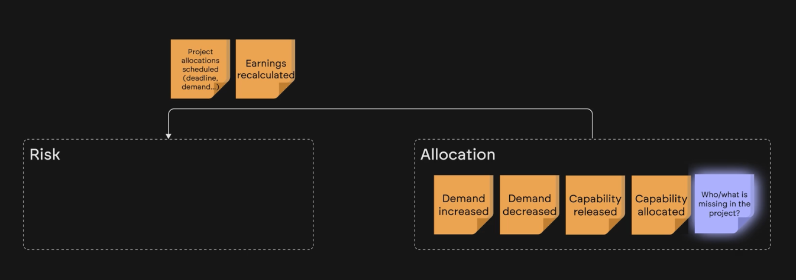

#### Kolejność zdarzeń

Problem ze zdarzeniami jest taki że zdarzenia mogą się zadziać w "nierozsądnej" kolejności.

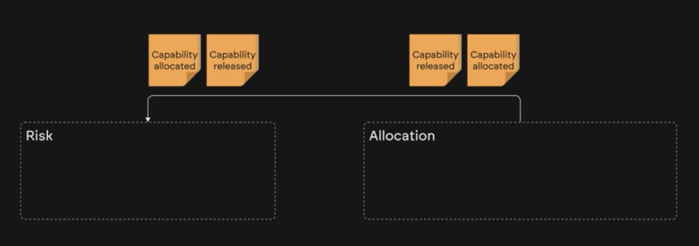

może to wnikać z:

-   opóźnień
-   złych granic
-   ustawień na brokerze
-   wysyłamy na różne kolejki

Zdarzenie do tego może być zdublowane itp.

**zabezpieczenie przed zdublowaniem zdarzeń: Idempotentny konsument (np. za pomocą deduplikacji) + producent z gwarancją at-least-once = exactly-once processing**

Powinniśmy o tych problemach myśleć nawet jeżeli piszemy w architekturze monolitowej przetwarzanej synchronicznie, to prowadzi do leszpej architektury ogólnie

#### Czy możemy polegać na kolejności?

Jeżeli jakiś moduł próbuje rozwiazać po swojej stronie problem przyjmowanych zdarzeń, to raczej na pewno probelm leży na złych granicach modeli i rozbicia spójności na kilka modułów

#### Podsumowanie

-   użyteczna metafora
    -   koordynator
-   użyteczne metryki
    -   liczba obsługiwanych komend i zdarzeń
-   użyteczne drivery
    -   latencja
    -   konkretna gwarancja na dostarczenie wiadomości
-   strategia testowania
    -   interaction-based (stubs, mocks)
    -   output-based
-   użyteczne elementy konstrukcyjne DDD
    -   zdarzenia
    -   komendy
    -   serwisy aplikacyjne z kodem proceduralnym
    -   saga/process manager
-   paradygmat
    -   obiektowy

## Moduł 11 - Breakthrough i Architektura Aplikacyjna

### L01. Nowe wymagania rzucające wyzwanie modelowi

Projektowanie prawdziwych dużych systemów ma więcej zakrętów niż zakopianka. Wszystkiego nie przewidzisz.

**Pierwsze wymagania są tylko pierwszymi wymaganiami. Kolejne wymagania często łamią początkowe założenia.**

**Modularyzacja zwieksza prawdopodobieństwo bezstresowego otwierania nowych potenchałów biznesowych, ale nie eleminuje go!**

Dwa rodzaje przełomowych wymagań

-   przełomowe dla biznesu
-   przełomowe (łamiące) dla architektury

przełomowe to takie które zmieniają reguły gry.

Jeżeli zmiana jest przełomowa dla archietktury a dla bizensu to niewielka zmiana to dobrym pomysłem jest pokazanie biznesowi ile będzie nas kosztować zmiana na mapie kontekstów (zmiany w modelach itp.)

Możemy mówić o ewentualnych biznesowych konsekwencjach krótkowzrocznej implementacji.

**Róbmy tak aby nasza arhichtektura robiła więcej niż musiała.**

#### Plan gry

Zadaniem świadomego programisty:

Dowiezeienie tematu oraz wzięcie odpowiedzialności za swoje decyzja i ich uargumentowanie (nawet jeśli łamią jakieś ogólne przyjęte dobre praktyki)

Zawsze zadaj sobie pytanie przed podjęciem decyzji:

**Jakbym to zrobił gdybym miał więcej czasu**, w ten sposób już masz dodatkowe rozwiązanie i poprzez zawężanie stożka możliwości możesz wybrać to optymalne

Pytania pomocniczne:

-   jak można byłby to zrobić, gdyby czasu było więcej?
-   jak można byłoby to zrobić, gdyby nie było problemu synchonizacjia zespołów?

#### L02. Zabrakło czasu czy zabrakło skilla? Konsekwencje decyzji podejmowanych w stresie

#### Małe decyzje, wielkie sktuki

Czas to potężny driver architektoczniczy

W momencie stresu nas umysł robi to co zna, nie jest kreatywny. Dlatego warto poszerzać swoją bibliteke możliwych rozwiazań aby radzić sobie w takiej sytuacji

#### Mapa modeli wyjaśnia niesmak

Często wszystko zaczyna się od emocji: "Łączenie niezależnych konceptów jest złe".

W takim przypadku najlepiej powrócić do mapy modeli, tak aby spojrzeć i pamiętać o tym że modele mają być kontekstowe i dopasowane do specyficznych problemów.

Przy projektowaniu autonomicznych modeli chcemy zapobiec:

-   duplikacji odpowiedzialności
    -   bo zminiejsza to sprawczość zespołów
    -   bo wymaga ich synchronizacji
    -   bo nie ma pojedyńczego źródła prawdy
-   modelom mającym zbyt wiele odpowiedzialności 
    -   bo zwiększa to ryzyko zmiany
    -   bo zwiększa to przeładowanie kognitywne

**Mapa modeli pozwala nam sprawdzić czy dwa modele zaczynają nam odpowiadać na to samo pytanie**

Jeżeli masz nowe pytanie i model na nie odpowiada bez żadnych dodatkowych danych to znaczy że to jest parafraza już istniejącego pytania na jakie odpowiada

#### Suma niestabilności

Prawdopopodobnieństwo zmiany modulu = suma prawdopodobieństwa zmian małych modułów z których się składa

Pochopna i wygodna zmiana niesie ryzyko

-   przeładowanie kognitywne
    -   generyki powinny zostać generykami
-   zwiększa prawdopodobieństwa błędu lub przyszłej zmiany pojedyńczego modelu
-   ziększenie prawdopodobieństwa zmiany wielu modelu jednocześnie
    -   co często powoduje synchonizację zespołów