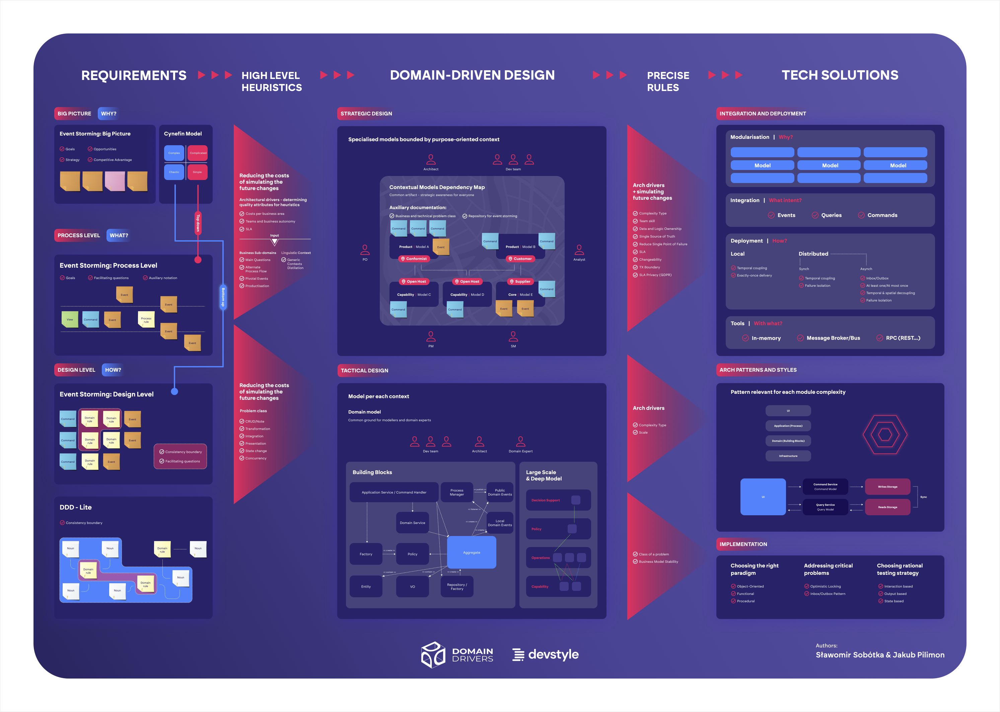

## Moduł 000

-   Jeśli będziesz wtanie argumentować przed biznesem to będziesz miał większe szanse na to, żeby zaimplementować DDD w projekcie.
-   Stajesz się pro-aktywnym doradcą a nie tylko wykonawcą.
-   Pomagasz dowozić projekty, a nie tylko je wykonywać.
-   Rozumiesz principla z których wynikają wzorce, dlaczego ich używamy. To pozwala na to, żeby zastosować je w odpowiednich miejscach.
-   Będziesz wstanie wskazać alternatywne rozwiązania, które są bardziej odpowiednie dla danego problemu.
-   Umiejętność zadawania pytań, które pomagają zrozumieć problem. Znalezienie optymalnego rozwiązania.
-   Usuwanie blokady zależności pomiędzy zespołami, poprzez rozwiązanie problemu zależności modułów.
-   Eleminowanie mody i przypadku z projektu technicznego. Zbytecznej złożności która nie wnosi wartości.
-   Celem nie jest nauka DDD tylko zrozumienie problemów biznesowych i technicznych, które pozwolą na zastosowanie DDD w projekcie.

## Moduł 001

### L01. Despota-driven Development

-   Problem jest gdzie do wszystkiego podchodzimy do CRUD
-   Głównym problemem jest to że dane są edytowane zróżnych miejscach
-   Problemem jest to że procesy operują na danych pomiędzy różnymi modułami
-   CRUD może być większą ilością kodu w projekcie niż kod biznesowy
-   System płytki to system gdzie pomiędzy UI a bazą danych nie ma żadnej warstwy biznesowej
-   System głęboki to system gdzie pomiędzy UI a bazą danych jest warstwa biznesowa
-   Zwykle problemem jest brak rozpoznania klasy problemów, które są w systemie i które powinny być rozwiązane
-   Data envy - kiedy jedna klasa chce mieć dostęp do danych z innej klasy
-   Feature envy - kiedy jedna klasa chce mieć dostęp do metod z innej klasy
-   Problemy zostaną rozwiązane "druciane" czyli poprzez mieszanie modułów i klas

### L02. Disaster-driven Design

-   W zaleznosci od klienta musisz dostosować swoje podejście
-   W jaki sposób sprawić wrazenie zeby klient myslal ze wiemy co robimy:
    -   Mowa ciała - kazdy ruch ktory zaczynasz powinnien wrocic do pozycji wyjsciowej. Czyli jak machasz reka do góry to powinna wrocic do pozycji wyjsciowej z ktorej zaczynała
    -   zwiezłe wypowiedzi - mówisz krótko i na temat
    -   przydziwięki i dopełniacze - nie powinno się kończyć zdania tak jakby to było pytanie do klienta
    -   Jeśli nie wiesz co powiedzieć to po prostu milczysz
        -   To znacznie lepsze niż robienie "yyyyyyy"
        -   "prawda, no tak"
-   Świadomość sytuacji, brak zaufania
-   Prawo conwaya - systemy które są projektowane przez zespół który nie jest w stanie zrozumieć problemu, będą miały architekturę która jest kopią struktury zespołu
    -   to też odwzorowuje się strukturę firmy
-   Wdrażenie zmian
-   Ludzie róźnie reagują na zmiany
    -   Każdy inaczej pojmuj zmianym ciężko jest zrozumieć co zmiana oznacza dla innych, nie możesze tego przedstawiać ze swojej perspektywy
-   jak sprzedawać zmiany
-   nie powinniśmy używać narzędzi bez zrozumienia, bo to może prowadzić do katastrofy
-   **Najczęściej problem w modelu to problem podczas analizy problemu**
-   Musimy uczyć się heurystyk do podziału większych modułów na mniejsze moduły
-   Potrzebujemy dobrze zrozumieć Event Storming aby to pomagało a nie przeszkadzało

### L03. Mapa szkolenia

-   5 kolumn
    -   pierwsza o zbiernaniu wymagań
        -   Big picture
            -   co chcemy osiągnąć
            -   jaką mamy przewagę konkurencyjną
        -   Design level
            -   rozpoczęcie od projekotwnia najtrudniejszych przypadków użycia, tak aby sprawdzić czy projekt ma jakikolwiek sens
                -   identyfikacja blokerów i ryzyko wykonalności
        -   Process level
            -   Event storming
            -   Szukamy pytania jak coś działa bez wchodzenia w szczegóły implementacji
    -   druga zawiera wysokopoziomowe heurystyki
        -   zawężanie możliwości stożka niepewności
        -   Szukanie drivertów biznesowych i architektonicznych
            -   Ma to na celu ocenienie czy projekt ma sens, czy idziemy w dobrym kierunku
            -   Drivery ustalamy z klientem
        -   Podzielenie na mniejsze niezleżne modele
    -   trzecia kolumna to artefkaty powstające dzięki DDD
        -   mapa powiązań pomiędzy autonomicznymi modelami (mapa kontekstów)
            -   **Mapa kontekstów to najważniejszy element w DDD**
            -   zapewnia świadomość organizacji systemu dla całej firmy (też tej nie technicznej)
            -   pokazuje wzroce integracyjne
            -   symulowanie zmian w systemie
            -   Niezależne modele
            -   jeden model = jeden problem
            -   modele finalnie muszę ze sobą współpracować
            -   modele często mają odwzierciedlenie w zespołach IT (jeden zespół = jeden model)
                -   To może prowadzić do problemów z komunikacją
        -   taktyczne modele to modele zorientowane na rozwiązanie konkretnego problemu
    -   czwarta kolumna - to konkretne heurystyki pozwalające na zaprojktowanie finalnego rozwiązania
        -   jest to finalne zawężenie stożka niepewności
        -   to powinno spiąc wszystko w całość, tak aby było to zrozumiałe dla programistów
        -   powinno być widać wynik pracy analizy w tej kolumnie
            -   bedły na poziomie strategicznym generują znacznie większe koszty niż na poziomie taktycznym
        -   trzeba wybrać narzędzia które pomogą w implementacji
            -   dobranie technolgii to zależy od corowych modułów
        -   jak dobrać rozwiązanie do problemu
            -   zawsze trzeba zastanowić się nad alternatywami
    -   piąta kolumna - to działące rozwiązanie dla klienta, to za co płaci
-   **Najważniejsze są metody dojścia do rozwiązań niż samo rozwiązanie**
-   Celem jest dobrania optymalnego rozwiązania dla danego problemu, bez zbędnej złożoności. Na to szukamy powtarzalnyej metody
-   Głębokie modele - tutaj będą korzystne wiedza z algorytmów, struktur danych, wzorców projektowych
-   Najważniejsze są separacje warstw, tak aby nie było zależności pomiędzy nimi
-   DDD Lite - kiedy nie mamy dostępu do biznesu to musimy zrobić DDD Lite
-   **Dobre DDD to dobre praktyki na wielu poziomach**

### L04. Jak korzystać z tego szkolenia

-   Uczenie przez różniczenie
    -   polega na przedstawieniu kilku rozwiązań i pokazaniu różnic
    -   jeżeli pojawią się jakieś emocje u klienta to znaczy że dobrze wykonaliśmy swoją robotę
        -   to spowoduje że klient na dłużej zapamięta to co mu pokazaliśmy
    -   zmagania bohaterów
        -   podejście proste (takich problemów jest sporo w dużych systemach) to podejście które powstało w czasach bańki internetowej (indie)
        -   podejście nastaiwione na nowości, na to żeby coś zrobić szybko. Brak dobrego dobrania klasy narzędzia do klasy problemu powoduje że system jest zbyt skomplikowany. Ominięcie wielu problemów biznesowych. Problemy na poziomie technicznym, kultury pracy, brak zrozumienia problemu
            -   co ważne to typowe dla nauki jakiejkolwiek branży
        -   podejście klasyczne, z lat 70, ugruntowane w latach 80. Ztonowane i zdystansowane podejście do problemu.
            -   Dobranie klasy nardzędzia do klasy problemu, zrozumienie problemu, zrozumienie co jest ważne dla klienta
            -   Branie pod uwagę drivery biznesowe i architektoniczne
    -   porządkowanie pojęć
        -   pierwsza ksiażka na temat DDD była pisana na początku wieku
        -   problem space, solution space
        -   domena, sub-domena
        -   bounded context, moduł
    -   model dreyfus i cykl Kolba
        -   cykl kolba
            -   doświadcznie problemu
            -   obserwacje i wnioski
            -   tworzenie teorii i hipotez
            -   zastosowanie w praktyce
            -   finalnie celem jest znalezienie rozwiąznaia lub przesunięcie się o jeden cykl bliżej rozwiązania
        -   model dreyfusa
            -   celem jest dojście do poziomu eksperta, gdzie głównie posługujemy się intuicją. Na tym etapie wiemy że wszystko zależy od kontekstu.
            -   najwięcej czasu spędzimy na poziomie "kompetentnego" gdzie zaczynamy rozumieć co się dzieje wokół nas. Potrzeba lat praktyki aby dojść do poziomu eksperta
    -   myślenie trójwymiarowe
        -   przełożenie wymagań na model to proces heurystyczny przy użyciu technik odkrywania wiedzy
        -   można tworzyć własne building blocki, tak jak np. agregat procesowy
    -   płaszyczyny ze szkolenia
        -   zbieranie infroamcji
            -   technika top down
                -   zaczynamy od modelu domenowego
            -   technika bottom up
                -   zaczynamy od reguł domenowych
            -   Event storming - Big picture
            -   Cynefin - Big picture
                -   klasifikowanie problemów pod kątem ich złożoności
                -   podjęcie decyzji w których miejscach używamy podejścia top down a gdzie to nie ma sensu (czyli bottom up
            -   Event storming - process level
                -   zaczynamy od procesów
                -   jak postawić cel spotkania event stormingu
                -   AS-IS, TO-BE
            -   Umiejętnosności miękkie
            -   Szukanie ukrytych poddomen biznesowych
            -   Celem jest uniknięcie naiwnych vertical slicingów, które powodują plątnanine zależności
        -   Mapa kontekstów
            -   najważniejsze umiejętność to umiejętnosć rozbijania większego problemu na mniejsze
                -   celem jest to aby móc to pojać umysłem i nie mieć przeładowania kongitywnego
            -   mapa kontekstów to najważniejszy arefakt w DDD
            -   to wypływa na podział ludzi w zespole
                -   jeden zespół = jeden model
            -   to też pokazuje gdzie nam contekty przeciekają
                -   to też pokazuje gdzie mamy zależności
            -   dobrze wykonana mapa powoduje że kontekst mapuje się na moduł w systemie
        -   racjonalna architektura
            -   finalnie to jest to co chcemy osiągnąć, to powoduje że firma jest bardziej elastyczna
            -   dobór wzorców integracyjnych
            -   modelowanie taktyczne ma sens dla głębokich dziedzin
        -   modelowanie
            -   event storming - design level
            -   musisz mieć już jakieś konkretny problem
            -   jeżeli nie rozumiesz problemu to lepiej napisać primtytywny kod aby zrozumieć problem i następnie zacząć modelować
            -   model powinien być implementowalny
                -   tak aby nie prowadzić to nieprozumienia w zespole
                -   model powinnien być zrozumiały dla biznesu, tak aby mogli bo zwerifikować (zrozumiały dla ekspertów dziedzinowych)
                -   modele będziemy budować z building blocków np. agregatów
            -   zrozumienie gdzie mamy problem współbieżnego dostępu do danych
            -   być może model nie wymaga zupełnie programowania bo problem jest już rozwiązany przez jakieś narzędzie itp.
        -   Kod
            -   podejmowanie istotnych decyzji technicznych
            -   tutaj często pojawiają się problemy marnowania czasu na rozterki techniczne, które nie mają znaczenia dla biznesu
                -   gdzie ten czas można poświęcić na decyzje strategiczne (modelowanie)
            -   dobry projekt techniczny to taki który pozwala łatwo zmienić decyzje co do wcześniejszych decyzji projektowych
