https://edu.devstyle.pl/products/domain-drivers

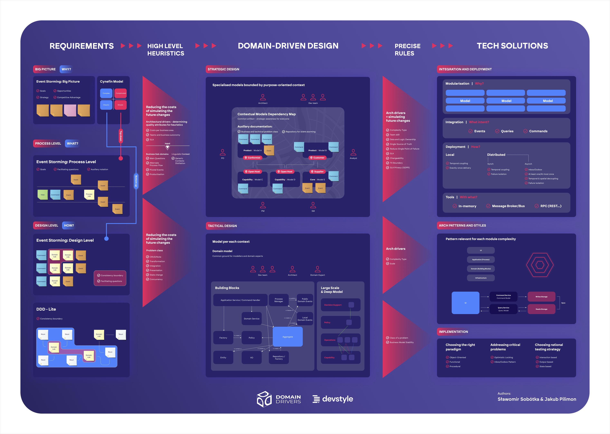

## Moduł 01 - Wstęp do szkolenia

-   Jeśli będziesz wstanie argumentować przed biznesem to będziesz miał większe szanse na to, żeby zaimplementować DDD w projekcie.
-   Stajesz się pro-aktywnym doradcą a nie tylko wykonawcą.
-   Pomagasz dowozić projekty, a nie tylko je wykonywać.
-   Rozumiesz principal z których wynikają wzorce, dlaczego ich używamy. To pozwala na to, żeby zastosować je w odpowiednich miejscach.
-   Będziesz wstanie wskazać alternatywne rozwiązania, które są bardziej odpowiednie dla danego problemu.
-   Umiejętność zadawania pytań, które pomagają zrozumieć problem. Znalezienie optymalnego rozwiązania.
-   Usuwanie blokady zależności pomiędzy zespołami, poprzez rozwiązanie problemu zależności modułów.
-   Eliminowanie mody i przypadku z projektu technicznego. Zbytecznej złożoności która nie wnosi wartości.
-   Celem nie jest nauka DDD tylko zrozumienie problemów biznesowych i technicznych, które pozwolą na zastosowanie DDD w projekcie.

## Moduł 001

### L01. Despota-driven Development

-   Problem jest gdzie do wszystkiego podchodzimy do CRUD
-   Głównym problemem jest to że dane są edytowane zróżnych miejscach
-   Problemem jest to że procesy operują na danych pomiędzy różnymi modułami
-   CRUD może być większą ilością kodu w projekcie niż kod biznesowy
-   System płytki to system gdzie pomiędzy UI a bazą danych nie ma żadnej warstwy biznesowej
-   System głęboki to system gdzie pomiędzy UI a bazą danych jest warstwa biznesowa
-   Zwykle problemem jest brak rozpoznania klasy problemów, które są w systemie i które powinny być rozwiązane
-   Data envy - kiedy jedna klasa chce mieć dostęp do danych z innej klasy
-   Feature envy - kiedy jedna klasa chce mieć dostęp do metod z innej klasy
-   Problemy zostaną rozwiązane "druciane" czyli poprzez mieszanie modułów i klas

### L02. Disaster-driven Design

-   W zaleznosci od klienta musisz dostosować swoje podejście
-   W jaki sposób sprawić wrazenie zeby klient myslal ze wiemy co robimy:
    -   Mowa ciała - kazdy ruch ktory zaczynasz powinnien wrocic do pozycji wyjsciowej. Czyli jak machasz reka do góry to powinna wrocic do pozycji wyjsciowej z ktorej zaczynała
    -   zwiezłe wypowiedzi - mówisz krótko i na temat
    -   przydziwięki i dopełniacze - nie powinno się kończyć zdania tak jakby to było pytanie do klienta
    -   Jeśli nie wiesz co powiedzieć to po prostu milczysz
        -   To znacznie lepsze niż robienie "yyyyyyy"
        -   "prawda, no tak"
-   Świadomość sytuacji, brak zaufania
-   Prawo conwaya - systemy które są projektowane przez zespół który nie jest w stanie zrozumieć problemu, będą miały architekturę która jest kopią struktury zespołu
    -   to też odwzorowuje się strukturę firmy
-   Wdrażenie zmian
-   Ludzie róźnie reagują na zmiany
    -   Każdy inaczej pojmuj zmianym ciężko jest zrozumieć co zmiana oznacza dla innych, nie możesze tego przedstawiać ze swojej perspektywy
-   jak sprzedawać zmiany
-   nie powinniśmy używać narzędzi bez zrozumienia, bo to może prowadzić do katastrofy
-   **Najczęściej problem w modelu to problem podczas analizy problemu**
-   Musimy uczyć się heurystyk do podziału większych modułów na mniejsze moduły
-   Potrzebujemy dobrze zrozumieć Event Storming aby to pomagało a nie przeszkadzało

### L03. Mapa szkolenia

-   5 kolumn
    -   pierwsza o zbiernaniu wymagań
        -   Big picture
            -   co chcemy osiągnąć
            -   jaką mamy przewagę konkurencyjną
        -   Design level
            -   rozpoczęcie od projekotwnia najtrudniejszych przypadków użycia, tak aby sprawdzić czy projekt ma jakikolwiek sens
                -   identyfikacja blokerów i ryzyko wykonalności
        -   Process level
            -   Event storming
            -   Szukamy pytania jak coś działa bez wchodzenia w szczegóły implementacji
    -   druga zawiera wysokopoziomowe heurystyki
        -   zawężanie możliwości stożka niepewności
        -   Szukanie drivertów biznesowych i architektonicznych
            -   Ma to na celu ocenienie czy projekt ma sens, czy idziemy w dobrym kierunku
            -   Drivery ustalamy z klientem
        -   Podzielenie na mniejsze niezleżne modele
    -   trzecia kolumna to artefkaty powstające dzięki DDD
        -   mapa powiązań pomiędzy autonomicznymi modelami (mapa kontekstów)
            -   **Mapa kontekstów to najważniejszy element w DDD**
            -   zapewnia świadomość organizacji systemu dla całej firmy (też tej nie technicznej)
            -   pokazuje wzroce integracyjne
            -   symulowanie zmian w systemie
            -   Niezależne modele
            -   jeden model = jeden problem
            -   modele finalnie muszę ze sobą współpracować
            -   modele często mają odwzierciedlenie w zespołach IT (jeden zespół = jeden model)
                -   To może prowadzić do problemów z komunikacją
        -   taktyczne modele to modele zorientowane na rozwiązanie konkretnego problemu
    -   czwarta kolumna - to konkretne heurystyki pozwalające na zaprojktowanie finalnego rozwiązania
        -   jest to finalne zawężenie stożka niepewności
        -   to powinno spiąc wszystko w całość, tak aby było to zrozumiałe dla programistów
        -   powinno być widać wynik pracy analizy w tej kolumnie
            -   bedły na poziomie strategicznym generują znacznie większe koszty niż na poziomie taktycznym
        -   trzeba wybrać narzędzia które pomogą w implementacji
            -   dobranie technolgii to zależy od corowych modułów
        -   jak dobrać rozwiązanie do problemu
            -   zawsze trzeba zastanowić się nad alternatywami
    -   piąta kolumna - to działące rozwiązanie dla klienta, to za co płaci
-   **Najważniejsze są metody dojścia do rozwiązań niż samo rozwiązanie**
-   Celem jest dobrania optymalnego rozwiązania dla danego problemu, bez zbędnej złożoności. Na to szukamy powtarzalnyej metody
-   Głębokie modele - tutaj będą korzystne wiedza z algorytmów, struktur danych, wzorców projektowych
-   Najważniejsze są separacje warstw, tak aby nie było zależności pomiędzy nimi
-   DDD Lite - kiedy nie mamy dostępu do biznesu to musimy zrobić DDD Lite
-   **Dobre DDD to dobre praktyki na wielu poziomach**

### L04. Jak korzystać z tego szkolenia

-   Uczenie przez różniczenie
    -   polega na przedstawieniu kilku rozwiązań i pokazaniu różnic
    -   jeżeli pojawią się jakieś emocje u klienta to znaczy że dobrze wykonaliśmy swoją robotę
        -   to spowoduje że klient na dłużej zapamięta to co mu pokazaliśmy
    -   zmagania bohaterów
        -   podejście proste (takich problemów jest sporo w dużych systemach) to podejście które powstało w czasach bańki internetowej (indie)
        -   podejście nastaiwione na nowości, na to żeby coś zrobić szybko. Brak dobrego dobrania klasy narzędzia do klasy problemu powoduje że system jest zbyt skomplikowany. Ominięcie wielu problemów biznesowych. Problemy na poziomie technicznym, kultury pracy, brak zrozumienia problemu
            -   co ważne to typowe dla nauki jakiejkolwiek branży
        -   podejście klasyczne, z lat 70, ugruntowane w latach 80. Ztonowane i zdystansowane podejście do problemu.
            -   Dobranie klasy nardzędzia do klasy problemu, zrozumienie problemu, zrozumienie co jest ważne dla klienta
            -   Branie pod uwagę drivery biznesowe i architektoniczne
    -   porządkowanie pojęć
        -   pierwsza ksiażka na temat DDD była pisana na początku wieku
        -   problem space, solution space
        -   domena, sub-domena
        -   bounded context, moduł
    -   model dreyfus i cykl Kolba
        -   cykl kolba
            -   doświadcznie problemu
            -   obserwacje i wnioski
            -   tworzenie teorii i hipotez
            -   zastosowanie w praktyce
            -   finalnie celem jest znalezienie rozwiąznaia lub przesunięcie się o jeden cykl bliżej rozwiązania
        -   model dreyfusa
            -   celem jest dojście do poziomu eksperta, gdzie głównie posługujemy się intuicją. Na tym etapie wiemy że wszystko zależy od kontekstu.
            -   najwięcej czasu spędzimy na poziomie "kompetentnego" gdzie zaczynamy rozumieć co się dzieje wokół nas. Potrzeba lat praktyki aby dojść do poziomu eksperta
    -   myślenie trójwymiarowe
        -   przełożenie wymagań na model to proces heurystyczny przy użyciu technik odkrywania wiedzy
        -   można tworzyć własne building blocki, tak jak np. agregat procesowy
    -   płaszyczyny ze szkolenia
        -   zbieranie infroamcji
            -   technika top down
                -   zaczynamy od modelu domenowego
            -   technika bottom up
                -   zaczynamy od reguł domenowych
            -   Event storming - Big picture
            -   Cynefin - Big picture
                -   klasifikowanie problemów pod kątem ich złożoności
                -   podjęcie decyzji w których miejscach używamy podejścia top down a gdzie to nie ma sensu (czyli bottom up
            -   Event storming - process level
                -   zaczynamy od procesów
                -   jak postawić cel spotkania event stormingu
                -   AS-IS, TO-BE
            -   Umiejętnosności miękkie
            -   Szukanie ukrytych poddomen biznesowych
            -   Celem jest uniknięcie naiwnych vertical slicingów, które powodują plątnanine zależności
        -   Mapa kontekstów
            -   najważniejsze umiejętność to umiejętnosć rozbijania większego problemu na mniejsze
                -   celem jest to aby móc to pojać umysłem i nie mieć przeładowania kongitywnego
            -   mapa kontekstów to najważniejszy arefakt w DDD
            -   to wypływa na podział ludzi w zespole
                -   jeden zespół = jeden model
            -   to też pokazuje gdzie nam contekty przeciekają
                -   to też pokazuje gdzie mamy zależności
            -   dobrze wykonana mapa powoduje że kontekst mapuje się na moduł w systemie
        -   racjonalna architektura
            -   finalnie to jest to co chcemy osiągnąć, to powoduje że firma jest bardziej elastyczna
            -   dobór wzorców integracyjnych
            -   modelowanie taktyczne ma sens dla głębokich dziedzin
        -   modelowanie
            -   event storming - design level
            -   musisz mieć już jakieś konkretny problem
            -   jeżeli nie rozumiesz problemu to lepiej napisać primtytywny kod aby zrozumieć problem i następnie zacząć modelować
            -   model powinien być implementowalny
                -   tak aby nie prowadzić to nieprozumienia w zespole
                -   model powinnien być zrozumiały dla biznesu, tak aby mogli bo zwerifikować (zrozumiały dla ekspertów dziedzinowych)
                -   modele będziemy budować z building blocków np. agregatów
            -   zrozumienie gdzie mamy problem współbieżnego dostępu do danych
            -   być może model nie wymaga zupełnie programowania bo problem jest już rozwiązany przez jakieś narzędzie itp.
        -   Kod
            -   podejmowanie istotnych decyzji technicznych
            -   tutaj często pojawiają się problemy marnowania czasu na rozterki techniczne, które nie mają znaczenia dla biznesu
                -   gdzie ten czas można poświęcić na decyzje strategiczne (modelowanie)
            -   dobry projekt techniczny to taki który pozwala łatwo zmienić decyzje co do wcześniejszych decyzji projektowych

### L05. A czym jest Domain-Driven Design?

-   rozmycie pierwotnej idei DDD
    -   Rick Evans opublikował w 2003 roku książkę Domain-Driven Design która spopularyzowała DDD
    -   sama wiedza została uguntowana 20 lat wcześniej
    -   jest to naturalny efekt rozmycia ideii z czasem, np. Agile software development stał się samym Agile'm
-   Pryncypia i heurystyki
    -   Rodzaje DDD
        -   DDD by Eric evans - pierwotna koncepcja, zainspirowanie kolejnych pokoleń
        -   DDD - Technial onanism - wypaczenie ideii evansa, skupienie się na technicznych aspektach
        -   Base design principles - ogólne zasady dobrego kodu, są programisći którzy nie znają DDD ale piszą dobry kod
        -   DDDD a'la botegga - dodatkowe heurystyki wypracowane przez autorów szkolenia
    -   celem jest przybliżenie naszej branży do standardów inżynierii
-   Czym jest a czym nie jest DDD
    -   Zbiór zasad, sposób myślenia, przewodnik do projektowania systemów
    -   DDD nie jest złotym młotkiem i nie rozwiązuje wszystkich problemów
    -   **DDD nie jest frameworkiem**
    -   możesz stosowac tylko wybrane techniki z DDD, nie musisz stosować wszystkiego jako dogmatu
    -   Krytyka DDD
        -   pierwsza grupa to osoby który tłumaczą to brakiem podjęcia stosownych krorków
            -   nie umiejętność mówienia językiem korzyści aby przekonać biznes oraz innych programistów
            -   brak umiejętności miękkich
            -   używanie DDD jako młotka do wszystkich problemów, nie dopasowanie narzędzia do problemu
        -   brak wiedzy biznesowej, brak współpracy z biznesem
            -   może to nie jest w interesie kogoś kto jest zainteresowany żeby projekt się udał
            -   czasami może być to firma gdzie nie ma miejsca na analizę problemu, nie chce tego organizacja
-   Jak sprzedać DDD?
    -   retoryke przyjmujemy w zależności od klienta
        -   przykład, sprzedaż wiertarki udarowej
            -   w przypadku bizensu sprzedajemy większą wydajność, mniejsze koszty
            -   w przypadku eksperta sprzedajemy jako narzędzie do wykonania konkretnego zadania
    -   DDD sprzedawalibyśmy jako metdyki w których dział IT jest doradcą i partnerem biznesowym
    -   **sprzedajemy "redukcje odpadów" (waste)**
-   Pull vs Push (czym są odpady, jak to redukować)
    -   Push to podejście waterfall, ci z wyższych sfer nie rozumieją potrzeb tych z niższych sfer (głuchy telefon)
        -   np. analitycy którzy wytwarzają artefakty które nie są potrzebne, to powoduje że programiści (niżej) i tak muszą wykonywać analizę
        -   Dodanie do założenia push np. cykli sprintowych nadal nie rozwiązuje problemu przepływu informacji
        -   DDD zakłada odwrócenie tego procesu na Pull
            -   W tym podejściu osoby realizujące swoje pracę dociągają potrzebne im informacje w zależnie od potrzeb
            -   Korzystają tylko z potrzebnych im informacji więc nie powstaje odpad
-   Role w DDD
    -   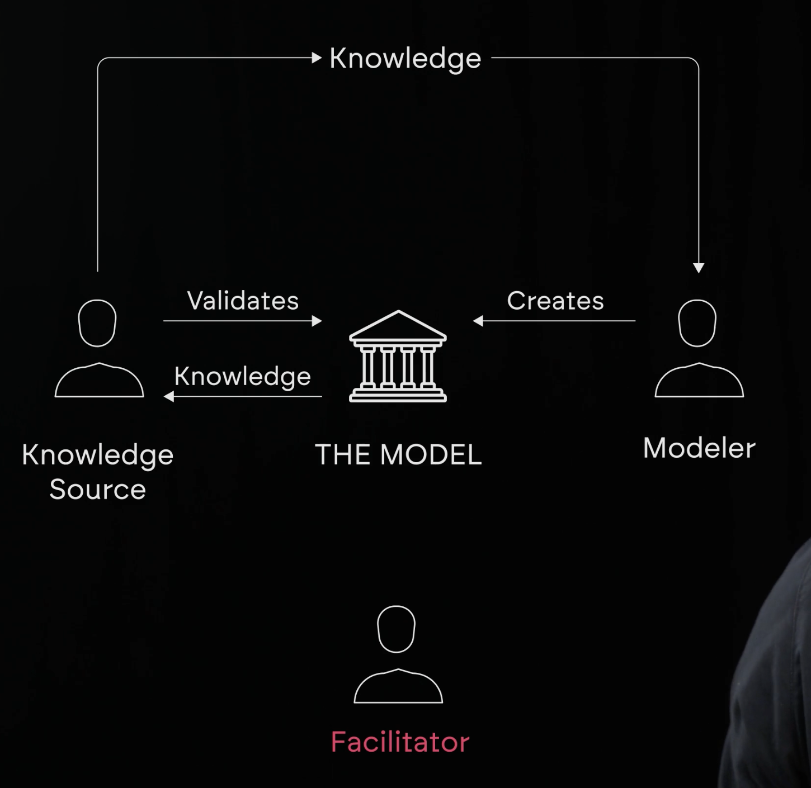
    -   Aby rozmawiaż z biznesem potrzebujesz minimum dwóch ról
        -   osoba która ma wiedzę
            -   weryfikuje model, sprawdza czy nie doszło do nieporozumień
            -   uczy się z modelu jak może optymalizować biznes
            -   model musi być czytelny dla niego
            -   źródło wiedzy dopieramy w zależności od potrzeby
                -   np. ekspert domenowy aby zebrać informacje o regułach biznesowych
                -   ekspert nie musi być użytkownikem systemu
                -   jeśli potrzebujesz zrozumieć strategiczne cele to musisz zaprosić osoby z zarządu
        -   osoba która modeluje w trakcie spotkania (modelarz)
            -   modeluje w trakcie spotkania lub po spotkaniu
            -   zadaje pytania, szukając odpowiedzi i modeli
            -   modelarz powinnien mieć wiedzę techniczną na wysokim poziomie tak aby modele były implementowalne w praktyce
            -   nie każda techniczna osoba powinna brać udział w spotkaniach z biznesem (może nie powinna)
        -   Facilitator - osoba która przygląda się z boku spotkaniu i go moderuje
            -   przydatna na początku, kiedy zespół nie wie jak prowadzić spotkania
            -   nie musi być to zewnętrzny ekspert
            -   partner, nie przeciwnik. Pomaga pokazując gdzie można wykonać poprawki
            -   osoba zainteresowana modelowaniem
-   Mapowanie ról - analityk i PO
    -   Czym zajmuje się analityk i Product Owner w DDD?
    -   Analityk
        -   Proxy expert - proxy do rynku
        -   expert domenowy - prawo itp. (wyspecializowany)
        -   Facylitator (wzmacnia komunikacje, standaruzją dokumentacje)
        -   Modelarz (jeżlie mają doświadczenie techniczne)
-   Model
    -   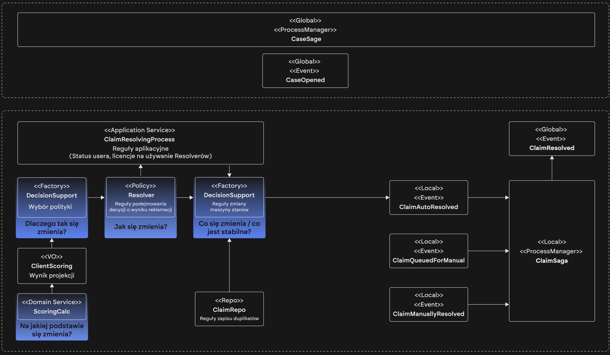
    -   Czym jest model?
        -   wspólna płaszczyzna porozumienia
        -   baza wiedzy
        -   narzędzie do stawiania hipotez oraz pytań
    -   Model jest wspólnym arefaktem aplikacyjnym, ustruktryzowanym wyobrażeniem o rozwiązywanym problemie
    -   Model definiuje słownictwo używane w systemie, dokumentacji oraz konwersacjach
    -   Język jest bardzo istotny, to co mówimy ma znaczeni
    -   Model mówi namy jak działa biznes razem z technologią
    -   Ważne aby model był zrozumiały dla biznesu (ogólnie dla wszystkich)
        -   pokazanie poprzez strzałki przepływu informacji
    -   Model nie odzworowuje rzeczywistości tylko jest jej uproszczoną wersją na tyle ile to nam potrzebne
    -   Mogę wygenerować kilka modeli tego samego problemu (wszystkie są nieprawdziwe ale niktóre są użyteczne)
-   Co modelujemy?
    -   Poziom startegiczny (strategiczny dla biznesu)
        -   podział problemu na mniejsze niezależne obszary biznesowe
        -   każdy z tych obszarów potencjalnie potrzebuje stworzenia osobnego modelu
        -   model dopasowany do klasy problemu jaki rozwiązujemy
        -   miejsce gdzie zastnawiamy się nad integracją modułów
        -   jest to poziom dla osób które chcą wiedzieć więcej o systemie, szerzej patrząc na system
    -   Poziom taktyczny (bardziej techniczny)
        -   np. wystawianie faktur. To nie jest core działalności firmy
        -   używamy building blocków
            -   modelowanie behawioryzmu, czyli jak działa biznes a nie tylko statycznych danych
        -   jest to elementarz dla programistów, analitków
    -   priorytety dziedzin
        -   Core
            -   powód powstania rozwiązania
            -   przewaga konkurencyjna
            -   tutaj inwestujemy czas najlepszych ludzi, tworzymy unikalną wartość
            -   to zwykle tylko kilka procent kodu
        -   Generic Core
            -   reużywalne rozwiąznaia systemowe
        -   Generic
            -   możliwe kupienie gotowego rozwiązania
        -   Supporting
            -   niekrytyczne funkcje systemu
            -   rozwiązanie gdzie możemy poświęcić mniej czasu (kosztem jakości)
-   Ubiquitos language
    -   Wspólny język dla wszystkich (biznes, programiści, analitycy)
    -   jezyk wspólny tylko dla kontekstów ograniczonych (w ramach jednego modelu)
    -   np. serwer to co innego dla IT a co innego dla branży samochoodowej (blacha)
    -   natomiast to też działa w drugą stronę. Np. dostępność będzie tym samym dla ludzi, maszyn, serwerów itp. (będą zasobem)
    -   ten wspólny język może pojawić się później podczas destylacji modelu
    -   to ograniczone conteksty nie są samymy w sobie celem
        -   to tylko heurystka, a celem jest stworzenie niezależnych modeli
-   knowladge crunching
    -   w DDD zakładamy inteacyjne pogłębianie wiedzy
    -   building blocki pozwalają ukrywać wiedzę, zgodnie z zasadą "ukrywaj to czego nie wiesz"
        -   agregaty
        -   object value
        -   eventy
    -   w iteracji na iteracje "kruszymy wiedzę"
        -   to powoduje tylko lokalne zmiany w bulding blockach które ukradają wiedzę
-   to co Cie zabije to prawo Conwaya
    -   "architetura systemu jest pochodną szlaków komunikacyjnch w organizacji"
    -   prawo to opisuje antywzorzec (często tego nie rozumie biznes)
    -   źle zoorganizowana firma prowadzi do źle zoorganizowanego systemu
    -   taktyczne DDD pozwala odkryć te szlaki komunikacyjne i zminimalizować zależności
-   Dokumentowanie modelu
    -   Event storming jest noracją nieformalną, a nie dokumentacją. Służy do prowadzenia warsztatów z osobami nie technicznymi.
    -   **Dokumentować powinniśmy w formie rozszerzonej mapy kontekstów, mapy modeli**
    -   jeżeli dokumentacja jest zbytnio szczegółowa to utracona jest esencja modelu
-   What drives your design?
    -   DDD
        -   Design - będziemy uczyć się projektować oprogramowanie
        -   Driven - będziemy uczyć się jakie są drivery biznesowe i architektoniczne
        -   Domain - podział problemu na niezależne obszary, domeny biznesowe, dogłebne zrozumienie krytycznych obszarów
    -   Są systemy gdzie zrozumienie domenyn nie jest krytyczne bo ona jest trywialna
    -   Czasmi są firmy gdzie są inne drivery np. szybkie powstanie kodu, działanie baterii itp.
-   Czy DDD jest dla mnie?
    -   Tak, natomiast skorzystasz z tych narzędzi które będą dla Ciebie teraz przydatne
    -   Finalnie to Ci się przyda na kolejnych poziomach kariery

### L06. Zadanie

-   Naczęstsze techniki podziału problemu
    -   szukanie rzeczowników
    -   intuicja
    -   naśladowanie działów struktur biznessowych

## Moduł 02 - Analiza Bottom-Up - kiedy musisz szybko zweryfikować założenia

### L01. Po co dzielić? Kiedy tego nie robić?

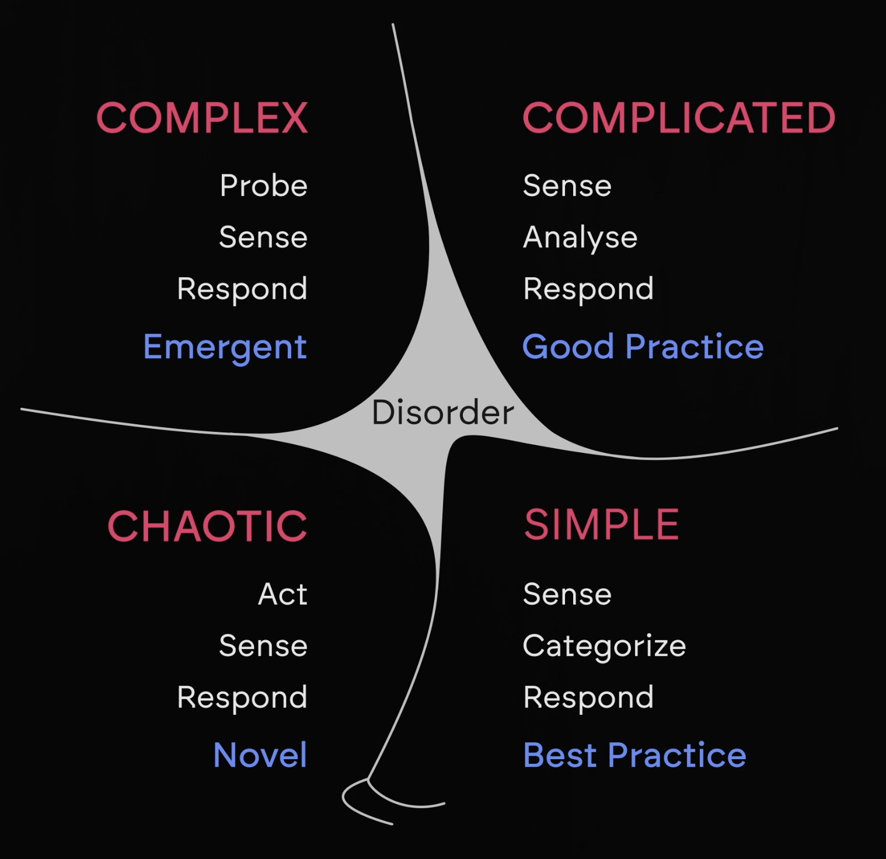

-   Na początku analizy nie powinniśmy myśleć o dzieleniu problemu na moduły czy konteksty, skupmy się na podzieleniu problemu na mniejsze problemy
-   Nadmierne dzielenie dla dzielenia to częsty efekt zachwytu nad DDD (nie zawsze jest to konieczne)
-   Dzieląc bez potrzeby powodujemy że kod jest trudniejszy do zrozumienia i wkoynujemy overdesign
-   Złożoność oprogramowania to nie koniecznie konieczność w dużych systemach
    -   jeżeli dobrze zaprojektujemy system to złożoność nie będzie problemem
-   Złożoność jest inkrementalna, nie jest to problem który pojawia się nagle
-   mamy możliwe podejścia
    -   złą modularyzację - duży początkowy koszt i szybko rosnący dalszy koszt
    -   bez modularyzacji - mały początkowy koszt i rosnący koszt (ale wolniej niż błędna modularyzacja)
    -   dobra modularyzacja - mały początkowy koszt i wolno rosnący koszt
    -   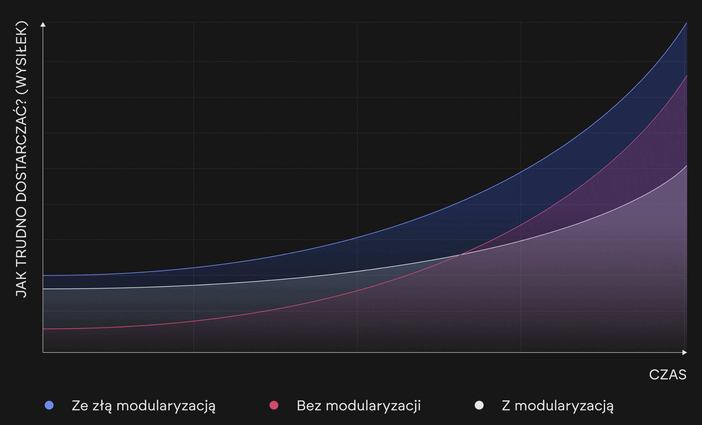
-   Modularyzacja nie jest celem samym w sobie, to walka ze złożonością w dugło trwającym projekcie

#### Kiedy tego nie robić?

-   Modularyzacja nie ma sensu jeżeli system nie będzie rozwijany lub to tylko prototyp (Proof of Concept)
    -   Nie zdążysz zobaczyć zysków z tej inwestycji
-   źle podzielony system będzie jeszcze gorszy niż nie podzielony system
    -   Lepiej czegoś nie wiedzieć niż wiedzieć źle
-   Podzielenie na zbyt dużo małych modułów niesie ze sobą koszt integracji tych modułów
-   Podzielenie mimo wszystko może mieć sens
    -   kiedy dany mechanizm powinnien być oddzielny np. dla testów
    -   chcemy aby dany mechanizm był częściej wdrażany niż reszta systemu
    -   izlowoanie porażek danego modułu (jeżeli reszta systemu nie powinna cierpieć z powodu porażki danego modułu)
    -   chcemy wydzielić osobny zespół projektowy aby zrównoleglić prace
-   Drivery architektoniczne
    -   wymagania funkcjonalne (problem biznesowy)
    -   atrybuty jakościowe (skalowalność, dostępność, wydajność itp.)
    -   ograniczenia zespołowe (zespoły, wiedza, czas, pieniądze)
    -   przyjęte konwencje (np. technologie, wzorce projektowe)

#### Po co modularyzacja?

-   Pomaga to programiście skupić się na wycinku złożoności
    -   zmniejszenie przeładowanie kognitywne
    -   narzędzie do zmiany pomysłu, łatwiej się wycofać (zmiana lokalna)
    -   jasny podział odpowiedzialności, wie do kogo się zgłosić w razie problemu
    -   sprawcze zespoły (łatwiej zrozumieć co się dzieje)
    -   narzędzie walidacji pomysłów (np. dla analityka)
    -   inwestycja finansowa (zwraca się w przypadku długotrwałych projektów)
-   **Moduł symbolizuje wektor zmiany w systemie**
    -   przygotowuje system na zmiany
-   W podziale warstwowym w momencie zmiany logiki biznesowej trzeba zmieniać wszystkie warstwy
    -   w DDD zmiana logiki biznesowej powinna być zlokalizowana w jednym miejscuń
-   zmiany z powodu wymagań funkcjonalnych są częstsze niż zmiany z powodu wymagań nie funkcjonalnych
-   **podział powinnien minimalizować miejsca do zmiany**
-   pułapki modularyzacji
    -   brak świadomości celu wprowadzania modularyzacji
    -   inwestycja bez oczekiwanych efektów
    -   zapętlenie w procesie modularyzacji

**Idealnie jeżeli możemy wykonać protoyp modularyzacji, tak aby sprawdzić czy to ma sens**

**Celem nie są bounded contexty ale autonomiczne modele**

Bounded contexty są heurystyką szukania odseparowanych modeli, heurystyką nastawioną na analizę lingiwstyczną
tak to nazwał Evans bo był nastawiony na analizę lingwistyczną, ale można to też robić na inne sposoby

### L02. Show me the money.

-   perspektywa procesowa w zależności do aktorów
-   event sotrming może być świetnym sposobem na zrozuzmienie bizensu i powiązań między aktorami
-   zrozumienie obszarów biznesowych oraz zrozumienie po co każdy z nich będdzie miał pokrycie w systemie
-   wyznaczenie obszarów dla których trzeba się bliżej przyjżeć (np. obszary które są bardzo skomplikowane) oraz dobrania dla nich odpowiedniej techniki analizy (w zależności od klasy problemu)
    -   top-down
    -   bottom-up

Po to, aby KORZYSC_DLA_KLINETA
potrzebujemy zrobić AKTYWNOŚĆ

#### Na czym zarabiacie?

-   Warsztat startegiczny
    -   Na czym zarabiacie
    -   gdzie są ryzyka
    -   gdzie są szanse na zysk
    -   poznanie otoczenie systemu, z czym się integruje system
    -   ograniczenia regulacyjne

#### Event storming - big picture

-   ryzyka i szanse
-   zyski i straty
-   otoczenie
-   obszary do pogłebionej analizy
    -   top-down
    -   bottom-up

#### Model kynefin

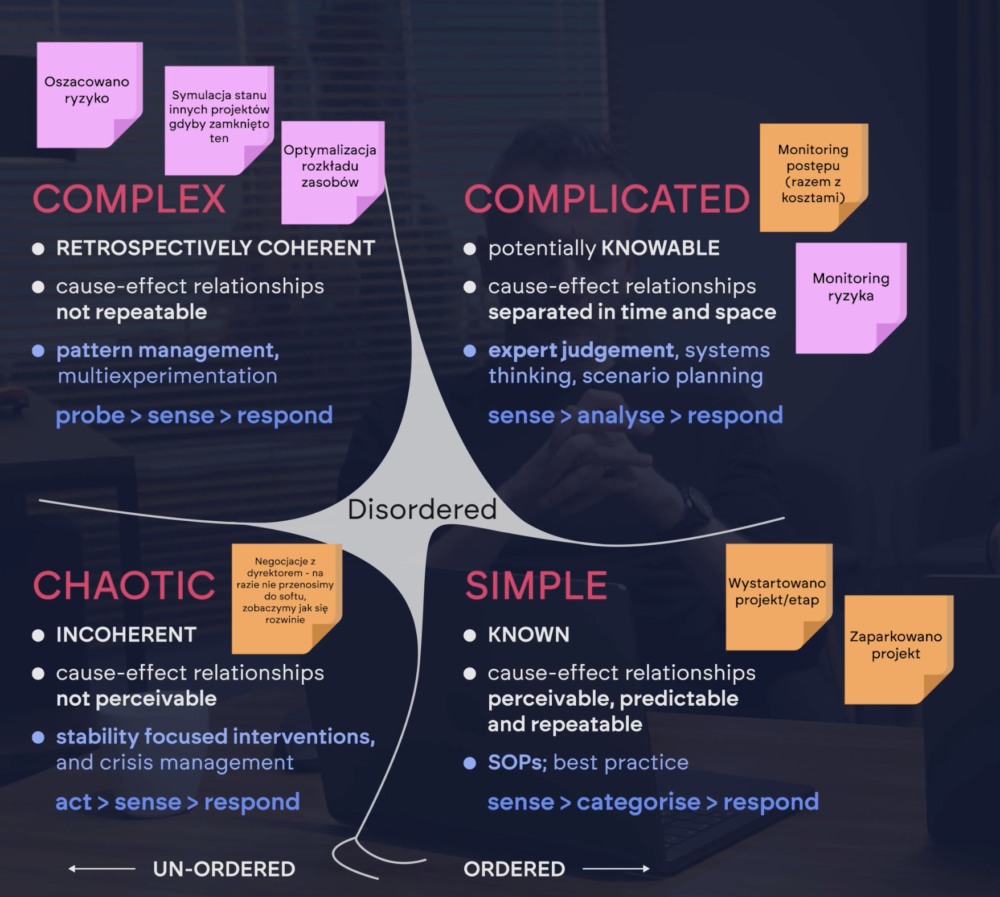

-   Problemy proste
    -   znamy odpowiedź
    -   znamy przyczynę
    -   znamy rozwiązanie
    -   przyczyna i skutek są proste i potwarzalne
-   Problemu skomplikowane
    -   wymaga analizy
    -   prawdoobnie znamy odpowiedź
    -   przyczyna i skutek są od siebie oddzielone czasowo
-   Problemy złożone (bottom-up)
    -   nie znamy odpowiedzi
    -   nie znamy przyczyny
    -   przycznyna i skutek nie są powtarzalne
-   problemy chaoetyczne
    -   nie znamy odpowiedzi
    -   nie znamy przyczyny
    -   przyczyna i skutek nie są zrozumiane

#### Podejście do analizy

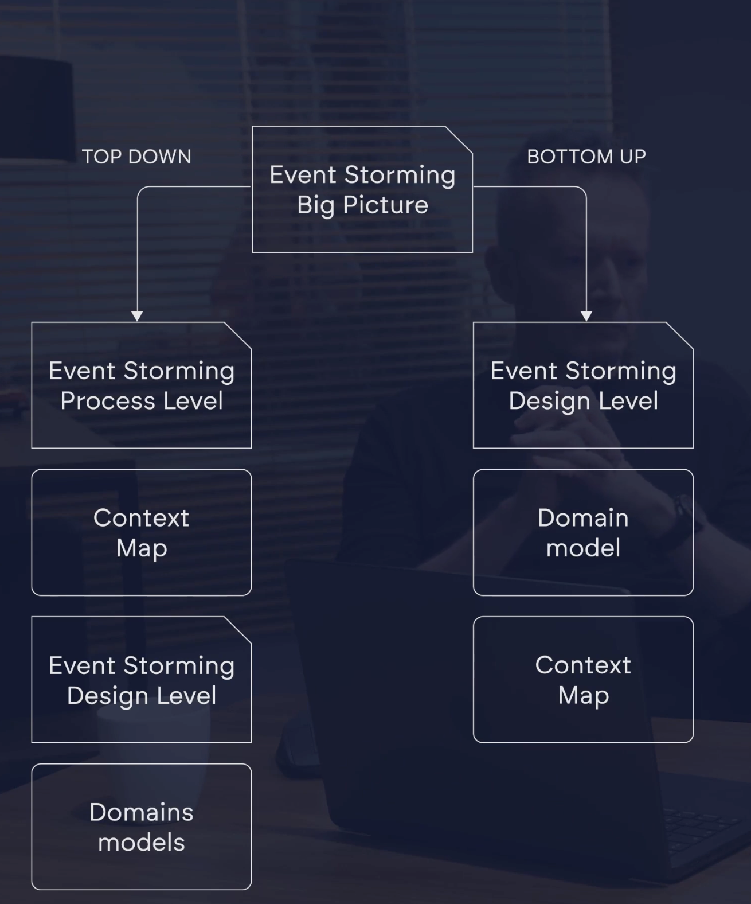

-   Problemy złożone
    -   bottom-up
        -   Szukanie reguł domenowych
-   Problemy klasyczne
    -   top-down
        -   mapowanie procesów
        -   orientuemy się na zachowania
        -   w przypadku trafienia na głęboką domenę piszemy PoC (Proof of Concept) aby zrozumieć problem

#### Kiedy potrzebne jest taktyczne DDD?

To zwykle tylko dla 5-7% kodu

### L03. Event Storming Big Picture - facylitacja.

#### Cel - założenia Event Stormingu Big Picture

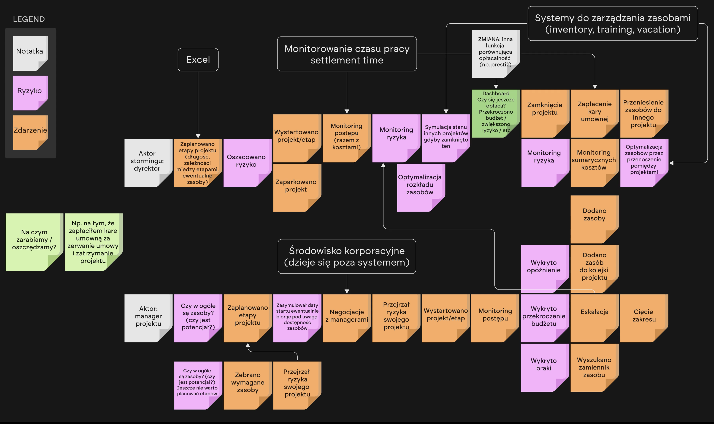

-   skupienie na ogólnej wizji, nie szczegółach modularyzacji
-   rozpoznanie otoaczenia biznesowego
    -   rozpoznanie ryzyk i szans
    -   rozpoznanie regulacji prawnych
-   świadomość tego, czemu ma służyć dane rozwiązanie
    -   rozwiązaniem nie zawsze musi być pisanie kodu

Najważniejsze pytanie: **"Po co to robimy?"**

jak będzie wygladać fima po wdrożeniu systemu, gdzie będzie różnica na lepsze

Pytamy o to co jest ważne dla biznesu.

Nie chcemy marnować czasu na modelowanie nie istotnego problemu dla biznesu

#### Kogo zapraszamy?

Szukamy osób które mogę odpowiedzieć na pytanie "Po co to robimy?"

-   poziomy odpowiedzialności (event storming - big picture)
    -   przedsiebiorcy
        -   maja wizje
        -   wyznaczają cele
    -   managment (event storming - process level)
        -   wiedzą jakie są cele
        -   ewentualnie jakie etapy dojścia do tego celu
        -   wiedzą jak rozliczać cele
    -   eksperci (event storming - design level)
        -   wiedzą jak to zrobić
        -   np. piszą kod itp.

#### Metodyka

-   BIg picture nie jest precyzyjny, może się ograniczać tylko do samych zdarzeń. Zdarzenia nie muszą być opisane w żadnej specyficzny sposób.
-   Nie muszą to być konkretne punkty w czasie, każdy z nich może wyglądać jak osobny proces
-   **chodzi o zrozumienie powodu powstania systemu, a nie jak konkretnie ma on działać.**
-   Nie powinnieneś pouczać osoób z zarządu czym jest dobre zdarzenie, to nie o to tutaj chodzi
-   Chcemy wyjśc ze spotkania ze zrozumieniem które porcesy są dobrze poznanie a które nie
    -   Dobranie rozwiąznaia analizy top-down, bottom-up

zdajemy pytania

-   Na czym zarabiamy?
-   Na czym oszczędzamy?
-   Czym różnicujemy się od konkurencji?
-   po co powstaje ten system?

#### Nawyki koginitywne

-   Szukanie motywacji, nastawienie na cele podczas rozmowy a nie na problemy
    -   dążenie do celu
    -   motywowanie nagrodami
    -   jest dobrze, może być lepiej
-   Skupienie się na problemach może spowodować że będziemy szukać problemów w organizacji sugerująć że coś jest nie tak
-   wymiana słowa problem na wyzwanie
-   pytając o cele masz szansę odkryć brakujące zdarzenia i dojść do sedna problemu

#### Zakończenie warsztatu

-   Kończymy w momencie jak mamy rozpoznane wszystkie krytyczne obszary biznesowe
-   zapytaj się czy jest coś jeszcze co wpływa na krytyczne decyzje biznesowe
-   dopytaj z kim możesz porozmawiać o szczegółach (process level)
-   po czym rozpoznać że Twój rozmówca nie potrafi odpowiedzieć na Twoje pytania
    -   cieżko wzdycha
    -   przewraca oczami
    -   pamiętaj że czasami osoba nie może poweidzieć że czegoś nie wie, bo jest osobą zarządzającą
-   u dorosyłch osób kierunek ich bioder i stóp pokaże im ich kierunek zainteresowań
-   nie zadręczaj pytaniami, zakończ spotkanie

### L04. Fail fast: Top down vs Bottom up

#### Co by było gdyby?

W celu lepszego zrozumienia i odkrycia ryzykownego obszaru biznesowego.

Wchodząc w szczegóły przydatne moze być techniki design level event storming

Nie zwołują spotkania aby zrobić event storming, chcą zrozumieć jak działa ten ryzykowny obszar

-   Design level oraz process level są dobrymi praktykami ale nie dzaiałają zawsze
    -   ich dogmatyczne stosowanie może prowadzić do problemów i braku zaufania

W momecnie kiedy nie wiesz co zrobić to najlepiej zaproponować jakiś model (PoC) aby zobaczyć czy to ma sens

#### Jak modelujemy?

-   top down - jeśli wiemy co chcemy zrobić ale nie wiemy jak
    -   rozpoczynamy od startegicznego modelowania odspearowanych modeli
    -   aby dalej skończyć na modelowaniu taktycznym
-   bottom up - nie znane obszary, gdzie potrzeba odkrycia, protopowania
    -   zaczynamy od taktycznego modelowania, modelowania tego co naprawdę wiemy oraz tego czego na pewno nie możemy zrobić

W momencie kiedy wszystko zależy od wszystikiego sprawdza się szukanie deep modeli

### L05. Szukanie Deep Model jako technika fail fast.

#### Kiedy model nie jest oczwisty?

Najcześciej są problemy modelami które wymagają bardziej niestarndardowego podejścia

Problemy jakie z nimi zwykle są:

-   uzależnienie od Autora rozwiązania
-   techniki klejenia niż modelowania

Najczęstsze tego typu problemu:

-   zmiana reguł biznesowych
-   zmiana obiektów biznesowych w systemie

Zwykle tutaj potrzeba "sprytnego" modelu do rozwiązania problemu

Do tego potrzebne są różne techniki modelarskie

Musimy wytworzyć nawyk myślenia lateralnego czyli nie liniowego

#### Modele zbyt specyficzne

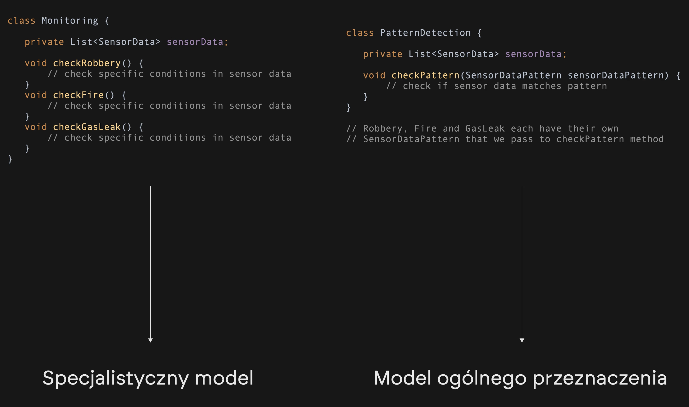

Najczęstszym problemem złożoności w kodzie są nadmiernie wyspecyfikowane modele "overspecialized models"

Zwykle to objawia się tym że muszę cały czas sprawdzać jakieś specjalne przypadki i to w wielu miejscach.

Zawsze zakładaj że podane przez biznes reguły to przypadek specyficzy, a nie reguła ogólna,
spróbuj zamodelować system tak aby obsługiwać każdy przypadek specyficzny

**Uogólnianie poprzez usuwanie przypadków specjalnych**

z takich techniki powstaje model ogólnego przeznaczenia albo też nazymwany model głęboki (deep model)

Aby znaleść taki ogólny model zadaj sobie pytanie:
**Jakiej ogólnej regule odpowiadają te specyficzne przypadki?**

To powoduje że upraszczamy model, a nie komplikujemy, upraszczamy interfejsy, a nie komplikujemy

#### Ogólne, czyli mniejsze lub prostsze

Modele ogólne zwykle są "oczywiste" oraz mają zelete prosty i zrozumiały interfejs

Łatwiej taki model rozwijać, łatwiej go testować, łatwiej go zrozumieć

Warto zawsze inwestować w

#### Model głęboki

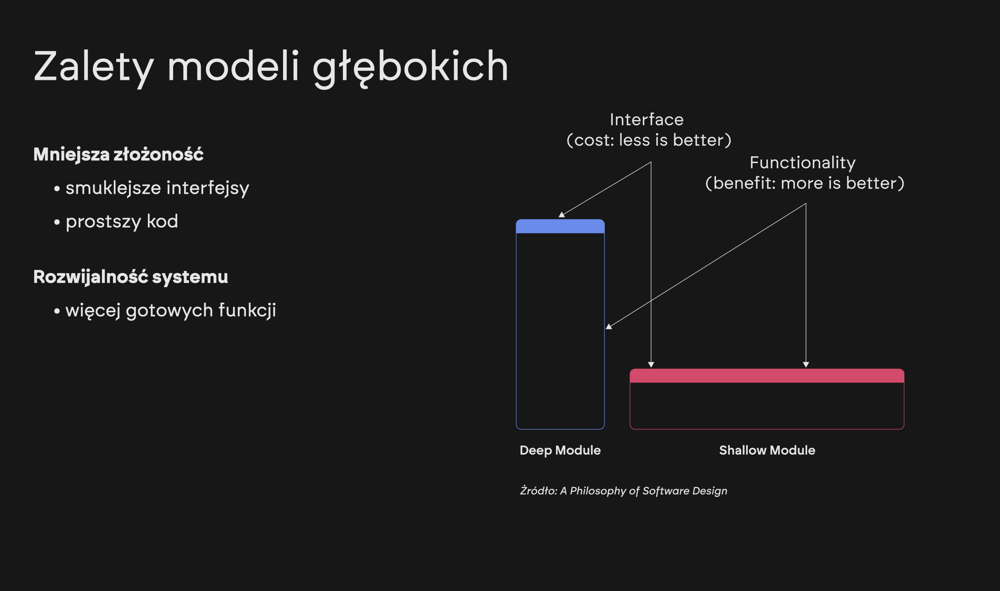

Modele głębokie to takie który są prostsze ale głębsze bo mogą "więcej" obsługiwać

Ogólny model nie oznacza modelu na wszystko, musimy dobierać deep model lub specialized model w zależności od potrzeb i problemu jaki chcemy rozwiązać

Zwykle usunięcie modeli specyficznych nie jest możliwe bo to jest tego czego potrzebuje użytkownik ale one mogą być nad modelem ogólnym i z niego korzystać jako z bazowego modelu

Powinniśmy unikać sytuacji gdzie z panicznie unikamy żadnego if'a w kodzie,
**powinniśmy zrozumieć że ogólny system służy głównie do tego aby uprościć system**

#### Cholerne User Story

User Story autorem jest Kent Beck

User Story jest zaproszeniem do rozmowy

Analizując problem tylko z poziomu User Story prawdopobnie nie odkryjesz głębokiego modelu

#### Szkic rozwiązania

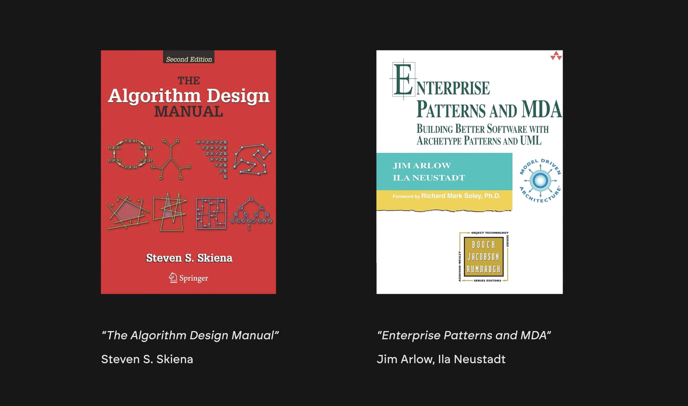

**Implementuj taki model który ma tylko te funkcje którę są dzisiaj potrzebne,
ALE którego interfejs jest gotowy na wiele nowych.**

Jeżeli nie wiesz jaki model głęboki mozesz zastosować, możesz po prostu spróbować po koleij dopasować gotowe rozwiąznia z książek do swojego problemu. Prawdopobnie znajdziesz tam rozwiązanie które będzie pasowało do Twojego problemu. Po prostu metodą brute force próbuj dopasować gotowe rozwiązania do swojego problemu.

**Jest dużo łatwiej oceniać sensowność rozwiązania, mając już przykładowe gotowe rozwiązania!**

**Redukuj problem który chcesz rozwiązać, do problemu który wiesz jak rozwiązać**

Pomocne pytania do szukania deep modelu:

-   Jaki jest obecnie najprostszy interfejs dla obecnych wymagań?
-   Czy intefejs jest łatwy w użyciu?
-   Jak wiele różnych wymagań kończy się wywołaniem tylko jednej, danej metody?

### L06. Co jest stabilne, a co zmienne?

-   Procedura pozwalająca rozwiązać palące problemy biznesowe
    -   Najpierw sprawdź czy jest tutaj potrzeba użycia deep modelu
        -   Sprawdzenie tego możesz dooknać poprzez zauważenie że specjalistyczne przypadku na siebie wpływają (powiązany graf)
        -   zwykle cechuje się to tym że przy próbie dodania nowego modułu będzie on wpływał na resztę modułów a one na niego
    -   Określenie API ogólnego modelu (deep model), stabilne wymaganie w gąszczu zmieniających się wymagań
        -   Szukamy tego co ma robić dany model, jeszcze nie wiadomo jak to będzie działać
        -   Stabilność trzeba rozumieć za coś co zawsze się dzieje w procesie, np. mamy inne alarmy ale każdy alaram szuka jakiegoś wzorca aby się odpalić
    -   Zaimplementuj najprostszy przypadek Twojego ogólnego modelu

Sposoby szukania abstrakcji

-   Poszukanie gotowych rozwiązań (z książek)
-   Generalizacja - szukanie bardziej ogólnego obiektu który będzie mógł obsłużyć wiele przypadków
-   Zmiana reprezentacji - zmiana reprezentacji obiektu na bardziej ogólną np. na drzewo

## Moduł 03 - Deep Models - głębsze zrozumienie w celu uproszczenia problemu

### L01. Rozwiązanie: Przykład deep modelu - harmonogramu. Jak na nie wpadać?

-   Rozpoczęcie prac od obszaru complex tak aby sprawdzić czy PoC ma sens
    -   Rozpoczęcie od bottom-up, przygotowanie PoC dla krytycznych obszarów
-   Zawsze szukanie alternatywnego modelu
    -   Zawsze szukaj alternatywnego modelu, nie bój się zapytać czy jest inny model
    -   Zawsze szukaj modelu który jest bardziej ogólny
-   Implementacja ma zawsze drugorzędne znacznie, istotne jest rozwiązanie problemu
    -   Po prostu w momencie zmiany decyzji był przepisywany moduł

#### Redukcja problemu

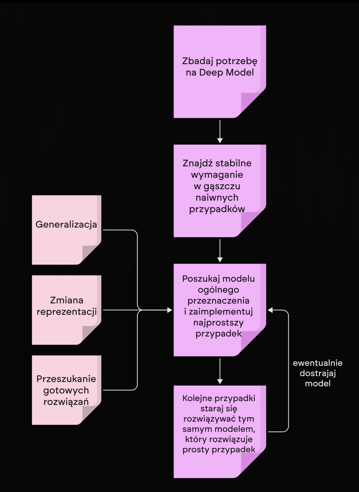

-   Przeszukanie gotowych rozwiązań z książek itp.
    -   "Nie wiesz co robić to rób co wiesz"
-   Rozwiązanie najprostszego przypadku
-   Stosowanie techniki uogulniania poprzez usuwanie przypadków szczególnych
-   Jeżeli żaden z przypadków szczegółnych nie pasuje do modelu to znaczy że musimy go dostroić
    -   Dostrajanie nadal jest w obrębie ogólnego modelu, np. waga grafu w algorytmie

#### Słowa mosty

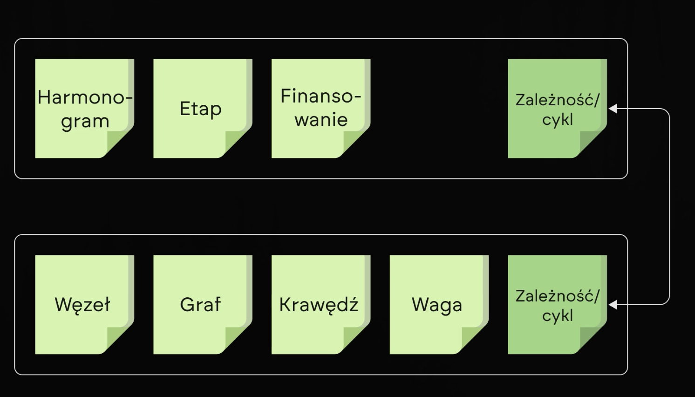

Słowa mosty pomagają w znalezieniu modelu ogólnego

Na przykład "zależność, cykl pomiędzy etapami" to słowa mosty które pomagają w znalezieniu modelu ogólnego
Sugerują użycie grafu gdzie takie słowa też występują

Oczywiście to wymaga znajomości algorytmów, struktur danych itp.

#### Wizualizacja

Wizualizacja problemu może pomóc w znalezieniu modelu ogólnego, np. podczas wizualizacji problemu znajdziemy podpowiedzi które pomogą w znalezieniu modelu ogólnego, rysnek będzie wyglądał jak jakiś znany algorytm np. graf

#### Intiucja

Intuicja to nieuświadomiona wiedza pochodząca z doświadczenia

Intuicja sprzyja tym którzy mieli szansę wystawić się na różne przypadki i problemy

Dobrym treningiem jest modelowanie tego czego używamy na co dzień, dla terningu w głowie. Wiele otacza nas techniologii które możemy modelować

#### Separacja konceptów

Podejmowanie wczesnej decyzji wdrożeniowej jest ryzykowne, lepiej jest oddzielić koncepty od implementacji.

Istotne jest aby nie poświęcić tygodni aby udowodnić że coś działa, lepiej jest zrobić PoC

### L02. Protip konsultanta: jak szybko generować wartość?

-   Można sprawdzić czy zmiana reprezentacji świata realna na algorytm np. graf jest sesowna, można to sprawdzić poprzez
    sprawdzenie czy kolejen obiekty ze świata algorytmów są w stanie reprezentować obiekty ze świata realnego
-   W ten sposób można wygenerować nowe pomysły biznesowe które można łatwo zaimplementować, w ten sposób można generować wartość
    oraz zyskiwać zaufanie klienta. Budowanie partnera biznesowego a nie tylko podwykonawcy
-   To też jest trick który pozwala zyskać budżet na analizę bo biznes widzi że to ma sens, możemy wygenerować nową wartość
-   "Dobrze wybrany model pozwala na zadanie ciekwych pytań"

### L03. Metryki dobrego modelu - brakujące narzędzie rozwiązujące "moje jest mojsze niż Twojsze"

#### Onanizm techniczny

-   W naszej branży brakuje podejścia inżynierskiego do modelowania
    -   czyli porównanie kilku rozwiązań pod kątem metryk
-   **Model to płaszczyzna komunikacji**
-   Zwykle problem jest patrzenie na system poprzez metryki techniczne pomijając metryki biznesowe
-   Zwykle metryki technicznie nie sa najważniejsze na początku
-   DDD staje się przykrywką do tego "kto dalej sika", to przechodzi do okradania klienta
-   Skupianie się na metrykach które w tym momencie nie są krtyczne
-   Zwykle dobre dobranie modelu i struktury jest znacznie bardziej istotne od implementacji

**Separacja koncepcji od konkretnej reprezentacji**

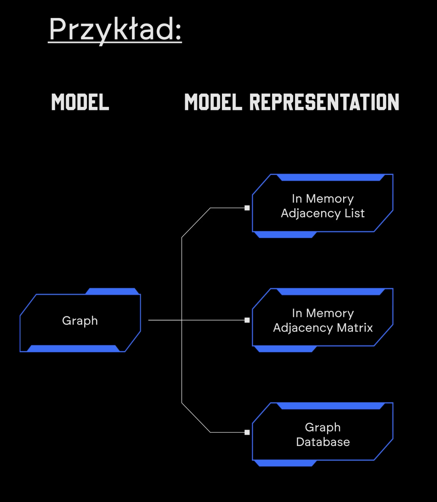

Na prrzykład graf to koncept, ale można go różnice zaprezentować, np. macierz sąsiedztwa, lista sąsiedztwa itp.

Nie powinno się mówić o reprezentacji osobie nie technicznej, tylko o konceptach

#### Drivery architektoniczne

Zwykle gorzej nam idzie z oceną metryk nie technicznych

Drivery architektoniczne to wymagania które nie są funkcjonalne, np. dostępność, skalowalność, wydajność

Szukanie rozwiązania poprzez zaproponowanie kilku rozwiązań i przefiltrowanie ich pod kątem drivery architektonicznych

-   Poprawność
    -   Czy spełnia kryteria akceptacji?
    -   Przejście przez wszystkie znane przypadki i sprawdzenie czy model je obsługuje
-   Prostoty użycia
    -   Ile jest warstw translacji?
    -   Jak łatwe jest API?
    -   Czy gotowe narzędzie zadziała, czy będzie potrzebna trasnlacja naszego modelu na model narzędzia?
    -   Czy znamy to narzędzie, czy musimy się go uczyć?
-   Rozwijalność i produktyzacja
    -   ile przyszłych rozwiązań mogę od razu rozwiązać?
    -   Walidujemy różne use case na tym modelu, różne przyszłe możliwe zmiany
-   Koszta
    -   Po prostu ile to będzie kosztować, praca czy gotowe rozwiązanie

Jeżeli nie potrafisz łatwo opowiedzieć o Twoim modelu biznesowi to prawdobonie tego modelu nie ma.

Twój model powinnien być wstanie odpowiedziec na use case'y biznesowe np. dodanie kolejnej reguły biznesowej

Biznes chce modeli którę rozwiązują ich problemy ale nie muszę wiedzieć jak konkretnie działają

#### Model jako narzędzie do prowadzenia symulacji zmian wymagań

Dobry model pozwala biznesowi zadać dobre pytania.

Model powinnien być rozwijalny, powinnieneś generować różne use case i sprawdzać czy model je obsługuje

#### Metryki będą się różnić w zależności od kontekstu

-   Może liczy się czas
-   Może liczy się rozwojość rozwiązania

#### Jak dokumentować modele?

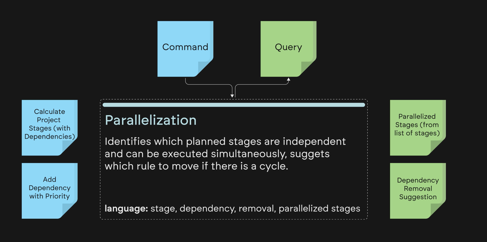

-   Testy automatyczne
-   ADR'y
-   Format rozumiany przez cały zespół (nie tylko techniczny)
-   Najczęściej wystarczy rysunek

UML'e wiele nie wnoszą, zwykle biznes ich nie rozumie. Jest zbyt złożona

### L04. Deep Model: Optymalizator

#### Metodyka zbierania wymagań

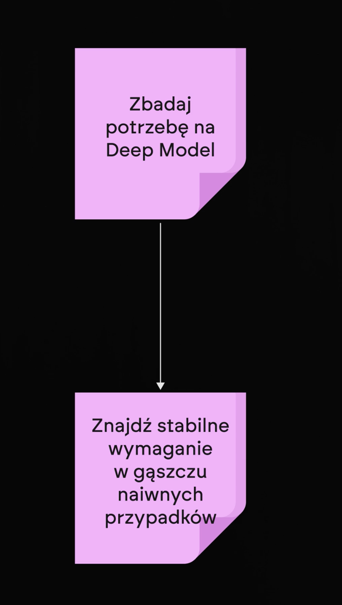

-   Zbadaj potrzębę na deep model -> znajdź stabilne rozwiązanie w gąszczu naiwnych przypadków -> szukaj ogólnego modelu i zaimplementuj najprostszy przypadek
    -   Pozwala to na lepsze zrozumienie wymagań i szukanie deep modelu. Może jest jakieś gotowe rozwiązanie które można dostosować

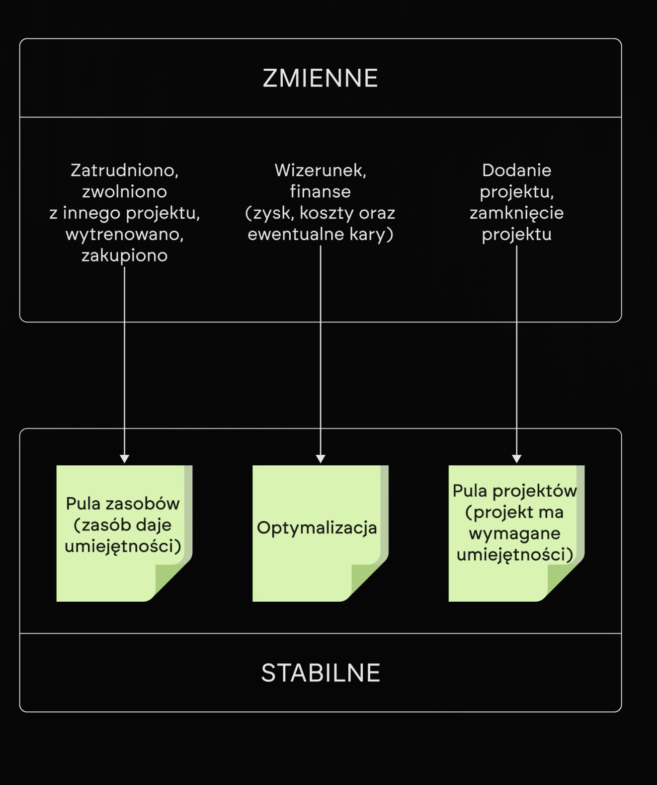

#### Stabilność vs niestabilność

Szukamy stabilnego modelu w niestabilnych wymaganiach

Dobry model pozwala automatycznie zadawać dobre pytania, usuwać specjalne przypadki

### L05. Zadanie

Brain popełnił błąd przez rozsmarowanie modelu po całej aplikacji

**Dużo łatwiej jest rozwiązać problem który chcesz rozwiązać, jeśli sprowadzisz go do problemu który wiesz jak rozwiązać**

### L06. Modelowanie Niepewności i Rozwiązania Zadania

Rozwiązaniem zadania jest zastosowanie ogólnego modelu dopasowania

Najważniejszy wniosek z zadnia: **wiele problemów można sprowadzić do znanych problemów**

#### Testowanie modelu

Testujemy model poprzez próbę dodania nowego przypadku, jeżeli model nie obsługuje tego przypadku to znaczy że trzeba go dostroić

**Pamiętaj prawdobponie Twój problem nie jest unikalny! Znajdź gotowe rozwiązanie i dostroj je do swojego problemu**

Uważaj na sytuacje jak biznes używa słów nigdy lub zawsze, tłumacz to na:

nigdy - nie znamy takiego przypadku
zawsze - zawsze to robimy, ale nie zawsze to robimy tak samo lub wcale nie robimy

Przygotywowanie się na przyszłe zmiany to nie jest łamanie zasady YAGNI

YAGNI - You Ain't Gonna Need It

Ironicznie pachanie się w model specjalistczny w dłuższej perspektywie będzie bardziej kosztowne niż zrobienie modelu ogólnego

### L07. Czy AI zastąpi białkowego modelarza? O szukaniu deep modelu przez deep learning

Powinniśmy nauczyć się poprawnie używanie LLM (Large Language Model)

Źle: generuje model

Dobrze: generują pomysły, generują konkretną implementacje znanego modelu

W tym momencie AI nie zastąpi modelarza, ale może pomóc w generowaniu pomysłów.

Najlepiej działa jak juz wiemy co chcemy zrobić, zapadła decyzja projektowa, a AI generuje implementacje

W tym momecnie musimy jeszcze poczekać zanim AI będzie wstanie samodzielnie modelować systemy

### L08. Bottom up: Podsumowanie i Zadanie

#### A kiedy takich głębokich modeli nie robić?

Nie zawsze to musi być problem modelarski

Może to być problem techniczny:

-   integracja z zewnętrznym systemem
-   pobieranie danych

#### Myślenie redukcyjne

-   Szukanie analogii
-   redukowanie problemu
-   zawsze zakładamy że ktoś już podobny problem rozwiązał

**Potrzebujesz czasu aby zdobyć doświadczenie, musisz zobaczyć wiele problemów aby zacząć widzieć analogie. Wtworzenie intuicji to proces długotrwały.**

### L09. Model jest wszystkim czego potrzebujesz

#### Jest coś jest dobre do wszystkiego to jest dobre do niczego

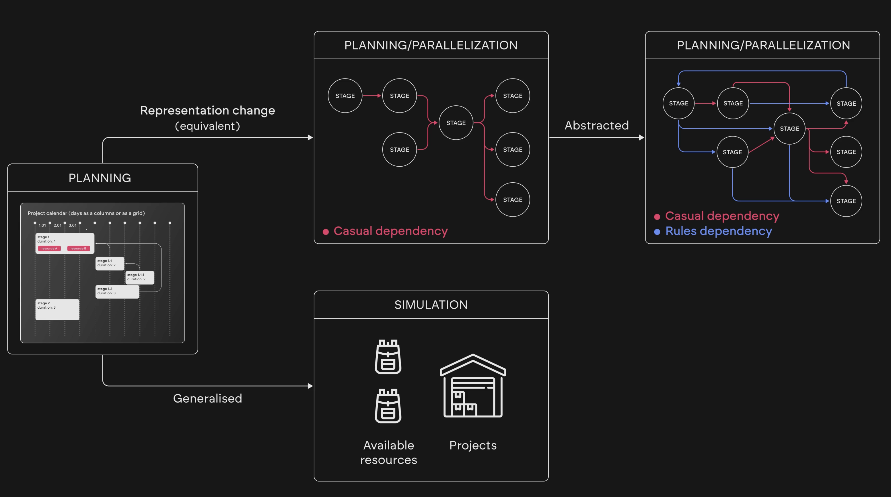

Opracowanie właściwego modelu to klucz do zwycięstwa

#### Model a rzeczywistość

Model nie musi odwzierciedlać rzeczywistości, musi być użyteczny

#### Model jako baza o regułach

Model to baza reguł, które pozwalają na generowanie nowych pomysłów, tłumaczą co się dzieje w firmie

## Moduł 04 - Analiza Top-Down - jak radzić sobie z obszernym, wielodomenowym problemem

### L01. Rozwiązanie zadania

**Dobry model pozwala samemu zadwać dobre pytania**

Dzielenie kodu na siłę może powodować że zaciemnimy sposób rozwiązania np. jakiś algorytm

Rozwiązaniem jest tutaj zbyt specyficzne podejście do potrzebnych zasobów do projektu, nie tylko pieniądze ale też wizerunek lub kombinacja tych dwóch

### L02. Event Storming Process Level - wprowadzenie

#### Nie kradnij

Okradaniem klienta jest próba modelowania procesów tam gdzie ich nie ma

#### Cel sesji Event Storming - Process Level

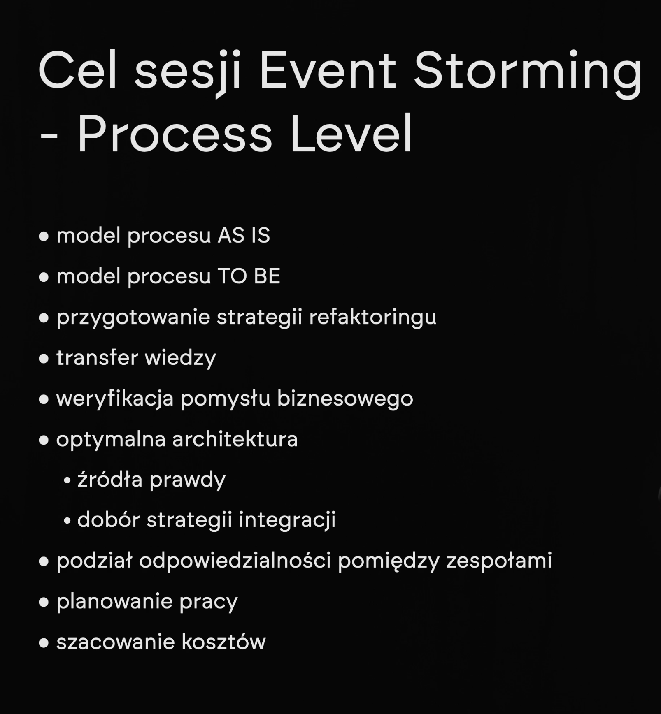

Użycie narzęddzia dla użycia jest bezsensu, korzystaj tylko z tego co jest potrzebne

Nie zwołuj spotkania aby wykonać Event Storming,
to tak jakby chirurg chciałby Cie operować dla operowania a nie aby Ci pomócF

Tricki

-   **Zakomunikuj cel spotkania i powołuj się na nieo w razie problemów**
-   Wprowadzaj notacje stopniowo
    -   zacznij od zdaczeń
    -   dodaj komendy i widoki
    -   dodaj reguły procesowe
-   Dodaj poziomy swimline
    -   poziom poza systemem
    -   poziom UI
    -   poziom domenowy
    -   poziom infrastruktury
    -   poziom innych systemów
-   Rozpocznij o istotnych zdarzeń
    -   pivotal events - sesja kreatywana TOBE
    -   zdarzenia początkowe i końcowe - sesja AS IS

#### Uczestnicy

Szukamy zależności przyczynowo-skutkowych, bez niej nie mówimy o procesach

Zapraszamy osoby z managmentu, czyli osoby którę wiedzą co ma być zrobione ale nie wiedzą jak to się robi dokładnie

Zapraszasz do kilka-kilkanaście osób, tak aby nie było chaosu

#### Czas

Średni czas trawnia sesji to 1-3 dni (w zależności od liczby procesów)

Zebrana wiedza powinna wystaczyć do zaplanowania pracy na kilka kolejnych miesięcy, wynikiem powinna być podział na konteksty i przydzielenie ogólnych zadań do zespółów

Zespoły następnie samodzielnie ustalają szczegóły z espertami dziedzinowymi w sesjach takttycznych

Może się okazać że będzie potrzebny jeden dzień wiecej aby ropzoczac prace, mogę być tarcia pomiędzy uczestnikami

#### Dla osób Facilitujących

Potrzebne korki który powinny się pojaić na spotkaniu:

-   zrozumienie - definiowanie problemu/wyzwania
    -   zrozum jakie są przyczyny wyzwania oraz jasno określ swoje cele i wyniki
    -   nie szukaj szybkicj rozwiązań, staraj sie jak najlepiej zrozumieć problem
-   ideacja - generowanie pomysłów
    -   badanie możliwośc i znajdowanie włąsciwości wujaśniających
    -   Na tym etapie żadeń pomysł nie jest zły
-   Analiza - ocena pomysłów (przeglądanie i sortowanie)
    -   badanie wykonalności i praktyczności wybranych pomysłów
-   kierunek - tworzenie planu, wdrażanie rozwiązań, wzmacnianie

#### Antypatycowanie chaosu

W momencie jak na starcie spotkania będzie chaos to narysuj ten rysunek:

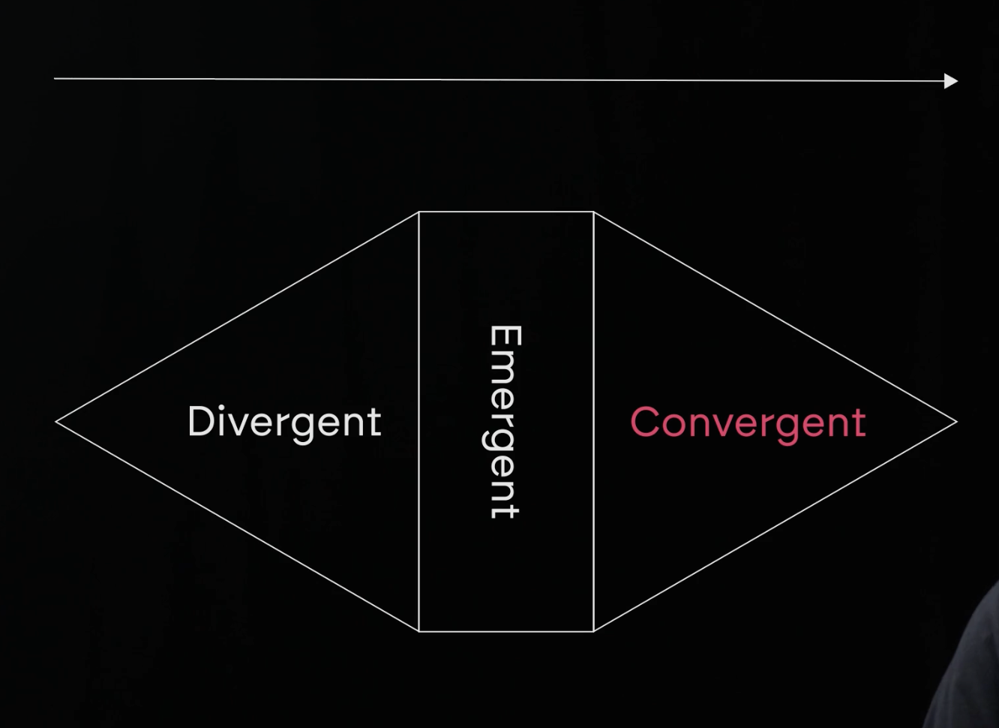

i skomentuj to:

Pierwsza faza może wyglądać na chaotyczną, ale jej struktura jest częscią więszkej metodyki aby zrozumieć procesy

#### Wstęp

Musisz zadbać o gładkie wprowadzenie

Zakomunikuj cel spotkania i wprowadzaj notacje ale stopioniowo

Zdarzenia - wpływaja na proces, coś co się dzieje, coś może się zdarzyć następnie. Muszą przypisane od konkretnego punktu w czasie

Zdarzenia opisuje się w czasownikiem w casie przeszłym w trybie dokonanym.

Proces płatności to nie zdarzenie ale proces, natomisat składa się np. z

-   zlecono pobranie
-   potwierdzono pobranie
-   odrzucono pobranie
-   potwierdzono płatność

Po wytłumaczeniu poproś uczestników aby podali własne przykłady z ich procesów biznesowych

Zwerfikuj czy to są konkretne punkty w czasie, czy to są zdarzenia

#### Zanim zaczniesz

Uczestnicy mogą korzystać z poleceń UI np. kliknięto przycisk, w taki sposób wyborażają sobie system osoby bez wiedzy technicznej

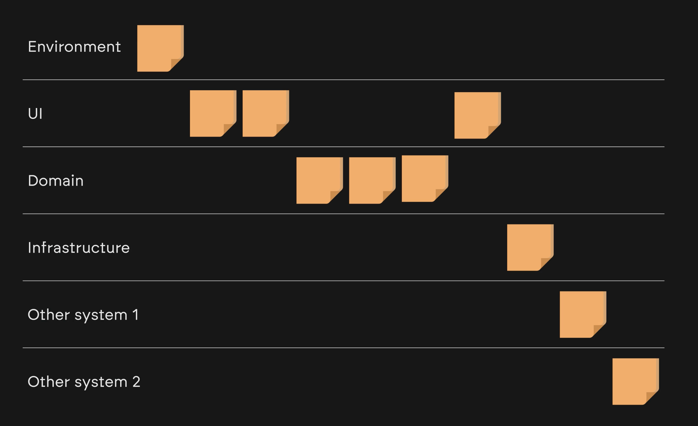

Dodaj poziomy swimline, zapis od lewej do prawej. Wygląda na prcesy które są wykonywane w systemie ale podzielone na konteksty.

Swimline pozawalja nam oddzielić zdarzenia domenowe od tych które są związane z UI albo poza systemem

Możesz dodać własne poziomy w ramach potrzeb.

#### Początek

Dla sesji AI IS zaczynamy od zdarzeń początkowych i końcowych. To pozwala na to aby się skupić na tym procesie i nie wychodzić poza niego

Dla sesji TO BE zaczynamy od pivotal events, czyli zdarzeń które są kluczowe dla procesu
Pivotal event to taki która ma poważne kosekwencje aby go odwrócić, np. zamówiono towar, aby go odwrócić trzeba wykonać cały proces złożenia rezygnacji

Nie przejmuje się kolejnością, eksplotuj zdarzenia wokół pivotal events. Ułożenie tego w czasie przyjdzie kolejnych etapach analizy.

#### Start

Najpierw osoby z różnych działów zajmują się swoimi procesami, pracują równolegle

#### Kolejne elementy

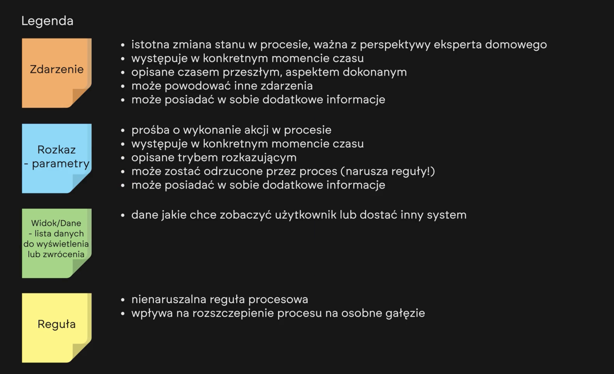

Komendy - każde zdarzenie musi mieć swoją przyczynę, np. inne zdarzenie lub komenda. Zapisana jako czasownik w trybie rozkazującym. Komendy mogą być wysyłane z innych systemów lub od innych użytkowników. Komendy można odrzucić.

Widoki - Widok to ekran jaki prezentujemy użytkownikom lub dane API jakie zwracamy innym systemom. Posługiwanie się widokami pomaga osobm nie technicznym. Zapytaj jakie zdarznenia muszą zadziać aby zebrać wymagane dane do wyświetlenia na widoku. Zapytaj do czego będą te dane służyć dalej.

Procesy mogą być liniowe lub rozgałęciaż się na kilka możliwości. Rozdzielają je reguły procesowe.

Reguły - Wpływają na rozwidlenia procesu. INTERESUJA CIE TYLKO REGUŁY PROCESOWE. Pomijamy reguły walidacyjne, bo wiadomo że kończą proces i przerywają wyświetelenem błędu. Pomijamy reguły zmiany stanu.

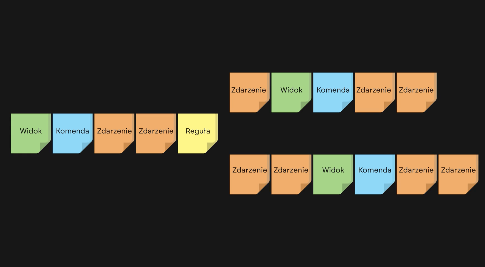

Reguły:

-   **procesowe - sterujące wyborem ścieżki w procesie**
-   walidacyjne
-   synktatyczne - wejście np. formularza
-   biznesowe - porówanie wejścia z bazą danych
-   obliczeniowe - algorytmy, np. obliczanie ceny
-   spójność zmiany stanu
-   spójność danych w bazie danych

**Pamiętaj aby przyklejać karteczki, nawet jeśli nie jesteś pewień czy to jest dobra karteczka, to zawsze można odkleić**

Kartęczkę łatwiej zmienić niż rysunek

Spotkania na żywo mają lepsze rezultaty niż zdalne, lepiej jest zrobić to w biurze

### L03. Model procesów
