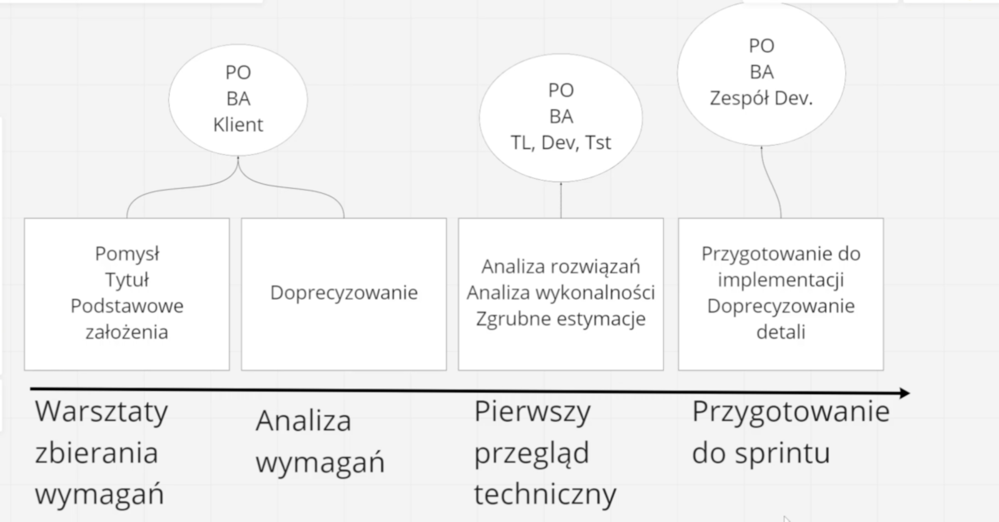
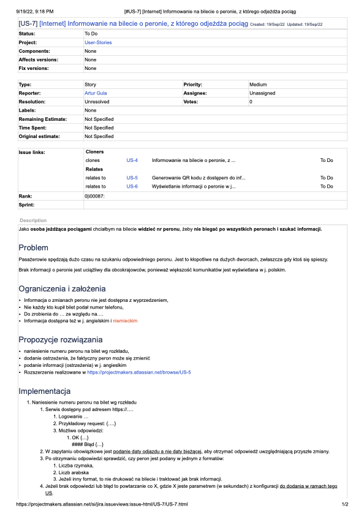

https://www.udemy.com/course/jak-pisac-dobre-user-story

## Sekcja 1: Wprowadzenie

-   Kurs jest dla wszystkich, którzy chcą nauczyć się pisać dobre user story
    -   analitcy
    -   programiści
    -   Product Ownerzy
    -   Scrum Masterzy

## Sekcja 2: CCC - o co w tym chodzi?

### Czym są User stories?

**Oczekiwania użytkowników opisane w naturalnym języku**

Język naturalny, czyli bez specjalnej konwencji. Opisujemy tak jakbyśmy rozmawiali ze sobą.

Skupiamy się na tym czego użytkownicy chcą a nie na konkretnych rozwiązaniach.

Idealnie aby to były realne osoby, które korzystają z naszego produktu. Wtedy mamy pewność, że to co piszemy jest zgodne z ich oczekiwaniami.

Np. "Jako użytkownik nie chce aby mój telefon zadzwonił w trakcie spotkania, więc chce aby dało się go wyciszyć"
To jest potrzeba ale nie rozwiązanie jeszcze. Rozwiązań może być wiele.

Mówiąc inaczej, znamy problem, wiemy co chcemy osiągnać ale jeszcze nie koniecznie znamy rozwiązanie.

### Historia user story i możliwe pułapki

User story rozpoczeło się na początku XI wieku.

Opisywanie wymagań językiem naturalnym może prowadzić do wielu problemów.

### C czyli Card

karta czyli user story, większość wykorzystuje jakiś schemat do opisywania karty.

59% korzysta ze schematu:

```
Jako (ktoś) chciałbym (coś osiągnąć) aby (jakaś korzyść)
```

Osoby które korzystały ze schematu były bardziej zadowolone z efektów.

(ktoś) - persona, nie powinna być wymyślona. **Najlepiej stowrzyć słownik** możliwych personas.

(coś osiągnąć) - to co chcemy osiągnąć, to jest nasz cel. Powinnien być prawdziwy cel. **Nie powinno być rozwiązaniem**.

(jakaś korzyść) - to co zyskamy po osiągnięciu celu. To jest nasza korzyść. **Zadajemy pytanie dlaczego?**
Jeżeli dotrzemy do tego dlaczego klient tego chce to zbudujemy znacznie lepsze rozwiązanie.

"Jako osoba jeżdząca pociągami, chciałbym mieć numer peronu na bilecie, aby nie musieć szukać informacji na tablicy i biegać po dworcu."

### Czego unikać w tytułach User story?

Nie powinno się wstawiać całego User Story w tytule. Tytuł powinien być krótki i zwięzły. Inaczje ciężko będzie się odnaleźć w backlogu.

### Jak nazywać User Story?

Czyli np. dla User story "Jako osoba jeżdząca pociągami, chciałbym mieć numer peronu na bilecie, aby nie musieć szukać informacji na tablicy i biegać po dworcu."

Damy tytuł "Numer peronu na bilecie"

### C czyli Conversation

Rozmowa na temat User Story. Najlepiej aby z takiej rozmowy powstała notatka.

Powinno to być uporządkowania notatka z rozmowy, tak aby dało się do tego wrócić po jakimś czasie. Unikamy chaosu.

Idealnie aby zawierały słowa kluczowe po których będzimy szukać w przyszłości takich funkcjonalności.

Może zawierać:

-   Problem - opisanie problemu który chcemy rozwiązać bardziej szczegółowo
-   Ograniczenia i założenia - opisanie możliwych problemów które mogą wystąpić, np. informacja jest przekazywana ze sporym opóźnieniem
    -   tutaj możemy też opisać jakieś założenia, np. że nie mamy wpływu na to jakie informacje dostajemy
    -   dodatkowe możliwe komplikacje np. klient może mówić w innym języku co może sugerować aby dać informacje w języku angielskim
-   Propozycje rozwiązania - jakieś propozycje rozwiązania problemu (burza mózgów)
    -   czyli jakie rozwiązanie możemy zaproponować przy obecnych ograniczeniach
    -   tutaj możemy rozpisać różne możliwości, przeanalizować plusy i minusy itp.
    -   np. przeniesienie numeru peronu na bilet
    -   w tym momencie skupiamy się na różnych rozwiązaniach, jeszcze nie wchodzimy w techniczne szczegóły
-   Kryteria akceptacji (testy) - jak będziemy testować dane rozwiązanie
    -   to już traktujemy jako ostatnie C czyli Confirmation

Dobrze się trzymać wypracowanego schematu, tak aby nie wprowadzać zamieszania w zespole.

### Cykl życia User Story (o czym i kiedy rozmawiać?)

Każda historyjka żyje zaczyna się od pomysłu do gotowego materiału do sprintu.



#### Pierwsza faza (warsztaty zbierania wymagań)

Pomysł, tytuł, podstawowe założenia. To jest etap że historyjka nadaje się do backlogu. Gotowść możemy ropoznać po tym że sam opis
sugeruje że to jest wartościowe dla klienta.

To zwykle wykonuje Product Owner, Analityk biznesowy, Klient.

#### Druga faza (Analiza wymagań)

Doprecyzowanie user story, to jest moment gdzie analitycy mają wiele pytań i wątpliwości. To jest moment na rozmowę.

To zwykle wykonuje Analityk biznesowy, Klient. Czasami bierze udział Product Owner.

#### Trzecia faza (pierwszy przegląd techniczny)

Analiza rozwiązań, Analiza wykonalności, Zgrubne estymacje.

Tutaj musimy podjąc decyzje czy doprecyzowana user story jest realna do zrobienia. Szczególnie tutaj liczymy na osoby techniczne,
które powiedzą czy to jest wykonalne przy założeniach które mamy. Pomoże dobrać rozwiązanie do możliwości technicznych.

Zespół techniczny powinnien pomagać poprzez zadawanie pytań i sugerowanie rozwiązań.

Tutaj też możemy dokonąć zgrubnych estymacji. Tak aby porównać rozwiązania np. miesiąc a tydzień czasu itp.

To zwykle wykonuje Product Owner, Analityk biznesowy oraz techniczne osoby (programista, team leader, tech lead itp.)

#### Czwarta faza (przygotowanie do sprintu, np. grooming, refinement)

Przygotowanie do implementacji, doprecyzowanie detali.

Domykamy wszystkie szczegóły, nie zostawiamy tematów otwartych np. "to jest jeszcze do ustalenia", "to jest jeszcze do przemyślenia",
"nie wiemy jak się połaczymy z tym systemem to nam jakoś wyjdzie w praniu".

Musimy to doprecyzować ponieważ tutaj wykonujemy commitment na sprint. Zobowiązujemy się do dostarczenia tego w danym czasie.

To zwykle wykonuje Product Owner, Analityk biznesowy oraz cały zespół techniczny który będzie to implementował. Każdy powinnien mieć prawo się wypowiedzieć.

#### Jak sobie radzić ze zmianami w User Story?

Dopóki User story nie przejdzie przez czwartą fazę (przygotowanie do sprintu) to zmiany są dozwolone.

Oczywiście tutaj powinna byc kutltra pracy, czyli zmieniamy po ustaleniach, bez samowolki.

Jeżeli jest już faza developmentu, to już nie powinniśmy zmieniać treści bez jasnego oznaczenia zmiany. Na przykłąd można można oznaczyć kolorem zmiany np. czerwonym.

Ewentualnie dodanie extra sekcji z wprowadzonymi zmianami w treści. **To istotne aby to było jasno widoczne!**

#### Czego nie opisywać w Conversation?

-   Interwejsu użytkownika (UI). To nie jest takie istotne z perspektywy celu i dlaczego to robimy. Wchodząc tak głęboko w szczegóły możemy zatracić perspektywe wartości która chcemy dostarczyć. Dodatkowo założenia mogą się zmieniać w trakcie pracy z User Story.
-   Rozwiązania techniczne (sposób implementacji) - np. jakiej bazy danych użyjemy, jakie technologie itp. To jest zbyt techniczne i nie ma to wpływu na wartość którą chcemy dostarczyć.
-   Kopiuj-wklej, lepiej połaczyć User Story w jedno. Nie powinno być sytuacji gdzie mamy kilka User Story które są ze sobą powiązane. Lepiej połaczyć to w jedno.

#### C czyli Confirmation

czyli inaczej mówiąc testy, czyli jak sprawdzimy czy to co zrobiliśmy jest zgodne z User story (całościowo)

Tutaj nie chodzi o precyzyjne testy (np. jednostkowe) a chodzi o testy akceptacyjne czyli na poziomie biznesowym. Tak aby testy były niezależne od implementacji, np. na interfejsie użytkownika.

Popularny jest schemat "Gherkin" czyli język testów akceptacyjnych. Czyli Given, When, Then.

Given - stan początkowy
When - wykonanie jakieś akcji
Then - oczekiwany rezultat

np.

```
Given - mam wyłączone dźwięki w telefonie
When - dostaje telefon
Then - telefon nie wydaje dźwięku
```

Testy też można opisywać po prostu tekstowo jako oczekiwane rezultaty.

-   Brak powiadomień dla wyciszonego telefonu
-   Powiadamianie wibracjami w przypadku wyciszonego telefonu

#### Confirmation - przykład

Dla user story "Numer peronu na bilecie"

-   Wydrukowanie informacji o spodziewanym peronie odjazdu na bilecie kupowanym przez internet
-   Wydrukowanie informacji o spodziewanym peronie odjazdu na bilecie kupowanym w kasie
-   Umieszczenie informacji o spodziewanym peronie a nie finalnym
-   Umieszcznenie QR kodu z informacją o peronie na bilecie
-   uwzględnienie przyszłych rozkładów pracy

Finalnie powinniśmy uzyskać listę testów jakie może wykonać użytkownik mógł sprawdzić czy to co zrobiliśmy jest zgodne z oczekiwaniami.

Scenariusze powinny być bardziej precyzyjne jeśli to będzie testować oboba która jest spoza zespołu.

#### CCC - podsumowanie

C - Card
C - Conversation
C - Confirmation

Finalnie powinniśmy eksperymentować z tym co u nas działa, powinniśmy zbudować własny proces który będzie dostosowany do naszych potrzeb.

User story może składać się z różnych elementów, nie musi być zawsze takie samo. Ważne aby były zrozumiałe dla wszystkich.

#### CCC - User story przygotowanie do implementacji (przykład)

[user_story_przyklad](./user_story.pdf)



Unikajmy ściany tekstu, starajmy się zapisywać to rzeczowo w punktach.

User story pozostaje takie jak stworzyliśmy, nie powinnismy usuwać powstałych sekcji w czasie Conversation, tak aby zespół implementacyjny miał jak najwięcej kontekstu do pracy.

**Dodajemy nową sekcje "Implementacja"**

Tutaj opisujemy już wymagania techniczne, czyli jak to powinno być wykonane

Wymagania techniczne mogą być wykorzystane jako element testów automatycznych.

Powinno opisywać różne scenariusze np. co mamy zrobić jeśli dostaniemy błąd w odpowiedzi o serwisu? Tutaj możemy sugerować aby spróbować ponownie pobrać informacje do 3 razy

Powinnismy dodać makiery UI do impementacji

W przpadku kiedy widzimy że User Story znaczyna "puchnąć" to powinniśmy zastanowić się czy nie powinniśmy podzielić tego na mniejsze User Story.

## INVEST - przydatny skrót w User Story

### Wprowadzenie
