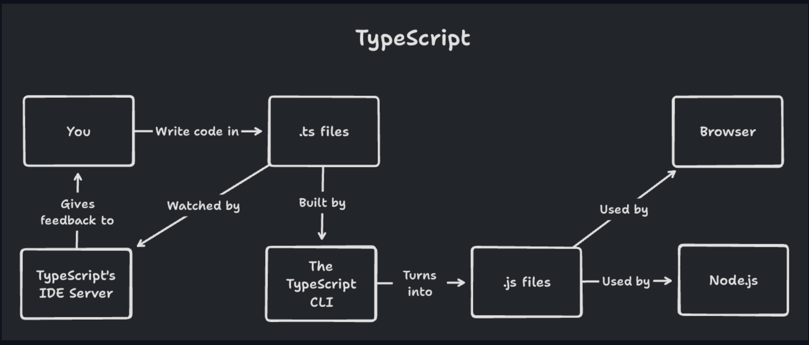

https://www.totaltypescript.com/workshops/typescript-pro-essentials

## Relacja Typescript z JavaScript

Typescript powstał bo praca z javascript w dużym codebase jest bardzo skomplikowana

Początkowo powstał silnik w C# który tłumaczenie C# na javascript było bardzo proste, script sharp jest to silnik który tłumaczy C# na javascript

## JS vs TS buld proces



W TS mamy serwer który działą w twoim IDE i momencie jak dokonujesz zmian to kompiluje i podkreśla wszystkie błędy

## Instalacja typescript

instalacja globalnie

```
npm -g install typescript
```

instalacja lokalnie

```
npm install -D typescriptF
```

następnie możemy użyć np.

```
tsc --version
```

aby sprawdzić czy tsc działa

## Wykonanie kompilacji

w folderze wykonujemy

```
tsc --init
```

następnie możemy przkompilować plik

```
tsc nazwa_pliku.ts
```

lub możemy uruchomić watch tak aby kompilować plik gdy zmieniamy go

```
tsc --watch nazwa_pliku.ts
```

## Porównanie Vite i TS

Co istotne w momencie integracji Vite z TS będziemy mieć w configu TS:

```js
...
"omitEmit": true,
```

Co oznacza że TS nie generuje plików JS, ponieważ tym już zajmuje się Vite

Vite używa esbuild, który jest alternatywą do tsc, to pozwala Vita na większą wydajność bez potrzeby sprawdzania typów i błędów

Natomiast nadal lokalnie potrzebujemy TS aby sprawdzał typy i wyświetlał nam błędy, więc mamy tutaj połączenie TS i Vite, natomiast aby mamy ustawione noEmit aby TS nie gryzł się z Vite.

### Uruchomienie TS w CI/CD na github

przykładowy github action:

```yml
name: CI
on:
    # Runs against all pushes
    push:
        branches:
            - "**"

    # Runs against all pull requests
    pull_request:
        branches:
            - "**"

jobs:
    ci:
        # Runs on the latest version of Ubuntu, a linux distro
        runs-on: ubuntu-latest
        steps:
            # Checks out the current branch using git checkout
            - uses: actions/checkout@v3

            # Sets up pnpm with version 7
            - uses: pnpm/action-setup@v2
              with:
                  version: 7

            # Sets up node
            - uses: actions/setup-node@v3
              with:
                  node-version: 16.x
                  # Sets up pnpm's cache
                  cache: "pnpm"

            # Install with frozen lockfile to ensure packages
            # are not accidentally updated
            - run: pnpm install --frozen-lockfile

            # Run the 'ci' script defined in package.json
            - run: pnpm run ci
```

Plik trzymany w .github/workflows/ci.yml

### Uruchomienie skryptu TS w aplikacji

zainstaluj tsx

```
npm install -D tsx
```

następnie dodaj skrypt do package.json

```json
{
    "scripts": {
        "my-script": "tsx scripts/my-script.ts"
    }
}
```

przykładowy skrypt

```ts
console.log("The script is working!");

const [, , ...args] = process.argv;

console.log(args);
```

### Array

array też można zapisać jako

```ts
Array<number>;
```

### Tuple

Tuple można też zapisać w formacie

```ts
[x: number, y: number]
```

to pozwala potem dostać podpowiedź od TS który parametr jest którym elementem

np.

rage: [x: number, y: number]

#### Opcjonalny parametr w Tuple

można to uzyskać na dwa sposoby:

```ts
[x: number, y?: number]
```

lub

```ts
[number, number?]
```

### Set init z typem

```ts
const set = new Set<number>();
```

lub

```ts
const set: Set<number> = new Set();
```

### Jak działa TS w VsCode

VsCode posiada TS server który działa w tle i sprawdza typy w czasie pisania, przekazuje do VSCode błędy i wskazuje na je

#### Szybki import

zaznacz kod wciśnij CMD + . i potem Import All missing imports

#### Usunięcie wszystkich nie potrzebnych importów

1. Komenda "Organize Imports"
2. Zaznacza CMD + . i wybierz "Remove Unused Imports"
3. ALT + SHIFT + O

#### Quick fixes

Quick fixes mogą:

-   wydzielić kod jako osobny funkcja
-   usunąć niepotrzebne importy
-   zrobić szybki refactoring

### Zbyt duży Union Type

Technicznie jest możliwe że będzie zbyt duży UnionType i wtedy TS nie będzie w stanie go obsłużyć

Natomiast to jest skrajny przypadek, raczej nie spotykany w praktyce

### Boolean nie zadziała

W typescript funkcja Boolean nie będzie działać, to jest ograniczenie TS

### Typ Unknown

Typ Unknown jest typem danych Do którego możemy przypisać dowolny inny typ danych. Jego zaletą jest to że typescript wtedy wymaga sprawdzenia czym jest ten typ dzięki czemu możemy do tego przepisać coś co jest zewnętrznego źródła


W try catch error jest domyślnie typem Unknown

```ts
try {
    ...
} catch (error) {
    if (error instanceof Error) {
        console.log(error.message);
    } else {
        throw error; // jeśli nie wiem co to jest to wyrzuć błąd
    }
}
```

W Przypadku unknown musimy zawsze dokładnie sprawdzać czym hest zmienna, czasami to może być sporo kodu

```ts
const parseValue = (value: unknown) => {
    if (
        typeof value === "object" &&
        value !== null &&
        "data" in value &&
        typeof value.data === "object" &&
        value.data !== null &&
        "id" in value.data &&
        typeof value.data.id === "string"
    ) {
        return value.data.id;
    }

    throw new Error("Parsing error!");
};
```

### Typ Never

Oznacza miejsce które nigdy się nie może wykonać w kodzie.


Co istotne:

-   Możesz przypisać never do wszystkich typów
-   Nic nie możesz przypisać do never

Pusty Array w TypeScript domyślnie dostaje typ never

```ts
const emptyArray = []; // type never[]
```

Jeżeli mamy metodę która rzuca wyjątkiem to możemy ją otypować jako never

```ts
const throwError = (message: string): never => {
    throw new Error(message);
};
```

### Dlaczego TS daje błąd w tym przypadku

```ts
if (searchParams.name) {
    return users.filter((user) => user.name.includes(searchParams.name));
}
```

to wynika z tego że typescript Nie wie jaka będzie wartość zmiennej w momencie wykonywania funkcji, ponieważ

Funkcja mogłaby się wykonać zupełnie innym momencie kiedy ta zmienna miały już zupełnie inną wartość

### Union w TS

W poniższym przypadku będzie to pola które są takie same w każdy z tych typów

```ts
type CircleShape = {
    kind: "circle";
    radius: number;
};

type SquareShape = {
    kind: "square";
    sideLength: number;
};

type Shape = CircleShape | SquareShape;
```

Czyli teraz:

```ts
shape.kind; // mamy wspolne pole
```

Dopiero jak zawęzimy do typu będziemy mieć inne pola

```ts
if (shape.kind === "circle") {
    shape.radius; // Będziemy mieć podpowiedź innych pól od TypesCript bo wie co to jest
}
```

### Switch z True

W typescript mamy możliwość wykonania tricku z switchem i wartością true

```ts
function calculateArea(shape: Shape) {
    switch (true) {
        // Wykona się tylko jeśli prawda
        case shape.kind === "circle": {
            return Math.PI * shape.radius * shape.radius;
        }
        case shape.kind === "square": {
            return shape.sideLength * shape.sideLength;
        }
        default:
            throw new Error(`Should not be here!`);
    }
}
```

### Union gdzie jakaś opcja ma być domyślną

```ts
type Circle = {
    kind?: "circle";
    radius: number;
};

type Square = {
    kind: "square";
    sideLength: number;
};

type Shape = Circle | Square;
```

W tym przypadku będziemy mieć założenie że domyślnie to jest Circle, powinniśmy takie założenie mieć tylko na jednym z typów w Union


### Kiedy interface jest lepszy od Type?

W momencie kiedy wykonujemy rozszerzenie typów:

```ts
interface UserPart {
  id: string;
  name: string;
  age: number;
};

interface UserPart2 {
  id: number;
  phone: string;
};

interface User extends UserPart, UserPart2 {};

const user: User = {
  id: "1",
  name: "John",
  age: 20,
  phone: "123456789",
};
```

W tym przypadku dostaniemy ładny error że pole `id` Nie jest identyczne i łatwiej znajdziemy błąd.

W przypadku użycia Typów byśmy nie mieli takiego błędu a jednie nie pasujace pole byłby typu `never`

### Dynamiczny klucz w TS

możemy to zapisać na dwa sposoby:

```ts
const scores: {
  [key: string]: number
} = {};

const scores: Record<string, number> = {};
```

gdzie `key` to może też być inną nazwą, technicznie to możliwe

```ts
const scores: {
  [someIndex: string]: number
} = {};
```