## Dodanie do PATH

```bash
cd # przejście do katalogu domowego
vim .zshrc # może być coś innego niż vim, np. nano
```

Dodajemy do pliku export do zmiennej PATH

```bash
# gdzie /opt/homebrew/bin może być inną ścieżką, lub kolekcją ścieżek
export PATH=$PATH:/opt/homebrew/bin
```

zapisujemy i gotowe!

## Dodanie GIT'a

W konsoli wywołujemy

```bash
git --version
```

samo to wywołanie spowoduje instalacje pakietu zawierającego git'a!

## Konfiguracja MacOS

## Wyczyszczenie Docka do tylko potrzebnych aplikacji

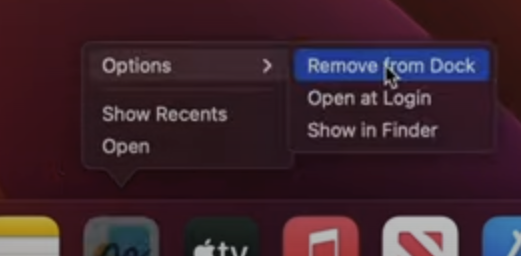

## Dodanie folderu Aplikacje do Docka

Poprzez przeciągniecie z spotlight do dock'a

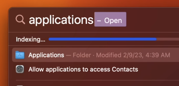
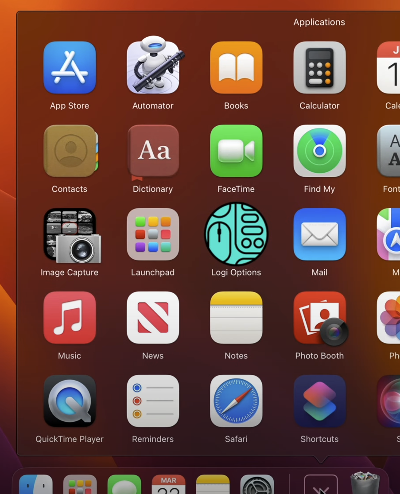

### Ustawienie gestu - 3 palce aby odpalić Misson Control

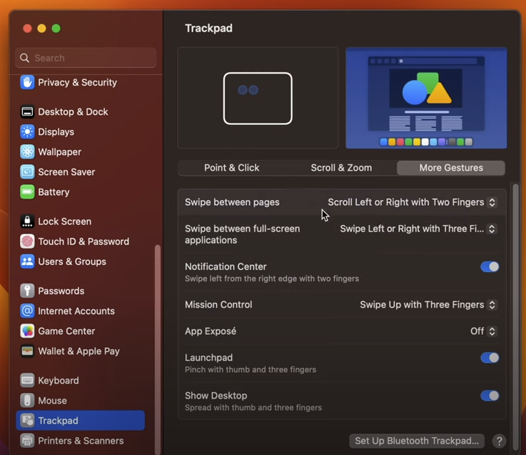

### Dodanie kolejnych wirtualnych pulpitów

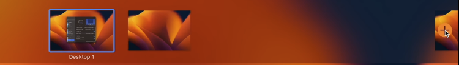

### Zawsze pokazuj procent baterii

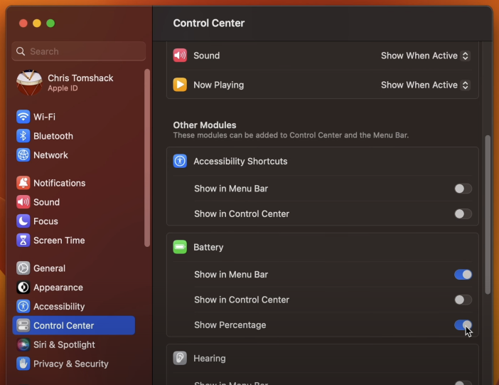

### Ukryj spotlight

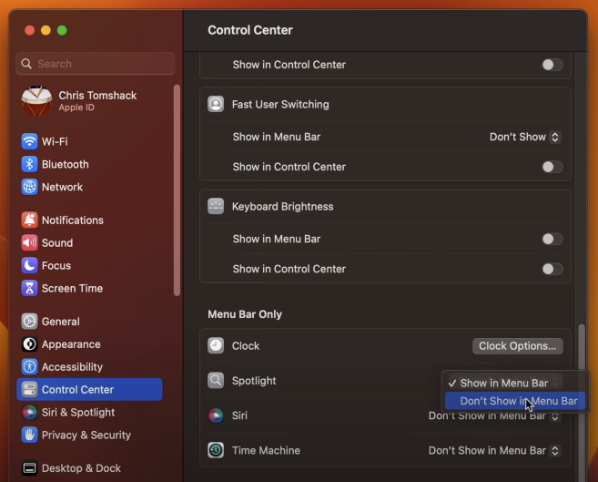

### Dostosuj swój zegar

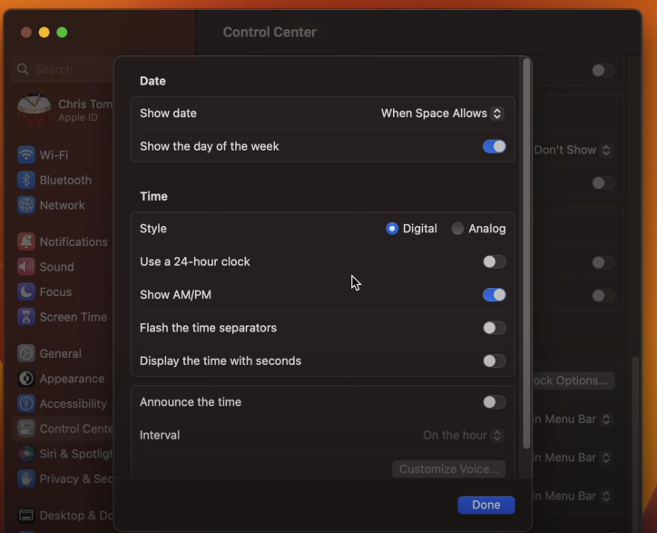

### Zawsze pokazuj scrollbar i skacz do klikniętej pozycji

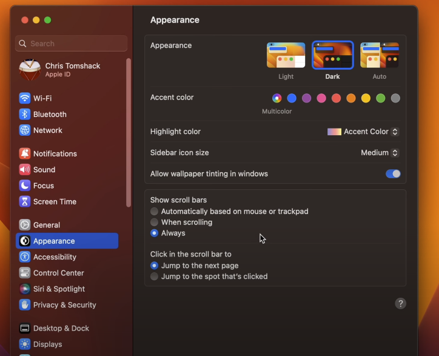

### Wyłacz automatyczne reogragnizowanie przestrzeni okien

Celem jest to aby nie ingerować w ustawienia okien, dzięki temu możemy to pogrupować względem swojej pracy

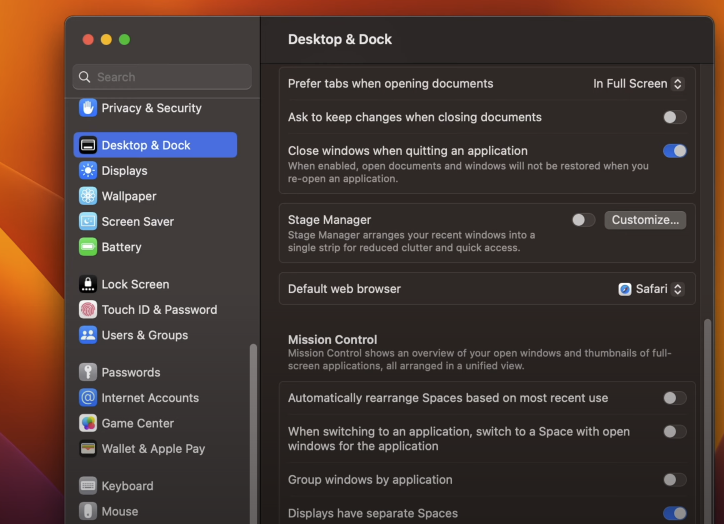

### Finder - pokaż ściezkę oraz status

ścieżka - aktualny katalog w jakim się znajdujemy
status - stan dysku, ile miejsca jeszcze mamy

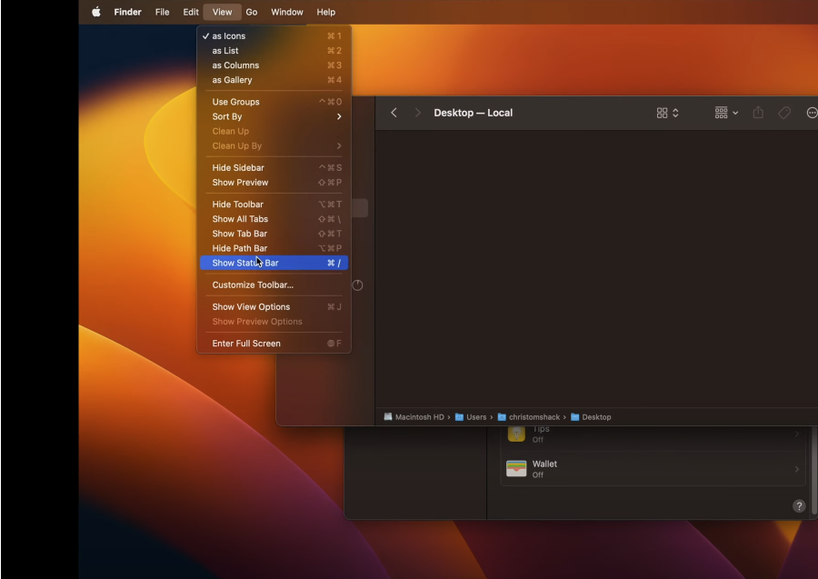

### Finder - customizacja toolbara - pozybcie się nadmiaru opcji

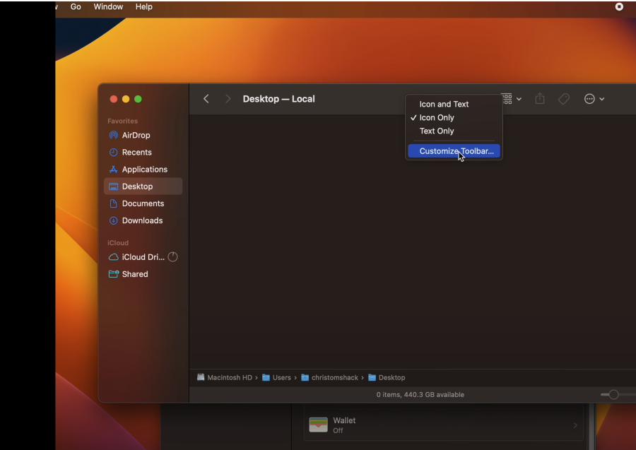

### Finder - sprawdź czy nowe okno będzie otwierało sie w tabie

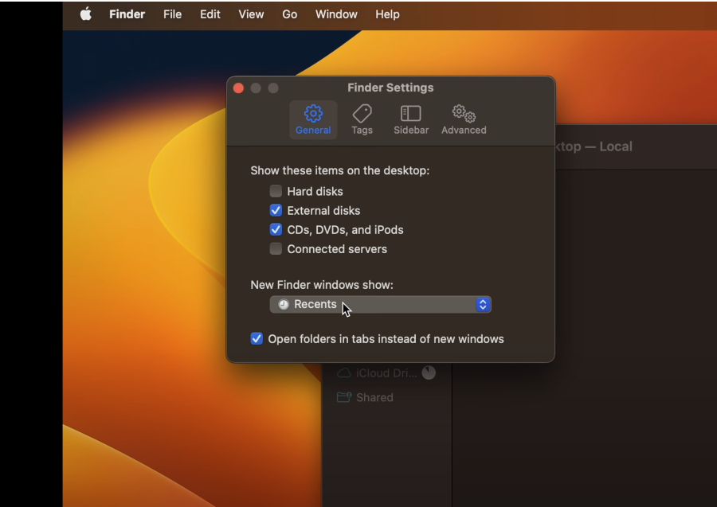

### Finder - pokazuj rozszerzenia wszystkich plików

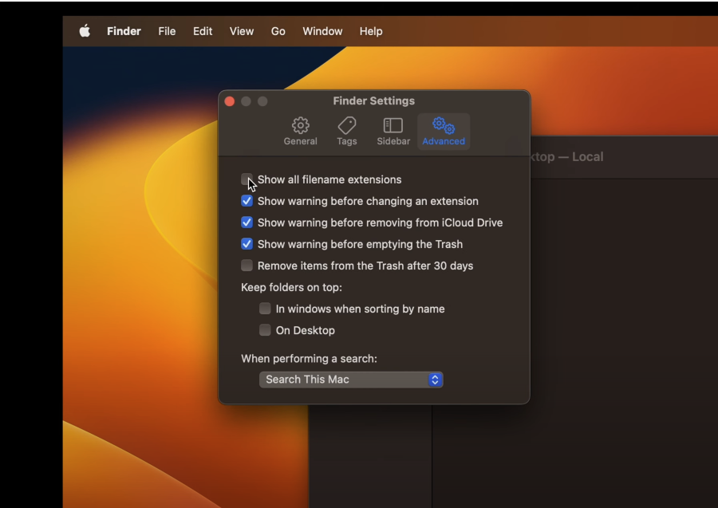

### Finder - dodaj Library/Biblioteka do ulubionych folderów - inaczej ciężko znaleść

- Najedz na Idź
- Wciśnij opt
- Pokaże się Bibloteka/Library
- Przenieś ze ścieżki do ulubionych

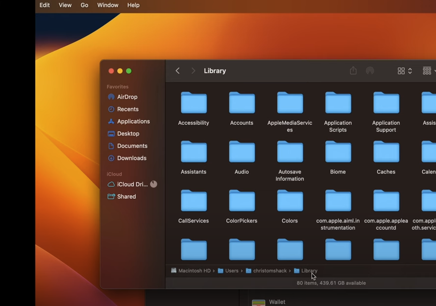

### Aplikacje 

- https://rectangleapp.com - rectangle
  - Split screen dla MacOs
- https://maccy.app - Maccy
  - Umożliwia kopiowanie wielu rzeczy naraz
- https://freemacsoft.net/appcleaner/ - AppCleaner
  - Do czyszczenia aplikacji
- https://iterm2.com/index.html - Nowoczesny terminal dla MacOs